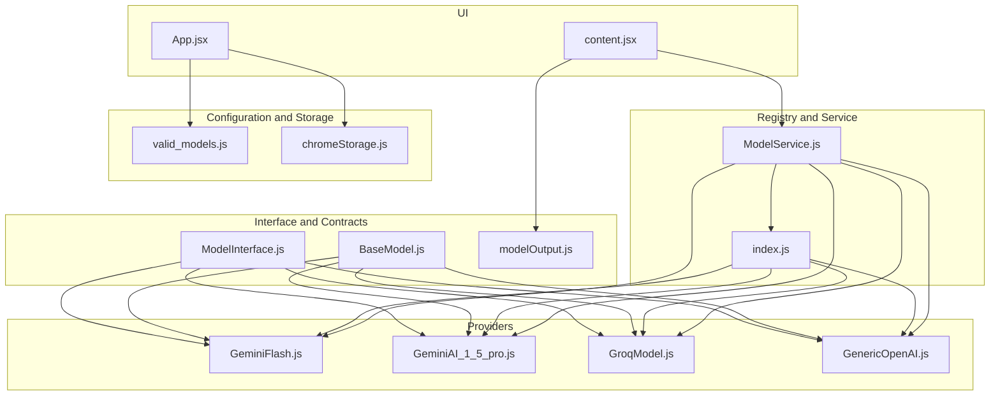
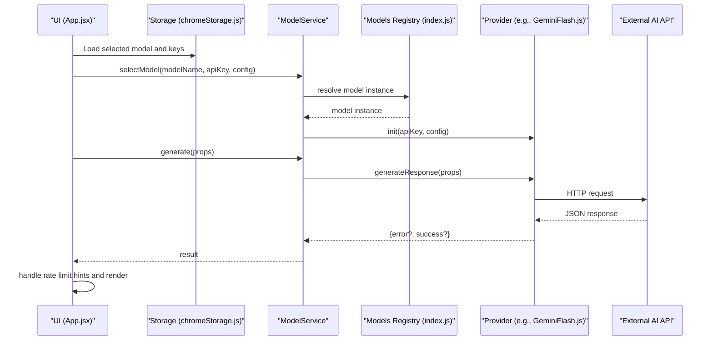
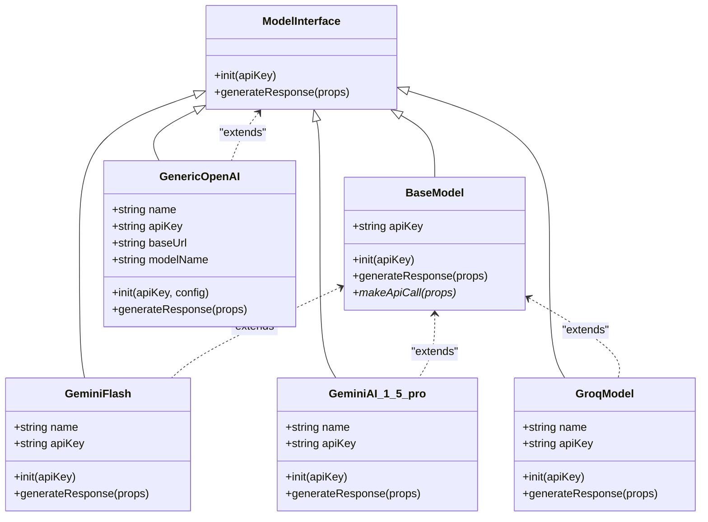
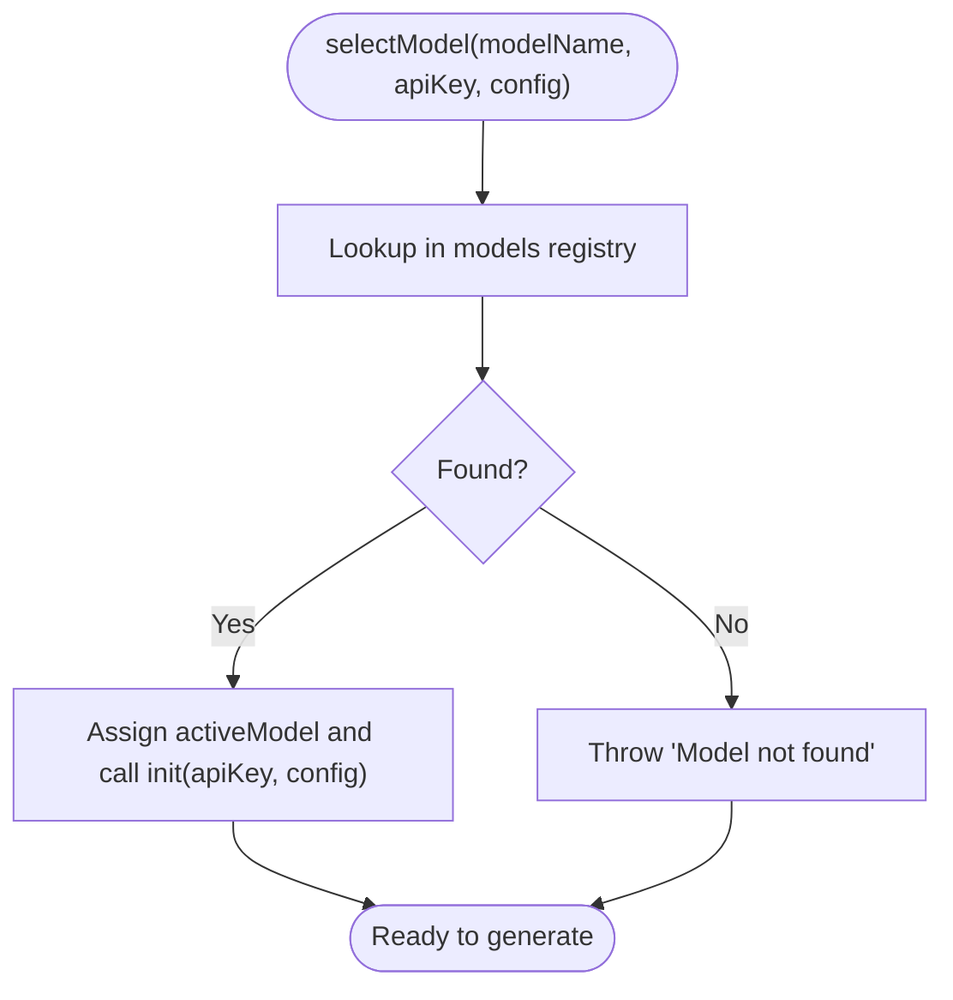
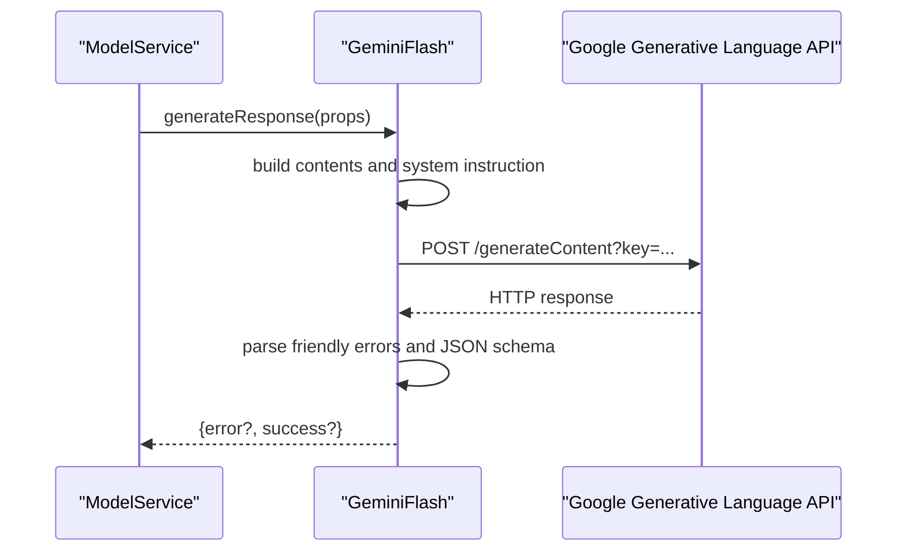
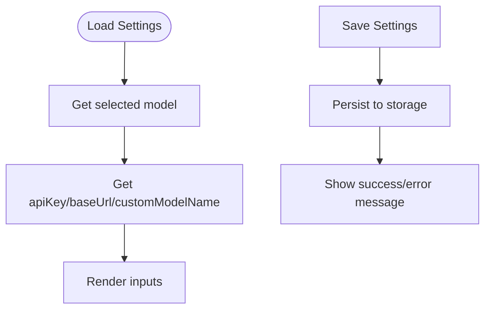
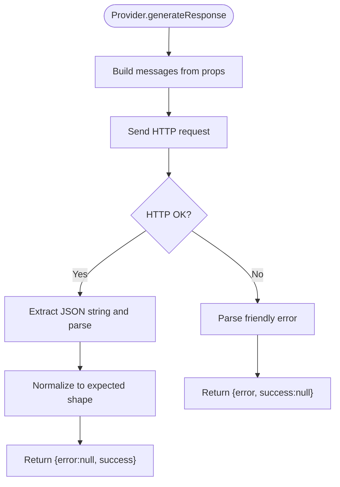
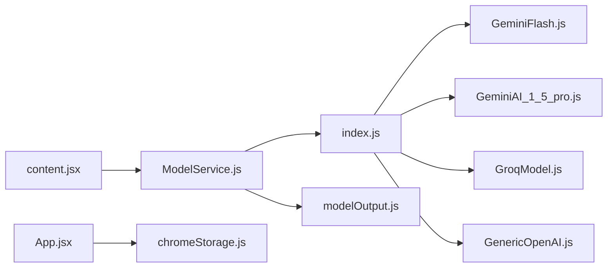

# AI Model Integration

<cite>
**Referenced Files in This Document**
- [BaseModel.js](file://src/models/BaseModel.js)
- [ModelInterface.js](file://src/interface/ModelInterface.js)
- [index.js](file://src/models/index.js)
- [GeminiFlash.js](file://src/models/model/GeminiFlash.js)
- [GeminiAI_1_5_pro.js](file://src/models/model/GeminiAI_1_5_pro.js)
- [GroqModel.js](file://src/models/model/GroqModel.js)
- [GenericOpenAI.js](file://src/models/model/GenericOpenAI.js)
- [ModelService.js](file://src/services/ModelService.js)
- [valid_models.js](file://src/constants/valid_models.js)
- [modelOutput.js](file://src/schema/modelOutput.js)
- [chromeStorage.js](file://src/lib/chromeStorage.js)
- [App.jsx](file://src/App.jsx)
- [content.jsx](file://src/content/content.jsx)
</cite>

## Table of Contents
1. [Introduction](#introduction)
2. [Project Structure](#project-structure)
3. [Core Components](#core-components)
4. [Architecture Overview](#architecture-overview)
5. [Detailed Component Analysis](#detailed-component-analysis)
6. [Dependency Analysis](#dependency-analysis)
7. [Performance Considerations](#performance-considerations)
8. [Troubleshooting Guide](#troubleshooting-guide)
9. [Conclusion](#conclusion)
10. [Appendices](#appendices)

## Introduction
This document explains DSABuddy’s AI model integration system. It covers the abstract model architecture centered on a base class, the factory-style registration of models, the plugin-like provider implementations for multiple AI backends, and the service orchestration that selects and runs models. It also documents configuration, API key management, request/response processing, error handling, rate limiting, retry logic, fallback mechanisms, and guidelines for adding new AI providers.

## Project Structure
The AI integration spans several modules:
- Interface and base classes define the contract and shared behavior.
- Provider plugins implement concrete AI backends.
- A registry exposes available models via a factory-style map.
- A service orchestrates model selection and invocation.
- Constants enumerate supported models.
- Schema validates model outputs.
- Storage utilities persist keys and selections.
- UI wiring integrates settings and runtime behavior.

**Diagram sources**
- [ModelInterface.js](file://src/interface/ModelInterface.js#L12-L17)
- [BaseModel.js](file://src/models/BaseModel.js#L3-L16)
- [GeminiFlash.js](file://src/models/model/GeminiFlash.js#L20-L98)
- [GeminiAI_1_5_pro.js](file://src/models/model/GeminiAI_1_5_pro.js#L34-L84)
- [GroqModel.js](file://src/models/model/GroqModel.js#L17-L68)
- [GenericOpenAI.js](file://src/models/model/GenericOpenAI.js#L5-L59)
- [index.js](file://src/models/index.js#L1-L19)
- [ModelService.js](file://src/services/ModelService.js#L4-L21)
- [valid_models.js](file://src/constants/valid_models.js#L1-L12)
- [chromeStorage.js](file://src/lib/chromeStorage.js#L1-L36)
- [App.jsx](file://src/App.jsx#L1-L200)
- [content.jsx](file://src/content/content.jsx#L183-L222)

**Section sources**
- [ModelInterface.js](file://src/interface/ModelInterface.js#L12-L17)
- [BaseModel.js](file://src/models/BaseModel.js#L3-L16)
- [index.js](file://src/models/index.js#L1-L19)
- [ModelService.js](file://src/services/ModelService.js#L4-L21)
- [valid_models.js](file://src/constants/valid_models.js#L1-L12)
- [chromeStorage.js](file://src/lib/chromeStorage.js#L1-L36)
- [App.jsx](file://src/App.jsx#L1-L200)
- [content.jsx](file://src/content/content.jsx#L183-L222)

## Core Components
- ModelInterface: Defines the contract for initialization and response generation. Provides helpers for chat history parsing and a typed modal parser.
- BaseModel: Extends the interface and centralizes shared behavior (storing API key, delegating generation to a provider-specific method).
- Provider Plugins: Implementations for Google Gemini Flash, Google Gemini 1.5 Pro, Groq, and a Generic OpenAI-compatible provider.
- Registry (index.js): Exposes a map of named models and a factory-like helper for Groq variants.
- ModelService: Encapsulates model selection and invocation, enforcing that a model is chosen before generation.
- Constants and Schema: Define supported models and the expected output shape.
- Storage Utilities: Persist and retrieve API keys, base URLs, and model preferences.
- UI Wiring: Loads defaults, saves settings, and surfaces rate-limit hints to the user.

**Section sources**
- [ModelInterface.js](file://src/interface/ModelInterface.js#L12-L17)
- [BaseModel.js](file://src/models/BaseModel.js#L3-L16)
- [index.js](file://src/models/index.js#L1-L19)
- [ModelService.js](file://src/services/ModelService.js#L4-L21)
- [valid_models.js](file://src/constants/valid_models.js#L1-L12)
- [modelOutput.js](file://src/schema/modelOutput.js#L9-L14)
- [chromeStorage.js](file://src/lib/chromeStorage.js#L1-L36)
- [App.jsx](file://src/App.jsx#L1-L200)

## Architecture Overview
The system follows a layered design:
- UI layer manages settings and displays responses.
- Service layer mediates between UI and models.
- Registry exposes available models.
- Provider plugins encapsulate backend-specific logic.
- Shared interface and base class enforce a consistent contract.

**Diagram sources**
- [App.jsx](file://src/App.jsx#L56-L87)
- [chromeStorage.js](file://src/lib/chromeStorage.js#L13-L35)
- [ModelService.js](file://src/services/ModelService.js#L7-L21)
- [index.js](file://src/models/index.js#L13-L19)
- [GeminiFlash.js](file://src/models/model/GeminiFlash.js#L28-L97)

## Detailed Component Analysis

### Abstract Model Architecture and Contract
- ModelInterface defines:
  - init(apiKey): optional initialization hook.
  - generateResponse(props): must be implemented by subclasses.
  - Utility parsers for chat history and modal data.
- BaseModel extends ModelInterface:
  - Stores the API key.
  - Delegates generation to a provider-specific method.
  - Requires subclasses to implement makeApiCall or override generateResponse.

**Diagram sources**
- [ModelInterface.js](file://src/interface/ModelInterface.js#L12-L17)
- [BaseModel.js](file://src/models/BaseModel.js#L3-L16)
- [GeminiFlash.js](file://src/models/model/GeminiFlash.js#L20-L98)
- [GeminiAI_1_5_pro.js](file://src/models/model/GeminiAI_1_5_pro.js#L34-L84)
- [GroqModel.js](file://src/models/model/GroqModel.js#L17-L68)
- [GenericOpenAI.js](file://src/models/model/GenericOpenAI.js#L5-L59)

**Section sources**
- [ModelInterface.js](file://src/interface/ModelInterface.js#L12-L17)
- [BaseModel.js](file://src/models/BaseModel.js#L3-L16)

### Factory Pattern and Plugin Architecture
- Registry (index.js) exports a map of named models:
  - Groq variants are created via a factory helper that sets the model name while sharing the same class.
  - Other providers are instantiated directly.
- This enables:
  - Easy addition of new providers by extending the interface and registering under a unique name.
  - Runtime selection of models by name.

**Diagram sources**
- [index.js](file://src/models/index.js#L13-L19)
- [ModelService.js](file://src/services/ModelService.js#L7-L14)

**Section sources**
- [index.js](file://src/models/index.js#L1-L19)
- [ModelService.js](file://src/services/ModelService.js#L7-L14)

### Supported AI Providers

#### Google Gemini Flash
- Implements JSON response shaping and schema enforcement.
- Uses a system instruction plus chat history to produce a JSON object.
- Handles rate limits, invalid keys, and model availability with user-friendly messages.
- Extracts retry delay hints from error responses to guide UI behavior.

**Diagram sources**
- [GeminiFlash.js](file://src/models/model/GeminiFlash.js#L28-L97)
- [valid_models.js](file://src/constants/valid_models.js#L6-L8)

**Section sources**
- [GeminiFlash.js](file://src/models/model/GeminiFlash.js#L20-L98)
- [valid_models.js](file://src/constants/valid_models.js#L6-L8)

#### Google Gemini 1.5 Pro
- Similar to Flash but targets a different model ID and applies the same schema enforcement and error handling.

**Section sources**
- [GeminiAI_1_5_pro.js](file://src/models/model/GeminiAI_1_5_pro.js#L34-L84)
- [valid_models.js](file://src/constants/valid_models.js#L6-L8)

#### Groq
- Sends a standardized JSON object response request and parses the returned JSON string into the expected structure.
- Uses a fixed endpoint and expects a bearer token.

**Section sources**
- [GroqModel.js](file://src/models/model/GroqModel.js#L17-L68)
- [valid_models.js](file://src/constants/valid_models.js#L2-L4)

#### Generic OpenAI-Compatible
- Accepts configurable base URL and model name.
- Sends a standardized JSON object response request and parses the returned JSON string.

**Section sources**
- [GenericOpenAI.js](file://src/models/model/GenericOpenAI.js#L5-L59)

### Model Configuration and API Key Management
- UI loads the selected model and previously saved keys on startup.
- Keys are stored per-model; Groq variants share a single key due to identical class.
- Settings include optional base URL and model name for custom providers.
- On save, keys and preferences are persisted to local storage.

**Diagram sources**
- [App.jsx](file://src/App.jsx#L56-L87)
- [chromeStorage.js](file://src/lib/chromeStorage.js#L13-L35)

**Section sources**
- [App.jsx](file://src/App.jsx#L1-L200)
- [chromeStorage.js](file://src/lib/chromeStorage.js#L1-L36)

### Request/Response Processing and Output Validation
- Providers construct messages from system prompts, chat history, and the current prompt.
- They enforce a JSON response format and parse the returned JSON string into a normalized object.
- The UI receives either an error or a validated object and appends it to chat history.

**Diagram sources**
- [GeminiFlash.js](file://src/models/model/GeminiFlash.js#L28-L97)
- [GroqModel.js](file://src/models/model/GroqModel.js#L25-L67)
- [GenericOpenAI.js](file://src/models/model/GenericOpenAI.js#L17-L58)
- [modelOutput.js](file://src/schema/modelOutput.js#L9-L14)

**Section sources**
- [GeminiFlash.js](file://src/models/model/GeminiFlash.js#L28-L97)
- [GroqModel.js](file://src/models/model/GroqModel.js#L25-L67)
- [GenericOpenAI.js](file://src/models/model/GenericOpenAI.js#L17-L58)
- [modelOutput.js](file://src/schema/modelOutput.js#L9-L14)

### Error Handling Strategies
- HTTP-level failures are captured and mapped to user-friendly messages.
- Special handling for rate limits (including retry delays), invalid keys, and model unavailability.
- Unknown errors are caught and returned with a generic message.
- The UI parses retry hints from error messages and updates countdowns accordingly.

**Section sources**
- [GeminiFlash.js](file://src/models/model/GeminiFlash.js#L62-L84)
- [GeminiAI_1_5_pro.js](file://src/models/model/GeminiAI_1_5_pro.js#L71-L73)
- [content.jsx](file://src/content/content.jsx#L183-L197)

### Rate Limiting, Retry Logic, and Fallback Mechanisms
- Providers detect rate-limit responses and surface retry guidance.
- The UI parses retry seconds from error messages and sets a countdown.
- Fallbacks:
  - Switch to a different model if one becomes unavailable.
  - Use a free tier alternative when hitting quotas.

**Section sources**
- [GeminiFlash.js](file://src/models/model/GeminiFlash.js#L69-L72)
- [GeminiAI_1_5_pro.js](file://src/models/model/GeminiAI_1_5_pro.js#L22-L28)
- [content.jsx](file://src/content/content.jsx#L183-L186)

### Model Selection Criteria, Performance, and Cost
- Free tier options include Groq and Gemini Flash/Lite.
- Higher-capability models (e.g., Gemini 1.5 Pro) may offer better quality at a higher cost.
- Selection logic:
  - UI enumerates VALID_MODELS for user choice.
  - Service enforces a selected model before generation.
- Cost considerations:
  - Free tiers have quotas and rate limits.
  - Paid tiers typically increase throughput and remove quotas.

**Section sources**
- [valid_models.js](file://src/constants/valid_models.js#L1-L12)
- [ModelService.js](file://src/services/ModelService.js#L7-L14)
- [App.jsx](file://src/App.jsx#L133-L147)

### Model Interface Contract and Guidelines for New Providers
- Implementations must adhere to the ModelInterface contract:
  - Provide init(apiKey, config?) to configure credentials and backend-specific settings.
  - Implement generateResponse(props) to:
    - Construct a request payload from props (systemPrompt, messages, prompt).
    - Call the external API.
    - Normalize the response to an object with fields: feedback, hints (up to 2), snippet, programmingLanguage.
    - Return { error, success } consistently.
- Recommended steps to add a new provider:
  - Create a new class extending ModelInterface or BaseModel.
  - Add a constant schema note to guide the model toward JSON responses.
  - Register the model in the registry map with a unique name.
  - Add a display option in VALID_MODELS.
  - Wire UI controls for any required configuration (e.g., base URL, model name).
  - Test error scenarios (rate limit, invalid key, model not found).

**Section sources**
- [ModelInterface.js](file://src/interface/ModelInterface.js#L12-L17)
- [BaseModel.js](file://src/models/BaseModel.js#L3-L16)
- [index.js](file://src/models/index.js#L13-L19)
- [valid_models.js](file://src/constants/valid_models.js#L1-L12)

## Dependency Analysis
- Cohesion:
  - Each provider encapsulates backend-specific logic, keeping concerns separated.
- Coupling:
  - Providers depend on ModelInterface and shared utilities.
  - ModelService depends on the registry and providers.
  - UI depends on storage and service.
- External dependencies:
  - Providers rely on external HTTP APIs.
  - Output validation relies on zod schema.

**Diagram sources**
- [ModelService.js](file://src/services/ModelService.js#L1-L22)
- [index.js](file://src/models/index.js#L1-L19)
- [GeminiFlash.js](file://src/models/model/GeminiFlash.js#L1-L99)
- [GeminiAI_1_5_pro.js](file://src/models/model/GeminiAI_1_5_pro.js#L1-L85)
- [GroqModel.js](file://src/models/model/GroqModel.js#L1-L69)
- [GenericOpenAI.js](file://src/models/model/GenericOpenAI.js#L1-L60)
- [modelOutput.js](file://src/schema/modelOutput.js#L1-L14)
- [App.jsx](file://src/App.jsx#L1-L200)
- [chromeStorage.js](file://src/lib/chromeStorage.js#L1-L36)
- [content.jsx](file://src/content/content.jsx#L183-L222)

**Section sources**
- [ModelService.js](file://src/services/ModelService.js#L1-L22)
- [index.js](file://src/models/index.js#L1-L19)

## Performance Considerations
- Network latency dominates response time; minimize payload size by sending only necessary messages.
- Prefer free tier alternatives for frequent operations to reduce costs.
- Use rate-limit hints to avoid repeated retries during quota windows.
- Consider caching non-sensitive metadata locally to reduce redundant requests.

## Troubleshooting Guide
- No model selected:
  - Ensure a model is selected before invoking generation.
- API key errors:
  - Verify the key in settings; providers return explicit messages for invalid or missing keys.
- Rate limit exceeded:
  - Observe the suggested retry delay and wait before retrying.
- Model not available:
  - Switch to another model listed in the UI.
- Unexpected output:
  - Confirm the model responds in JSON format as expected by the schema.

**Section sources**
- [ModelService.js](file://src/services/ModelService.js#L16-L21)
- [GeminiFlash.js](file://src/models/model/GeminiFlash.js#L62-L84)
- [GeminiAI_1_5_pro.js](file://src/models/model/GeminiAI_1_5_pro.js#L71-L73)
- [content.jsx](file://src/content/content.jsx#L183-L197)

## Conclusion
DSABuddy’s AI integration cleanly separates concerns through an interface-driven architecture, a registry-based factory, and provider plugins. It supports multiple backends with consistent configuration, robust error handling, and user-friendly rate-limit guidance. The design makes it straightforward to add new providers while maintaining a uniform developer and user experience.

## Appendices

### Model Output Schema
- Fields:
  - feedback: string (required)
  - hints: array of up to 2 strings (optional)
  - snippet: string (optional)
  - programmingLanguage: enum of supported languages (optional)

**Section sources**
- [modelOutput.js](file://src/schema/modelOutput.js#L9-L14)