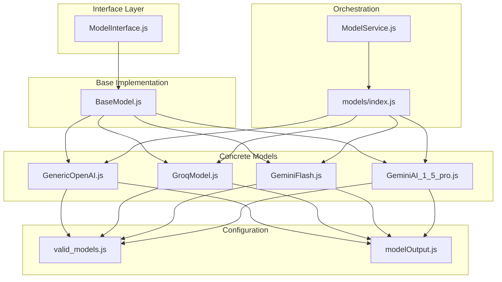
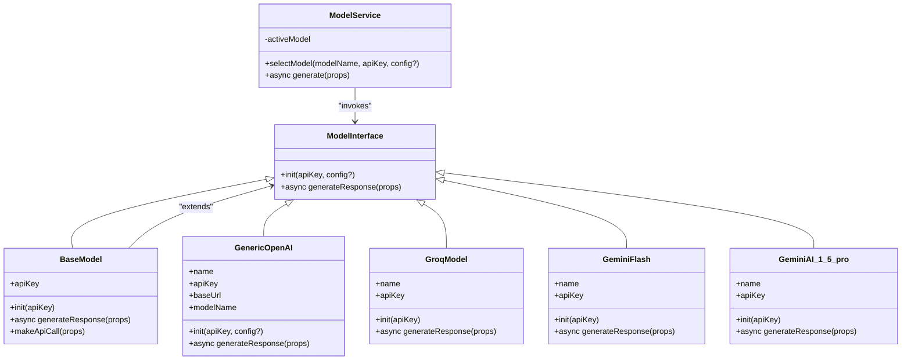
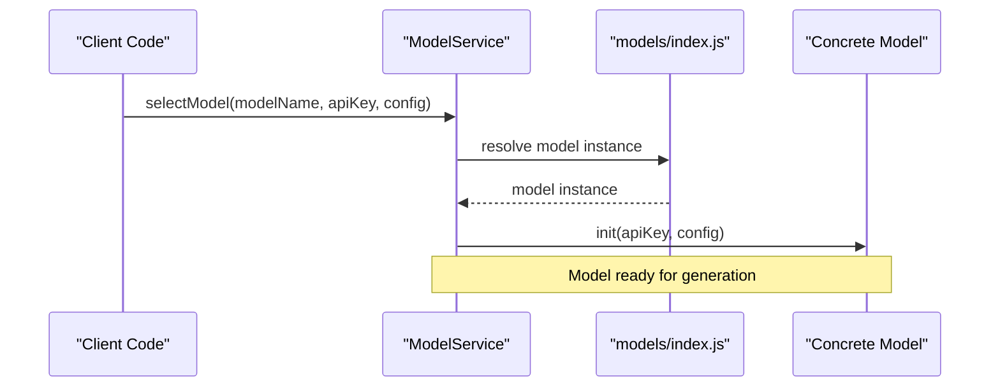
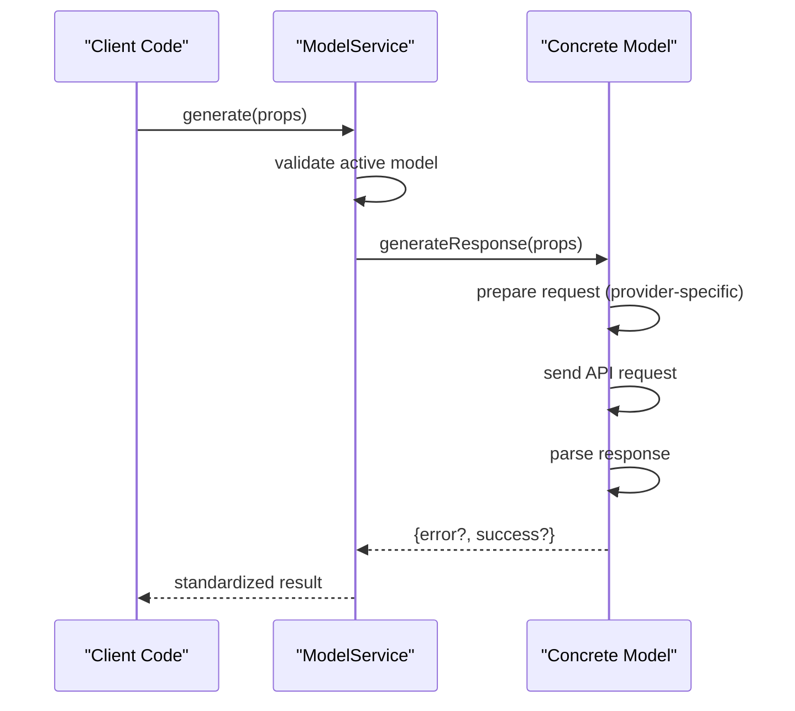
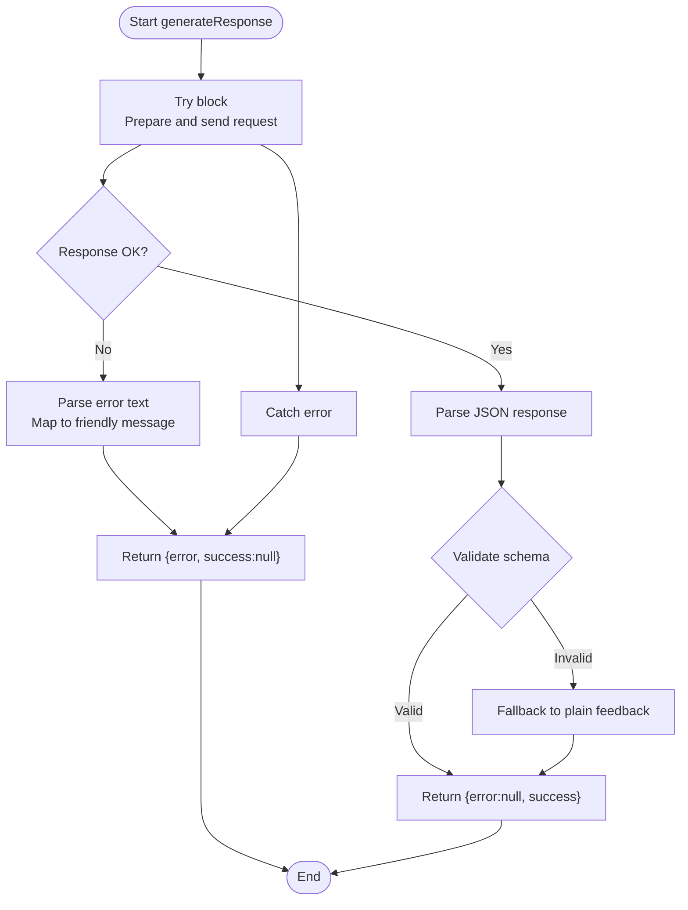
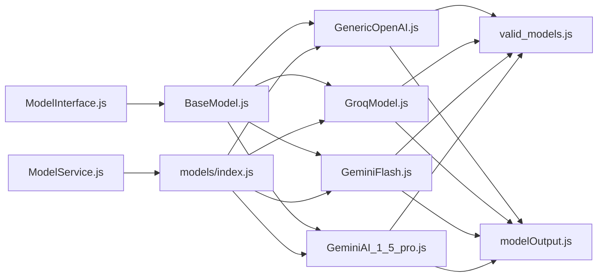

# Abstract Model Architecture

<cite>
**Referenced Files in This Document**
- [BaseModel.js](file://src/models/BaseModel.js)
- [ModelInterface.js](file://src/interface/ModelInterface.js)
- [ModelService.js](file://src/services/ModelService.js)
- [index.js](file://src/models/index.js)
- [GeminiAI_1_5_pro.js](file://src/models/model/GeminiAI_1_5_pro.js)
- [GeminiFlash.js](file://src/models/model/GeminiFlash.js)
- [GroqModel.js](file://src/models/model/GroqModel.js)
- [GenericOpenAI.js](file://src/models/model/GenericOpenAI.js)
- [valid_models.js](file://src/constants/valid_models.js)
- [modelOutput.js](file://src/schema/modelOutput.js)
- [utils.js](file://src/models/utils.js)
- [chatHistory.js](file://src/interface/chatHistory.js)
</cite>

## Table of Contents
1. [Introduction](#introduction)
2. [Project Structure](#project-structure)
3. [Core Components](#core-components)
4. [Architecture Overview](#architecture-overview)
5. [Detailed Component Analysis](#detailed-component-analysis)
6. [Dependency Analysis](#dependency-analysis)
7. [Performance Considerations](#performance-considerations)
8. [Troubleshooting Guide](#troubleshooting-guide)
9. [Conclusion](#conclusion)

## Introduction
This document explains the abstract model architecture foundation that powers pluggable AI model implementations in the DSA Buddy Chrome extension. The architecture centers around a shared interface contract and a base class that enforces a consistent API while allowing concrete model implementations to handle provider-specific details. This design enables easy addition of new AI providers and models without changing the external usage patterns.

## Project Structure
The model architecture spans several modules:
- Interface definition: defines the contract that all models must satisfy
- Base implementation: provides shared behavior and enforces required methods
- Concrete model implementations: provider-specific logic for OpenAI-compatible, Groq, and Google Gemini APIs
- Service orchestration: selects and invokes models consistently
- Model registry: centralizes model instantiation and configuration
- Output schema: validates and standardizes model responses

**Diagram sources**
- [ModelInterface.js](file://src/interface/ModelInterface.js#L12-L17)
- [BaseModel.js](file://src/models/BaseModel.js#L3-L16)
- [GenericOpenAI.js](file://src/models/model/GenericOpenAI.js#L5-L58)
- [GroqModel.js](file://src/models/model/GroqModel.js#L17-L67)
- [GeminiFlash.js](file://src/models/model/GeminiFlash.js#L20-L97)
- [GeminiAI_1_5_pro.js](file://src/models/model/GeminiAI_1_5_pro.js#L34-L84)
- [ModelService.js](file://src/services/ModelService.js#L4-L21)
- [index.js](file://src/models/index.js#L13-L18)
- [valid_models.js](file://src/constants/valid_models.js#L1-L12)
- [modelOutput.js](file://src/schema/modelOutput.js#L9-L14)

**Section sources**
- [ModelInterface.js](file://src/interface/ModelInterface.js#L1-L18)
- [BaseModel.js](file://src/models/BaseModel.js#L1-L17)
- [ModelService.js](file://src/services/ModelService.js#L1-L22)
- [index.js](file://src/models/index.js#L1-L19)

## Core Components
This section documents the foundational abstractions and their roles.

- ModelInterface: Defines the contract that all models must implement. It specifies two methods:
  - init(apiKey, config?): Initializes the model with an API key and optional provider-specific configuration
  - generateResponse(props): Asynchronous method that produces a standardized response object with either success data or an error

- BaseModel: Extends ModelInterface and provides shared behavior:
  - Stores the API key during initialization
  - Implements generateResponse(props) by delegating to makeApiCall(props)
  - Provides a default makeApiCall(props) that throws an error if subclasses do not override it

- ModelService: Orchestrates model selection and invocation:
  - selectModel(modelName, apiKey, config?): Resolves a model from the registry and initializes it
  - generate(props): Invokes the active model's generateResponse method

- Model Registry (models/index.js): Centralizes model instances and aliases:
  - Maps logical model names to concrete implementations
  - Supports dynamic Groq model aliases by creating instances with different names

- Output Schema (modelOutput.js): Validates model responses to ensure consistent structure across providers

**Section sources**
- [ModelInterface.js](file://src/interface/ModelInterface.js#L12-L17)
- [BaseModel.js](file://src/models/BaseModel.js#L3-L16)
- [ModelService.js](file://src/services/ModelService.js#L4-L21)
- [index.js](file://src/models/index.js#L13-L18)
- [modelOutput.js](file://src/schema/modelOutput.js#L9-L14)

## Architecture Overview
The architecture follows a layered approach:
- Interface layer defines the contract
- Base implementation provides common behavior
- Concrete implementations encapsulate provider specifics
- Service layer coordinates model selection and invocation
- Registry layer manages model lifecycle and aliases
- Validation layer ensures consistent output format

**Diagram sources**
- [ModelInterface.js](file://src/interface/ModelInterface.js#L12-L17)
- [BaseModel.js](file://src/models/BaseModel.js#L3-L16)
- [GenericOpenAI.js](file://src/models/model/GenericOpenAI.js#L5-L58)
- [GroqModel.js](file://src/models/model/GroqModel.js#L17-L67)
- [GeminiFlash.js](file://src/models/model/GeminiFlash.js#L20-L97)
- [GeminiAI_1_5_pro.js](file://src/models/model/GeminiAI_1_5_pro.js#L34-L84)
- [ModelService.js](file://src/services/ModelService.js#L4-L21)

## Detailed Component Analysis

### ModelInterface Contract
The interface establishes a minimal yet powerful contract:
- init(apiKey, config?): Optional initialization hook for provider-specific setup
- generateResponse(props): Must be implemented by all concrete models to return a standardized result object

Implementation notes:
- The interface allows optional configuration in init, enabling flexible provider setups
- The generateResponse method signature is consistent across all models, simplifying service orchestration

**Section sources**
- [ModelInterface.js](file://src/interface/ModelInterface.js#L12-L17)

### BaseModel: Shared Foundation
BaseModel extends ModelInterface and provides:
- API key storage and initialization
- Delegated response generation via generateResponse
- Enforced contract enforcement through makeApiCall default behavior

Initialization process:
- The init method stores the API key for later use by concrete implementations
- Subclasses override generateResponse to implement provider-specific logic

Error handling pattern:
- BaseModel does not implement error handling itself; subclasses implement robust try/catch blocks
- The interface contract expects a standardized result object with either success or error fields

**Section sources**
- [BaseModel.js](file://src/models/BaseModel.js#L3-L16)

### Concrete Model Implementations

#### GenericOpenAI
Purpose: Provides OpenAI-compatible model support with configurable base URL and model name.

Key behaviors:
- Uses a system prompt plus schema note to enforce JSON output
- Normalizes message roles between provider expectations
- Handles response parsing with graceful fallback to plain text feedback
- Returns standardized result object with error or success fields

Configuration:
- Accepts baseUrl and modelName via init(config)
- Defaults to common OpenAI-compatible endpoints and model names

**Section sources**
- [GenericOpenAI.js](file://src/models/model/GenericOpenAI.js#L5-L58)

#### GroqModel
Purpose: Integrates with Groq's OpenAI-compatible API.

Key behaviors:
- Resolves model ID from VALID_MODELS based on logical name
- Sends system prompt and messages in OpenAI-compatible format
- Enforces JSON response format and parses structured output
- Provides consistent error handling with standardized result object

**Section sources**
- [GroqModel.js](file://src/models/model/GroqModel.js#L17-L67)
- [valid_models.js](file://src/constants/valid_models.js#L1-L12)

#### GeminiFlash
Purpose: Integrates with Google Gemini's native API.

Key behaviors:
- Resolves model ID from VALID_MODELS based on logical name
- Constructs Gemini-specific content arrays with role normalization
- Uses responseMimeType and responseSchema for structured JSON output
- Implements friendly error parsing for common API errors (rate limits, invalid keys, model unavailability)

**Section sources**
- [GeminiFlash.js](file://src/models/model/GeminiFlash.js#L20-L97)
- [valid_models.js](file://src/constants/valid_models.js#L6-L8)

#### GeminiAI_1_5_pro
Purpose: Alternative Gemini model variant with similar structure.

Key behaviors:
- Identical initialization and response handling patterns as GeminiFlash
- Different model resolution and schema enforcement
- Friendly error parsing with rate limit and authentication handling

**Section sources**
- [GeminiAI_1_5_pro.js](file://src/models/model/GeminiAI_1_5_pro.js#L34-L84)
- [valid_models.js](file://src/constants/valid_models.js#L7-L8)

### ModelService Orchestration
ModelService coordinates model selection and invocation:
- selectModel(modelName, apiKey, config?): Resolves model from registry and initializes with API key and optional config
- generate(props): Invokes the active model's generateResponse method

Design rationale:
- Centralized selection prevents scattered model instantiation logic
- Consistent invocation pattern simplifies integration points
- Clear error propagation when no model is selected

**Section sources**
- [ModelService.js](file://src/services/ModelService.js#L4-L21)
- [index.js](file://src/models/index.js#L13-L18)

### Model Registry and Aliasing
The registry centralizes model management:
- Maps logical names to concrete implementations
- Supports Groq model aliasing by creating instances with different names
- Enables easy addition of new models without changing service logic

**Section sources**
- [index.js](file://src/models/index.js#L7-L11)
- [index.js](file://src/models/index.js#L13-L18)

### Output Schema Validation
The output schema ensures consistent response structure:
- Enforces presence of feedback field
- Limits hints to at most two entries
- Validates programming language against supported set
- Provides descriptive metadata for each field

Integration:
- Used by concrete models to validate parsed responses
- Ensures downstream consumers receive predictable data shapes

**Section sources**
- [modelOutput.js](file://src/schema/modelOutput.js#L9-L14)

## Architecture Overview

### Initialization Flow

**Diagram sources**
- [ModelService.js](file://src/services/ModelService.js#L7-L14)
- [index.js](file://src/models/index.js#L13-L18)

### Generation Flow

**Diagram sources**
- [ModelService.js](file://src/services/ModelService.js#L16-L21)
- [GenericOpenAI.js](file://src/models/model/GenericOpenAI.js#L17-L58)
- [GroqModel.js](file://src/models/model/GroqModel.js#L25-L67)
- [GeminiFlash.js](file://src/models/model/GeminiFlash.js#L28-L97)
- [GeminiAI_1_5_pro.js](file://src/models/model/GeminiAI_1_5_pro.js#L42-L84)

### Error Handling Flow

**Diagram sources**
- [GenericOpenAI.js](file://src/models/model/GenericOpenAI.js#L17-L58)
- [GroqModel.js](file://src/models/model/GroqModel.js#L25-L67)
- [GeminiFlash.js](file://src/models/model/GeminiFlash.js#L28-L97)
- [GeminiAI_1_5_pro.js](file://src/models/model/GeminiAI_1_5_pro.js#L42-L84)

## Dependency Analysis
The architecture exhibits clean separation of concerns:
- Interface layer defines contracts without implementation details
- Base implementation provides shared behavior without provider specifics
- Concrete models encapsulate provider-specific logic
- Service layer orchestrates without knowing provider details
- Registry layer manages lifecycle and aliases
- Validation layer ensures output consistency

Potential circular dependencies:
- None detected between interface, base, and concrete models
- Service depends on registry, which depends on concrete models; this is acceptable as it's a controlled dependency chain

External dependencies:
- fetch API for HTTP requests
- zod for response validation
- ai library for structured generation utilities

**Diagram sources**
- [ModelInterface.js](file://src/interface/ModelInterface.js#L12-L17)
- [BaseModel.js](file://src/models/BaseModel.js#L3-L16)
- [GenericOpenAI.js](file://src/models/model/GenericOpenAI.js#L5-L58)
- [GroqModel.js](file://src/models/model/GroqModel.js#L17-L67)
- [GeminiFlash.js](file://src/models/model/GeminiFlash.js#L20-L97)
- [GeminiAI_1_5_pro.js](file://src/models/model/GeminiAI_1_5_pro.js#L34-L84)
- [ModelService.js](file://src/services/ModelService.js#L4-L21)
- [index.js](file://src/models/index.js#L13-L18)
- [valid_models.js](file://src/constants/valid_models.js#L1-L12)
- [modelOutput.js](file://src/schema/modelOutput.js#L9-L14)

**Section sources**
- [index.js](file://src/models/index.js#L1-L19)
- [ModelService.js](file://src/services/ModelService.js#L1-L22)

## Performance Considerations
- Network latency dominates cost; minimize unnecessary requests and retries
- Prefer streaming responses when available (not currently implemented)
- Cache frequently used model configurations locally
- Batch related operations when possible
- Use exponential backoff for rate-limited requests (already handled for Gemini)
- Validate responses early to fail fast on malformed data

## Troubleshooting Guide
Common issues and resolutions:

API Key Problems:
- Invalid or missing API key leads to authentication failures
- Gemini models provide explicit "Invalid API key" messages
- Verify key validity and permissions for target models

Rate Limiting:
- Gemini models detect 429 responses and suggest wait times
- Groq and OpenAI-compatible endpoints may throttle requests
- Implement retry logic with backoff for transient failures

Model Availability:
- Some models may be unavailable or restricted
- Gemini models provide "Model not available" messages
- Switch to alternative models in the registry

Response Parsing:
- Models fall back to plain text feedback when JSON parsing fails
- Ensure system prompts clearly instruct JSON output format
- Validate output against schema before downstream processing

Service Errors:
- No model selected: ensure selectModel is called before generate
- Model not found: verify model name matches registry keys

**Section sources**
- [GeminiFlash.js](file://src/models/model/GeminiFlash.js#L64-L83)
- [GeminiAI_1_5_pro.js](file://src/models/model/GeminiAI_1_5_pro.js#L17-L32)
- [ModelService.js](file://src/services/ModelService.js#L11-L13)

## Conclusion
The abstract model architecture provides a robust, extensible foundation for integrating multiple AI providers while maintaining a consistent interface and output format. The design enables easy addition of new models, centralized configuration management, and reliable error handling. By enforcing a strict contract and providing shared infrastructure, the architecture supports rapid iteration and experimentation with different AI backends without compromising system stability or developer experience.