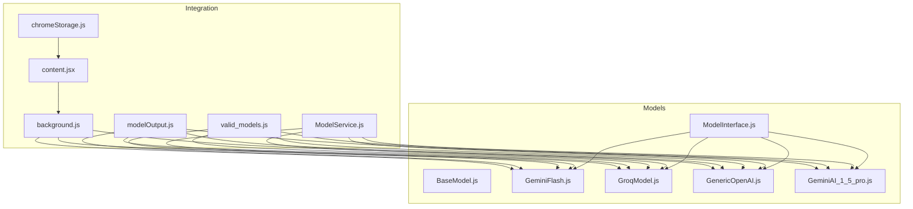
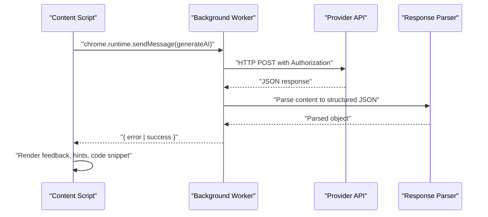
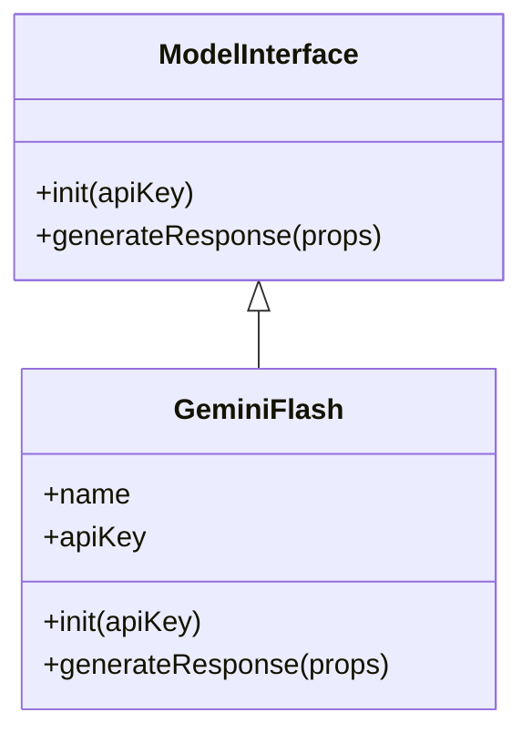
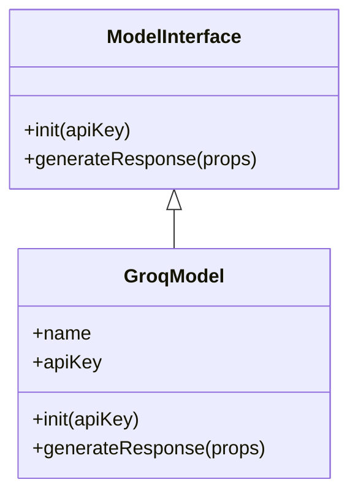
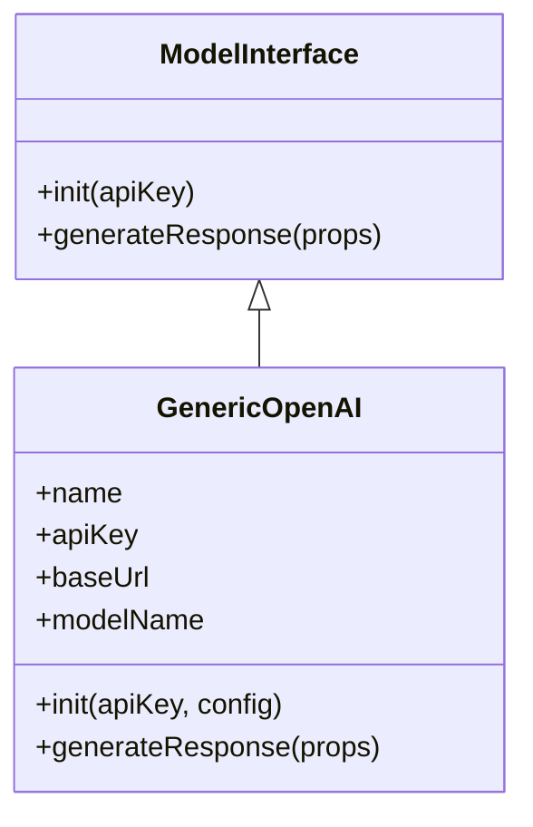
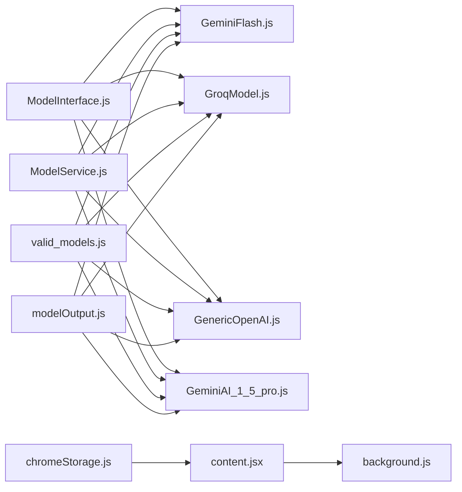

# Concrete Model Implementations

<cite>
**Referenced Files in This Document**
- [GeminiFlash.js](file://src/models/model/GeminiFlash.js)
- [GroqModel.js](file://src/models/model/GroqModel.js)
- [GenericOpenAI.js](file://src/models/model/GenericOpenAI.js)
- [GeminiAI_1_5_pro.js](file://src/models/model/GeminiAI_1_5_pro.js)
- [BaseModel.js](file://src/models/BaseModel.js)
- [ModelInterface.js](file://src/interface/ModelInterface.js)
- [ModelService.js](file://src/services/ModelService.js)
- [valid_models.js](file://src/constants/valid_models.js)
- [modelOutput.js](file://src/schema/modelOutput.js)
- [content.jsx](file://src/content/content.jsx)
- [background.js](file://src/background.js)
- [chromeStorage.js](file://src/lib/chromeStorage.js)
</cite>

## Table of Contents
1. [Introduction](#introduction)
2. [Project Structure](#project-structure)
3. [Core Components](#core-components)
4. [Architecture Overview](#architecture-overview)
5. [Detailed Component Analysis](#detailed-component-analysis)
6. [Dependency Analysis](#dependency-analysis)
7. [Performance Considerations](#performance-considerations)
8. [Troubleshooting Guide](#troubleshooting-guide)
9. [Conclusion](#conclusion)

## Introduction
This document provides comprehensive technical documentation for the concrete AI model implementations used by the Chrome extension. It covers three primary model classes: Google Gemini Flash, Groq, and Generic OpenAI-compatible implementations. The documentation explains API integrations, authentication methods, request formatting, response processing, provider-specific parameters, rate limiting, pricing considerations, performance characteristics, configuration requirements, error handling strategies, and troubleshooting guidance for each provider.

## Project Structure
The model implementations are organized within the models directory and integrate with the extension's content script and background service worker. The structure supports pluggable model selection and shared configuration through constants and services.

**Diagram sources**
- [ModelInterface.js](file://src/interface/ModelInterface.js#L12-L17)
- [BaseModel.js](file://src/models/BaseModel.js#L3-L16)
- [GeminiFlash.js](file://src/models/model/GeminiFlash.js#L20-L98)
- [GroqModel.js](file://src/models/model/GroqModel.js#L17-L68)
- [GenericOpenAI.js](file://src/models/model/GenericOpenAI.js#L5-L59)
- [GeminiAI_1_5_pro.js](file://src/models/model/GeminiAI_1_5_pro.js#L34-L84)
- [ModelService.js](file://src/services/ModelService.js#L4-L21)
- [valid_models.js](file://src/constants/valid_models.js#L1-L12)
- [modelOutput.js](file://src/schema/modelOutput.js#L9-L14)
- [content.jsx](file://src/content/content.jsx#L153-L181)
- [background.js](file://src/background.js#L127-L155)
- [chromeStorage.js](file://src/lib/chromeStorage.js#L1-L36)

**Section sources**
- [GeminiFlash.js](file://src/models/model/GeminiFlash.js#L1-L99)
- [GroqModel.js](file://src/models/model/GroqModel.js#L1-L69)
- [GenericOpenAI.js](file://src/models/model/GenericOpenAI.js#L1-L60)
- [GeminiAI_1_5_pro.js](file://src/models/model/GeminiAI_1_5_pro.js#L1-L85)
- [ModelInterface.js](file://src/interface/ModelInterface.js#L1-L18)
- [ModelService.js](file://src/services/ModelService.js#L1-L22)
- [valid_models.js](file://src/constants/valid_models.js#L1-L12)
- [modelOutput.js](file://src/schema/modelOutput.js#L1-L14)
- [content.jsx](file://src/content/content.jsx#L1-L760)
- [background.js](file://src/background.js#L1-L156)
- [chromeStorage.js](file://src/lib/chromeStorage.js#L1-L36)

## Core Components
- ModelInterface: Defines the contract for all model implementations with init and generateResponse methods.
- BaseModel: Provides a base implementation that delegates to a subclass-defined makeApiCall method.
- Concrete Models: GeminiFlash, GroqModel, GenericOpenAI, and GeminiAI_1_5_pro implement provider-specific logic.
- ModelService: Manages model selection and delegates generation requests to the active model.
- Integration Layer: content.jsx orchestrates UI events and routes API calls via background.js to avoid CORS issues.

Key implementation patterns:
- All models inherit from ModelInterface and implement generateResponse.
- Request bodies are constructed from props.messages, props.systemPrompt, and props.prompt.
- Response parsing enforces a JSON schema with feedback, hints, snippet, and programmingLanguage fields.
- Error handling converts provider-specific errors into user-friendly messages.

**Section sources**
- [ModelInterface.js](file://src/interface/ModelInterface.js#L12-L17)
- [BaseModel.js](file://src/models/BaseModel.js#L3-L16)
- [ModelService.js](file://src/services/ModelService.js#L4-L21)

## Architecture Overview
The extension routes AI requests through the content script to the background service worker, which performs provider-specific API calls. The content script handles UI rendering and user interactions, while the background worker manages authentication and provider integrations.

**Diagram sources**
- [content.jsx](file://src/content/content.jsx#L153-L181)
- [background.js](file://src/background.js#L127-L155)
- [modelOutput.js](file://src/schema/modelOutput.js#L9-L14)

## Detailed Component Analysis

### Google Gemini Flash Implementation
The GeminiFlash model integrates with Google's Generative Language API v1beta endpoint. It constructs a content array from chat history and appends the user prompt, then sends a request with a system instruction and JSON response schema.

Implementation highlights:
- Authentication: Uses API key query parameter (?key=...) appended to the endpoint URL.
- Request formatting: Builds contents array with roles mapped from assistant/user to model/user.
- Response processing: Extracts JSON from candidates[0].content.parts[0].text and parses into structured output.
- Error handling: Parses provider error codes and maps them to friendly messages, including rate limit guidance.

Provider-specific parameters:
- Model ID: Defaults to gemini-2.0-flash if not found in VALID_MODELS.
- Generation config: responseMimeType application/json with responseSchema enforced.

Rate limits and pricing:
- Free tier rate limit handling: Detects 429 errors and extracts retry delay from error payload to inform the user.
- Pricing considerations: Subject to Google Cloud Generative Language API pricing; free tier quotas apply.

Performance characteristics:
- Lightweight JSON schema enforcement reduces ambiguity in provider responses.
- Role mapping ensures correct conversational context for Gemini models.

Configuration requirements:
- API key must be provided via init method.
- VALID_MODELS defines available model IDs and display names.

Error handling strategies:
- Catches network errors and JSON parsing failures.
- Converts provider error codes (401, 403, 404) into actionable messages.
- Gracefully falls back to returning raw text if JSON parsing fails.

**Diagram sources**
- [ModelInterface.js](file://src/interface/ModelInterface.js#L12-L17)
- [GeminiFlash.js](file://src/models/model/GeminiFlash.js#L20-L98)

**Section sources**
- [GeminiFlash.js](file://src/models/model/GeminiFlash.js#L1-L99)
- [valid_models.js](file://src/constants/valid_models.js#L6-L8)
- [modelOutput.js](file://src/schema/modelOutput.js#L9-L14)

### Groq Implementation
The GroqModel implementation targets the Groq OpenAI-compatible API endpoint. It formats messages with system, user, and assistant roles and requests JSON responses.

Implementation highlights:
- Authentication: Uses Authorization header with Bearer token.
- Request formatting: Constructs messages array with role mapping and content serialization.
- Response processing: Parses JSON from choices[0].message.content and falls back to raw text if parsing fails.
- Error handling: Returns provider error messages with HTTP status codes.

Provider-specific parameters:
- Model ID: Defaults to llama-3.3-70b-versatile for groq_llama; deepseek-r1-distill-llama-70b for groq_deepseek.
- Response format: response_format set to json_object.

Rate limits and pricing:
- Free tier availability with potential rate limiting; error messages indicate provider-side throttling.
- Pricing varies by model; groq_llama and groq_deepseek are listed as free options.

Performance characteristics:
- OpenAI-compatible endpoint simplifies integration and reduces latency expectations.
- Message truncation in content script helps manage token usage for free tiers.

Configuration requirements:
- API key must be provided via init method.
- Model selection uses VALID_MODELS entries for groq_llama and groq_deepseek.

Error handling strategies:
- Catches network errors and returns structured error objects.
- Provides clear error messages for non-OK responses.

**Diagram sources**
- [ModelInterface.js](file://src/interface/ModelInterface.js#L12-L17)
- [GroqModel.js](file://src/models/model/GroqModel.js#L17-L68)

**Section sources**
- [GroqModel.js](file://src/models/model/GroqModel.js#L1-L69)
- [valid_models.js](file://src/constants/valid_models.js#L2-L4)
- [modelOutput.js](file://src/schema/modelOutput.js#L9-L14)

### Generic OpenAI-Compatible Implementation
The GenericOpenAI model enables integration with any OpenAI-compatible API by allowing configurable base URLs and model names. It follows the same request/response pattern as other models.

Implementation highlights:
- Authentication: Uses Authorization header with Bearer token.
- Request formatting: Similar to other models with system prompt and serialized messages.
- Response processing: Parses JSON from choices[0].message.content with fallback behavior.
- Flexibility: Supports custom base URLs and model names for diverse providers.

Provider-specific parameters:
- Base URL: Defaults to https://api.openai.com/v1 if not provided.
- Model name: Defaults to gpt-3.5-turbo if not specified.

Rate limits and pricing:
- Depends on the configured provider; generic implementation does not assume specific limits.
- Pricing determined by the target provider’s rates.

Performance characteristics:
- Minimal overhead; relies on standardized OpenAI-compatible endpoints.
- Configurable model allows targeting specialized or lower-cost endpoints.

Configuration requirements:
- API key via init method.
- Optional config object with baseUrl and modelName.

Error handling strategies:
- Returns structured error messages for non-OK responses.
- Maintains consistent error handling across providers.

**Diagram sources**
- [ModelInterface.js](file://src/interface/ModelInterface.js#L12-L17)
- [GenericOpenAI.js](file://src/models/model/GenericOpenAI.js#L5-L59)

**Section sources**
- [GenericOpenAI.js](file://src/models/model/GenericOpenAI.js#L1-L60)
- [valid_models.js](file://src/constants/valid_models.js#L10-L12)
- [modelOutput.js](file://src/schema/modelOutput.js#L9-L14)

### Additional Provider: Gemini 1.5 Pro
The GeminiAI_1_5_pro model mirrors the Gemini Flash implementation but targets the gemini-1.5-flash model and includes a reusable error parsing helper.

Key differences:
- Model ID defaults to gemini-1.5-flash.
- Uses a shared parseFriendlyError helper for consistent error messaging.

**Section sources**
- [GeminiAI_1_5_pro.js](file://src/models/model/GeminiAI_1_5_pro.js#L1-L85)
- [valid_models.js](file://src/constants/valid_models.js#L6-L9)
- [modelOutput.js](file://src/schema/modelOutput.js#L9-L14)

## Dependency Analysis
The models depend on shared interfaces, constants, and services. The content script coordinates model selection and passes requests to the background worker, which executes provider-specific logic.

**Diagram sources**
- [ModelInterface.js](file://src/interface/ModelInterface.js#L12-L17)
- [GeminiFlash.js](file://src/models/model/GeminiFlash.js#L20-L98)
- [GroqModel.js](file://src/models/model/GroqModel.js#L17-L68)
- [GenericOpenAI.js](file://src/models/model/GenericOpenAI.js#L5-L59)
- [GeminiAI_1_5_pro.js](file://src/models/model/GeminiAI_1_5_pro.js#L34-L84)
- [ModelService.js](file://src/services/ModelService.js#L4-L21)
- [valid_models.js](file://src/constants/valid_models.js#L1-L12)
- [modelOutput.js](file://src/schema/modelOutput.js#L9-L14)
- [content.jsx](file://src/content/content.jsx#L153-L181)
- [background.js](file://src/background.js#L127-L155)
- [chromeStorage.js](file://src/lib/chromeStorage.js#L1-L36)

**Section sources**
- [ModelService.js](file://src/services/ModelService.js#L1-L22)
- [valid_models.js](file://src/constants/valid_models.js#L1-L12)
- [modelOutput.js](file://src/schema/modelOutput.js#L1-L14)
- [content.jsx](file://src/content/content.jsx#L1-L760)
- [background.js](file://src/background.js#L1-L156)
- [chromeStorage.js](file://src/lib/chromeStorage.js#L1-L36)

## Performance Considerations
- Token usage: The content script truncates user code and limits chat history to reduce token consumption on free tiers.
- Request batching: The background worker consolidates provider-specific logic to minimize repeated initialization overhead.
- Response parsing: Enforcing JSON schema reduces ambiguity and parsing retries.
- Rate limiting UI: The content script displays countdown timers for rate-limited operations to improve user experience.

[No sources needed since this section provides general guidance]

## Troubleshooting Guide
Common integration issues and resolutions:
- Invalid API key: Models return user-friendly messages indicating invalid credentials; verify keys in extension settings.
- Rate limit exceeded: Gemini models detect 429 errors and extract retry delays; wait for the specified period before retrying.
- Model not available: Provider returns 404 for unavailable models; switch to a supported model from VALID_MODELS.
- Network errors: Catch-all error handling returns structured error messages; check connectivity and provider status.
- JSON parsing failures: Models fall back to returning raw text if JSON parsing fails; ensure provider supports JSON response format.

Configuration tips:
- Gemini: Ensure API key is set and model ID matches VALID_MODELS.
- Groq: Verify Authorization header and model ID selection.
- Generic OpenAI: Confirm base URL and model name configuration.

**Section sources**
- [GeminiFlash.js](file://src/models/model/GeminiFlash.js#L62-L84)
- [GroqModel.js](file://src/models/model/GroqModel.js#L52-L55)
- [GenericOpenAI.js](file://src/models/model/GenericOpenAI.js#L43-L46)
- [GeminiAI_1_5_pro.js](file://src/models/model/GeminiAI_1_5_pro.js#L71-L74)
- [chromeStorage.js](file://src/lib/chromeStorage.js#L1-L36)

## Conclusion
The concrete model implementations provide a robust, extensible foundation for integrating multiple AI providers within the Chrome extension. By leveraging shared interfaces, constants, and services, the codebase maintains consistency across providers while accommodating provider-specific requirements. The integration with the background worker and content script ensures secure, efficient, and user-friendly AI assistance for coding challenges.