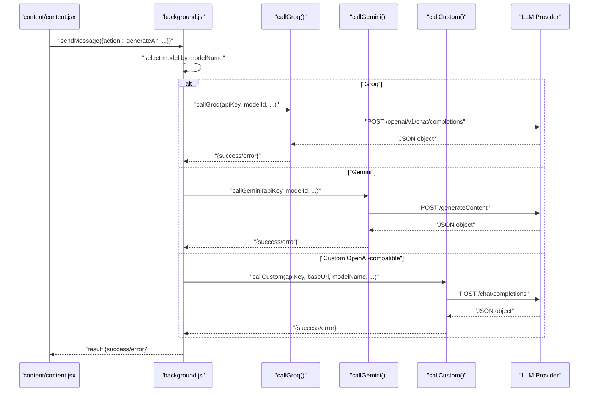
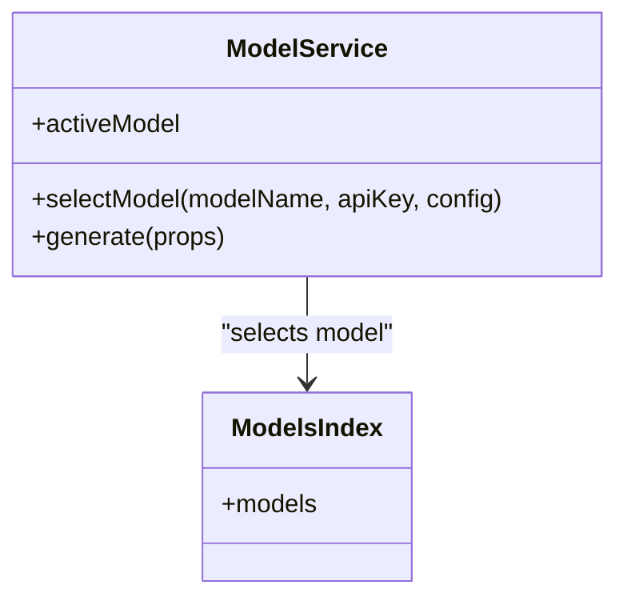
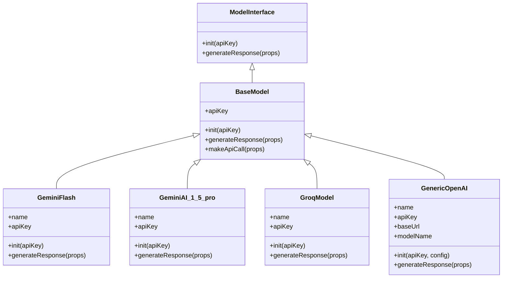
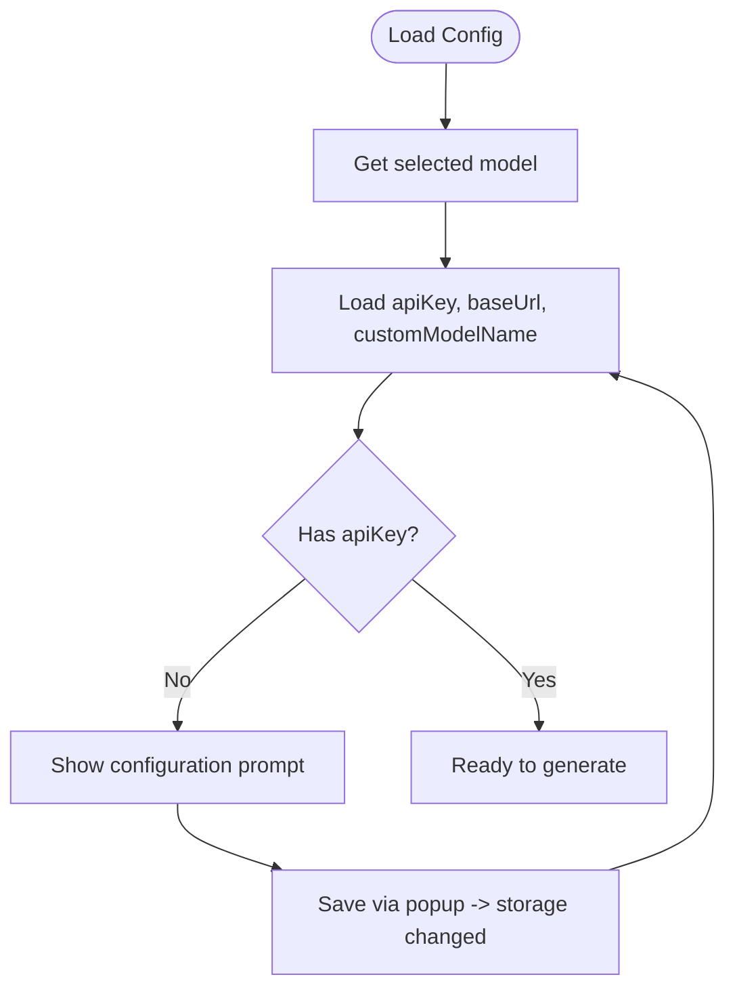
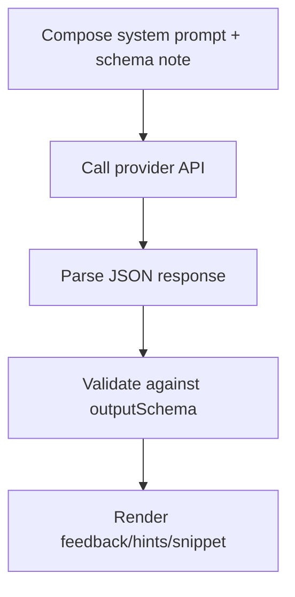
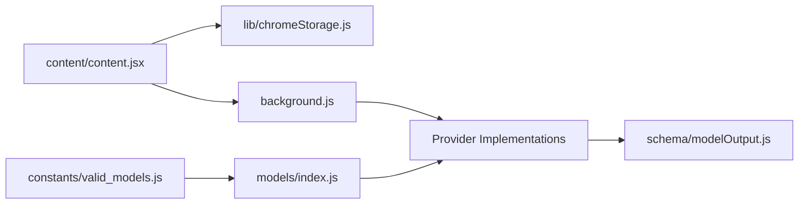

# Model Configuration Management

<cite>
**Referenced Files in This Document**
- [src/models/utils.js](file://src/models/utils.js)
- [src/constants/valid_models.js](file://src/constants/valid_models.js)
- [src/models/BaseModel.js](file://src/models/BaseModel.js)
- [src/services/ModelService.js](file://src/services/ModelService.js)
- [src/lib/chromeStorage.js](file://src/lib/chromeStorage.js)
- [src/models/index.js](file://src/models/index.js)
- [src/models/model/GeminiAI_1_5_pro.js](file://src/models/model/GeminiAI_1_5_pro.js)
- [src/models/model/GeminiFlash.js](file://src/models/model/GeminiFlash.js)
- [src/models/model/GroqModel.js](file://src/models/model/GroqModel.js)
- [src/models/model/GenericOpenAI.js](file://src/models/model/GenericOpenAI.js)
- [src/interface/ModelInterface.js](file://src/interface/ModelInterface.js)
- [src/schema/modelOutput.js](file://src/schema/modelOutput.js)
- [src/content/content.jsx](file://src/content/content.jsx)
- [src/background.js](file://src/background.js)
- [src/constants/prompt.js](file://src/constants/prompt.js)
</cite>

## Table of Contents
1. [Introduction](#introduction)
2. [Project Structure](#project-structure)
3. [Core Components](#core-components)
4. [Architecture Overview](#architecture-overview)
5. [Detailed Component Analysis](#detailed-component-analysis)
6. [Dependency Analysis](#dependency-analysis)
7. [Performance Considerations](#performance-considerations)
8. [Troubleshooting Guide](#troubleshooting-guide)
9. [Conclusion](#conclusion)
10. [Appendices](#appendices)

## Introduction
This document explains the model configuration and management utilities used by the extension to integrate with multiple AI providers. It covers configuration validation, API key management, model parameter handling, environment variable integration, configuration persistence, default value handling, validation rules for different model types, and utility functions for configuration processing, error validation, and compatibility checking. It also includes examples for configuring different AI providers, handling missing or invalid configurations, secure API key storage, configuration migration, version compatibility, and troubleshooting configuration issues.

## Project Structure
The model configuration system spans several modules:
- Model registry and selection: models/index.js and services/ModelService.js
- Provider-specific implementations: models/model/*.js
- Base abstraction: models/BaseModel.js and interface/ModelInterface.js
- Configuration persistence: lib/chromeStorage.js
- Validation and defaults: constants/valid_models.js and schema/modelOutput.js
- Orchestration: content/content.jsx and background.js
- Prompt composition: constants/prompt.js

```mermaid
graph TB
subgraph "UI Layer"
Content["content/content.jsx"]
end
subgraph "Service Layer"
ModelService["services/ModelService.js"]
end
subgraph "Model Registry"
ModelsIndex["models/index.js"]
ValidModels["constants/valid_models.js"]
end
subgraph "Providers"
GeminiFlash["models/model/GeminiFlash.js"]
GeminiPro["models/model/GeminiAI_1_5_pro.js"]
Groq["models/model/GroqModel.js"]
Generic["models/model/GenericOpenAI.js"]
end
subgraph "Persistence"
ChromeStorage["lib/chromeStorage.js"]
end
subgraph "Validation & Schema"
OutputSchema["schema/modelOutput.js"]
Prompt["constants/prompt.js"]
end
subgraph "Background"
Background["background.js"]
end
Content --> ModelService
ModelService --> ModelsIndex
ModelsIndex --> GeminiFlash
ModelsIndex --> GeminiPro
ModelsIndex --> Groq
ModelsIndex --> Generic
Content --> ChromeStorage
Content --> Prompt
Content --> Background
Background --> GeminiFlash
Background --> GeminiPro
Background --> Groq
Background --> Generic
GeminiFlash --> OutputSchema
GeminiPro --> OutputSchema
Groq --> OutputSchema
Generic --> OutputSchema
ValidModels --> ModelsIndex
```

**Diagram sources**
- [src/content/content.jsx](file://src/content/content.jsx#L1-L760)
- [src/services/ModelService.js](file://src/services/ModelService.js#L1-L22)
- [src/models/index.js](file://src/models/index.js#L1-L19)
- [src/constants/valid_models.js](file://src/constants/valid_models.js#L1-L12)
- [src/models/model/GeminiFlash.js](file://src/models/model/GeminiFlash.js#L1-L99)
- [src/models/model/GeminiAI_1_5_pro.js](file://src/models/model/GeminiAI_1_5_pro.js#L1-L85)
- [src/models/model/GroqModel.js](file://src/models/model/GroqModel.js#L1-L69)
- [src/models/model/GenericOpenAI.js](file://src/models/model/GenericOpenAI.js#L1-L60)
- [src/lib/chromeStorage.js](file://src/lib/chromeStorage.js#L1-L36)
- [src/schema/modelOutput.js](file://src/schema/modelOutput.js#L1-L14)
- [src/constants/prompt.js](file://src/constants/prompt.js#L1-L51)
- [src/background.js](file://src/background.js#L1-L156)

**Section sources**
- [src/models/index.js](file://src/models/index.js#L1-L19)
- [src/services/ModelService.js](file://src/services/ModelService.js#L1-L22)
- [src/lib/chromeStorage.js](file://src/lib/chromeStorage.js#L1-L36)
- [src/constants/valid_models.js](file://src/constants/valid_models.js#L1-L12)
- [src/schema/modelOutput.js](file://src/schema/modelOutput.js#L1-L14)
- [src/content/content.jsx](file://src/content/content.jsx#L1-L760)
- [src/background.js](file://src/background.js#L1-L156)

## Core Components
- Model registry and selection: models/index.js exports provider-specific model instances; services/ModelService.js selects and initializes a model with an API key and optional configuration.
- Provider implementations: Each provider class implements a common interface and handles API calls, error parsing, and response normalization.
- Base abstraction: BaseModel.js and ModelInterface.js define the contract for initialization and response generation.
- Configuration persistence: lib/chromeStorage.js stores API keys, base URLs, and custom model names per provider, with shared storage for Groq variants.
- Validation and defaults: constants/valid_models.js enumerates supported models; schema/modelOutput.js defines the expected response shape validated by the LLM.
- Orchestration: content/content.jsx loads persisted configuration and routes requests to background.js; background.js executes provider-specific calls.

**Section sources**
- [src/models/index.js](file://src/models/index.js#L1-L19)
- [src/services/ModelService.js](file://src/services/ModelService.js#L1-L22)
- [src/models/BaseModel.js](file://src/models/BaseModel.js#L1-L17)
- [src/interface/ModelInterface.js](file://src/interface/ModelInterface.js#L1-L18)
- [src/lib/chromeStorage.js](file://src/lib/chromeStorage.js#L1-L36)
- [src/constants/valid_models.js](file://src/constants/valid_models.js#L1-L12)
- [src/schema/modelOutput.js](file://src/schema/modelOutput.js#L1-L14)
- [src/content/content.jsx](file://src/content/content.jsx#L1-L760)
- [src/background.js](file://src/background.js#L1-L156)

## Architecture Overview
The configuration lifecycle:
- UI loads saved model and credentials from chrome.storage.local.
- User triggers a generation request via content/content.jsx.
- Request is sent to background.js via chrome.runtime.sendMessage.
- background.js selects the appropriate provider implementation and performs the API call.
- Responses are normalized and returned to the UI, which updates chat history.



**Diagram sources**
- [src/content/content.jsx](file://src/content/content.jsx#L122-L181)
- [src/background.js](file://src/background.js#L7-L44)
- [src/background.js](file://src/background.js#L46-L83)
- [src/background.js](file://src/background.js#L85-L123)

## Detailed Component Analysis

### Model Registry and Selection
- models/index.js registers provider instances and aliases Groq models to a single class with dynamic model IDs resolved at runtime.
- services/ModelService.js exposes selectModel(modelName, apiKey, config) and generate(props) to orchestrate model usage.



**Diagram sources**
- [src/services/ModelService.js](file://src/services/ModelService.js#L1-L22)
- [src/models/index.js](file://src/models/index.js#L1-L19)

**Section sources**
- [src/models/index.js](file://src/models/index.js#L1-L19)
- [src/services/ModelService.js](file://src/services/ModelService.js#L1-L22)

### Provider Implementations
- BaseModel.js and ModelInterface.js define the base contract for provider classes.
- GeminiFlash.js and GeminiAI_1_5_pro.js implement Gemini-specific API calls, URL construction, message formatting, and error parsing.
- GroqModel.js implements Groq’s OpenAI-compatible endpoint with JSON response formatting.
- GenericOpenAI.js implements a configurable OpenAI-compatible endpoint with default base URL and model name.



**Diagram sources**
- [src/interface/ModelInterface.js](file://src/interface/ModelInterface.js#L1-L18)
- [src/models/BaseModel.js](file://src/models/BaseModel.js#L1-L17)
- [src/models/model/GeminiFlash.js](file://src/models/model/GeminiFlash.js#L1-L99)
- [src/models/model/GeminiAI_1_5_pro.js](file://src/models/model/GeminiAI_1_5_pro.js#L1-L85)
- [src/models/model/GroqModel.js](file://src/models/model/GroqModel.js#L1-L69)
- [src/models/model/GenericOpenAI.js](file://src/models/model/GenericOpenAI.js#L1-L60)

**Section sources**
- [src/interface/ModelInterface.js](file://src/interface/ModelInterface.js#L1-L18)
- [src/models/BaseModel.js](file://src/models/BaseModel.js#L1-L17)
- [src/models/model/GeminiFlash.js](file://src/models/model/GeminiFlash.js#L1-L99)
- [src/models/model/GeminiAI_1_5_pro.js](file://src/models/model/GeminiAI_1_5_pro.js#L1-L85)
- [src/models/model/GroqModel.js](file://src/models/model/GroqModel.js#L1-L69)
- [src/models/model/GenericOpenAI.js](file://src/models/model/GenericOpenAI.js#L1-L60)

### Configuration Persistence and Defaults
- lib/chromeStorage.js persists API keys, base URLs, and custom model names per model. Groq variants share the same key to simplify storage.
- content/content.jsx loads persisted configuration and displays a configuration prompt if model or API key is missing.
- constants/valid_models.js enumerates supported models and display names.
- GenericOpenAI.js applies defaults for base URL and model name when not provided.



**Diagram sources**
- [src/lib/chromeStorage.js](file://src/lib/chromeStorage.js#L1-L36)
- [src/content/content.jsx](file://src/content/content.jsx#L602-L622)

**Section sources**
- [src/lib/chromeStorage.js](file://src/lib/chromeStorage.js#L1-L36)
- [src/content/content.jsx](file://src/content/content.jsx#L602-L622)
- [src/constants/valid_models.js](file://src/constants/valid_models.js#L1-L12)
- [src/models/model/GenericOpenAI.js](file://src/models/model/GenericOpenAI.js#L11-L15)

### Validation and Output Schema
- schema/modelOutput.js defines the expected response structure and constraints (e.g., number of hints, supported languages).
- Providers embed a schema note in prompts to encourage JSON responses aligned with the schema.
- content/content.jsx parses and renders structured responses, including hints and code snippets.



**Diagram sources**
- [src/schema/modelOutput.js](file://src/schema/modelOutput.js#L1-L14)
- [src/models/model/GeminiFlash.js](file://src/models/model/GeminiFlash.js#L18-L18)
- [src/models/model/GeminiAI_1_5_pro.js#L15-L15)
- [src/models/model/GroqModel.js](file://src/models/model/GroqModel.js#L15-L15)
- [src/models/model/GenericOpenAI.js](file://src/models/model/GenericOpenAI.js#L3-L3)
- [src/content/content.jsx](file://src/content/content.jsx#L335-L490)

**Section sources**
- [src/schema/modelOutput.js](file://src/schema/modelOutput.js#L1-L14)
- [src/models/model/GeminiFlash.js](file://src/models/model/GeminiFlash.js#L18-L18)
- [src/models/model/GeminiAI_1_5_pro.js](file://src/models/model/GeminiAI_1_5_pro.js#L15-L15)
- [src/models/model/GroqModel.js](file://src/models/model/GroqModel.js#L15-L15)
- [src/models/model/GenericOpenAI.js](file://src/models/model/GenericOpenAI.js#L3-L3)
- [src/content/content.jsx](file://src/content/content.jsx#L335-L490)

### API Key Management and Security
- API keys are stored in chrome.storage.local keyed by model name. Groq variants share a single key to reduce duplication.
- content/content.jsx listens to storage changes and reloads configuration automatically.
- background.js receives apiKey and config from the UI and executes provider calls without exposing UI secrets.

**Section sources**
- [src/lib/chromeStorage.js](file://src/lib/chromeStorage.js#L1-L36)
- [src/content/content.jsx](file://src/content/content.jsx#L602-L622)
- [src/background.js](file://src/background.js#L133-L155)

### Environment Variables and Configuration Migration
- The codebase does not rely on environment variables at runtime. Instead, configuration is persisted in chrome.storage.local.
- Version compatibility is handled by:
  - Using a fixed set of supported models from constants/valid_models.js.
  - Defaulting to known-good model IDs in provider implementations.
  - Keeping a single base URL fallback in GenericOpenAI.js.

**Section sources**
- [src/constants/valid_models.js](file://src/constants/valid_models.js#L1-L12)
- [src/models/model/GroqModel.js](file://src/models/model/GroqModel.js#L27-L28)
- [src/models/model/GeminiAI_1_5_pro.js](file://src/models/model/GeminiAI_1_5_pro.js#L44-L45)
- [src/models/model/GeminiFlash.js](file://src/models/model/GeminiFlash.js#L30-L31)
- [src/models/model/GenericOpenAI.js](file://src/models/model/GenericOpenAI.js#L13-L14)

## Dependency Analysis
- content/content.jsx depends on chromeStorage for configuration and on background.js for API calls.
- background.js encapsulates provider logic to avoid UI-side network constraints.
- models/index.js centralizes model registration and aliases.
- schema/modelOutput.js constrains provider outputs to a stable format.



**Diagram sources**
- [src/content/content.jsx](file://src/content/content.jsx#L1-L760)
- [src/lib/chromeStorage.js](file://src/lib/chromeStorage.js#L1-L36)
- [src/background.js](file://src/background.js#L1-L156)
- [src/models/index.js](file://src/models/index.js#L1-L19)
- [src/constants/valid_models.js](file://src/constants/valid_models.js#L1-L12)
- [src/schema/modelOutput.js](file://src/schema/modelOutput.js#L1-L14)

**Section sources**
- [src/content/content.jsx](file://src/content/content.jsx#L1-L760)
- [src/lib/chromeStorage.js](file://src/lib/chromeStorage.js#L1-L36)
- [src/background.js](file://src/background.js#L1-L156)
- [src/models/index.js](file://src/models/index.js#L1-L19)
- [src/constants/valid_models.js](file://src/constants/valid_models.js#L1-L12)
- [src/schema/modelOutput.js](file://src/schema/modelOutput.js#L1-L14)

## Performance Considerations
- Message truncation and sliding window: content/content.jsx sends only recent messages to reduce token usage and stay within free-tier limits.
- Rate limiting: Providers return user-friendly rate-limit messages; UI displays countdown timers and disables input until cooldown ends.
- Single base URL fallback: GenericOpenAI.js avoids extra config lookups by providing a sensible default.

**Section sources**
- [src/content/content.jsx](file://src/content/content.jsx#L149-L150)
- [src/content/content.jsx](file://src/content/content.jsx#L183-L197)
- [src/models/model/GenericOpenAI.js](file://src/models/model/GenericOpenAI.js#L13-L14)

## Troubleshooting Guide
Common issues and resolutions:
- Model not found: ModelService throws an error if the requested modelName is not registered. Verify the model name matches constants/valid_models.js.
- No model selected: ModelService throws an error if generate is called without selecting a model. Ensure selectModel was invoked.
- Missing API key: content/content.jsx shows a configuration prompt when apiKey is absent. Save credentials via the popup and listen for storage changes.
- Invalid or unauthorized key: Providers return friendly errors for 401/403; update the key in the extension popup.
- Rate limit exceeded: Providers return retry delay messages; wait for the indicated time before retrying.
- Model not available: Providers return a “not available” message; switch to another model from the UI.
- Unexpected response format: Providers attempt to parse JSON; if parsing fails, a fallback object is used. Ensure the system prompt includes the schema note.

**Section sources**
- [src/services/ModelService.js](file://src/services/ModelService.js#L11-L13)
- [src/services/ModelService.js](file://src/services/ModelService.js#L17-L19)
- [src/content/content.jsx](file://src/content/content.jsx#L642-L696)
- [src/models/model/GeminiFlash.js](file://src/models/model/GeminiFlash.js#L64-L83)
- [src/models/model/GeminiAI_1_5_pro.js](file://src/models/model/GeminiAI_1_5_pro.js#L71-L74)
- [src/models/model/GroqModel.js](file://src/models/model/GroqModel.js#L52-L55)
- [src/models/model/GenericOpenAI.js](file://src/models/model/GenericOpenAI.js#L43-L46)

## Conclusion
The model configuration system provides a clean separation between UI, service orchestration, provider implementations, and persistence. It enforces consistent output validation, offers robust error messaging, and simplifies multi-provider support through a centralized registry. Configuration is persisted securely in chrome.storage.local, with sensible defaults and compatibility safeguards.

## Appendices

### Configuration Examples
- Configure a Groq model:
  - Select the model in the UI; the extension stores the API key under a shared key for Groq variants.
- Configure Gemini:
  - Select the model; the extension uses the configured API key and resolves the correct model ID from the registry.
- Configure a custom OpenAI-compatible endpoint:
  - Set base URL and model name in the popup; the extension passes these to the provider implementation.

**Section sources**
- [src/lib/chromeStorage.js](file://src/lib/chromeStorage.js#L1-L36)
- [src/models/index.js](file://src/models/index.js#L1-L19)
- [src/models/model/GenericOpenAI.js](file://src/models/model/GenericOpenAI.js#L11-L15)

### Validation Rules Summary
- Output schema requires feedback and optionally allows hints (up to two), snippet, and programmingLanguage.
- Providers embed a schema note in system prompts to guide the LLM toward compliant responses.

**Section sources**
- [src/schema/modelOutput.js](file://src/schema/modelOutput.js#L9-L14)
- [src/models/model/GeminiFlash.js](file://src/models/model/GeminiFlash.js#L18-L18)
- [src/models/model/GeminiAI_1_5_pro.js](file://src/models/model/GeminiAI_1_5_pro.js#L15-L15)
- [src/models/model/GroqModel.js](file://src/models/model/GroqModel.js#L15-L15)
- [src/models/model/GenericOpenAI.js](file://src/models/model/GenericOpenAI.js#L3-L3)