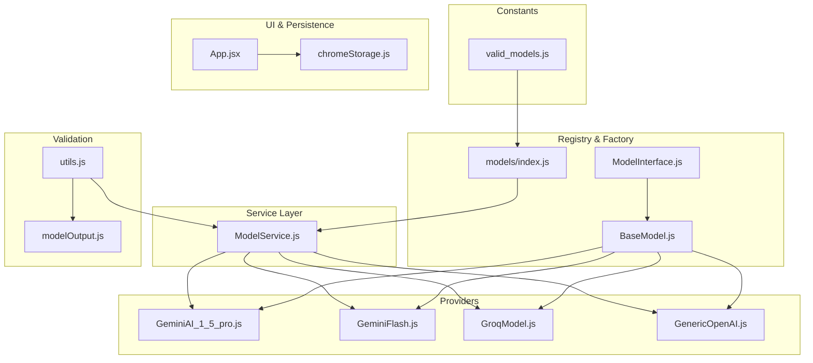
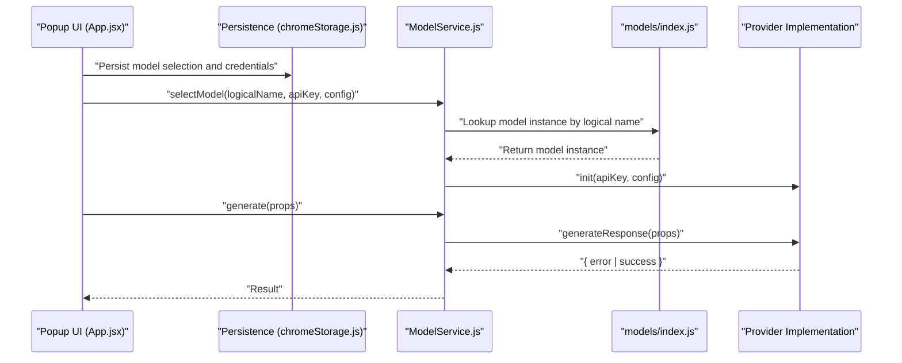
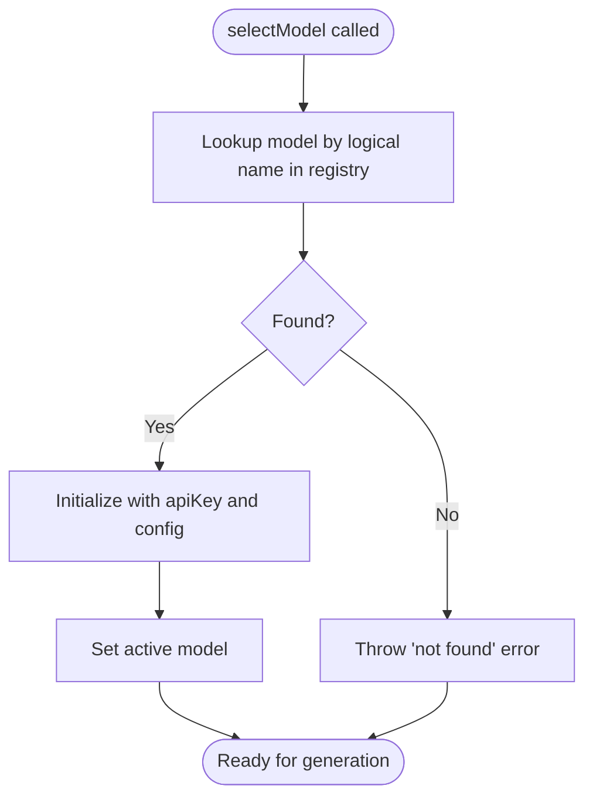
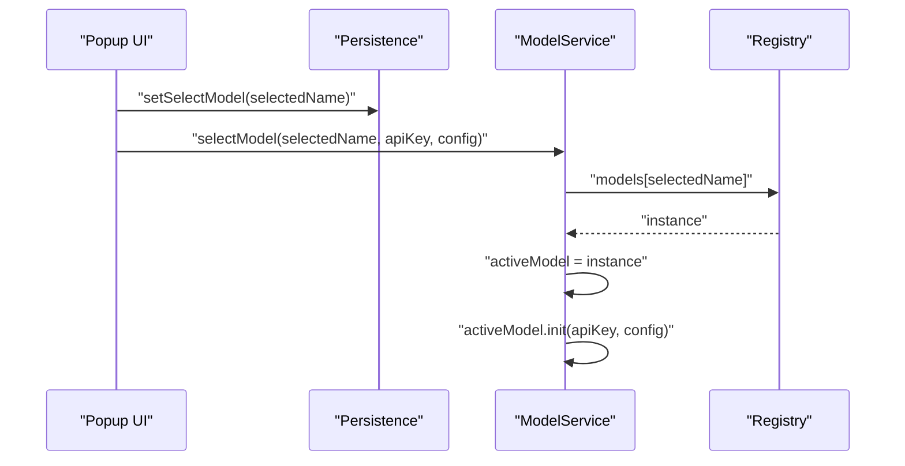
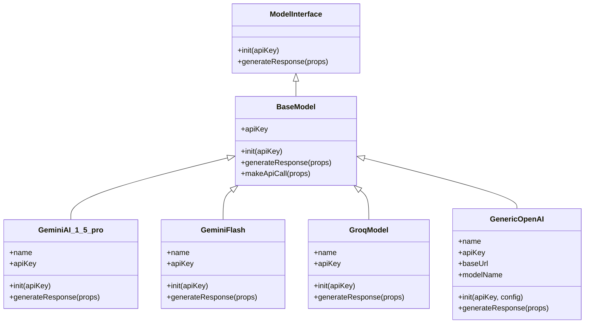
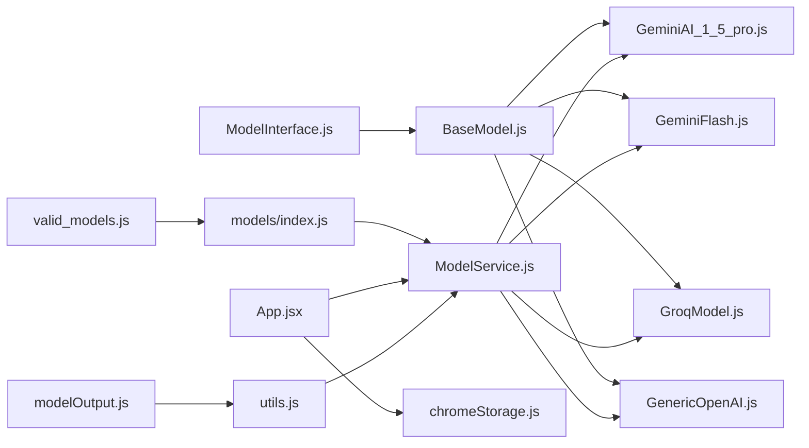

# Model Factory System

<cite>
**Referenced Files in This Document**
- [valid_models.js](file://src/constants/valid_models.js)
- [models/index.js](file://src/models/index.js)
- [BaseModel.js](file://src/models/BaseModel.js)
- [ModelInterface.js](file://src/interface/ModelInterface.js)
- [ModelService.js](file://src/services/ModelService.js)
- [GeminiAI_1_5_pro.js](file://src/models/model/GeminiAI_1_5_pro.js)
- [GeminiFlash.js](file://src/models/model/GeminiFlash.js)
- [GroqModel.js](file://src/models/model/GroqModel.js)
- [GenericOpenAI.js](file://src/models/model/GenericOpenAI.js)
- [chromeStorage.js](file://src/lib/chromeStorage.js)
- [App.jsx](file://src/App.jsx)
- [modelOutput.js](file://src/schema/modelOutput.js)
- [utils.js](file://src/models/utils.js)
</cite>

## Table of Contents
1. [Introduction](#introduction)
2. [Project Structure](#project-structure)
3. [Core Components](#core-components)
4. [Architecture Overview](#architecture-overview)
5. [Detailed Component Analysis](#detailed-component-analysis)
6. [Dependency Analysis](#dependency-analysis)
7. [Performance Considerations](#performance-considerations)
8. [Troubleshooting Guide](#troubleshooting-guide)
9. [Conclusion](#conclusion)
10. [Appendices](#appendices)

## Introduction
This document explains the model factory system responsible for dynamic model instantiation and selection in the Chrome extension. It covers the centralized model registry, the valid model enumeration, the factory pattern implementation, model selection logic, runtime switching, configuration management, validation, instantiation parameters, error handling, programmatic selection, dynamic provider loading, UI integration, and lifecycle/cleanup procedures.

## Project Structure
The model factory system spans several modules:
- Centralized registry and factory: models/index.js
- Valid model enumeration: constants/valid_models.js
- Base model abstraction: models/BaseModel.js and interface/ModelInterface.js
- Provider-specific implementations: models/model/*.js
- Service orchestration: services/ModelService.js
- UI integration and persistence: App.jsx and lib/chromeStorage.js
- Output schema validation: schema/modelOutput.js
- Utility helpers: models/utils.js

**Diagram sources**
- [valid_models.js](file://src/constants/valid_models.js#L1-L12)
- [models/index.js](file://src/models/index.js#L1-L19)
- [ModelInterface.js](file://src/interface/ModelInterface.js#L12-L17)
- [BaseModel.js](file://src/models/BaseModel.js#L3-L17)
- [GeminiAI_1_5_pro.js](file://src/models/model/GeminiAI_1_5_pro.js#L34-L85)
- [GeminiFlash.js](file://src/models/model/GeminiFlash.js#L20-L99)
- [GroqModel.js](file://src/models/model/GroqModel.js#L17-L69)
- [GenericOpenAI.js](file://src/models/model/GenericOpenAI.js#L5-L60)
- [ModelService.js](file://src/services/ModelService.js#L4-L22)
- [App.jsx](file://src/App.jsx#L17-L147)
- [chromeStorage.js](file://src/lib/chromeStorage.js#L1-L36)
- [modelOutput.js](file://src/schema/modelOutput.js#L9-L14)
- [utils.js](file://src/models/utils.js#L16-L39)

**Section sources**
- [valid_models.js](file://src/constants/valid_models.js#L1-L12)
- [models/index.js](file://src/models/index.js#L1-L19)
- [ModelInterface.js](file://src/interface/ModelInterface.js#L12-L17)
- [BaseModel.js](file://src/models/BaseModel.js#L3-L17)
- [ModelService.js](file://src/services/ModelService.js#L4-L22)
- [App.jsx](file://src/App.jsx#L17-L147)
- [chromeStorage.js](file://src/lib/chromeStorage.js#L1-L36)
- [modelOutput.js](file://src/schema/modelOutput.js#L9-L14)
- [utils.js](file://src/models/utils.js#L16-L39)

## Core Components
- Centralized model registry: A single module exports a named map of model instances keyed by logical names. This enables uniform selection via a string identifier.
- Valid model enumeration: A constant array defines supported models with identifiers, human-friendly display names, and internal keys used by the registry.
- Factory pattern: The registry acts as a factory by returning pre-instantiated model instances. Special handling exists for providers that share a single API key across multiple logical names.
- Service orchestration: A service class encapsulates model selection, initialization, and generation calls, enforcing runtime checks and error propagation.
- UI integration: The popup UI reads the valid model list, persists selections and credentials, and triggers model switching.
- Configuration management: Per-model configuration (e.g., base URL and model name for custom providers) is persisted and restored.
- Validation: Output schema ensures structured responses conform to expectations; utilities assist in generating validated object responses.

**Section sources**
- [models/index.js](file://src/models/index.js#L6-L11)
- [models/index.js](file://src/models/index.js#L13-L19)
- [valid_models.js](file://src/constants/valid_models.js#L1-L12)
- [ModelService.js](file://src/services/ModelService.js#L7-L14)
- [ModelService.js](file://src/services/ModelService.js#L16-L21)
- [App.jsx](file://src/App.jsx#L137-L144)
- [chromeStorage.js](file://src/lib/chromeStorage.js#L4-L26)
- [modelOutput.js](file://src/schema/modelOutput.js#L9-L14)
- [utils.js](file://src/models/utils.js#L16-L39)

## Architecture Overview
The system follows a layered architecture:
- UI layer: Presents model selection and credentials, persists state.
- Service layer: Manages active model selection and delegates generation requests.
- Registry/factory layer: Provides model instances mapped by logical names.
- Provider layer: Implements provider-specific logic for API calls and response parsing.
- Validation layer: Ensures output conforms to schema and utilities support structured generation.

**Diagram sources**
- [App.jsx](file://src/App.jsx#L33-L54)
- [App.jsx](file://src/App.jsx#L89-L99)
- [chromeStorage.js](file://src/lib/chromeStorage.js#L4-L26)
- [ModelService.js](file://src/services/ModelService.js#L7-L14)
- [ModelService.js](file://src/services/ModelService.js#L16-L21)
- [models/index.js](file://src/models/index.js#L13-L19)
- [GeminiAI_1_5_pro.js](file://src/models/model/GeminiAI_1_5_pro.js#L38-L40)
- [GenericOpenAI.js](file://src/models/model/GenericOpenAI.js#L11-L15)

## Detailed Component Analysis

### Centralized Model Registry and Factory Pattern
- Registry composition: The registry imports provider classes and exposes a map keyed by logical names. Some entries reuse a single class instance while assigning distinct logical names.
- Factory behavior: Selection is performed by indexing into the registry map. The Groq entry demonstrates a factory-like helper that instantiates a shared class and assigns a logical name.
- Runtime switching: The service’s selectModel method replaces the active model instance, enabling runtime switching without reloading the page.

**Diagram sources**
- [models/index.js](file://src/models/index.js#L13-L19)
- [ModelService.js](file://src/services/ModelService.js#L7-L14)

**Section sources**
- [models/index.js](file://src/models/index.js#L6-L11)
- [models/index.js](file://src/models/index.js#L13-L19)
- [ModelService.js](file://src/services/ModelService.js#L7-L14)

### Valid Model Enumeration
- Defines supported models with:
  - model: Provider-specific model identifier
  - name: Logical registry key
  - display: Human-readable label shown in UI
- UI binds to this list to populate the model selector.

**Section sources**
- [valid_models.js](file://src/constants/valid_models.js#L1-L12)
- [App.jsx](file://src/App.jsx#L137-L144)

### Model Selection Logic and Runtime Switching
- UI-driven selection updates persistent state and triggers model switching.
- The service enforces:
  - Existence check before activation
  - Initialization with API key and provider-specific configuration
  - Guard against invoking generation without an active model

**Diagram sources**
- [App.jsx](file://src/App.jsx#L89-L99)
- [chromeStorage.js](file://src/lib/chromeStorage.js#L28-L35)
- [ModelService.js](file://src/services/ModelService.js#L7-L14)

**Section sources**
- [App.jsx](file://src/App.jsx#L89-L99)
- [chromeStorage.js](file://src/lib/chromeStorage.js#L28-L35)
- [ModelService.js](file://src/services/ModelService.js#L7-L14)

### Configuration Management
- API key storage:
  - Groq models share a single key across logical names to simplify credential management.
  - Other models are stored under their own keys.
- Additional configuration:
  - Custom provider base URL and model name are persisted alongside the API key.
- Retrieval:
  - On startup, the UI loads the selected model and associated credentials, defaulting to the first available model if none is selected.

**Section sources**
- [chromeStorage.js](file://src/lib/chromeStorage.js#L1-L11)
- [chromeStorage.js](file://src/lib/chromeStorage.js#L13-L26)
- [chromeStorage.js](file://src/lib/chromeStorage.js#L28-L35)
- [App.jsx](file://src/App.jsx#L56-L87)

### Model Validation and Instantiation Parameters
- Output validation:
  - A Zod schema defines the expected structure of model responses, ensuring consistent parsing downstream.
- Instantiation parameters:
  - Providers accept an API key and optional configuration (e.g., base URL and model name for custom providers).
  - Base classes define a common init contract; subclasses override provider-specific behavior.

**Section sources**
- [modelOutput.js](file://src/schema/modelOutput.js#L9-L14)
- [GenericOpenAI.js](file://src/models/model/GenericOpenAI.js#L11-L15)
- [BaseModel.js](file://src/models/BaseModel.js#L6-L8)

### Provider Implementations and Error Handling
- Gemini providers:
  - Resolve the provider model identifier from the valid model list.
  - Build structured prompts with system instructions and JSON schema enforcement.
  - Parse provider errors into user-friendly messages.
- Groq provider:
  - Uses a shared class for multiple logical names.
  - Enforces JSON response format and parses returned content.
- Generic OpenAI-compatible provider:
  - Accepts configurable base URL and model name.
  - Supports custom endpoints compatible with OpenAI-style APIs.

**Diagram sources**
- [ModelInterface.js](file://src/interface/ModelInterface.js#L12-L17)
- [BaseModel.js](file://src/models/BaseModel.js#L3-L17)
- [GeminiAI_1_5_pro.js](file://src/models/model/GeminiAI_1_5_pro.js#L34-L85)
- [GeminiFlash.js](file://src/models/model/GeminiFlash.js#L20-L99)
- [GroqModel.js](file://src/models/model/GroqModel.js#L17-L69)
- [GenericOpenAI.js](file://src/models/model/GenericOpenAI.js#L5-L60)

**Section sources**
- [GeminiAI_1_5_pro.js](file://src/models/model/GeminiAI_1_5_pro.js#L42-L84)
- [GeminiFlash.js](file://src/models/model/GeminiFlash.js#L28-L97)
- [GroqModel.js](file://src/models/model/GroqModel.js#L25-L67)
- [GenericOpenAI.js](file://src/models/model/GenericOpenAI.js#L17-L58)

### Programmatic Model Selection and Dynamic Loading
- Programmatic selection:
  - Call the service’s selectModel with the desired logical name, API key, and optional configuration.
- Dynamic loading:
  - The registry map is static but can be extended to dynamically import provider modules if needed.
  - Current design leverages a centralized import list for simplicity and deterministic loading.

**Section sources**
- [ModelService.js](file://src/services/ModelService.js#L7-L14)
- [models/index.js](file://src/models/index.js#L1-L4)

### Integration with the User Interface for Model Configuration
- The popup UI:
  - Reads the valid model list to populate the model selector.
  - Persists model selection and credentials.
  - Shows optional fields for custom provider base URL and model name.
- Storage integration:
  - Uses Chrome storage to persist selected model and credentials.
  - Handles defaults when no selection exists.

**Section sources**
- [App.jsx](file://src/App.jsx#L17-L147)
- [App.jsx](file://src/App.jsx#L56-L87)
- [chromeStorage.js](file://src/lib/chromeStorage.js#L1-L36)

### Model Lifecycle Management and Cleanup
- Lifecycle stages:
  - Registration: Models instantiated once and reused.
  - Selection: Active model replaced via service selectModel.
  - Generation: Delegated to the active model instance.
  - Cleanup: No explicit teardown is implemented; models remain initialized in memory until the extension unloads.
- Recommendations:
  - Add a dispose method to provider classes to revoke tokens or cancel pending requests if needed.
  - Clear active model reference on extension unload to prevent accidental reuse.

**Section sources**
- [models/index.js](file://src/models/index.js#L13-L19)
- [ModelService.js](file://src/services/ModelService.js#L7-L14)

## Dependency Analysis
The following diagram highlights key dependencies among components:

**Diagram sources**
- [valid_models.js](file://src/constants/valid_models.js#L1-L12)
- [models/index.js](file://src/models/index.js#L1-L19)
- [ModelInterface.js](file://src/interface/ModelInterface.js#L12-L17)
- [BaseModel.js](file://src/models/BaseModel.js#L3-L17)
- [GeminiAI_1_5_pro.js](file://src/models/model/GeminiAI_1_5_pro.js#L34-L85)
- [GeminiFlash.js](file://src/models/model/GeminiFlash.js#L20-L99)
- [GroqModel.js](file://src/models/model/GroqModel.js#L17-L69)
- [GenericOpenAI.js](file://src/models/model/GenericOpenAI.js#L5-L60)
- [ModelService.js](file://src/services/ModelService.js#L4-L22)
- [App.jsx](file://src/App.jsx#L17-L147)
- [chromeStorage.js](file://src/lib/chromeStorage.js#L1-L36)
- [utils.js](file://src/models/utils.js#L16-L39)
- [modelOutput.js](file://src/schema/modelOutput.js#L9-L14)

**Section sources**
- [ModelService.js](file://src/services/ModelService.js#L4-L22)
- [models/index.js](file://src/models/index.js#L1-L19)

## Performance Considerations
- Instantiation cost: Models are pre-instantiated in the registry; selection is O(1) map lookup.
- Network latency: Provider calls are asynchronous; consider caching or rate-limiting strategies at the UI level.
- Schema enforcement: Using a strict schema reduces downstream parsing overhead and improves reliability.
- Memory footprint: Persistent active model instances remain in memory; avoid unnecessary recreation during runtime switching.

[No sources needed since this section provides general guidance]

## Troubleshooting Guide
Common issues and resolutions:
- Model not found:
  - Cause: Logical name does not exist in the registry.
  - Resolution: Verify the name matches a key in the registry and that the provider module is imported.
- No model selected:
  - Cause: Attempted generation without selecting a model.
  - Resolution: Ensure selectModel is called before generate.
- Invalid API key or provider errors:
  - Providers translate HTTP errors into user-friendly messages; check the returned error field for details.
- Rate limits:
  - Providers detect rate-limit responses and suggest retry delays; wait and retry after the indicated period.
- Custom provider misconfiguration:
  - Ensure base URL and model name are correct; verify endpoint compatibility.

**Section sources**
- [ModelService.js](file://src/services/ModelService.js#L11-L13)
- [ModelService.js](file://src/services/ModelService.js#L17-L19)
- [GeminiAI_1_5_pro.js](file://src/models/model/GeminiAI_1_5_pro.js#L71-L74)
- [GeminiFlash.js](file://src/models/model/GeminiFlash.js#L62-L84)
- [GroqModel.js](file://src/models/model/GroqModel.js#L52-L55)
- [GenericOpenAI.js](file://src/models/model/GenericOpenAI.js#L43-L46)

## Conclusion
The model factory system provides a clean, extensible mechanism for dynamic model instantiation and selection. The centralized registry simplifies runtime switching, while provider implementations encapsulate external API specifics. The UI integrates seamlessly with persistence and selection logic, and validation ensures robust output handling. Extending the system involves adding new provider classes, updating the registry, and enriching the valid model enumeration.

[No sources needed since this section summarizes without analyzing specific files]

## Appendices

### Example Workflows

- Programmatic model selection:
  - Steps: Initialize service, select model by logical name, pass API key and optional config, then call generate.
  - References: [ModelService.js](file://src/services/ModelService.js#L7-L14), [models/index.js](file://src/models/index.js#L13-L19)

- Dynamic loading of different providers:
  - Extend the registry map to include new provider classes and logical names.
  - References: [models/index.js](file://src/models/index.js#L1-L4), [models/index.js](file://src/models/index.js#L13-L19)

- Integration with UI for model configuration:
  - Populate selector from valid model list, persist selection and credentials, and restore on load.
  - References: [App.jsx](file://src/App.jsx#L137-L144), [App.jsx](file://src/App.jsx#L56-L87), [chromeStorage.js](file://src/lib/chromeStorage.js#L28-L35)

- Model lifecycle and cleanup:
  - Replace active model via service; consider adding a dispose method to provider classes.
  - References: [ModelService.js](file://src/services/ModelService.js#L7-L14), [models/index.js](file://src/models/index.js#L13-L19)