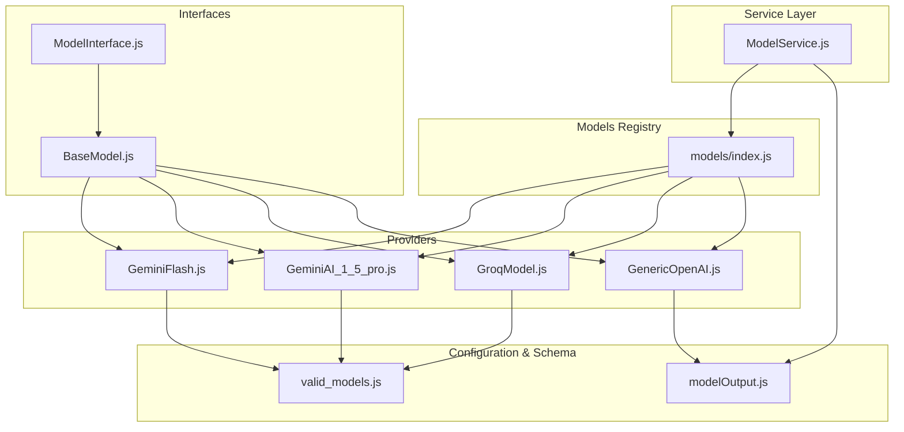
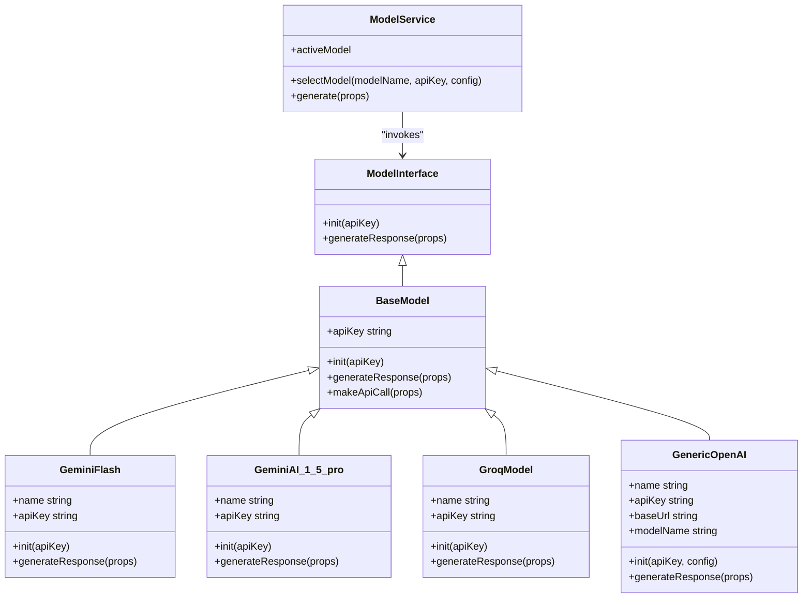
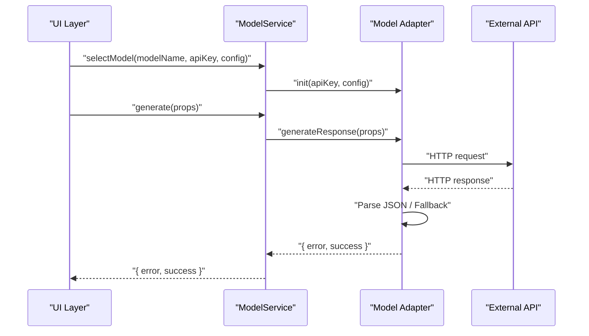
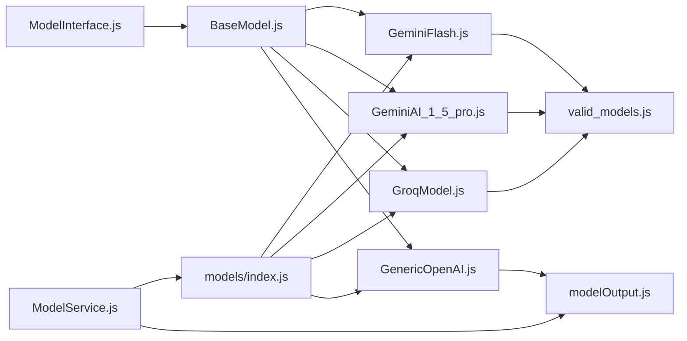

# AI Model Integration Architecture

<cite>
**Referenced Files in This Document**
- [BaseModel.js](file://src/models/BaseModel.js)
- [ModelInterface.js](file://src/interface/ModelInterface.js)
- [models/index.js](file://src/models/index.js)
- [ModelService.js](file://src/services/ModelService.js)
- [GeminiAI_1_5_pro.js](file://src/models/model/GeminiAI_1_5_pro.js)
- [GeminiFlash.js](file://src/models/model/GeminiFlash.js)
- [GroqModel.js](file://src/models/model/GroqModel.js)
- [GenericOpenAI.js](file://src/models/model/GenericOpenAI.js)
- [valid_models.js](file://src/constants/valid_models.js)
- [modelOutput.js](file://src/schema/modelOutput.js)
- [utils.js](file://src/models/utils.js)
- [App.jsx](file://src/App.jsx)
- [package.json](file://package.json)
</cite>

## Table of Contents
1. [Introduction](#introduction)
2. [Project Structure](#project-structure)
3. [Core Components](#core-components)
4. [Architecture Overview](#architecture-overview)
5. [Detailed Component Analysis](#detailed-component-analysis)
6. [Dependency Analysis](#dependency-analysis)
7. [Performance Considerations](#performance-considerations)
8. [Troubleshooting Guide](#troubleshooting-guide)
9. [Conclusion](#conclusion)
10. [Appendices](#appendices)

## Introduction
This document describes the AI model integration architecture used by DSABuddy. It focuses on the plugin-style architecture that enables pluggable AI providers (Google Gemini, Groq, and OpenAI-compatible APIs), the abstract base class design, the factory-like model registry, and the central ModelService orchestration layer. It also documents the model interface contracts, response processing pipeline, error handling strategies, runtime model switching, API key management, configuration patterns, and the adapter pattern used to abstract provider differences. Guidance is included for adding new AI providers and extending the model ecosystem.

## Project Structure
The AI integration is organized around a small set of cohesive modules:
- Interface contract and base classes define the model contract and shared behavior.
- Provider-specific adapters encapsulate API differences.
- A registry exposes available models and supports dynamic selection.
- A central service coordinates model selection and invocation.
- Validation and schema enforcement ensure consistent output.

**Diagram sources**
- [ModelInterface.js](file://src/interface/ModelInterface.js#L12-L17)
- [BaseModel.js](file://src/models/BaseModel.js#L3-L16)
- [models/index.js](file://src/models/index.js#L1-L19)
- [GeminiFlash.js](file://src/models/model/GeminiFlash.js#L20-L98)
- [GeminiAI_1_5_pro.js](file://src/models/model/GeminiAI_1_5_pro.js#L34-L84)
- [GroqModel.js](file://src/models/model/GroqModel.js#L17-L68)
- [GenericOpenAI.js](file://src/models/model/GenericOpenAI.js#L5-L59)
- [ModelService.js](file://src/services/ModelService.js#L4-L21)
- [valid_models.js](file://src/constants/valid_models.js#L1-L12)
- [modelOutput.js](file://src/schema/modelOutput.js#L9-L14)

**Section sources**
- [ModelInterface.js](file://src/interface/ModelInterface.js#L12-L17)
- [BaseModel.js](file://src/models/BaseModel.js#L3-L16)
- [models/index.js](file://src/models/index.js#L1-L19)
- [ModelService.js](file://src/services/ModelService.js#L4-L21)
- [valid_models.js](file://src/constants/valid_models.js#L1-L12)
- [modelOutput.js](file://src/schema/modelOutput.js#L9-L14)

## Core Components
- ModelInterface: Defines the contract for all models, including initialization and response generation.
- BaseModel: Provides a default implementation and enforces the requirement for a provider-specific makeApiCall method.
- Provider Adapters: Concrete implementations for Gemini Flash, Gemini 1.5 Pro, Groq, and Generic OpenAI-compatible providers.
- ModelService: Central orchestrator that selects a model by name, initializes it with credentials and configuration, and delegates generation requests.
- Registry: A factory-like index exporting named instances of supported models.
- Validation and Schema: Zod schema for normalized output and a constant list of valid models with display metadata.

Key responsibilities:
- Contract enforcement via ModelInterface and BaseModel.
- Provider abstraction via adapter classes.
- Runtime model switching via ModelService.selectModel.
- API key and configuration management through UI and storage helpers.
- Output normalization and validation.

**Section sources**
- [ModelInterface.js](file://src/interface/ModelInterface.js#L12-L17)
- [BaseModel.js](file://src/models/BaseModel.js#L3-L16)
- [models/index.js](file://src/models/index.js#L13-L19)
- [ModelService.js](file://src/services/ModelService.js#L7-L21)
- [modelOutput.js](file://src/schema/modelOutput.js#L9-L14)
- [valid_models.js](file://src/constants/valid_models.js#L1-L12)

## Architecture Overview
The system follows a layered architecture:
- Interface Layer: ModelInterface defines the contract.
- Implementation Layer: BaseModel and provider adapters implement the contract.
- Registry Layer: models/index.js exposes a dictionary of model instances.
- Service Layer: ModelService manages selection and invocation.
- Configuration Layer: valid_models.js enumerates supported models; modelOutput.js validates outputs.
- UI Layer: App.jsx integrates with storage and settings to persist keys and model choices.

**Diagram sources**
- [ModelInterface.js](file://src/interface/ModelInterface.js#L12-L17)
- [BaseModel.js](file://src/models/BaseModel.js#L3-L16)
- [GeminiFlash.js](file://src/models/model/GeminiFlash.js#L20-L98)
- [GeminiAI_1_5_pro.js](file://src/models/model/GeminiAI_1_5_pro.js#L34-L84)
- [GroqModel.js](file://src/models/model/GroqModel.js#L17-L68)
- [GenericOpenAI.js](file://src/models/model/GenericOpenAI.js#L5-L59)
- [ModelService.js](file://src/services/ModelService.js#L4-L21)

## Detailed Component Analysis

### ModelInterface and BaseModel
- ModelInterface establishes the contract with minimal methods: init and generateResponse. It also provides a helper for parsing chat history.
- BaseModel extends ModelInterface and adds a default generateResponse that delegates to a provider-specific makeApiCall. It requires subclasses to implement makeApiCall.

Implementation highlights:
- Enforced contract: subclasses must implement generateResponse or makeApiCall.
- Shared initialization pattern: models receive an API key during init.

**Section sources**
- [ModelInterface.js](file://src/interface/ModelInterface.js#L12-L17)
- [BaseModel.js](file://src/models/BaseModel.js#L3-L16)

### Provider Adapters

#### Gemini Flash Adapter
- Implements a JSON response schema and enforces a system instruction that instructs the model to return a JSON object with specific fields.
- Uses Google Generative Language API v1beta endpoint.
- Parses candidate content and falls back to raw text if JSON parsing fails.
- Includes friendly error parsing for common HTTP errors (rate limit, invalid key, model not found).

Key behaviors:
- Uses VALID_MODELS to resolve the provider model identifier.
- Normalizes roles for the provider’s expectations.
- Returns a standardized shape: { error, success }.

**Section sources**
- [GeminiFlash.js](file://src/models/model/GeminiFlash.js#L20-L98)
- [valid_models.js](file://src/constants/valid_models.js#L6-L8)

#### Gemini 1.5 Pro Adapter
- Similar to Gemini Flash but targets a different model identifier.
- Applies the same JSON schema enforcement and friendly error handling.

**Section sources**
- [GeminiAI_1_5_pro.js](file://src/models/model/GeminiAI_1_5_pro.js#L34-L84)
- [valid_models.js](file://src/constants/valid_models.js#L7-L8)

#### Groq Adapter
- Uses OpenAI-compatible chat/completions endpoint with Authorization header.
- Enforces JSON object response via response_format.
- Builds a messages array with system, prior messages, and current prompt.

**Section sources**
- [GroqModel.js](file://src/models/model/GroqModel.js#L17-L68)
- [valid_models.js](file://src/constants/valid_models.js#L2-L4)

#### Generic OpenAI-Compatible Adapter
- Designed for custom endpoints compatible with OpenAI’s API.
- Accepts configurable base URL and model name via init config.
- Enforces JSON object response and normalizes output similarly.

**Section sources**
- [GenericOpenAI.js](file://src/models/model/GenericOpenAI.js#L5-L59)

### Model Registry (Factory Pattern)
- The registry exports a map of model instances keyed by model name.
- Groq models are dynamically instantiated with a specific name, enabling multiple Groq variants under a single class.
- Other models are instantiated directly.

Implications:
- Centralized model availability and naming.
- Supports runtime model switching by name.

**Section sources**
- [models/index.js](file://src/models/index.js#L13-L19)

### ModelService (Centralization Layer)
- selectModel: Resolves a model by name from the registry, initializes it with the API key and optional configuration, and sets it as active.
- generate: Delegates generation to the active model if present; otherwise throws an error indicating no model was selected.

Runtime switching:
- Call selectModel with a new model name and key to switch providers at runtime.

**Section sources**
- [ModelService.js](file://src/services/ModelService.js#L7-L21)

### Model Interface Contracts and Response Processing Pipeline
- Contract: All models must implement generateResponse and accept an init method with an API key.
- Response shape: Both success and error are returned in a consistent shape to simplify consumer handling.
- JSON schema enforcement: Providers embed a system instruction requiring JSON output and optionally apply a response schema.
- Fallback behavior: If JSON parsing fails, the adapter returns a structured object with feedback text.

**Diagram sources**
- [ModelService.js](file://src/services/ModelService.js#L7-L21)
- [GeminiFlash.js](file://src/models/model/GeminiFlash.js#L28-L93)
- [GroqModel.js](file://src/models/model/GroqModel.js#L25-L63)
- [GenericOpenAI.js](file://src/models/model/GenericOpenAI.js#L17-L54)

### Error Handling Strategies
- HTTP error handling: Non-OK responses trigger a friendly error message constructed from the provider’s error payload.
- Authentication errors: Distinguish unauthorized/forbidden vs. rate limit scenarios.
- Parsing errors: If the provider returns non-JSON content, adapters fall back to returning a structured object with feedback text.
- Initialization errors: ModelService throws when a requested model name is not found.

**Section sources**
- [GeminiFlash.js](file://src/models/model/GeminiFlash.js#L62-L83)
- [GeminiAI_1_5_pro.js](file://src/models/model/GeminiAI_1_5_pro.js#L71-L73)
- [GroqModel.js](file://src/models/model/GroqModel.js#L52-L54)
- [GenericOpenAI.js](file://src/models/model/GenericOpenAI.js#L43-L45)
- [ModelService.js](file://src/services/ModelService.js#L11-L13)

### Runtime Model Switching Capabilities
- The UI loads the previously selected model and API key from storage.
- On model change, the UI updates the stored selection and reloads keys.
- ModelService.selectModel allows switching providers without restarting the app.

**Section sources**
- [App.jsx](file://src/App.jsx#L56-L99)
- [ModelService.js](file://src/services/ModelService.js#L7-L14)

### API Key Management and Configuration Patterns
- API keys are persisted per model and base URL (for custom providers).
- The UI exposes fields for API key, base URL, and model name for custom providers.
- Model initialization accepts a configuration object to support custom endpoints.

**Section sources**
- [App.jsx](file://src/App.jsx#L33-L54)
- [GenericOpenAI.js](file://src/models/model/GenericOpenAI.js#L11-L15)

### Adapter Pattern and Abstraction Layers
- Each provider adapter encapsulates:
  - Endpoint URL construction.
  - Message role normalization.
  - Response parsing and fallback.
  - Friendly error translation.
- BaseModel and ModelInterface provide a uniform interface across adapters.

Benefits:
- Pluggable providers.
- Consistent output regardless of provider.
- Easy to add new providers by implementing the interface.

**Section sources**
- [ModelInterface.js](file://src/interface/ModelInterface.js#L12-L17)
- [BaseModel.js](file://src/models/BaseModel.js#L3-L16)
- [GeminiFlash.js](file://src/models/model/GeminiFlash.js#L20-L98)
- [GroqModel.js](file://src/models/model/GroqModel.js#L17-L68)
- [GenericOpenAI.js](file://src/models/model/GenericOpenAI.js#L5-L59)

### Integration with External APIs and Rate Limiting
- Gemini: Uses Google Generative Language API; includes rate limit detection and user-friendly retry messaging.
- Groq: Uses OpenAI-compatible chat/completions endpoint; includes basic error wrapping.
- Custom: Supports arbitrary base URLs and model names.

Rate limiting considerations:
- Gemini adapters detect 429 and provide retry guidance.
- No client-side retry/backoff is implemented in the adapters; consumers can implement higher-level retry policies if desired.

**Section sources**
- [GeminiFlash.js](file://src/models/model/GeminiFlash.js#L69-L72)
- [GeminiAI_1_5_pro.js](file://src/models/model/GeminiAI_1_5_pro.js#L22-L24)
- [GroqModel.js](file://src/models/model/GroqModel.js#L39-L50)

### Fallback Mechanisms
- JSON parsing fallback: If the provider’s response cannot be parsed as JSON, adapters return a structured object with feedback text.
- Model resolution fallback: If a model name does not resolve to a provider model ID, adapters fall back to a default provider model identifier.

**Section sources**
- [GeminiFlash.js](file://src/models/model/GeminiFlash.js#L89-L91)
- [GeminiAI_1_5_pro.js](file://src/models/model/GeminiAI_1_5_pro.js#L79)
- [GroqModel.js](file://src/models/model/GroqModel.js#L61)
- [GenericOpenAI.js](file://src/models/model/GenericOpenAI.js#L52)

### Adding New AI Providers
Steps to integrate a new provider:
1. Create a new adapter class that extends the base interface contract.
2. Implement initialization and response generation tailored to the provider’s API.
3. Add a registry entry in the models index to expose the new model by name.
4. Optionally add a new entry in the valid models list with a display name and model identifier.
5. Ensure the adapter returns the standardized response shape and handles errors gracefully.

Reference paths for implementation:
- Implement generateResponse and init in a new adapter similar to existing ones.
- Export the adapter in the models index and register it under a unique name.
- Update the UI to support any new configuration fields if needed.

**Section sources**
- [models/index.js](file://src/models/index.js#L13-L19)
- [valid_models.js](file://src/constants/valid_models.js#L1-L12)
- [ModelInterface.js](file://src/interface/ModelInterface.js#L12-L17)
- [BaseModel.js](file://src/models/BaseModel.js#L3-L16)

## Dependency Analysis
The system exhibits low coupling and high cohesion:
- ModelInterface and BaseModel define a stable contract.
- Adapters depend on the contract and provider-specific endpoints.
- ModelService depends on the registry and schema.
- UI depends on storage and model selection.

**Diagram sources**
- [ModelInterface.js](file://src/interface/ModelInterface.js#L12-L17)
- [BaseModel.js](file://src/models/BaseModel.js#L3-L16)
- [models/index.js](file://src/models/index.js#L13-L19)
- [ModelService.js](file://src/services/ModelService.js#L4-L21)
- [GeminiFlash.js](file://src/models/model/GeminiFlash.js#L20-L98)
- [GeminiAI_1_5_pro.js](file://src/models/model/GeminiAI_1_5_pro.js#L34-L84)
- [GroqModel.js](file://src/models/model/GroqModel.js#L17-L68)
- [GenericOpenAI.js](file://src/models/model/GenericOpenAI.js#L5-L59)
- [valid_models.js](file://src/constants/valid_models.js#L1-L12)
- [modelOutput.js](file://src/schema/modelOutput.js#L9-L14)

**Section sources**
- [ModelInterface.js](file://src/interface/ModelInterface.js#L12-L17)
- [BaseModel.js](file://src/models/BaseModel.js#L3-L16)
- [models/index.js](file://src/models/index.js#L13-L19)
- [ModelService.js](file://src/services/ModelService.js#L4-L21)
- [valid_models.js](file://src/constants/valid_models.js#L1-L12)
- [modelOutput.js](file://src/schema/modelOutput.js#L9-L14)

## Performance Considerations
- Network latency dominates cost; minimize unnecessary retries and avoid blocking UI threads.
- Consider caching provider responses at the application level if appropriate.
- Batch or debounce requests when integrating with content scripts.
- Monitor provider-specific quotas and rate limits; implement client-side backoff if needed.

[No sources needed since this section provides general guidance]

## Troubleshooting Guide
Common issues and resolutions:
- Model not found: Ensure the model name exists in the registry and matches the valid models list.
- Invalid API key: Verify the key in the extension popup; Gemini adapters provide explicit invalid key messaging.
- Rate limit exceeded: For free tiers, wait the suggested duration and retry.
- JSON parsing failures: Confirm the provider returns JSON; adapters fall back to feedback text.
- Custom endpoint misconfiguration: Validate base URL and model name; ensure the endpoint supports OpenAI-compatible chat/completions.

**Section sources**
- [ModelService.js](file://src/services/ModelService.js#L11-L13)
- [GeminiFlash.js](file://src/models/model/GeminiFlash.js#L69-L72)
- [GeminiAI_1_5_pro.js](file://src/models/model/GeminiAI_1_5_pro.js#L22-L24)
- [GenericOpenAI.js](file://src/models/model/GenericOpenAI.js#L11-L15)

## Conclusion
DSABuddy’s AI integration leverages a clean, extensible architecture:
- A strong interface contract ensures consistent behavior across providers.
- Adapter implementations encapsulate provider specifics while preserving a unified API.
- A registry and central service enable runtime model switching and configuration.
- Output schema validation and friendly error handling improve reliability and UX.
This design makes it straightforward to add new providers and maintain a flexible, provider-agnostic model ecosystem.

[No sources needed since this section summarizes without analyzing specific files]

## Appendices

### Model Output Schema
- Fields: feedback (string), hints (up to two strings), snippet (string), programmingLanguage (enumerated language).
- Validation ensures hints length and language enumeration.

**Section sources**
- [modelOutput.js](file://src/schema/modelOutput.js#L9-L14)

### Package Dependencies Related to AI
- ai SDK and provider packages are used for potential future integrations; current implementation relies on direct HTTP calls.

**Section sources**
- [package.json](file://package.json#L12-L33)