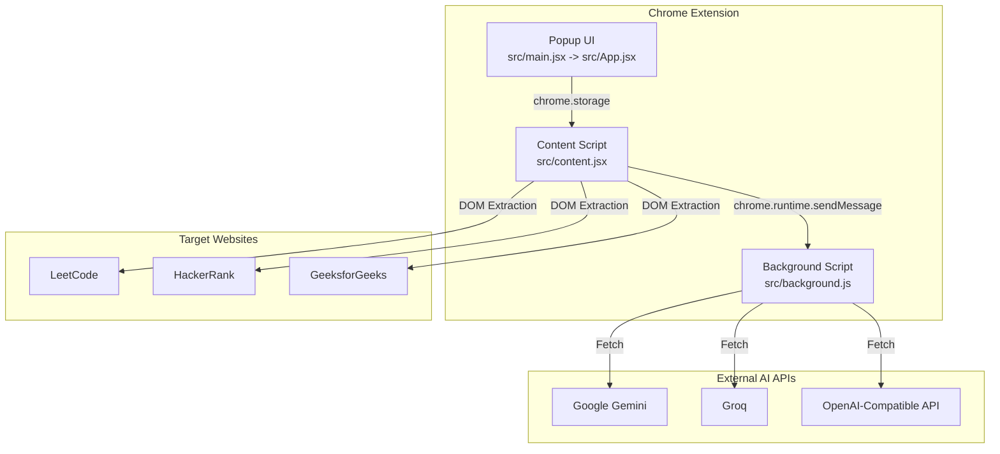
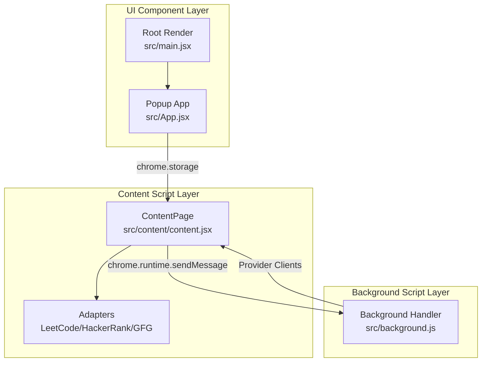
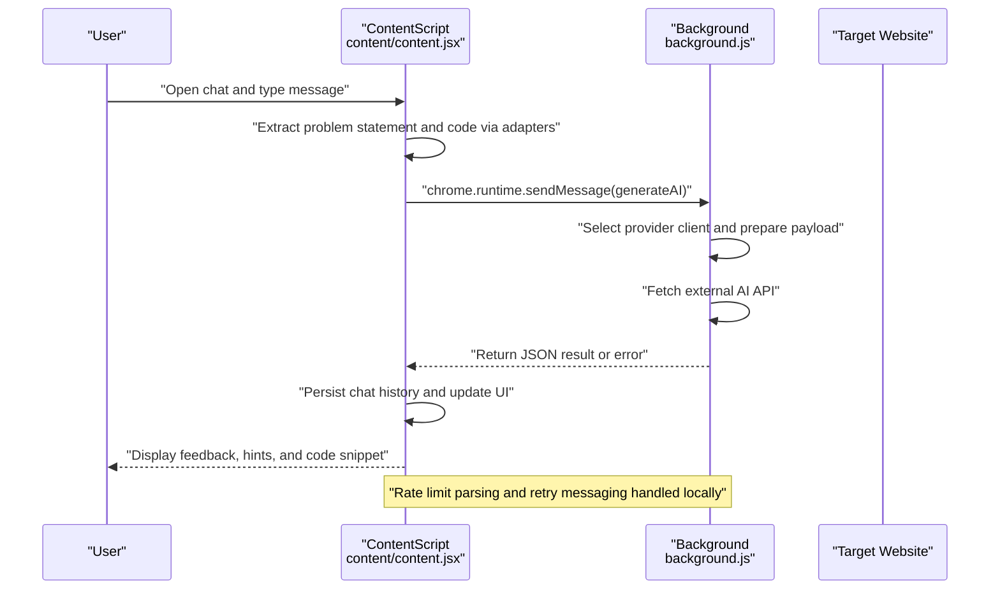
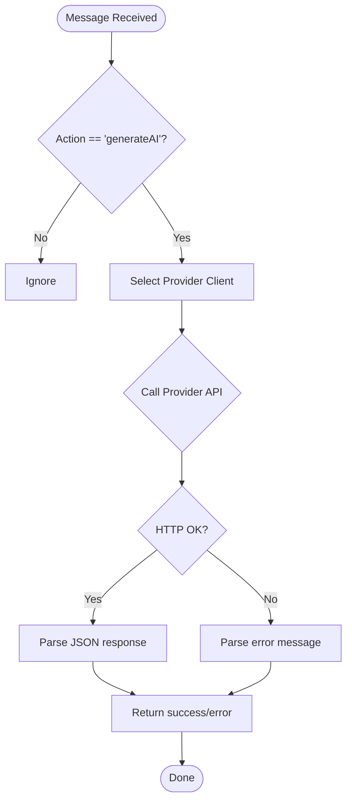
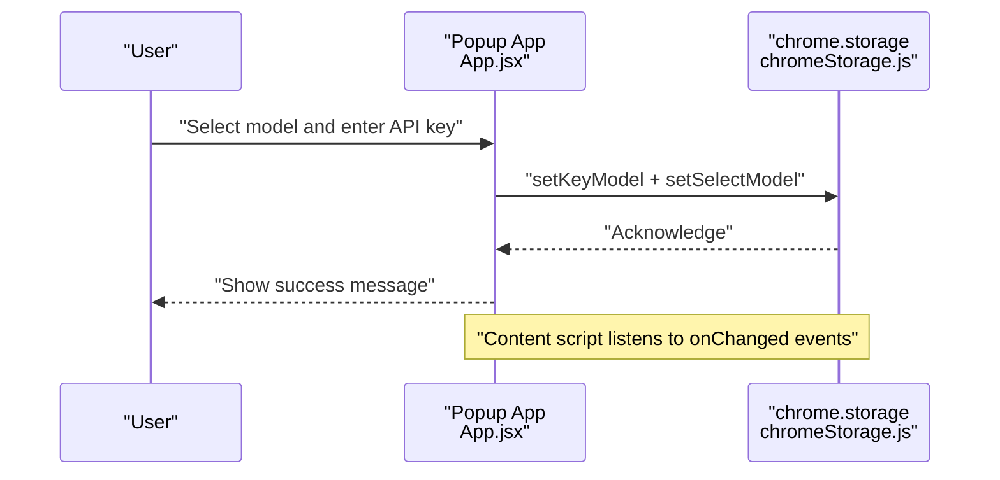
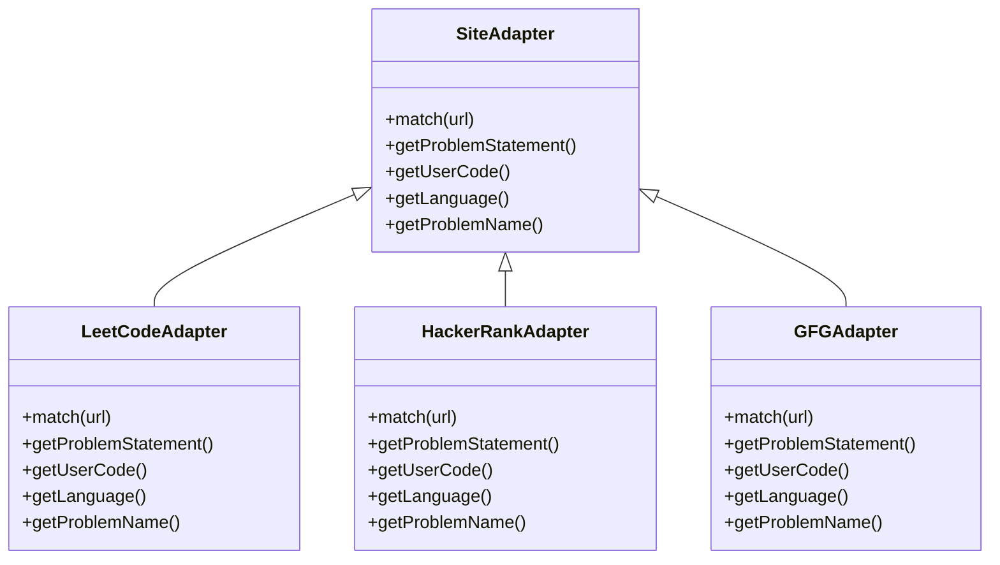
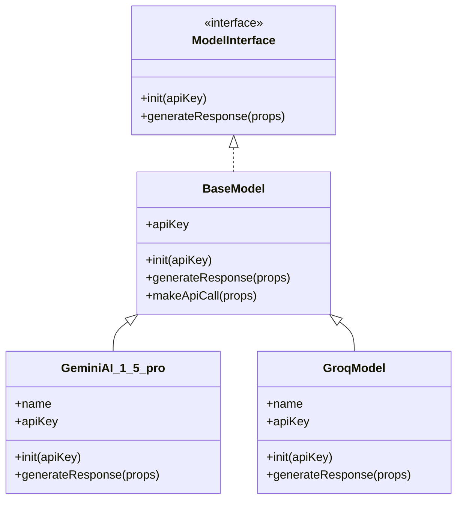
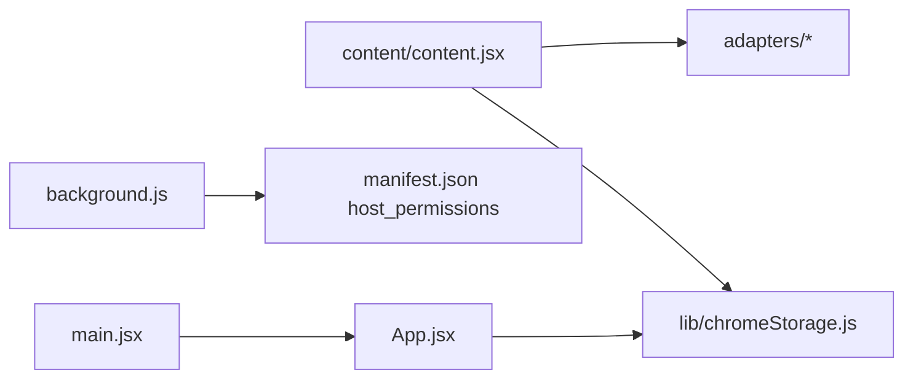
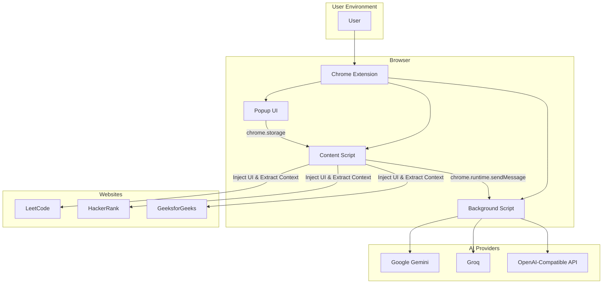

# Architecture Overview

<cite>
**Referenced Files in This Document**
- [manifest.json](file://manifest.json)
- [background.js](file://src/background.js)
- [content.jsx](file://src/content.jsx)
- [content/content.jsx](file://src/content/content.jsx)
- [App.jsx](file://src/App.jsx)
- [main.jsx](file://src/main.jsx)
- [SiteAdapter.js](file://src/content/adapters/SiteAdapter.js)
- [LeetCodeAdapter.js](file://src/content/adapters/LeetCodeAdapter.js)
- [HackerRankAdapter.js](file://src/content/adapters/HackerRankAdapter.js)
- [GFGAdapter.js](file://src/content/adapters/GFGAdapter.js)
- [BaseModel.js](file://src/models/BaseModel.js)
- [GeminiAI_1_5_pro.js](file://src/models/model/GeminiAI_1_5_pro.js)
- [GroqModel.js](file://src/models/model/GroqModel.js)
- [ModelService.js](file://src/services/ModelService.js)
- [chromeStorage.js](file://src/lib/chromeStorage.js)
</cite>

## Table of Contents
1. [Introduction](#introduction)
2. [Project Structure](#project-structure)
3. [Core Components](#core-components)
4. [Architecture Overview](#architecture-overview)
5. [Detailed Component Analysis](#detailed-component-analysis)
6. [Dependency Analysis](#dependency-analysis)
7. [Performance Considerations](#performance-considerations)
8. [Security Considerations](#security-considerations)
9. [Extension Lifecycle Management](#extension-lifecycle-management)
10. [System Context and Integration Patterns](#system-context-and-integration-patterns)
11. [Troubleshooting Guide](#troubleshooting-guide)
12. [Conclusion](#conclusion)

## Introduction
This document describes the architecture of DSABuddy, a Chrome Extension designed to assist learners of Data Structures and Algorithms by integrating with popular competitive programming platforms and AI APIs. The system is organized into three primary layers:
- Content Script Layer: Injects UI into target websites, extracts problem context, and manages the chat UI.
- Background Script Layer: Handles secure API communication with external AI services and routes requests from content scripts.
- UI Component Layer: Provides the extension popup for configuration and model selection.

The architecture emphasizes separation of concerns, robust site adapters for platform-specific integrations, and a flexible model abstraction for AI provider integration.

## Project Structure
The repository follows a modern React-based build with Vite, structured into:
- Manifest v3 configuration for permissions, content scripts, background service worker, and keyboard shortcut.
- Content script entry that mounts a React app inside target websites.
- Background script implementing AI API clients and message routing.
- UI entry for the extension popup.
- Adapters for LeetCode, HackerRank, and GeeksforGeeks.
- Model abstractions and provider-specific implementations.
- Storage utilities for secure key management.

**Diagram sources**
- [manifest.json](file://manifest.json#L11-L28)
- [content.jsx](file://src/content.jsx#L1-L35)
- [background.js](file://src/background.js#L127-L156)
- [App.jsx](file://src/App.jsx#L1-L233)

**Section sources**
- [manifest.json](file://manifest.json#L1-L74)
- [content.jsx](file://src/content.jsx#L1-L35)
- [main.jsx](file://src/main.jsx#L1-L13)

## Core Components
- Content Script Entry: Mounts the React UI and ensures persistence across SPA navigations.
- Content Page: Orchestrates problem context extraction, chat history, and AI request routing.
- Adapters: Platform-specific logic to extract problem statements, current code, and language.
- Background Script: Implements provider-specific API clients and message handler for AI generation.
- Popup UI: Manages model selection, API key storage, and user configuration.
- Storage Utilities: Encapsulate Chrome storage operations and model key normalization.

**Section sources**
- [content.jsx](file://src/content.jsx#L1-L35)
- [content/content.jsx](file://src/content/content.jsx#L555-L724)
- [SiteAdapter.js](file://src/content/adapters/SiteAdapter.js#L1-L28)
- [LeetCodeAdapter.js](file://src/content/adapters/LeetCodeAdapter.js#L1-L51)
- [HackerRankAdapter.js](file://src/content/adapters/HackerRankAdapter.js#L1-L86)
- [GFGAdapter.js](file://src/content/adapters/GFGAdapter.js#L1-L84)
- [background.js](file://src/background.js#L1-L156)
- [App.jsx](file://src/App.jsx#L1-L233)
- [chromeStorage.js](file://src/lib/chromeStorage.js#L1-L36)

## Architecture Overview
The system is layered to separate concerns:
- Content Script Layer: Runs in-page, injects UI, extracts context, and communicates with the background script.
- Background Script Layer: Executes in the extension’s service worker, performs network calls, and returns results to the content script.
- UI Component Layer: Hosted in the extension popup, allows users to configure models and keys.

**Diagram sources**
- [content/content.jsx](file://src/content/content.jsx#L122-L181)
- [background.js](file://src/background.js#L127-L156)
- [App.jsx](file://src/App.jsx#L1-L233)
- [main.jsx](file://src/main.jsx#L1-L13)

## Detailed Component Analysis

### Content Script Layer
Responsibilities:
- Inject and manage a persistent React root inside target websites.
- Extract problem context and user code via adapters.
- Build a structured prompt and route AI requests to the background script.
- Manage chat history and UI state, including rate-limit messaging.

Key interactions:
- Uses MutationObserver to re-inject UI after SPA navigation.
- Sends messages to background script with model, keys, and context.
- Persists and loads configuration from Chrome storage.

**Diagram sources**
- [content/content.jsx](file://src/content/content.jsx#L122-L181)
- [background.js](file://src/background.js#L133-L155)

**Section sources**
- [content.jsx](file://src/content.jsx#L1-L35)
- [content/content.jsx](file://src/content/content.jsx#L555-L724)
- [LeetCodeAdapter.js](file://src/content/adapters/LeetCodeAdapter.js#L1-L51)
- [HackerRankAdapter.js](file://src/content/adapters/HackerRankAdapter.js#L1-L86)
- [GFGAdapter.js](file://src/content/adapters/GFGAdapter.js#L1-L84)

### Background Script Layer
Responsibilities:
- Implement provider-specific clients for Groq, Google Gemini, and custom OpenAI-compatible endpoints.
- Normalize and validate responses, returning structured JSON to the content script.
- Handle CORS and credential exposure by centralizing network calls in the background script.

**Diagram sources**
- [background.js](file://src/background.js#L127-L156)
- [background.js](file://src/background.js#L7-L44)
- [background.js](file://src/background.js#L46-L83)
- [background.js](file://src/background.js#L85-L123)

**Section sources**
- [background.js](file://src/background.js#L1-L156)

### UI Component Layer
Responsibilities:
- Provide a popup for selecting models, entering API keys, and configuring custom endpoints.
- Persist configuration to Chrome storage and synchronize with content scripts.

**Diagram sources**
- [App.jsx](file://src/App.jsx#L33-L54)
- [chromeStorage.js](file://src/lib/chromeStorage.js#L4-L11)

**Section sources**
- [App.jsx](file://src/App.jsx#L1-L233)
- [main.jsx](file://src/main.jsx#L1-L13)
- [chromeStorage.js](file://src/lib/chromeStorage.js#L1-L36)

### Adapter Pattern for Site Integration
The adapter pattern isolates platform-specific logic:
- SiteAdapter defines the contract for matching URLs and extracting problem context.
- Concrete adapters implement extraction for LeetCode, HackerRank, and GeeksforGeeks.

**Diagram sources**
- [SiteAdapter.js](file://src/content/adapters/SiteAdapter.js#L1-L28)
- [LeetCodeAdapter.js](file://src/content/adapters/LeetCodeAdapter.js#L1-L51)
- [HackerRankAdapter.js](file://src/content/adapters/HackerRankAdapter.js#L1-L86)
- [GFGAdapter.js](file://src/content/adapters/GFGAdapter.js#L1-L84)

**Section sources**
- [SiteAdapter.js](file://src/content/adapters/SiteAdapter.js#L1-L28)
- [LeetCodeAdapter.js](file://src/content/adapters/LeetCodeAdapter.js#L1-L51)
- [HackerRankAdapter.js](file://src/content/adapters/HackerRankAdapter.js#L1-L86)
- [GFGAdapter.js](file://src/content/adapters/GFGAdapter.js#L1-L84)

### AI Model Integration Patterns
Two complementary approaches exist:
- Background Script Clients: Provider-specific fetch implementations embedded in the background script.
- Model Abstractions: A base class and provider-specific implementations for potential future use within the content script or shared utilities.

**Diagram sources**
- [BaseModel.js](file://src/models/BaseModel.js#L1-L17)
- [GeminiAI_1_5_pro.js](file://src/models/model/GeminiAI_1_5_pro.js#L34-L85)
- [GroqModel.js](file://src/models/model/GroqModel.js#L17-L69)

**Section sources**
- [BaseModel.js](file://src/models/BaseModel.js#L1-L17)
- [GeminiAI_1_5_pro.js](file://src/models/model/GeminiAI_1_5_pro.js#L1-L85)
- [GroqModel.js](file://src/models/model/GroqModel.js#L1-L69)

## Dependency Analysis
High-level dependencies:
- Content script depends on adapters and storage utilities to extract context and load configuration.
- Background script depends on provider endpoints declared in the manifest for host permissions.
- Popup UI depends on storage utilities to persist configuration.

**Diagram sources**
- [content/content.jsx](file://src/content/content.jsx#L1-L760)
- [chromeStorage.js](file://src/lib/chromeStorage.js#L1-L36)
- [background.js](file://src/background.js#L1-L156)
- [manifest.json](file://manifest.json#L29-L40)
- [App.jsx](file://src/App.jsx#L1-L233)
- [main.jsx](file://src/main.jsx#L1-L13)

**Section sources**
- [content/content.jsx](file://src/content/content.jsx#L1-L760)
- [chromeStorage.js](file://src/lib/chromeStorage.js#L1-L36)
- [background.js](file://src/background.js#L1-L156)
- [manifest.json](file://manifest.json#L29-L40)
- [App.jsx](file://src/App.jsx#L1-L233)
- [main.jsx](file://src/main.jsx#L1-L13)

## Performance Considerations
- Prompt Size Control: Limits user code length and recent message count to reduce token usage and stay within free-tier quotas.
- Rate Limit Handling: Parses retry durations from provider errors and disables input until cooldown ends.
- UI Responsiveness: Uses MutationObserver to re-inject UI after SPA navigation; avoids heavy computations in observers.
- Network Efficiency: Centralizes API calls in the background script to minimize repeated CORS and credential exposure.

[No sources needed since this section provides general guidance]

## Security Considerations
- API Keys Stored Locally: Keys are persisted via Chrome storage; normalization groups Groq variants under a single key to simplify management.
- Secure Communication: Background script handles all network calls, preventing direct exposure of credentials in content scripts.
- Host Permissions: Explicit permissions for target sites and AI endpoints; restricts access to necessary origins only.
- Input Sanitization: Truncation of user code and prompt text reduces risk of oversized payloads.

**Section sources**
- [chromeStorage.js](file://src/lib/chromeStorage.js#L1-L36)
- [manifest.json](file://manifest.json#L29-L40)
- [content/content.jsx](file://src/content/content.jsx#L137-L150)

## Extension Lifecycle Management
- Content Script Injection: Ensures a persistent container and re-injects after SPA navigation.
- Popup Lifecycle: Mounted by the root renderer; popup UI updates configuration and persists to storage.
- Background Handler: Listens for messages and keeps the response channel open while asynchronous work completes.

**Section sources**
- [content.jsx](file://src/content.jsx#L1-L35)
- [main.jsx](file://src/main.jsx#L1-L13)
- [background.js](file://src/background.js#L127-L156)

## System Context and Integration Patterns
The extension integrates with target websites and AI APIs as follows:

**Diagram sources**
- [manifest.json](file://manifest.json#L11-L28)
- [content.jsx](file://src/content.jsx#L1-L35)
- [content/content.jsx](file://src/content/content.jsx#L122-L181)
- [background.js](file://src/background.js#L127-L156)

## Troubleshooting Guide
Common issues and resolutions:
- No Response from Background: Verify the message handler is registered and the action matches the expected value.
- Rate Limit Errors: The UI displays a countdown; wait for the cooldown period indicated by the provider’s error message.
- Missing API Key: The content script prompts to open the popup when a model is selected but no key is present.
- Provider-Specific Errors: Background script parses provider errors and returns friendly messages; check the returned error message for actionable guidance.

**Section sources**
- [content/content.jsx](file://src/content/content.jsx#L183-L197)
- [background.js](file://src/background.js#L133-L155)

## Conclusion
DSABuddy employs a clean separation of concerns across three layers: content script for site integration, background script for secure API communication, and a popup UI for configuration. The adapter pattern enables extensible support for multiple platforms, while the model abstractions provide a foundation for future enhancements. By centralizing network operations and managing credentials securely, the extension balances functionality, performance, and safety.