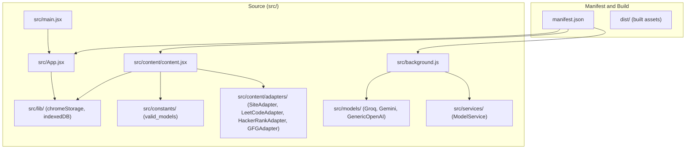
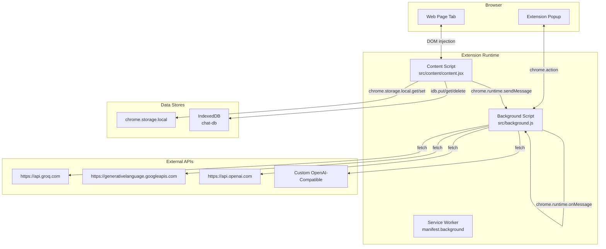
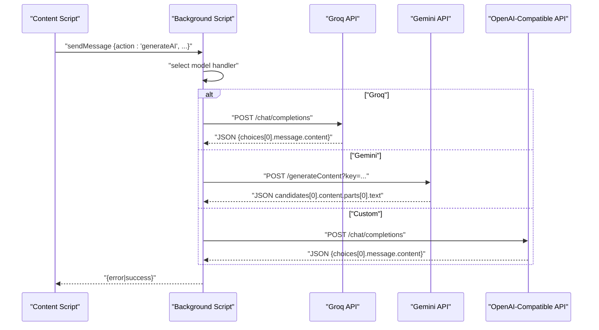
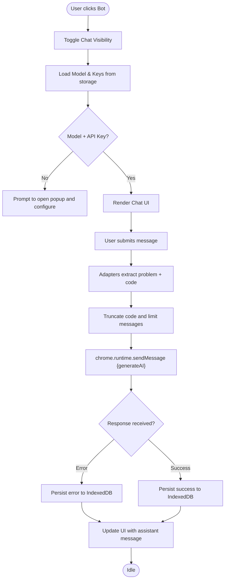
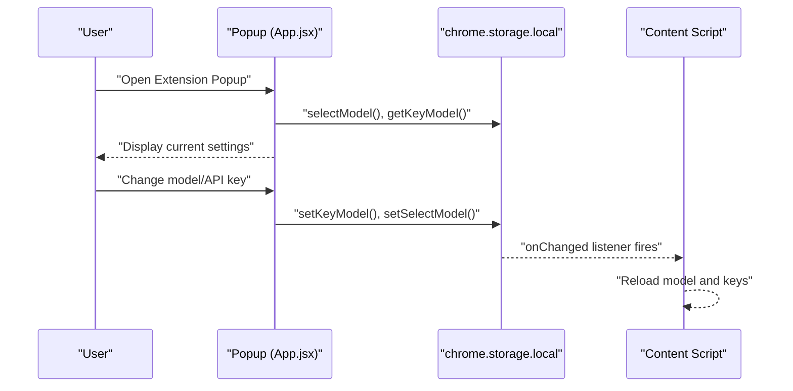
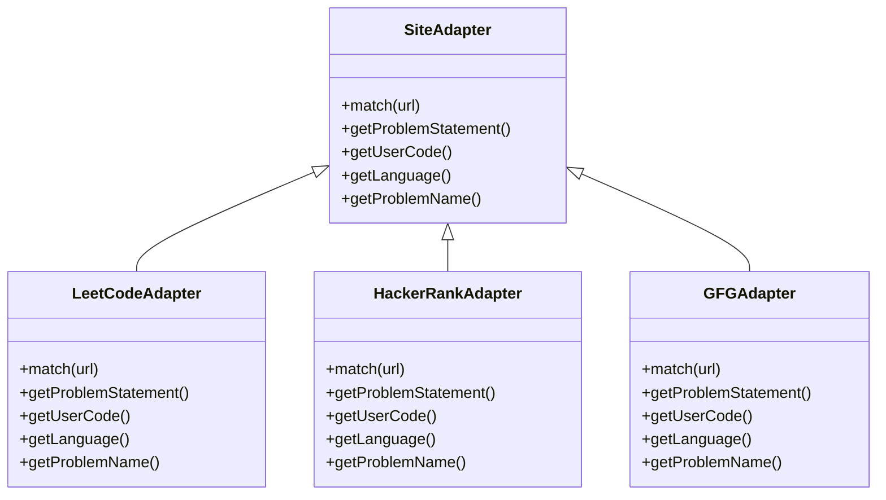
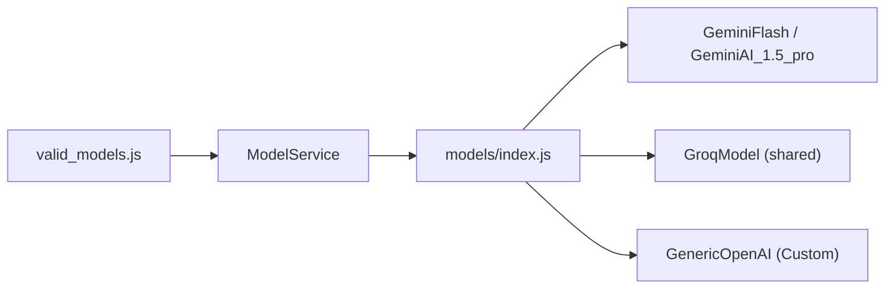
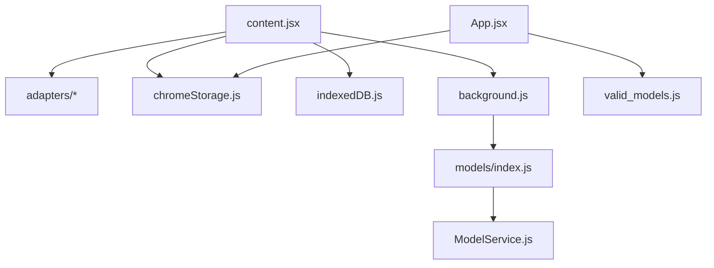

# Chrome Extension Architecture

<cite>
**Referenced Files in This Document**
- [manifest.json](file://manifest.json)
- [background.js](file://src/background.js)
- [content.jsx](file://src/content/content.jsx)
- [main.jsx](file://src/main.jsx)
- [App.jsx](file://src/App.jsx)
- [chromeStorage.js](file://src/lib/chromeStorage.js)
- [indexedDB.js](file://src/lib/indexedDB.js)
- [valid_models.js](file://src/constants/valid_models.js)
- [SiteAdapter.js](file://src/content/adapters/SiteAdapter.js)
- [LeetCodeAdapter.js](file://src/content/adapters/LeetCodeAdapter.js)
- [HackerRankAdapter.js](file://src/content/adapters/HackerRankAdapter.js)
- [GFGAdapter.js](file://src/content/adapters/GFGAdapter.js)
- [ModelService.js](file://src/services/ModelService.js)
- [models/index.js](file://src/models/index.js)
</cite>

## Table of Contents
1. [Introduction](#introduction)
2. [Project Structure](#project-structure)
3. [Core Components](#core-components)
4. [Architecture Overview](#architecture-overview)
5. [Detailed Component Analysis](#detailed-component-analysis)
6. [Dependency Analysis](#dependency-analysis)
7. [Performance Considerations](#performance-considerations)
8. [Security Considerations](#security-considerations)
9. [Troubleshooting Guide](#troubleshooting-guide)
10. [Conclusion](#conclusion)

## Introduction
This document describes the architecture of DSABuddy, a Chrome Extension that integrates AI assistance into popular coding challenge platforms. The extension follows a three-layer architecture:
- Content Script Layer: Injects a React-based UI into target websites (LeetCode, HackerRank, GeeksforGeeks).
- Background Script Layer: Manages extension lifecycle, API communication, and message routing.
- Main Application Layer: Renders the extension’s popup UI for configuration and settings.

We explain manifest configuration, communication patterns (message passing, storage APIs, IndexedDB), extension lifecycle, and security considerations.

## Project Structure
The repository is organized into:
- Manifest and build outputs under the root and dist directories.
- Source code under src/, split into content scripts, background script, main app, libraries, models, adapters, and services.
- Constants and adapters for site-specific integrations.

**Diagram sources**
- [manifest.json](file://manifest.json#L1-L74)
- [background.js](file://src/background.js#L1-L156)
- [content.jsx](file://src/content/content.jsx#L1-L760)
- [main.jsx](file://src/main.jsx#L1-L13)
- [App.jsx](file://src/App.jsx#L1-L233)
- [chromeStorage.js](file://src/lib/chromeStorage.js#L1-L36)
- [indexedDB.js](file://src/lib/indexedDB.js#L1-L38)
- [valid_models.js](file://src/constants/valid_models.js#L1-L12)
- [SiteAdapter.js](file://src/content/adapters/SiteAdapter.js#L1-L28)
- [LeetCodeAdapter.js](file://src/content/adapters/LeetCodeAdapter.js#L1-L51)
- [HackerRankAdapter.js](file://src/content/adapters/HackerRankAdapter.js#L1-L86)
- [GFGAdapter.js](file://src/content/adapters/GFGAdapter.js#L1-L84)
- [ModelService.js](file://src/services/ModelService.js#L1-L22)
- [models/index.js](file://src/models/index.js#L1-L19)

**Section sources**
- [manifest.json](file://manifest.json#L1-L74)
- [content.jsx](file://src/content/content.jsx#L1-L760)
- [background.js](file://src/background.js#L1-L156)
- [App.jsx](file://src/App.jsx#L1-L233)
- [main.jsx](file://src/main.jsx#L1-L13)

## Core Components
- Manifest v3 defines permissions, content scripts, host permissions, browser action, service worker, web-accessible resources, keyboard command, and icons.
- Background script implements AI model handlers for Groq, Gemini, and custom OpenAI-compatible APIs, and listens for messages to open the popup or generate AI responses.
- Content script injects a persistent React UI into supported sites, adapts to DOM changes, and communicates with the background script for AI generation while persisting chat history locally.
- Main application renders the popup UI for model selection, API key configuration, and saving settings.

Communication highlights:
- Message passing: content script sends requests to background script; background script responds with AI results.
- Storage APIs: chrome.storage for model selection and keys; chrome.action for opening the popup.
- IndexedDB: local persistence of chat histories per problem.

**Section sources**
- [manifest.json](file://manifest.json#L6-L48)
- [background.js](file://src/background.js#L127-L156)
- [content.jsx](file://src/content/content.jsx#L122-L181)
- [chromeStorage.js](file://src/lib/chromeStorage.js#L1-L36)
- [indexedDB.js](file://src/lib/indexedDB.js#L1-L38)
- [App.jsx](file://src/App.jsx#L33-L54)

## Architecture Overview
The extension enforces a strict separation of concerns:
- Content Script Layer: Runs in page context, isolated from the extension world, responsible for UI injection and site adaptation.
- Background Script Layer: Runs in a service worker, isolated from pages, responsible for API calls and extension lifecycle.
- Main Application Layer: Runs in the extension popup, isolated from pages, responsible for configuration and settings.

**Diagram sources**
- [manifest.json](file://manifest.json#L41-L48)
- [background.js](file://src/background.js#L127-L156)
- [content.jsx](file://src/content/content.jsx#L122-L181)
- [chromeStorage.js](file://src/lib/chromeStorage.js#L1-L36)
- [indexedDB.js](file://src/lib/indexedDB.js#L1-L38)

## Detailed Component Analysis

### Manifest Configuration
- Permissions: storage, activeTab, scripting.
- Content Scripts: matches LeetCode, HackerRank, and GeeksforGeeks domains; loads content.js and CSS.
- Host Permissions: allows network calls to target sites and external AI endpoints.
- Browser Action: default_popup points to index.html; default_title is set; keyboard shortcut configured.
- Background: service_worker is background.js with module type.
- Web Accessible Resources: assets are exposed to all URLs.
- Icons: 16x16, 48x48, 128x128 PNGs.

**Section sources**
- [manifest.json](file://manifest.json#L6-L72)

### Background Script Layer
Responsibilities:
- Implements model-specific API handlers for Groq, Gemini, and custom endpoints.
- Listens for messages to open the popup and to generate AI responses.
- Returns structured results or errors to the content script.

Key behaviors:
- Uses fetch with Authorization headers for external APIs.
- Parses JSON responses and falls back to raw text when JSON parse fails.
- Keeps the message channel open while performing async work.

**Diagram sources**
- [background.js](file://src/background.js#L7-L123)
- [background.js](file://src/background.js#L127-L156)

**Section sources**
- [background.js](file://src/background.js#L1-L156)

### Content Script Layer
Responsibilities:
- Injects a React UI into supported sites.
- Adapts to SPA navigation by re-injecting containers when removed.
- Collects problem statements and user code via adapters.
- Sends messages to the background script for AI generation.
- Persists chat history in IndexedDB and syncs with storage for model/key configuration.

UI and data flow:
- Uses MutationObserver to detect DOM changes and re-inject UI.
- Integrates with adapters to extract problem context and user code.
- Limits payload sizes to stay within free-tier token limits.
- Handles rate-limit messages and disables input accordingly.

**Diagram sources**
- [content.jsx](file://src/content/content.jsx#L555-L760)
- [LeetCodeAdapter.js](file://src/content/adapters/LeetCodeAdapter.js#L1-L51)
- [HackerRankAdapter.js](file://src/content/adapters/HackerRankAdapter.js#L1-L86)
- [GFGAdapter.js](file://src/content/adapters/GFGAdapter.js#L1-L84)
- [chromeStorage.js](file://src/lib/chromeStorage.js#L1-L36)
- [indexedDB.js](file://src/lib/indexedDB.js#L1-L38)

**Section sources**
- [content.jsx](file://src/content/content.jsx#L1-L760)
- [LeetCodeAdapter.js](file://src/content/adapters/LeetCodeAdapter.js#L1-L51)
- [HackerRankAdapter.js](file://src/content/adapters/HackerRankAdapter.js#L1-L86)
- [GFGAdapter.js](file://src/content/adapters/GFGAdapter.js#L1-L84)
- [chromeStorage.js](file://src/lib/chromeStorage.js#L1-L36)
- [indexedDB.js](file://src/lib/indexedDB.js#L1-L38)

### Main Application Layer (Popup)
Responsibilities:
- Renders the popup UI for model selection and API key configuration.
- Saves settings to chrome.storage.local and triggers storage change listeners in content scripts.
- Provides model options including Groq, Gemini, and Custom OpenAI-compatible.

**Diagram sources**
- [App.jsx](file://src/App.jsx#L21-L100)
- [chromeStorage.js](file://src/lib/chromeStorage.js#L1-L36)
- [content.jsx](file://src/content/content.jsx#L602-L622)

**Section sources**
- [App.jsx](file://src/App.jsx#L1-L233)
- [chromeStorage.js](file://src/lib/chromeStorage.js#L1-L36)
- [content.jsx](file://src/content/content.jsx#L602-L622)

### Site Adapters and Data Extraction
The adapters encapsulate site-specific logic for extracting problem statements, user code, language, and problem identifiers.

**Diagram sources**
- [SiteAdapter.js](file://src/content/adapters/SiteAdapter.js#L1-L28)
- [LeetCodeAdapter.js](file://src/content/adapters/LeetCodeAdapter.js#L1-L51)
- [HackerRankAdapter.js](file://src/content/adapters/HackerRankAdapter.js#L1-L86)
- [GFGAdapter.js](file://src/content/adapters/GFGAdapter.js#L1-L84)

**Section sources**
- [SiteAdapter.js](file://src/content/adapters/SiteAdapter.js#L1-L28)
- [LeetCodeAdapter.js](file://src/content/adapters/LeetCodeAdapter.js#L1-L51)
- [HackerRankAdapter.js](file://src/content/adapters/HackerRankAdapter.js#L1-L86)
- [GFGAdapter.js](file://src/content/adapters/GFGAdapter.js#L1-L84)

### Model Selection and Services
- ModelService selects and initializes models based on user choice.
- models/index.js maps model names to concrete implementations (Groq, Gemini, GenericOpenAI).
- valid_models.js enumerates selectable models and their display names.

**Diagram sources**
- [ModelService.js](file://src/services/ModelService.js#L1-L22)
- [models/index.js](file://src/models/index.js#L1-L19)
- [valid_models.js](file://src/constants/valid_models.js#L1-L12)

**Section sources**
- [ModelService.js](file://src/services/ModelService.js#L1-L22)
- [models/index.js](file://src/models/index.js#L1-L19)
- [valid_models.js](file://src/constants/valid_models.js#L1-L12)

## Dependency Analysis
High-level dependencies:
- content.jsx depends on adapters, chromeStorage, and indexedDB.
- background.js depends on model endpoints and returns results to content.jsx.
- App.jsx depends on chromeStorage and valid_models.js.
- models/index.js and ModelService.js depend on model implementations.

**Diagram sources**
- [content.jsx](file://src/content/content.jsx#L1-L760)
- [chromeStorage.js](file://src/lib/chromeStorage.js#L1-L36)
- [indexedDB.js](file://src/lib/indexedDB.js#L1-L38)
- [background.js](file://src/background.js#L1-L156)
- [App.jsx](file://src/App.jsx#L1-L233)
- [valid_models.js](file://src/constants/valid_models.js#L1-L12)
- [models/index.js](file://src/models/index.js#L1-L19)
- [ModelService.js](file://src/services/ModelService.js#L1-L22)

**Section sources**
- [content.jsx](file://src/content/content.jsx#L1-L760)
- [background.js](file://src/background.js#L1-L156)
- [App.jsx](file://src/App.jsx#L1-L233)
- [chromeStorage.js](file://src/lib/chromeStorage.js#L1-L36)
- [indexedDB.js](file://src/lib/indexedDB.js#L1-L38)
- [models/index.js](file://src/models/index.js#L1-L19)
- [ModelService.js](file://src/services/ModelService.js#L1-L22)

## Performance Considerations
- Payload limiting: code truncation and message window reduction prevent excessive token usage and reduce latency.
- Local pagination: IndexedDB slicing reduces memory footprint and improves responsiveness.
- MutationObserver usage: ensures UI resilience against SPA navigation without heavy polling.
- Storage caching: content script reloads model and keys on storage changes to minimize redundant fetches.

[No sources needed since this section provides general guidance]

## Security Considerations
- Content Script Isolation: Content scripts run in page context but cannot directly access extension APIs; all privileged operations (networking, storage) are mediated by the background script.
- Cross-Origin Communication: Network calls are restricted to declared host permissions; API keys are sent only to authorized endpoints.
- API Key Management: Keys are stored in chrome.storage.local; the extension groups Groq models under a shared key to simplify management. Avoid embedding keys in client-side code; rely on storage APIs.
- Popup Security: The popup validates model selection and requires API keys before enabling AI features.

**Section sources**
- [manifest.json](file://manifest.json#L29-L40)
- [chromeStorage.js](file://src/lib/chromeStorage.js#L1-L36)
- [content.jsx](file://src/content/content.jsx#L122-L181)

## Troubleshooting Guide
Common issues and resolutions:
- Popup not opening: Verify the keyboard shortcut and chrome.action.openPopup invocation.
- No AI response: Check model selection and API key presence; confirm host permissions; inspect background script error responses.
- Chat history missing: Ensure IndexedDB is initialized and content script persists messages after successful responses.
- Rate-limits: UI displays countdown timers; content script parses retry seconds from error messages.

**Section sources**
- [background.js](file://src/background.js#L127-L156)
- [content.jsx](file://src/content/content.jsx#L183-L197)
- [indexedDB.js](file://src/lib/indexedDB.js#L1-L38)

## Conclusion
DSABuddy’s architecture cleanly separates concerns across three layers, leveraging Chrome Extension APIs for secure and efficient operation. The content script layer focuses on UI and site adaptation, the background script manages AI integrations and lifecycle, and the main application layer provides configuration. Robust communication via message passing, storage APIs, and IndexedDB ensures reliability, while manifest-defined permissions and adapter-based extraction enforce security and maintainability.