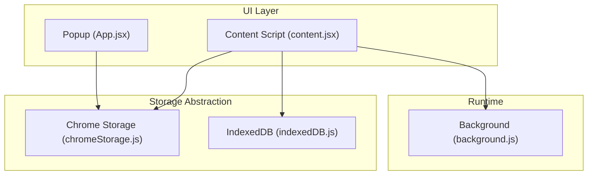
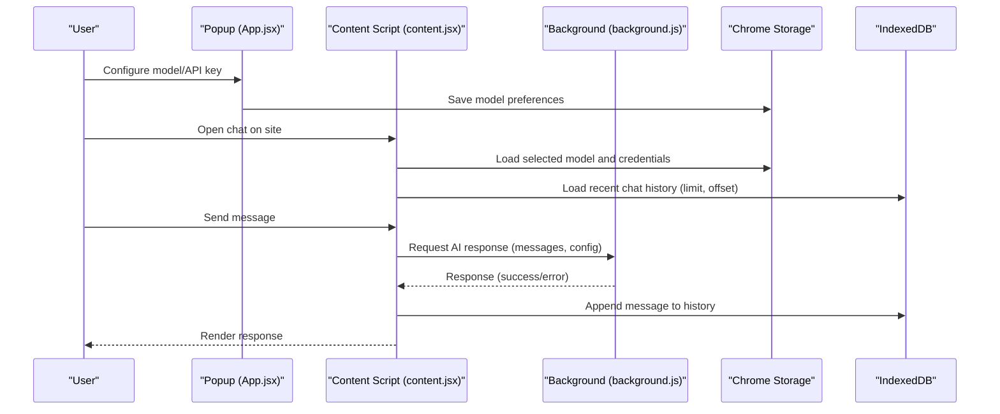
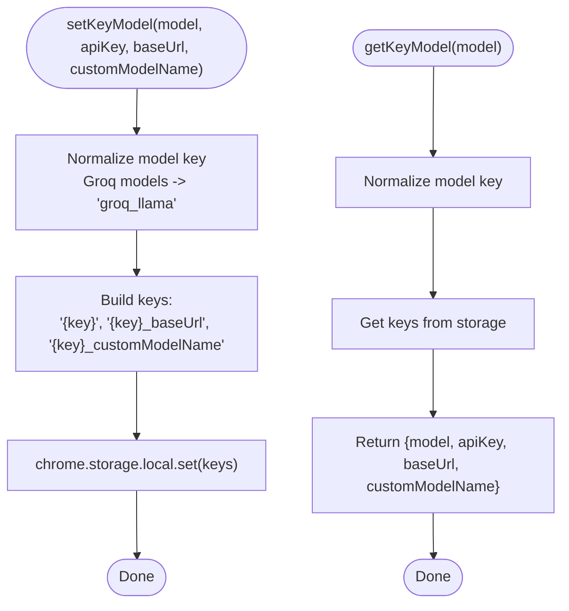
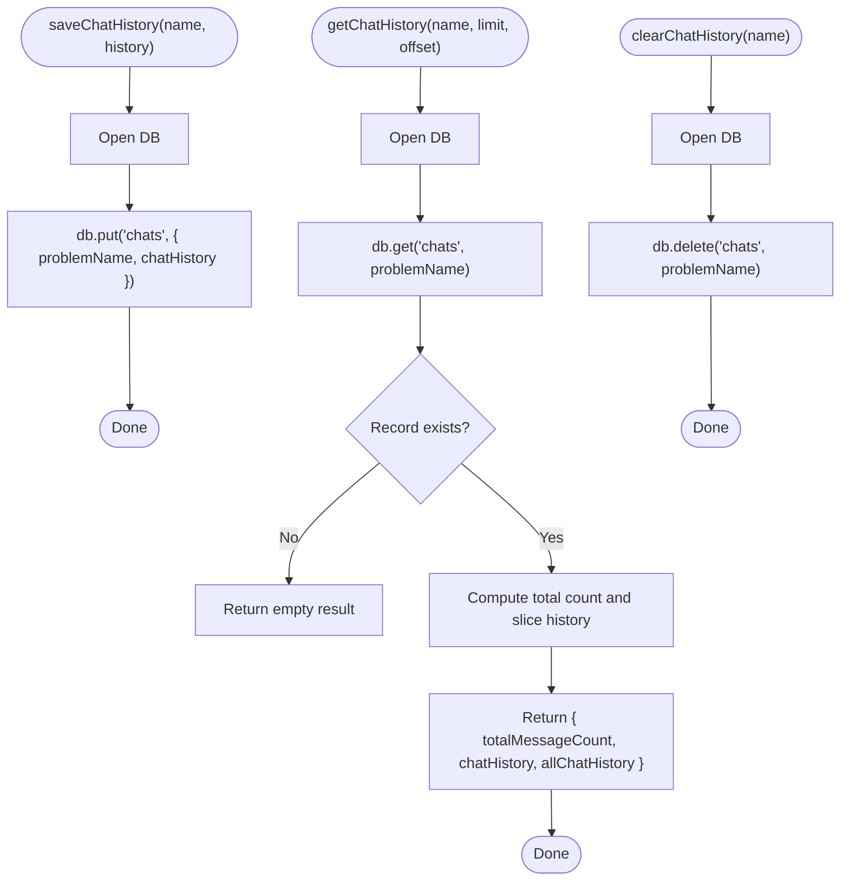
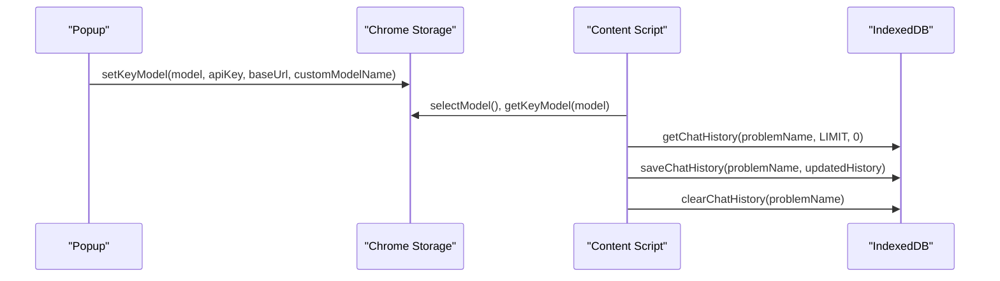
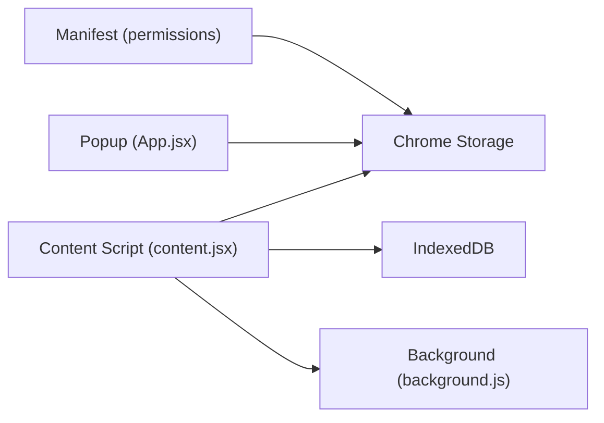

# Data Persistence Architecture

<cite>
**Referenced Files in This Document**
- [chromeStorage.js](file://src/lib/chromeStorage.js)
- [indexedDB.js](file://src/lib/indexedDB.js)
- [chatHistory.js](file://src/interface/chatHistory.js)
- [content.jsx](file://src/content/content.jsx)
- [App.jsx](file://src/App.jsx)
- [background.js](file://src/background.js)
- [manifest.json](file://manifest.json)
- [valid_models.js](file://src/constants/valid_models.js)
</cite>

## Table of Contents
1. [Introduction](#introduction)
2. [Project Structure](#project-structure)
3. [Core Components](#core-components)
4. [Architecture Overview](#architecture-overview)
5. [Detailed Component Analysis](#detailed-component-analysis)
6. [Dependency Analysis](#dependency-analysis)
7. [Performance Considerations](#performance-considerations)
8. [Troubleshooting Guide](#troubleshooting-guide)
9. [Conclusion](#conclusion)

## Introduction
This document describes DSABuddy's data persistence architecture, which combines two complementary storage mechanisms:
- Chrome Storage API for lightweight configuration and small data (user preferences, model configurations)
- IndexedDB for chat history and larger datasets (conversation records)

It explains the storage abstraction layers, data serialization strategies, migration patterns, and the chat history data model. It also covers error handling, performance optimization, and practical examples of data access patterns and lifecycle management.

## Project Structure
The persistence system spans three primary areas:
- Storage abstraction libraries: Chrome Storage wrapper and IndexedDB wrapper
- UI integration: Content script and popup components that read/write preferences and chat history
- Background service: Orchestrates model calls and coordinates runtime messaging

**Diagram sources**
- [App.jsx](file://src/App.jsx#L1-L233)
- [content.jsx](file://src/content/content.jsx#L1-L760)
- [chromeStorage.js](file://src/lib/chromeStorage.js#L1-L36)
- [indexedDB.js](file://src/lib/indexedDB.js#L1-L38)
- [background.js](file://src/background.js#L1-L156)

**Section sources**
- [chromeStorage.js](file://src/lib/chromeStorage.js#L1-L36)
- [indexedDB.js](file://src/lib/indexedDB.js#L1-L38)
- [content.jsx](file://src/content/content.jsx#L1-L760)
- [App.jsx](file://src/App.jsx#L1-L233)
- [background.js](file://src/background.js#L1-L156)
- [manifest.json](file://manifest.json#L1-L74)

## Core Components
- Chrome Storage abstraction
  - Stores per-model API keys, base URLs, custom model names, and the selected model
  - Normalizes Groq models to share a single key for streamlined storage
- IndexedDB abstraction
  - Stores chat histories keyed by problem name
  - Provides save, load with pagination, and clear operations
- Chat history parsing utility
  - Ensures robust parsing of stored history strings into arrays
- UI integration
  - Popup loads/saves model preferences
  - Content script loads previous messages, appends new ones, and persists to IndexedDB
  - Uses background script for model inference calls

**Section sources**
- [chromeStorage.js](file://src/lib/chromeStorage.js#L1-L36)
- [indexedDB.js](file://src/lib/indexedDB.js#L1-L38)
- [chatHistory.js](file://src/interface/chatHistory.js#L1-L19)
- [content.jsx](file://src/content/content.jsx#L1-L760)
- [App.jsx](file://src/App.jsx#L1-L233)

## Architecture Overview
The dual-storage architecture separates concerns:
- Small, frequently accessed preferences live in Chrome Storage for fast synchronous access
- Larger, append-only chat histories live in IndexedDB for scalable persistence and efficient slicing

**Diagram sources**
- [App.jsx](file://src/App.jsx#L33-L54)
- [content.jsx](file://src/content/content.jsx#L122-L217)
- [chromeStorage.js](file://src/lib/chromeStorage.js#L4-L35)
- [indexedDB.js](file://src/lib/indexedDB.js#L9-L36)
- [background.js](file://src/background.js#L133-L155)

## Detailed Component Analysis

### Chrome Storage Abstraction
Responsibilities:
- Normalize Groq models to a shared key to simplify storage
- Persist per-model API key, base URL, and custom model name
- Track the currently selected model
- Retrieve model-specific credentials and configuration

Data model:
- Keys per model: model key, model key + "_baseUrl", model key + "_customModelName"
- Selected model key: "selectedModel"

Serialization:
- Values are stored as-is; no explicit serialization performed by the wrapper

**Diagram sources**
- [chromeStorage.js](file://src/lib/chromeStorage.js#L1-L35)

**Section sources**
- [chromeStorage.js](file://src/lib/chromeStorage.js#L1-L36)
- [App.jsx](file://src/App.jsx#L33-L54)
- [content.jsx](file://src/content/content.jsx#L602-L622)

### IndexedDB Abstraction
Schema:
- Database: "chat-db"
- Object store: "chats"
- Key path: "problemName"
- Value: { problemName, chatHistory }

Operations:
- saveChatHistory(problemName, history): put entire history array for a problem
- getChatHistory(problemName, limit, offset): return paginated slice and total count
- clearChatHistory(problemName): delete record for a problem
- LIMIT_VALUE: constant page size for pagination

Data model:
- chatHistory is an array of message objects with role, content, and timestamp
- Pagination uses totalMessageCount and slice boundaries computed from limit and offset

**Diagram sources**
- [indexedDB.js](file://src/lib/indexedDB.js#L1-L38)

**Section sources**
- [indexedDB.js](file://src/lib/indexedDB.js#L1-L38)
- [content.jsx](file://src/content/content.jsx#L219-L252)

### Chat History Parsing Utility
Purpose:
- Safely parse stored history strings into arrays
- Gracefully handle malformed JSON by returning an empty array

Usage:
- Ensures UI rendering stability when reading persisted chat data

**Section sources**
- [chatHistory.js](file://src/interface/chatHistory.js#L1-L19)

### UI Integration: Popup and Content Script
Popup (preferences):
- Loads selected model and credentials from Chrome Storage
- Saves model preferences and clears submit message on success

Content script (chat):
- Loads initial chat history via getChatHistory with pagination
- Appends new user and assistant messages to history
- Persists updates via saveChatHistory
- Clears chat history via clearChatHistory
- Listens to storage changes to refresh credentials

**Diagram sources**
- [App.jsx](file://src/App.jsx#L33-L54)
- [content.jsx](file://src/content/content.jsx#L219-L252)
- [chromeStorage.js](file://src/lib/chromeStorage.js#L28-L35)
- [indexedDB.js](file://src/lib/indexedDB.js#L9-L36)

**Section sources**
- [App.jsx](file://src/App.jsx#L33-L99)
- [content.jsx](file://src/content/content.jsx#L219-L252)
- [content.jsx](file://src/content/content.jsx#L112-L217)
- [content.jsx](file://src/content/content.jsx#L602-L622)

### Background Service Integration
The content script routes model requests through the background script to avoid CORS restrictions. While the background script does not directly persist data, it influences the chat flow by providing AI responses that are persisted by the content script.

**Section sources**
- [content.jsx](file://src/content/content.jsx#L153-L181)
- [background.js](file://src/background.js#L133-L155)

## Dependency Analysis
- Permissions: The extension declares storage permission in the manifest, enabling Chrome Storage access
- Model selection: The popup reads/writes the selected model and credentials; the content script listens for storage changes
- Data flow: Preferences flow from popup to Chrome Storage; chat history flows from content script to IndexedDB

**Diagram sources**
- [manifest.json](file://manifest.json#L6-L10)
- [App.jsx](file://src/App.jsx#L19-L99)
- [content.jsx](file://src/content/content.jsx#L23-L42)
- [chromeStorage.js](file://src/lib/chromeStorage.js#L1-L36)
- [indexedDB.js](file://src/lib/indexedDB.js#L1-L38)
- [background.js](file://src/background.js#L127-L155)

**Section sources**
- [manifest.json](file://manifest.json#L6-L10)
- [App.jsx](file://src/App.jsx#L19-L99)
- [content.jsx](file://src/content/content.jsx#L23-L42)

## Performance Considerations
- IndexedDB pagination: Using limit/offset prevents loading entire histories into memory; adjust LIMIT_VALUE for different performance needs
- Minimal writes: Persist only after appending a message to reduce write frequency
- Efficient retrieval: Store entire history per problem; rely on client-side slicing to minimize DB queries
- Storage normalization: Group Groq models under a single key reduces storage overhead and simplifies maintenance
- UI responsiveness: Debounce or throttle message sending and scrolling to avoid excessive re-renders

[No sources needed since this section provides general guidance]

## Troubleshooting Guide
Common issues and remedies:
- Storage access errors: Wrap Chrome Storage calls in try/catch blocks; log errors and fall back to defaults
- IndexedDB upgrade failures: Ensure the object store "chats" exists with the correct key path; handle version upgrades carefully
- Malformed history data: Use the parsing utility to guard against invalid JSON; initialize with empty arrays when parsing fails
- Rate limiting: The UI handles rate-limit messages; persist error messages alongside successful responses for continuity
- Storage change synchronization: The content script listens to storage changes; ensure listeners are registered and cleaned up properly

**Section sources**
- [content.jsx](file://src/content/content.jsx#L183-L197)
- [chatHistory.js](file://src/interface/chatHistory.js#L11-L18)
- [chromeStorage.js](file://src/lib/chromeStorage.js#L57-L83)
- [content.jsx](file://src/content/content.jsx#L616-L622)

## Conclusion
DSABuddy’s dual-storage architecture leverages Chrome Storage for lightweight, fast preferences and IndexedDB for scalable chat history. The abstractions are thin and focused, enabling straightforward persistence patterns while maintaining separation of concerns. Robust parsing, pagination, and change listeners provide a reliable foundation for user data. Extending the system can involve adding new preference keys in Chrome Storage and new object stores or indexes in IndexedDB as requirements evolve.