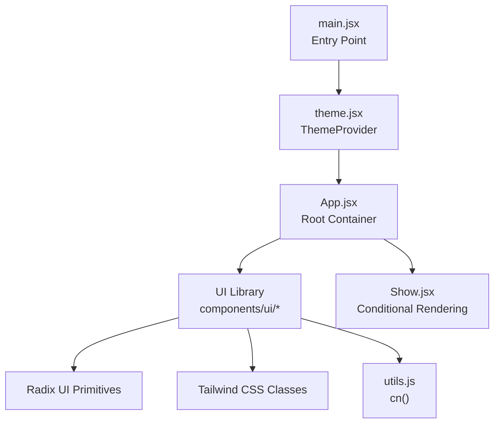
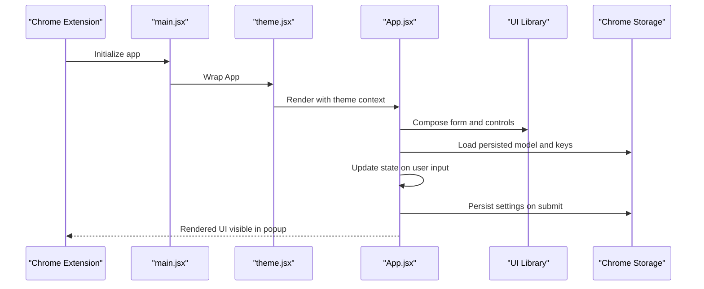
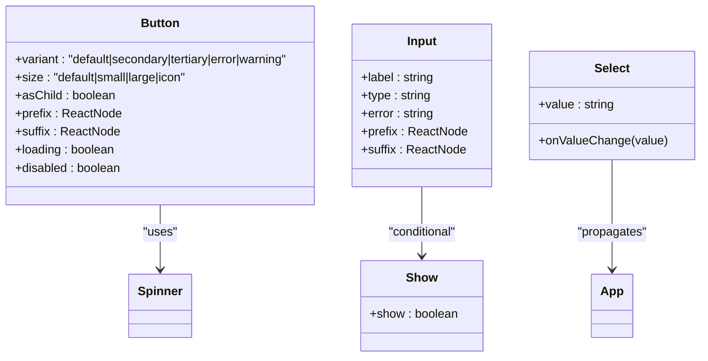
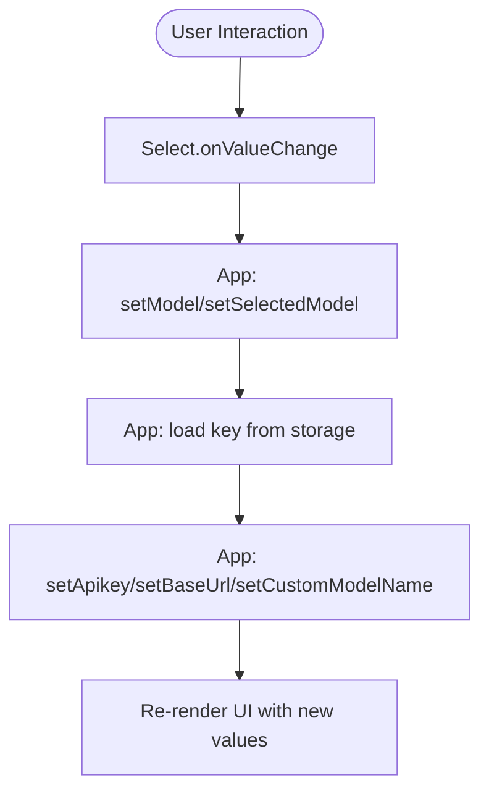
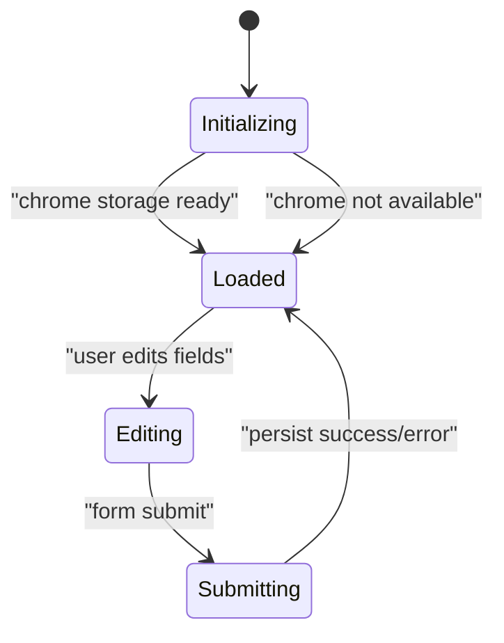
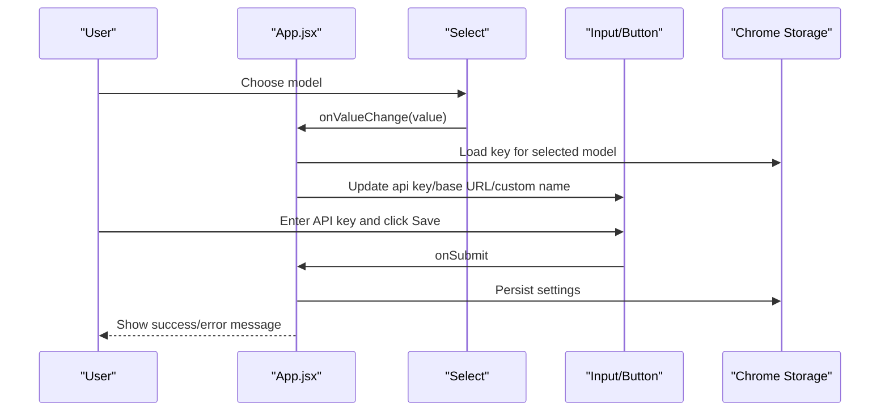
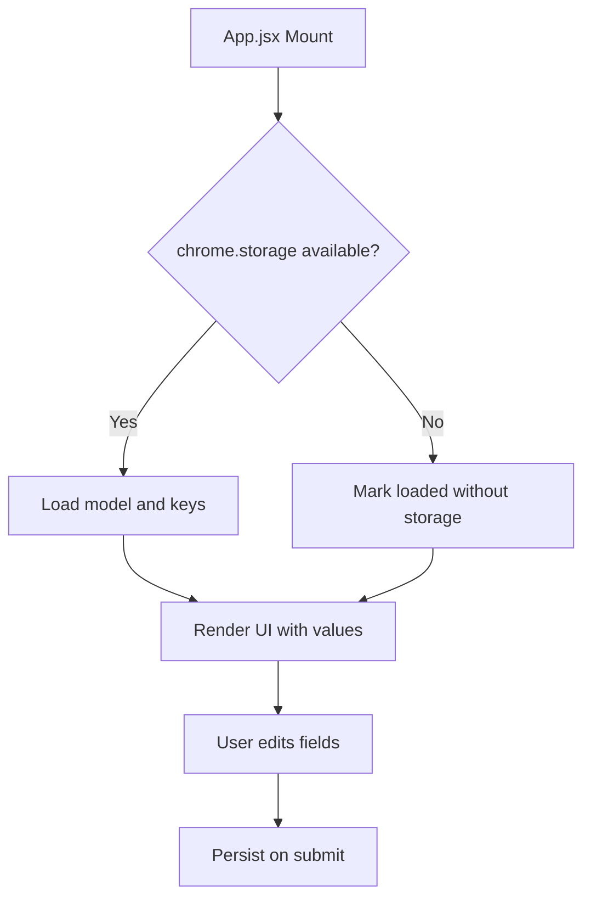
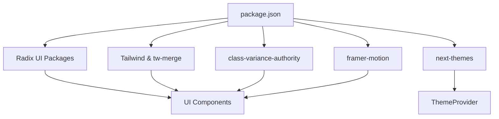

# React Component Architecture

<cite>
**Referenced Files in This Document**
- [App.jsx](file://src/App.jsx)
- [main.jsx](file://src/main.jsx)
- [theme.jsx](file://src/providers/theme.jsx)
- [button.jsx](file://src/components/ui/button.jsx)
- [card.jsx](file://src/components/ui/card.jsx)
- [input.jsx](file://src/components/ui/input.jsx)
- [select.jsx](file://src/components/ui/select.jsx)
- [accordion.jsx](file://src/components/ui/accordion.jsx)
- [dropdown-menu.jsx](file://src/components/ui/dropdown-menu.jsx)
- [label.jsx](file://src/components/ui/label.jsx)
- [scroll-area.jsx](file://src/components/ui/scroll-area.jsx)
- [spinner.jsx](file://src/components/ui/spinner.jsx)
- [Show.jsx](file://src/components/Show.jsx)
- [utils.js](file://src/lib/utils.js)
- [package.json](file://package.json)
</cite>

## Table of Contents
1. [Introduction](#introduction)
2. [Project Structure](#project-structure)
3. [Core Components](#core-components)
4. [Architecture Overview](#architecture-overview)
5. [Detailed Component Analysis](#detailed-component-analysis)
6. [Dependency Analysis](#dependency-analysis)
7. [Performance Considerations](#performance-considerations)
8. [Troubleshooting Guide](#troubleshooting-guide)
9. [Conclusion](#conclusion)
10. [Appendices](#appendices)

## Introduction
This document describes the React component architecture of DSABuddy, focusing on the component hierarchy, design system built with Radix UI primitives, styling via Tailwind CSS, state management patterns, and integration points with Chrome Extension APIs. It explains how the application composes UI components, manages state, handles events, and ensures accessibility and performance.

## Project Structure
The application follows a feature-centric structure with a clear separation between the entry point, providers, UI components, and shared utilities:
- Entry point initializes the React root and wraps the app in a theme provider.
- The root component orchestrates state and renders the primary UI.
- A dedicated UI library under components/ui encapsulates reusable Radix UI-based components styled with Tailwind CSS.
- Shared utilities consolidate cross-cutting concerns like class merging.

**Diagram sources**
- [main.jsx](file://src/main.jsx#L1-L13)
- [theme.jsx](file://src/providers/theme.jsx#L1-L41)
- [App.jsx](file://src/App.jsx#L1-L233)
- [Show.jsx](file://src/components/Show.jsx#L1-L22)
- [utils.js](file://src/lib/utils.js#L1-L3)

**Section sources**
- [main.jsx](file://src/main.jsx#L1-L13)
- [theme.jsx](file://src/providers/theme.jsx#L1-L41)
- [App.jsx](file://src/App.jsx#L1-L233)
- [Show.jsx](file://src/components/Show.jsx#L1-L22)
- [utils.js](file://src/lib/utils.js#L1-L3)

## Core Components
This section outlines the primary building blocks of the UI system and their roles:
- App.jsx: Root container managing model selection, API key storage, and form submission with loading and feedback states.
- UI primitives: A curated set of components derived from Radix UI, styled with Tailwind CSS and composed with animations and motion.
- Providers: Theme provider enabling light/dark/system themes.
- Utilities: Utility functions for class merging and conditional rendering.

Key component responsibilities:
- State orchestration and persistence: App.jsx coordinates local state and persists selections to Chrome storage.
- UI composition: Components are composable, accept consistent props, and expose variants/sizes for styling.
- Accessibility: Components leverage Radix UI’s semantics and ARIA attributes.

**Section sources**
- [App.jsx](file://src/App.jsx#L1-L233)
- [button.jsx](file://src/components/ui/button.jsx#L1-L115)
- [input.jsx](file://src/components/ui/input.jsx#L1-L169)
- [select.jsx](file://src/components/ui/select.jsx#L1-L259)
- [theme.jsx](file://src/providers/theme.jsx#L1-L41)
- [utils.js](file://src/lib/utils.js#L1-L3)

## Architecture Overview
The runtime architecture centers on a single-page popup UI for a Chrome extension. The entry point creates the root, applies theming, and mounts the root component. App.jsx manages user interactions, state updates, and persistence. The UI library provides reusable, accessible primitives.

**Diagram sources**
- [main.jsx](file://src/main.jsx#L1-L13)
- [theme.jsx](file://src/providers/theme.jsx#L1-L41)
- [App.jsx](file://src/App.jsx#L1-L233)
- [select.jsx](file://src/components/ui/select.jsx#L1-L259)
- [input.jsx](file://src/components/ui/input.jsx#L1-L169)

## Detailed Component Analysis

### Component Composition Patterns
- Slot-based composition: The Button component uses a slot pattern to render either a native button or a child component, enabling semantic flexibility.
- Variants and sizes: Components define consistent variant and size interfaces, allowing uniform styling across the app.
- Animation integration: Components like Select and Button integrate motion libraries for smooth interactions.
- Conditional rendering: Show.jsx replaces content with a spinner until a loaded flag indicates readiness.

**Diagram sources**
- [button.jsx](file://src/components/ui/button.jsx#L1-L115)
- [input.jsx](file://src/components/ui/input.jsx#L1-L169)
- [select.jsx](file://src/components/ui/select.jsx#L1-L259)
- [Show.jsx](file://src/components/Show.jsx#L1-L22)
- [spinner.jsx](file://src/components/ui/spinner.jsx#L1-L39)

**Section sources**
- [button.jsx](file://src/components/ui/button.jsx#L1-L115)
- [input.jsx](file://src/components/ui/input.jsx#L1-L169)
- [select.jsx](file://src/components/ui/select.jsx#L1-L259)
- [Show.jsx](file://src/components/Show.jsx#L1-L22)

### Prop Drilling Strategies
- Minimal prop drilling: App.jsx holds state for model selection, API key, base URL, and custom model name. Child components receive only necessary props (e.g., Select receives onValueChange and value).
- Localized state: Each form field maintains its own state, reducing cross-component coupling.
- Event handlers: Handlers are passed down to child components, keeping the root component the single source of truth for UI state.

**Diagram sources**
- [App.jsx](file://src/App.jsx#L89-L99)
- [select.jsx](file://src/components/ui/select.jsx#L1-L259)

**Section sources**
- [App.jsx](file://src/App.jsx#L89-L99)
- [select.jsx](file://src/components/ui/select.jsx#L1-L259)

### State Management Approaches
- React local state: App.jsx uses useState and useEffect to manage UI state and initialize from Chrome storage.
- Persistence: Settings are persisted via Chrome storage functions invoked from App.jsx.
- Controlled components: Inputs and Select components are controlled, receiving current values and callbacks to update state.

**Diagram sources**
- [App.jsx](file://src/App.jsx#L56-L87)
- [App.jsx](file://src/App.jsx#L33-L54)

**Section sources**
- [App.jsx](file://src/App.jsx#L21-L100)
- [App.jsx](file://src/App.jsx#L56-L87)
- [App.jsx](file://src/App.jsx#L33-L54)

### Design System Architecture
Reusable UI components and their interfaces:
- Button: Variants (default, outline, secondary, tertiary, link, error, warning), sizes (default, small, large, icon), loading state, prefix/suffix support.
- Input: Label, type, error messaging, prefix/suffix with dynamic padding, masked password toggle.
- Select: Trigger, Content with animated variants, Item, Label, Separator, Scroll buttons.
- Card: Card, CardHeader, CardTitle, CardDescription, CardContent, CardFooter.
- Accordion: Root, Item, Trigger with chevron indicator, Content with collapse/expand animations.
- Dropdown Menu: Root, Trigger, Content, Items, Checkbox/Radio items, Submenus, separators, shortcuts.
- Label: Styled label primitive with consistent typography.
- Scroll Area: Root and Scrollbar with vertical/horizontal orientation.
- Spinner: Animated spinner with configurable size.

Styling patterns:
- Tailwind classes compose consistently across components.
- cn utility merges Tailwind classes safely.
- Variants defined via class variance authority for predictable styling.

Accessibility:
- Components rely on Radix UI’s accessible primitives and ARIA attributes.
- Focus management and keyboard navigation are handled by Radix UI.
- Semantic HTML and proper labeling are enforced by components.

**Section sources**
- [button.jsx](file://src/components/ui/button.jsx#L1-L115)
- [input.jsx](file://src/components/ui/input.jsx#L1-L169)
- [select.jsx](file://src/components/ui/select.jsx#L1-L259)
- [card.jsx](file://src/components/ui/card.jsx#L1-L58)
- [accordion.jsx](file://src/components/ui/accordion.jsx#L1-L46)
- [dropdown-menu.jsx](file://src/components/ui/dropdown-menu.jsx#L1-L166)
- [label.jsx](file://src/components/ui/label.jsx#L1-L20)
- [scroll-area.jsx](file://src/components/ui/scroll-area.jsx#L1-L40)
- [spinner.jsx](file://src/components/ui/spinner.jsx#L1-L39)
- [utils.js](file://src/lib/utils.js#L1-L3)

### Component Lifecycle Management and Event Handling
- Initialization: App.jsx loads persisted settings on mount, sets up state, and signals readiness.
- User interactions: Form controls update state via event handlers; Select triggers model switching; Button submits settings.
- Persistence: On submit, App.jsx writes to Chrome storage and displays feedback messages.
- Conditional rendering: Show.jsx swaps content for a spinner during initialization.

**Diagram sources**
- [App.jsx](file://src/App.jsx#L56-L87)
- [App.jsx](file://src/App.jsx#L33-L54)
- [select.jsx](file://src/components/ui/select.jsx#L1-L259)
- [input.jsx](file://src/components/ui/input.jsx#L1-L169)
- [button.jsx](file://src/components/ui/button.jsx#L1-L115)

**Section sources**
- [App.jsx](file://src/App.jsx#L56-L87)
- [App.jsx](file://src/App.jsx#L33-L54)
- [select.jsx](file://src/components/ui/select.jsx#L1-L259)
- [input.jsx](file://src/components/ui/input.jsx#L1-L169)
- [button.jsx](file://src/components/ui/button.jsx#L1-L115)

### Integration with Chrome Extension APIs
- Storage: App.jsx reads/writes model and API key settings using Chrome storage functions.
- Environment checks: App.jsx guards against missing chrome.storage by marking loaded immediately.
- No background/content scripts are used in the UI layer; persistence is handled directly in the popup UI.

**Diagram sources**
- [App.jsx](file://src/App.jsx#L56-L87)
- [App.jsx](file://src/App.jsx#L33-L54)

**Section sources**
- [App.jsx](file://src/App.jsx#L18-L20)
- [App.jsx](file://src/App.jsx#L56-L87)
- [App.jsx](file://src/App.jsx#L33-L54)

### Component Testing Strategies
Recommended testing approaches:
- Unit tests for component props and variants using a testing framework.
- Snapshot tests to prevent unintended UI regressions.
- Accessibility tests using tools that assert ARIA attributes and keyboard navigation.
- Integration tests simulating user interactions (selecting model, entering API key, submitting).

[No sources needed since this section provides general guidance]

### Accessibility Considerations
- Semantic correctness: Components use Radix UI primitives ensuring correct semantics.
- Keyboard navigation: Radix UI components provide built-in keyboard handling.
- Focus management: Components forward refs and handle focus states appropriately.
- Screen reader support: Labels and icons include appropriate ARIA attributes.

[No sources needed since this section provides general guidance]

### Examples of Component Composition and Reusability
- Button with loading state and icons: Demonstrates variant, size, and prefix/suffix composition.
- Input with label and error: Shows label, type, and error messaging composition.
- Select with animated content: Illustrates composition of trigger, content, item, and separator.
- Conditional rendering with Show: Shows how to swap content during asynchronous initialization.

**Section sources**
- [button.jsx](file://src/components/ui/button.jsx#L62-L113)
- [input.jsx](file://src/components/ui/input.jsx#L23-L115)
- [select.jsx](file://src/components/ui/select.jsx#L124-L207)
- [Show.jsx](file://src/components/Show.jsx#L13-L21)

## Dependency Analysis
External dependencies and their roles:
- Radix UI: Provides accessible base components (select, dropdown-menu, accordion, label, scroll-area, slot).
- Tailwind CSS and tw-merge: Styling and safe class merging.
- class-variance-authority: Variants and sizes for components.
- framer-motion: Smooth animations for interactive elements.
- next-themes: Theme provider for light/dark/system modes.

**Diagram sources**
- [package.json](file://package.json#L12-L34)
- [button.jsx](file://src/components/ui/button.jsx#L1-L115)
- [select.jsx](file://src/components/ui/select.jsx#L1-L259)
- [theme.jsx](file://src/providers/theme.jsx#L1-L41)

**Section sources**
- [package.json](file://package.json#L12-L34)

## Performance Considerations
- Minimize re-renders: Keep state granular and avoid unnecessary lifting.
- Lazy loading: Defer heavy computations until after initialization.
- CSS animations: Prefer hardware-accelerated properties; keep animation durations reasonable.
- Conditional rendering: Use Show.jsx to avoid rendering heavy content before data is ready.

[No sources needed since this section provides general guidance]

## Troubleshooting Guide
Common issues and resolutions:
- Missing chrome.storage: App.jsx guards against unavailable storage and marks loaded immediately.
- Form submission errors: App.jsx catches errors and displays feedback messages.
- Loading states: Button supports a loading variant; Spinner provides visual feedback.

**Section sources**
- [App.jsx](file://src/App.jsx#L56-L87)
- [App.jsx](file://src/App.jsx#L46-L51)
- [button.jsx](file://src/components/ui/button.jsx#L71-L73)
- [spinner.jsx](file://src/components/ui/spinner.jsx#L1-L39)

## Conclusion
DSABuddy’s React component system leverages Radix UI primitives and Tailwind CSS to deliver a consistent, accessible, and performant UI. The App.jsx root container orchestrates state and persistence, while the UI library offers composable, variant-rich components. The architecture emphasizes minimal prop drilling, clear lifecycle management, and robust integration with Chrome Extension APIs.

## Appendices
- Class merging utility: cn consolidates Tailwind classes safely.
- Conditional rendering helper: Show swaps content with a spinner during initialization.

**Section sources**
- [utils.js](file://src/lib/utils.js#L1-L3)
- [Show.jsx](file://src/components/Show.jsx#L1-L22)