# API Communication Patterns

<cite>
**Referenced Files in This Document**
- [src/models/index.js](file://src/models/index.js)
- [src/services/ModelService.js](file://src/services/ModelService.js)
- [src/models/BaseModel.js](file://src/models/BaseModel.js)
- [src/interface/ModelInterface.js](file://src/interface/ModelInterface.js)
- [src/schema/modelOutput.js](file://src/schema/modelOutput.js)
- [src/constants/valid_models.js](file://src/constants/valid_models.js)
- [src/models/model/GroqModel.js](file://src/models/model/GroqModel.js)
- [src/models/model/GeminiFlash.js](file://src/models/model/GeminiFlash.js)
- [src/models/model/GeminiAI_1_5_pro.js](file://src/models/model/GeminiAI_1_5_pro.js)
- [src/models/model/GenericOpenAI.js](file://src/models/model/GenericOpenAI.js)
- [src/constants/prompt.js](file://src/constants/prompt.js)
- [src/content/content.jsx](file://src/content/content.jsx)
- [src/content/adapters/SiteAdapter.js](file://src/content/adapters/SiteAdapter.js)
</cite>

## Table of Contents
1. [Introduction](#introduction)
2. [Project Structure](#project-structure)
3. [Core Components](#core-components)
4. [Architecture Overview](#architecture-overview)
5. [Detailed Component Analysis](#detailed-component-analysis)
6. [Dependency Analysis](#dependency-analysis)
7. [Performance Considerations](#performance-considerations)
8. [Troubleshooting Guide](#troubleshooting-guide)
9. [Conclusion](#conclusion)

## Introduction
This document explains DSABuddy’s AI API communication patterns and response processing workflows across three providers: Groq, Google Gemini, and a custom OpenAI-compatible API. It documents standardized request/response formats, message transformations, system prompt injection, content formatting, JSON parsing, error handling, rate limiting, and performance optimizations. The goal is to provide a clear understanding of how the extension routes requests, adapts messages to provider-specific formats, parses structured outputs, and handles errors gracefully.

## Project Structure
DSABuddy organizes AI-related logic into models, a service layer, interfaces, and shared schemas. The content script orchestrates request routing and UI rendering, while adapters extract site-specific context for prompts.

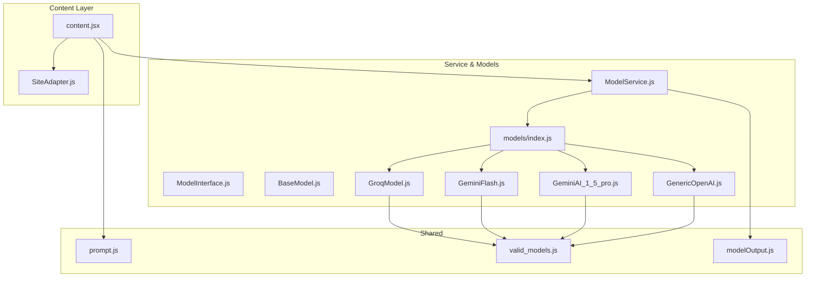

**Diagram sources**
- [src/content/content.jsx](file://src/content/content.jsx#L1-L760)
- [src/models/index.js](file://src/models/index.js#L1-L19)
- [src/services/ModelService.js](file://src/services/ModelService.js#L1-L22)
- [src/models/BaseModel.js](file://src/models/BaseModel.js#L1-L17)
- [src/interface/ModelInterface.js](file://src/interface/ModelInterface.js#L1-L18)
- [src/models/model/GroqModel.js](file://src/models/model/GroqModel.js#L1-L69)
- [src/models/model/GeminiFlash.js](file://src/models/model/GeminiFlash.js#L1-L99)
- [src/models/model/GeminiAI_1_5_pro.js](file://src/models/model/GeminiAI_1_5_pro.js#L1-L85)
- [src/models/model/GenericOpenAI.js](file://src/models/model/GenericOpenAI.js#L1-L60)
- [src/constants/prompt.js](file://src/constants/prompt.js#L1-L51)
- [src/constants/valid_models.js](file://src/constants/valid_models.js#L1-L12)
- [src/schema/modelOutput.js](file://src/schema/modelOutput.js#L1-L14)
- [src/content/adapters/SiteAdapter.js](file://src/content/adapters/SiteAdapter.js#L1-L28)

**Section sources**
- [src/models/index.js](file://src/models/index.js#L1-L19)
- [src/services/ModelService.js](file://src/services/ModelService.js#L1-L22)
- [src/models/BaseModel.js](file://src/models/BaseModel.js#L1-L17)
- [src/interface/ModelInterface.js](file://src/interface/ModelInterface.js#L1-L18)
- [src/constants/valid_models.js](file://src/constants/valid_models.js#L1-L12)
- [src/constants/prompt.js](file://src/constants/prompt.js#L1-L51)
- [src/schema/modelOutput.js](file://src/schema/modelOutput.js#L1-L14)
- [src/content/content.jsx](file://src/content/content.jsx#L1-L760)
- [src/content/adapters/SiteAdapter.js](file://src/content/adapters/SiteAdapter.js#L1-L28)

## Core Components
- Model registry and selection: The model index exports provider-specific model instances and a factory for Groq models. The service selects and initializes a model with an API key and optional configuration.
- Base and interface: A base class and interface define the contract for initialization and response generation, ensuring consistent behavior across providers.
- Output schema: A Zod schema defines the expected shape of AI responses, enabling robust parsing and validation.
- Prompt and adapters: A reusable system prompt template is injected into provider requests, and adapters extract problem statements, user code, and language from supported sites.

**Section sources**
- [src/models/index.js](file://src/models/index.js#L1-L19)
- [src/services/ModelService.js](file://src/services/ModelService.js#L1-L22)
- [src/models/BaseModel.js](file://src/models/BaseModel.js#L1-L17)
- [src/interface/ModelInterface.js](file://src/interface/ModelInterface.js#L1-L18)
- [src/schema/modelOutput.js](file://src/schema/modelOutput.js#L1-L14)
- [src/constants/prompt.js](file://src/constants/prompt.js#L1-L51)
- [src/content/adapters/SiteAdapter.js](file://src/content/adapters/SiteAdapter.js#L1-L28)

## Architecture Overview
The content script constructs a request payload, injects a system prompt, transforms chat history into provider-specific roles, and sends the request to the active model. The model performs the HTTP call, parses JSON, and returns a normalized result. Errors are normalized and surfaced to the UI.

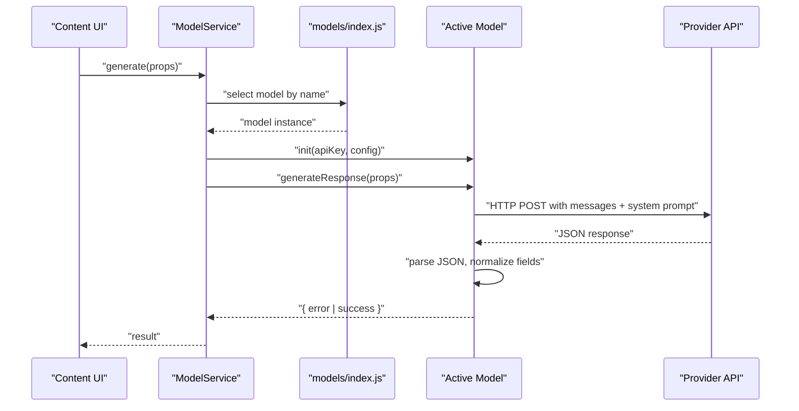

**Diagram sources**
- [src/content/content.jsx](file://src/content/content.jsx#L122-L217)
- [src/services/ModelService.js](file://src/services/ModelService.js#L16-L21)
- [src/models/index.js](file://src/models/index.js#L13-L19)
- [src/models/model/GroqModel.js](file://src/models/model/GroqModel.js#L25-L67)
- [src/models/model/GeminiFlash.js](file://src/models/model/GeminiFlash.js#L28-L97)
- [src/models/model/GeminiAI_1_5_pro.js](file://src/models/model/GeminiAI_1_5_pro.js#L42-L84)
- [src/models/model/GenericOpenAI.js](file://src/models/model/GenericOpenAI.js#L17-L58)

## Detailed Component Analysis

### Groq Integration
- Request format:
  - Endpoint: chat completions compatible with OpenAI-style API.
  - Headers: Authorization Bearer and Content-Type JSON.
  - Body: model identifier, messages array, and response_format set to JSON object.
- Message transformation:
  - System prompt is prepended with a schema note instructing JSON output.
  - Messages are mapped: assistant becomes assistant, others become user; content is stringified if not already a string.
  - Final user prompt is appended as the last message.
- Response processing:
  - On HTTP OK, extracts the assistant’s content and attempts JSON parsing.
  - On HTTP error, returns a normalized error object with status and message.
  - On exceptions, returns an error with a generic message.
- Output normalization:
  - Returns an object with either error or success, where success contains the parsed JSON or a fallback object with feedback.

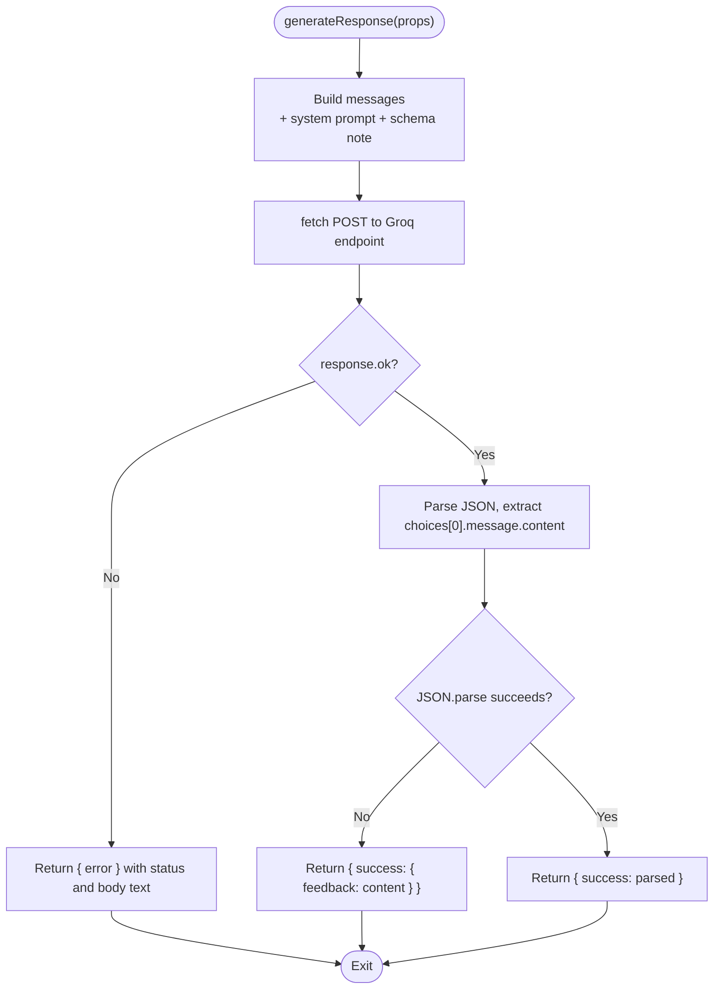

**Diagram sources**
- [src/models/model/GroqModel.js](file://src/models/model/GroqModel.js#L25-L67)

**Section sources**
- [src/models/model/GroqModel.js](file://src/models/model/GroqModel.js#L1-L69)

### Google Gemini Integration (Flash and 1.5 Pro)
- Request format:
  - Endpoint: generateContent with API key query param.
  - Body: contents array with role mapping (assistant -> model, others -> user), system_instruction parts with schema note, and generationConfig specifying JSON response with schema.
- Message transformation:
  - Same role mapping and content formatting as Groq.
  - System instruction is constructed from the provided system prompt plus schema note.
- Response processing:
  - On HTTP OK, extracts candidates[0].content.parts[0].text and attempts JSON parsing.
  - On HTTP error, parses the error payload to detect common HTTP statuses and constructs a friendly message; includes rate limit retry hints when available.
  - On exceptions, returns a generic error.
- Output normalization:
  - Returns an object with either error or success, where success contains the parsed JSON or a fallback object with feedback.

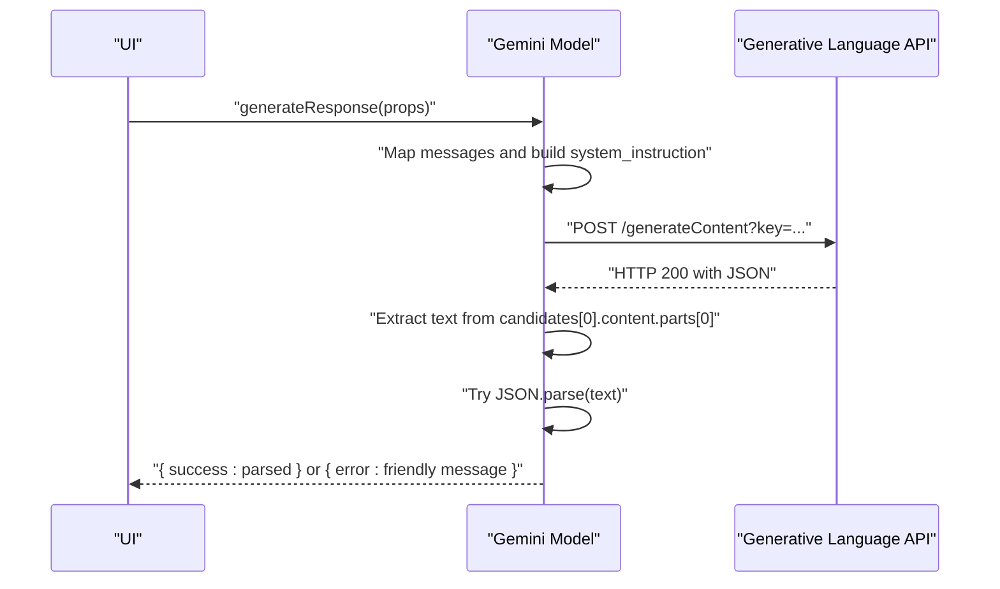

**Diagram sources**
- [src/models/model/GeminiFlash.js](file://src/models/model/GeminiFlash.js#L28-L97)
- [src/models/model/GeminiAI_1_5_pro.js](file://src/models/model/GeminiAI_1_5_pro.js#L42-L84)

**Section sources**
- [src/models/model/GeminiFlash.js](file://src/models/model/GeminiFlash.js#L1-L99)
- [src/models/model/GeminiAI_1_5_pro.js](file://src/models/model/GeminiAI_1_5_pro.js#L1-L85)

### Custom OpenAI-Compatible API
- Request format:
  - Endpoint: configurable base URL with /chat/completions path.
  - Headers: Authorization Bearer and Content-Type JSON.
  - Body: model name, messages array, and response_format set to JSON object.
- Message transformation:
  - Same as Groq: system prompt + schema note, role mapping, and content formatting.
- Response processing:
  - On HTTP OK, extracts the assistant’s content and attempts JSON parsing.
  - On HTTP error, returns a normalized error object with status and body text.
  - On exceptions, returns a generic error.
- Output normalization:
  - Returns an object with either error or success, where success contains the parsed JSON or a fallback object with feedback.

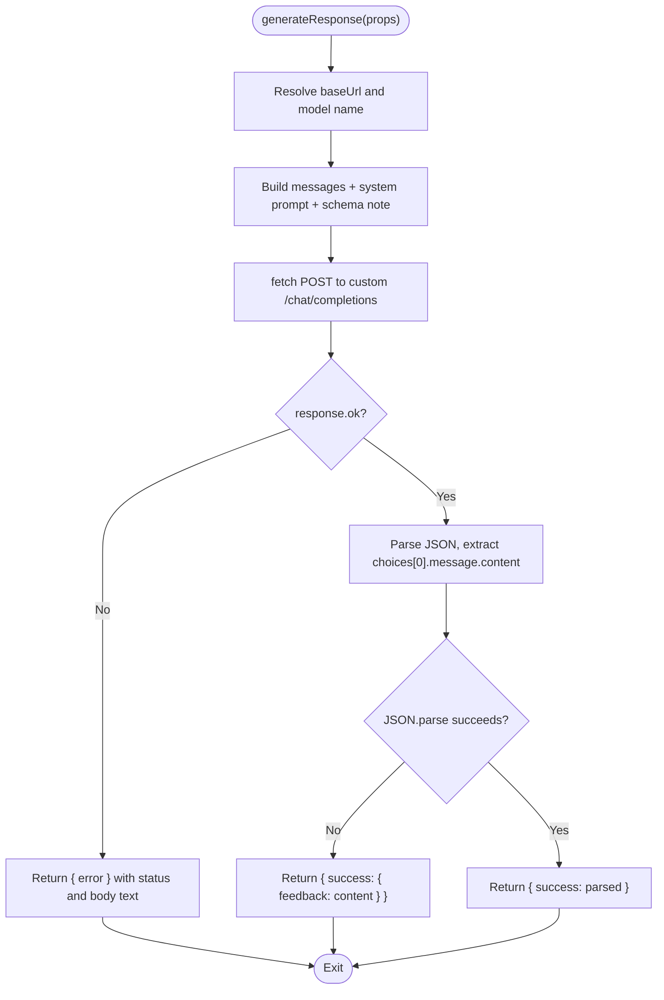

**Diagram sources**
- [src/models/model/GenericOpenAI.js](file://src/models/model/GenericOpenAI.js#L17-L58)

**Section sources**
- [src/models/model/GenericOpenAI.js](file://src/models/model/GenericOpenAI.js#L1-L60)

### Model Selection and Initialization
- ModelService selects a model by name, initializes it with an API key and optional configuration, and delegates generation to the active model.
- The model registry maps logical names to concrete implementations, including a factory for Groq models that sets the model name dynamically.

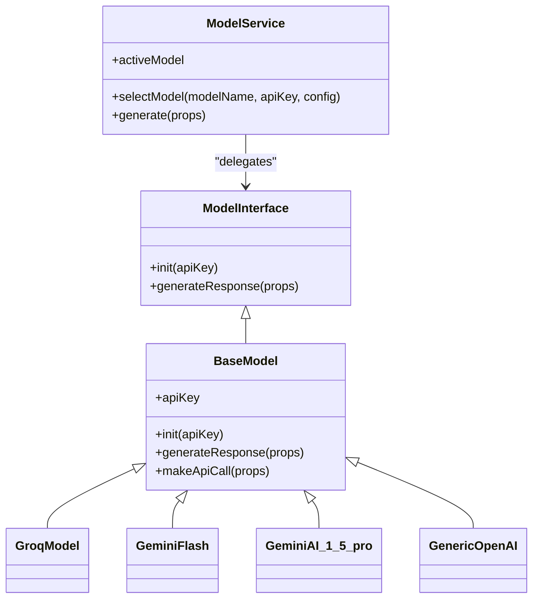

**Diagram sources**
- [src/services/ModelService.js](file://src/services/ModelService.js#L4-L21)
- [src/interface/ModelInterface.js](file://src/interface/ModelInterface.js#L12-L17)
- [src/models/BaseModel.js](file://src/models/BaseModel.js#L3-L16)
- [src/models/model/GroqModel.js](file://src/models/model/GroqModel.js#L17-L23)
- [src/models/model/GeminiFlash.js](file://src/models/model/GeminiFlash.js#L20-L26)
- [src/models/model/GeminiAI_1_5_pro.js](file://src/models/model/GeminiAI_1_5_pro.js#L34-L40)
- [src/models/model/GenericOpenAI.js](file://src/models/model/GenericOpenAI.js#L5-L15)

**Section sources**
- [src/services/ModelService.js](file://src/services/ModelService.js#L1-L22)
- [src/models/BaseModel.js](file://src/models/BaseModel.js#L1-L17)
- [src/interface/ModelInterface.js](file://src/interface/ModelInterface.js#L1-L18)
- [src/models/index.js](file://src/models/index.js#L6-L11)

### Message Transformation and System Prompt Injection
- System prompt injection:
  - The system prompt template is injected into provider requests. For Gemini, it is placed in system_instruction.parts[]. For Groq and custom APIs, it is included as a system message.
  - A schema note is appended to enforce JSON output with specific fields.
- Role mapping:
  - Assistant messages are mapped to provider-specific assistant/model roles.
  - Other messages are mapped to user roles.
- Content formatting:
  - Non-string content is stringified to ensure compatibility with provider message bodies.
- Chat history truncation:
  - The UI sends only the last N messages to reduce token usage and stay within free-tier limits.

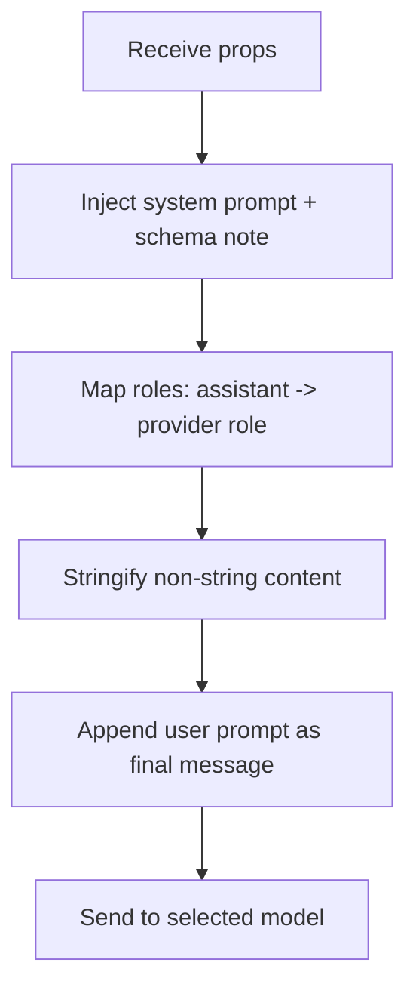

**Diagram sources**
- [src/models/model/GroqModel.js](file://src/models/model/GroqModel.js#L30-L37)
- [src/models/model/GeminiFlash.js](file://src/models/model/GeminiFlash.js#L45-L54)
- [src/models/model/GeminiAI_1_5_pro.js](file://src/models/model/GeminiAI_1_5_pro.js#L59-L63)
- [src/models/model/GenericOpenAI.js](file://src/models/model/GenericOpenAI.js#L21-L28)
- [src/constants/prompt.js](file://src/constants/prompt.js#L1-L51)
- [src/content/content.jsx](file://src/content/content.jsx#L142-L150)

**Section sources**
- [src/constants/prompt.js](file://src/constants/prompt.js#L1-L51)
- [src/models/model/GroqModel.js](file://src/models/model/GroqModel.js#L30-L37)
- [src/models/model/GeminiFlash.js](file://src/models/model/GeminiFlash.js#L45-L54)
- [src/models/model/GeminiAI_1_5_pro.js](file://src/models/model/GeminiAI_1_5_pro.js#L59-L63)
- [src/models/model/GenericOpenAI.js](file://src/models/model/GenericOpenAI.js#L21-L28)
- [src/content/content.jsx](file://src/content/content.jsx#L142-L150)

### Output Schema Specification and Parsing
- Expected fields:
  - feedback: required string.
  - hints: optional array of up to two strings.
  - snippet: optional code snippet string.
  - programmingLanguage: optional enum of supported languages.
- Validation:
  - The Zod schema enforces the structure and constraints.
- Parsing strategy:
  - Providers are instructed to return JSON objects matching the schema.
  - On parsing failure, a fallback object with feedback is used to preserve usability.

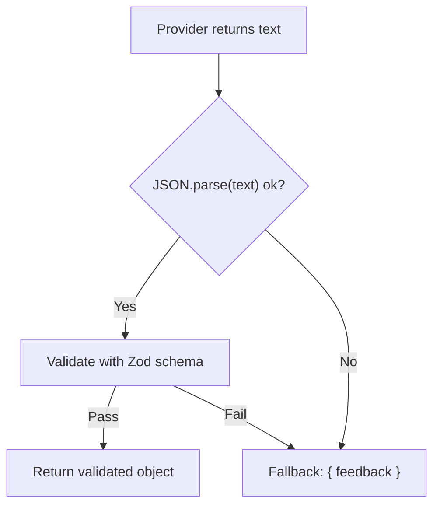

**Diagram sources**
- [src/schema/modelOutput.js](file://src/schema/modelOutput.js#L9-L14)
- [src/models/model/GroqModel.js](file://src/models/model/GroqModel.js#L60-L63)
- [src/models/model/GeminiFlash.js](file://src/models/model/GeminiFlash.js#L89-L93)
- [src/models/model/GeminiAI_1_5_pro.js](file://src/models/model/GeminiAI_1_5_pro.js#L78-L80)
- [src/models/model/GenericOpenAI.js](file://src/models/model/GenericOpenAI.js#L51-L54)

**Section sources**
- [src/schema/modelOutput.js](file://src/schema/modelOutput.js#L1-L14)
- [src/models/model/GroqModel.js](file://src/models/model/GroqModel.js#L60-L63)
- [src/models/model/GeminiFlash.js](file://src/models/model/GeminiFlash.js#L89-L93)
- [src/models/model/GeminiAI_1_5_pro.js](file://src/models/model/GeminiAI_1_5_pro.js#L78-L80)
- [src/models/model/GenericOpenAI.js](file://src/models/model/GenericOpenAI.js#L51-L54)

### Error Handling Strategies
- Provider-specific error handling:
  - Groq: returns a normalized error with HTTP status and body text.
  - Gemini: parses error payloads to detect common HTTP codes and constructs friendly messages; includes rate limit retry hints when available.
  - Custom: returns a normalized error with HTTP status and body text.
- UI-level error handling:
  - The content script detects rate limit messages and starts a countdown timer.
  - Errors are saved to chat history and displayed to the user.

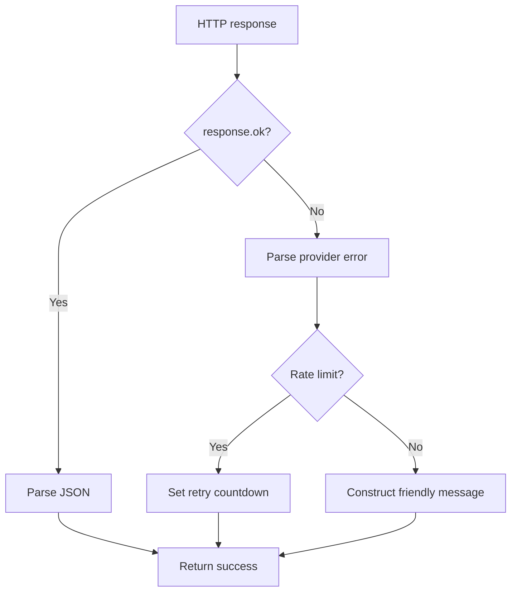

**Diagram sources**
- [src/models/model/GroqModel.js](file://src/models/model/GroqModel.js#L52-L55)
- [src/models/model/GeminiFlash.js](file://src/models/model/GeminiFlash.js#L62-L84)
- [src/models/model/GeminiAI_1_5_pro.js](file://src/models/model/GeminiAI_1_5_pro.js#L71-L74)
- [src/models/model/GenericOpenAI.js](file://src/models/model/GenericOpenAI.js#L43-L46)
- [src/content/content.jsx](file://src/content/content.jsx#L183-L197)

**Section sources**
- [src/models/model/GroqModel.js](file://src/models/model/GroqModel.js#L52-L55)
- [src/models/model/GeminiFlash.js](file://src/models/model/GeminiFlash.js#L62-L84)
- [src/models/model/GeminiAI_1_5_pro.js](file://src/models/model/GeminiAI_1_5_pro.js#L71-L74)
- [src/models/model/GenericOpenAI.js](file://src/models/model/GenericOpenAI.js#L43-L46)
- [src/content/content.jsx](file://src/content/content.jsx#L183-L197)

### Rate Limiting and Retry Logic
- Detection and messaging:
  - Gemini models parse rate limit errors and extract retry delays when available.
  - UI parses retry hints from error messages and starts a countdown.
- Practical effect:
  - The UI disables input and displays a countdown to prevent further requests until the cooldown ends.

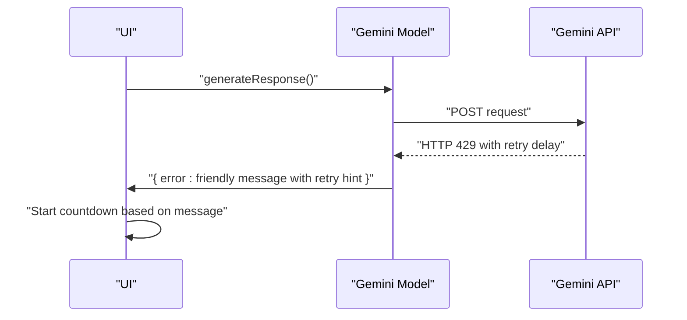

**Diagram sources**
- [src/models/model/GeminiFlash.js](file://src/models/model/GeminiFlash.js#L69-L72)
- [src/content/content.jsx](file://src/content/content.jsx#L183-L187)

**Section sources**
- [src/models/model/GeminiFlash.js](file://src/models/model/GeminiFlash.js#L69-L72)
- [src/content/content.jsx](file://src/content/content.jsx#L183-L187)

### Model Output Schema Definition
- Fields and constraints:
  - feedback: required string.
  - hints: optional array of strings with a maximum length of two.
  - snippet: optional string.
  - programmingLanguage: optional enum constrained to a predefined list of supported languages.
- Purpose:
  - Ensures consistent response structure across providers and simplifies UI rendering.

**Section sources**
- [src/schema/modelOutput.js](file://src/schema/modelOutput.js#L9-L14)

### Model Registry and Valid Models
- Registry:
  - Logical names map to concrete model instances; Groq uses a factory to set the model name dynamically.
- Valid models:
  - Lists supported model identifiers for Groq and Gemini, and marks the custom model as openai-compatible.

**Section sources**
- [src/models/index.js](file://src/models/index.js#L13-L19)
- [src/constants/valid_models.js](file://src/constants/valid_models.js#L1-L12)

## Dependency Analysis
The following diagram shows how components depend on each other and how the content script interacts with the model layer.

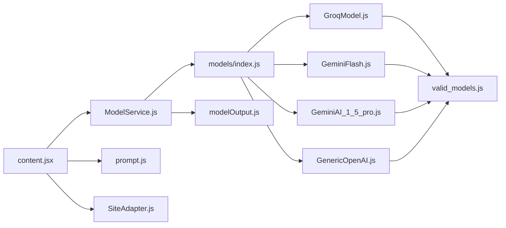

**Diagram sources**
- [src/content/content.jsx](file://src/content/content.jsx#L1-L760)
- [src/services/ModelService.js](file://src/services/ModelService.js#L1-L22)
- [src/models/index.js](file://src/models/index.js#L1-L19)
- [src/models/model/GroqModel.js](file://src/models/model/GroqModel.js#L1-L69)
- [src/models/model/GeminiFlash.js](file://src/models/model/GeminiFlash.js#L1-L99)
- [src/models/model/GeminiAI_1_5_pro.js](file://src/models/model/GeminiAI_1_5_pro.js#L1-L85)
- [src/models/model/GenericOpenAI.js](file://src/models/model/GenericOpenAI.js#L1-L60)
- [src/constants/valid_models.js](file://src/constants/valid_models.js#L1-L12)
- [src/constants/prompt.js](file://src/constants/prompt.js#L1-L51)
- [src/content/adapters/SiteAdapter.js](file://src/content/adapters/SiteAdapter.js#L1-L28)
- [src/schema/modelOutput.js](file://src/schema/modelOutput.js#L1-L14)

**Section sources**
- [src/content/content.jsx](file://src/content/content.jsx#L1-L760)
- [src/services/ModelService.js](file://src/services/ModelService.js#L1-L22)
- [src/models/index.js](file://src/models/index.js#L1-L19)
- [src/models/model/GroqModel.js](file://src/models/model/GroqModel.js#L1-L69)
- [src/models/model/GeminiFlash.js](file://src/models/model/GeminiFlash.js#L1-L99)
- [src/models/model/GeminiAI_1_5_pro.js](file://src/models/model/GeminiAI_1_5_pro.js#L1-L85)
- [src/models/model/GenericOpenAI.js](file://src/models/model/GenericOpenAI.js#L1-L60)
- [src/constants/valid_models.js](file://src/constants/valid_models.js#L1-L12)
- [src/constants/prompt.js](file://src/constants/prompt.js#L1-L51)
- [src/content/adapters/SiteAdapter.js](file://src/content/adapters/SiteAdapter.js#L1-L28)
- [src/schema/modelOutput.js](file://src/schema/modelOutput.js#L1-L14)

## Performance Considerations
- Token and message limits:
  - The UI truncates long user code and limits the number of prior messages sent to the model to avoid exceeding free-tier token budgets.
- Request batching and retries:
  - There is no explicit retry loop in the current implementation. Rate limiting is handled by UI-level cooldowns.
- Network efficiency:
  - Using JSON object responses from providers reduces ambiguity and parsing overhead.
- Rendering:
  - UI defers heavy rendering tasks and uses incremental loading for chat history.

**Section sources**
- [src/content/content.jsx](file://src/content/content.jsx#L137-L150)
- [src/models/model/GroqModel.js](file://src/models/model/GroqModel.js#L48-L49)
- [src/models/model/GeminiFlash.js](file://src/models/model/GeminiFlash.js#L50-L53)
- [src/models/model/GeminiAI_1_5_pro.js](file://src/models/model/GeminiAI_1_5_pro.js#L60-L63)
- [src/models/model/GenericOpenAI.js](file://src/models/model/GenericOpenAI.js#L36-L40)

## Troubleshooting Guide
- Missing model or API key:
  - The service throws an error if a model is not found or if no model is selected before generating a response.
- Provider errors:
  - Groq: returns HTTP status and body text.
  - Gemini: parses structured errors and provides friendly messages; includes rate limit hints.
  - Custom: returns HTTP status and body text.
- UI behavior:
  - On rate limit errors, the UI starts a countdown and disables input.
  - Errors are persisted to chat history for visibility.

**Section sources**
- [src/services/ModelService.js](file://src/services/ModelService.js#L11-L14)
- [src/services/ModelService.js](file://src/services/ModelService.js#L17-L19)
- [src/models/model/GroqModel.js](file://src/models/model/GroqModel.js#L52-L55)
- [src/models/model/GeminiFlash.js](file://src/models/model/GeminiFlash.js#L62-L84)
- [src/models/model/GeminiAI_1_5_pro.js](file://src/models/model/GeminiAI_1_5_pro.js#L71-L74)
- [src/models/model/GenericOpenAI.js](file://src/models/model/GenericOpenAI.js#L43-L46)
- [src/content/content.jsx](file://src/content/content.jsx#L183-L197)

## Conclusion
DSABuddy implements a consistent, extensible pattern for interacting with multiple AI providers. By injecting a structured system prompt, transforming messages to provider-specific formats, enforcing JSON responses, and normalizing errors, the extension ensures reliable and user-friendly interactions. The UI mitigates rate limits and token usage, while the schema validates outputs. Extending support to additional providers involves implementing a new model class that adheres to the established interface and response format.