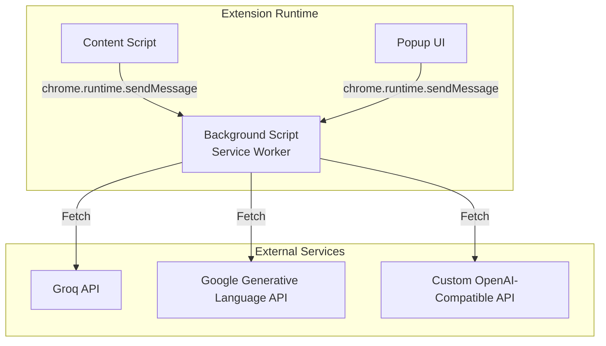
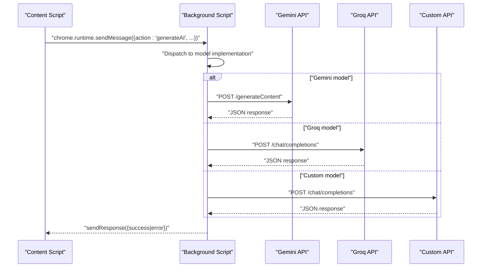
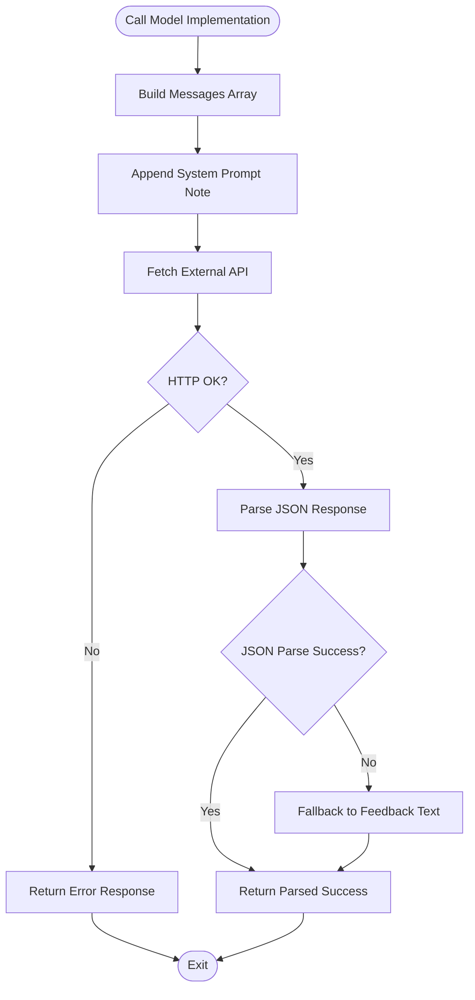
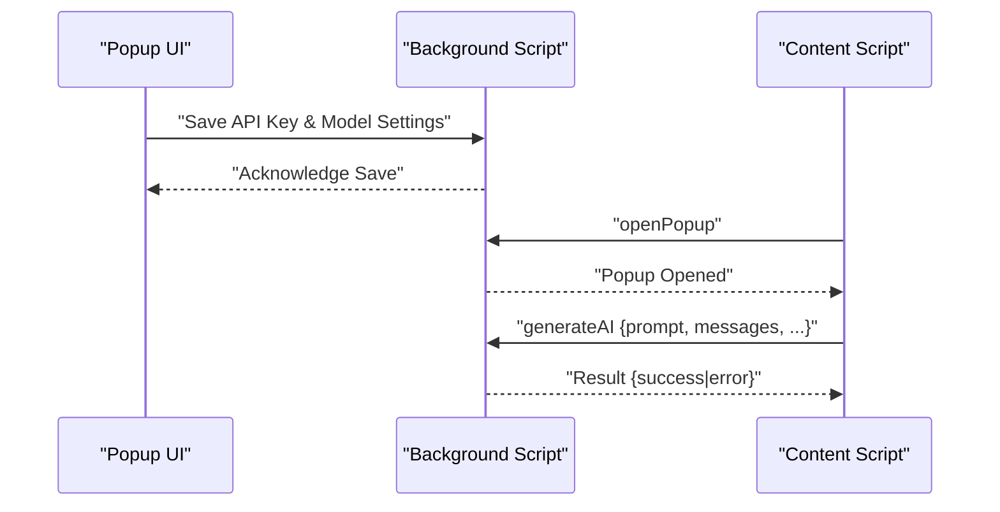
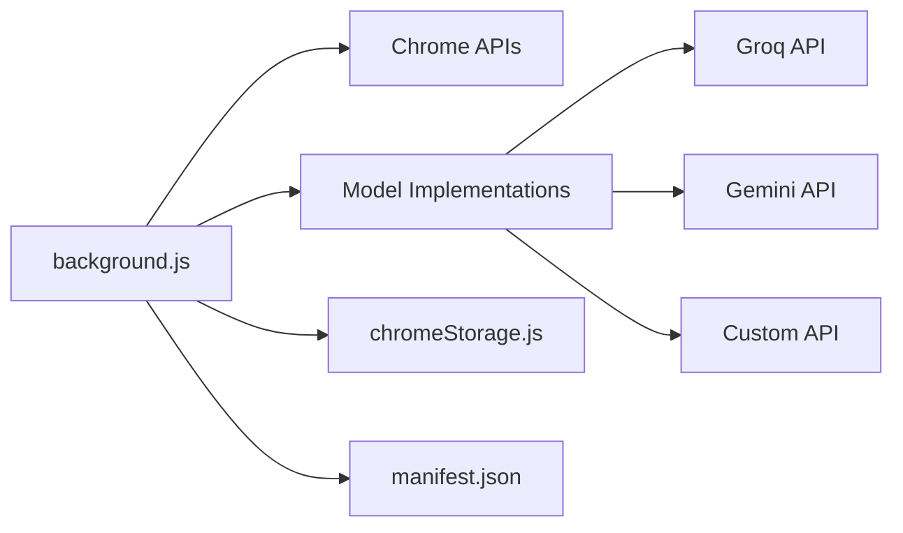

# Background Script Architecture

<cite>
**Referenced Files in This Document**
- [background.js](file://src/background.js)
- [manifest.json](file://manifest.json)
- [chromeStorage.js](file://src/lib/chromeStorage.js)
- [ModelService.js](file://src/services/ModelService.js)
- [models/index.js](file://src/models/index.js)
- [content.jsx](file://src/content/content.jsx)
- [App.jsx](file://src/App.jsx)
- [valid_models.js](file://src/constants/valid_models.js)
- [prompt.js](file://src/constants/prompt.js)
- [postbuild.js](file://src/scripts/postbuild.js)
</cite>

## Table of Contents
1. [Introduction](#introduction)
2. [Project Structure](#project-structure)
3. [Core Components](#core-components)
4. [Architecture Overview](#architecture-overview)
5. [Detailed Component Analysis](#detailed-component-analysis)
6. [Dependency Analysis](#dependency-analysis)
7. [Performance Considerations](#performance-considerations)
8. [Security Considerations](#security-considerations)
9. [Troubleshooting Guide](#troubleshooting-guide)
10. [Conclusion](#conclusion)

## Introduction
This document explains DSABuddy's background script architecture and its role as the central coordinator for AI API requests and extension-wide state management. The background script handles Chrome extension messaging via chrome.runtime.onMessage.addListener, orchestrates AI model calls to external APIs (Groq, Gemini, and custom OpenAI-compatible endpoints), manages asynchronous execution, and coordinates with the popup UI and content scripts. It also documents the message handling system, supported actions, request/response patterns, error handling strategies, and security considerations for API key handling and cross-origin communication.

## Project Structure
The background script is implemented as a service worker module and integrates with the popup UI and content scripts through Chrome extension messaging. Key elements:
- Background script: Handles AI model dispatch and API calls
- Manifest: Declares permissions, host permissions, and service worker registration
- Storage utilities: Persist and retrieve API keys and model selections
- Models registry: Maps model names to concrete model implementations
- Content script: Initiates AI generation requests and opens the popup
- Popup UI: Collects user preferences and API keys

**Diagram sources**
- [background.js](file://src/background.js#L127-L156)
- [manifest.json](file://manifest.json#L45-L48)
- [content.jsx](file://src/content/content.jsx#L652-L654)
- [App.jsx](file://src/App.jsx#L33-L54)

**Section sources**
- [manifest.json](file://manifest.json#L45-L48)
- [postbuild.js](file://src/scripts/postbuild.js#L122-L123)

## Core Components
- Background script handler: Listens for messages, routes to appropriate AI model, and responds asynchronously
- Model implementations: Encapsulate API-specific request construction and response parsing
- Storage utilities: Manage API keys and model selection persistence
- Message routing: Supports actions for opening the popup and generating AI responses
- Popup UI: Provides configuration for API keys and model selection
- Content script: Initiates actions and displays contextual UI

**Section sources**
- [background.js](file://src/background.js#L127-L156)
- [chromeStorage.js](file://src/lib/chromeStorage.js#L1-L36)
- [content.jsx](file://src/content/content.jsx#L652-L654)
- [App.jsx](file://src/App.jsx#L33-L54)

## Architecture Overview
The background script acts as the central coordinator:
- Receives messages from the popup and content scripts
- Validates and routes requests to the appropriate model implementation
- Executes asynchronous fetch calls to external AI APIs
- Parses responses and returns structured results to the caller
- Manages extension-wide state via Chrome storage

**Diagram sources**
- [background.js](file://src/background.js#L133-L151)
- [background.js](file://src/background.js#L46-L83)
- [background.js](file://src/background.js#L7-L44)
- [background.js](file://src/background.js#L85-L123)

## Detailed Component Analysis

### Background Script Message Handler
The background script registers a listener for chrome.runtime.onMessage. It supports two primary actions:
- openPopup: Attempts to open the extension popup
- generateAI: Executes AI model inference with structured request parameters

Asynchronous execution model:
- The generateAI branch creates an internal async function to process the request
- Returns true to keep the message channel open until sendResponse is invoked
- Uses Promise-based fetch calls for external API interactions
- Ensures errors are captured and returned in a standardized format

Request/response pattern:
- Request shape includes: modelName, apiKey, config, prompt, systemPrompt, messages
- Response shape: { success: object | null, error: object | null }
- On success, returns parsed JSON payload conforming to the expected schema
- On failure, returns an error object with a descriptive message

Error handling strategies:
- Catches network and parsing errors for each model implementation
- Wraps unexpected errors with a background error prefix
- Returns structured error responses to maintain consistent contract

Message channel management:
- Keeps channel open for asynchronous responses by returning true
- Ensures sendResponse is called exactly once per message lifecycle

**Section sources**
- [background.js](file://src/background.js#L127-L156)

### Model Implementations
The background script includes three model implementations:
- Groq: Calls /chat/completions with Bearer token authorization
- Gemini: Calls /generateContent with API key query parameter and system instruction
- Custom: Accepts configurable base URL and model name, sends OpenAI-compatible request

Processing logic:
- Constructs messages array with role normalization and content serialization
- Adds system prompt note to enforce JSON response format
- Parses response content and falls back to raw text if JSON parsing fails
- Returns standardized success/error structure

**Diagram sources**
- [background.js](file://src/background.js#L7-L44)
- [background.js](file://src/background.js#L46-L83)
- [background.js](file://src/background.js#L85-L123)

**Section sources**
- [background.js](file://src/background.js#L7-L123)

### Extension State Management
The background script coordinates state via Chrome storage utilities:
- Storage key mapping: Groq models share the same storage key for simplicity
- Persistence: Stores API key, base URL, and custom model name per selected model
- Selection: Tracks the currently selected model for UI and request routing

Integration points:
- Popup UI loads stored values and updates them on save
- Content script checks for model and API key presence before enabling chat features

**Section sources**
- [chromeStorage.js](file://src/lib/chromeStorage.js#L1-L36)
- [App.jsx](file://src/App.jsx#L56-L87)
- [content.jsx](file://src/content/content.jsx#L642-L695)

### Messaging Between Components
Communication flow:
- Content script initiates actions by sending messages to the background script
- Popup UI triggers configuration actions and can request popup opening
- Background script executes model logic and returns results to the caller

**Diagram sources**
- [App.jsx](file://src/App.jsx#L33-L54)
- [content.jsx](file://src/content/content.jsx#L652-L654)
- [background.js](file://src/background.js#L127-L156)

**Section sources**
- [content.jsx](file://src/content/content.jsx#L652-L654)
- [App.jsx](file://src/App.jsx#L33-L54)

### Model Registry and Selection
The models registry maps model names to concrete implementations:
- Groq models reuse a single class with runtime model ID selection
- Gemini models use dedicated classes for specific variants
- Custom model uses a generic OpenAI-compatible adapter

Selection flow:
- Popup UI presents available models
- Selected model is persisted and used by the content script
- Background script resolves the correct implementation based on the model name

**Section sources**
- [models/index.js](file://src/models/index.js#L1-L19)
- [valid_models.js](file://src/constants/valid_models.js#L1-L12)
- [App.jsx](file://src/App.jsx#L89-L99)

## Dependency Analysis
The background script depends on:
- Chrome extension APIs for messaging and action management
- External AI APIs for inference
- Storage utilities for state persistence
- Model implementations for request construction and response parsing

**Diagram sources**
- [background.js](file://src/background.js#L127-L156)
- [chromeStorage.js](file://src/lib/chromeStorage.js#L1-L36)
- [manifest.json](file://manifest.json#L45-L48)

**Section sources**
- [background.js](file://src/background.js#L127-L156)
- [chromeStorage.js](file://src/lib/chromeStorage.js#L1-L36)
- [manifest.json](file://manifest.json#L29-L40)

## Performance Considerations
- Asynchronous execution: All model calls use async/await to prevent blocking the UI thread
- Minimal background work: Model implementations are self-contained to reduce overhead
- Efficient message handling: Returning true keeps channels open only while necessary
- Memory management: Avoid retaining references to large message payloads after processing
- Network efficiency: Responses are parsed once and returned in a compact structure
- Build optimization: Post-build script ensures content and background scripts are self-contained

[No sources needed since this section provides general guidance]

## Security Considerations
- API key handling: Keys are stored in Chrome storage and retrieved per model selection; ensure proper key scoping and avoid logging sensitive data
- Cross-origin communication: Host permissions are declared for external AI APIs; restrict URLs to only those necessary
- Authorization headers: API keys are sent via Authorization headers; ensure HTTPS endpoints are used
- Input sanitization: Normalize message roles and serialize content to prevent injection issues
- Error containment: Wrap all external calls in try/catch blocks and return sanitized error messages

**Section sources**
- [chromeStorage.js](file://src/lib/chromeStorage.js#L1-L36)
- [manifest.json](file://manifest.json#L29-L40)
- [background.js](file://src/background.js#L18-L28)
- [background.js](file://src/background.js#L59-L69)
- [background.js](file://src/background.js#L97-L107)

## Troubleshooting Guide
Common issues and resolutions:
- Popup does not open: Verify the openPopup action is triggered and the extension action is configured
- No API key found: Ensure the popup saves the API key and model selection; check storage retrieval logic
- Model not implemented: Confirm the model name matches one of the supported variants
- Network errors: Check host permissions and endpoint availability; inspect error messages for HTTP status codes
- JSON parsing failures: Validate that the external API returns JSON-formatted responses

Diagnostic tips:
- Inspect message channel lifecycle by ensuring sendResponse is called once per message
- Log request shapes before dispatch to verify required fields are present
- Test individual model endpoints independently to isolate issues

**Section sources**
- [background.js](file://src/background.js#L127-L156)
- [App.jsx](file://src/App.jsx#L33-L54)
- [content.jsx](file://src/content/content.jsx#L642-L695)

## Conclusion
DSABuddy’s background script serves as the central coordinator for AI API requests and extension-wide state management. Through a robust message handling system, it routes requests to model implementations, manages asynchronous execution, and maintains consistent error handling. By leveraging Chrome storage for state persistence and carefully managing cross-origin communication, it provides a secure and efficient foundation for the extension’s AI-powered features.