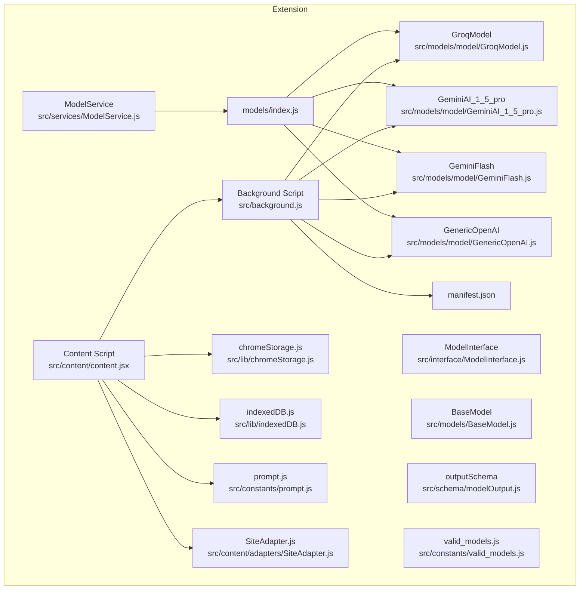
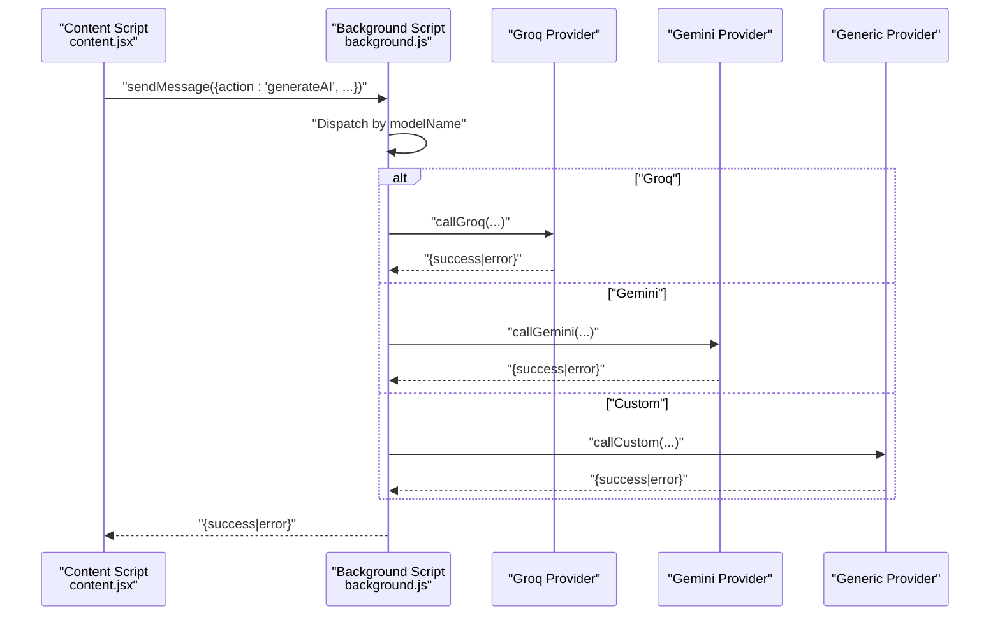
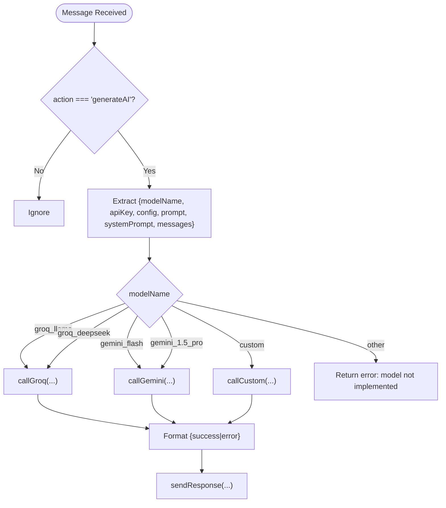
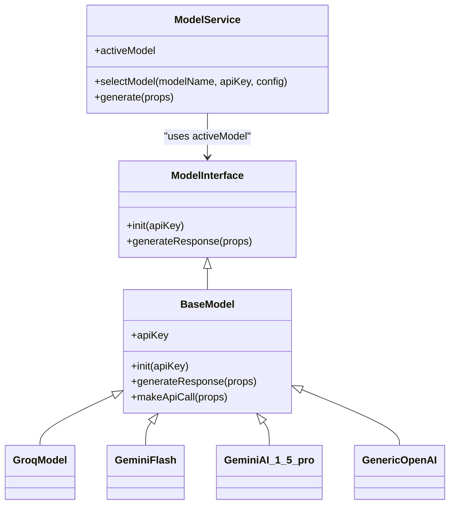
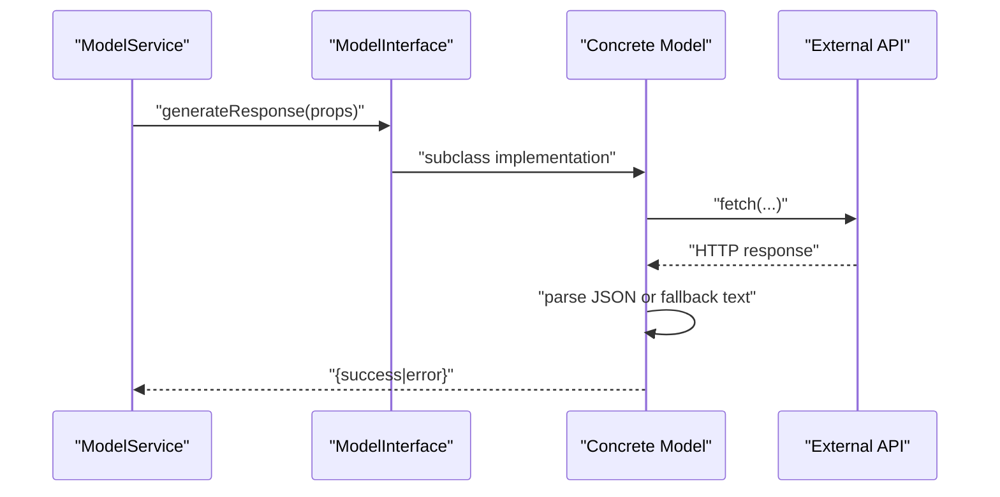
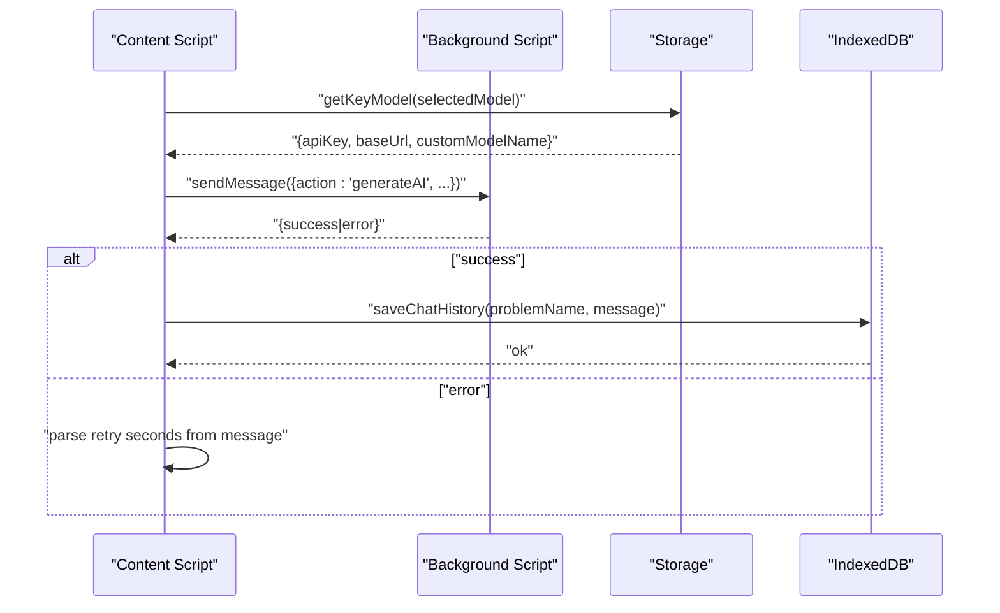
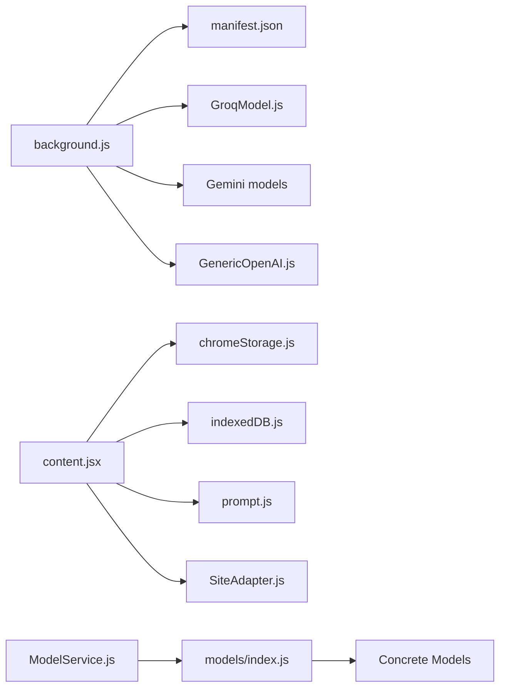

# Background Script and API Communication

<cite>
**Referenced Files in This Document**
- [background.js](file://src/background.js)
- [ModelService.js](file://src/services/ModelService.js)
- [index.js](file://src/models/index.js)
- [BaseModel.js](file://src/models/BaseModel.js)
- [GeminiAI_1_5_pro.js](file://src/models/model/GeminiAI_1_5_pro.js)
- [GeminiFlash.js](file://src/models/model/GeminiFlash.js)
- [GroqModel.js](file://src/models/model/GroqModel.js)
- [GenericOpenAI.js](file://src/models/model/GenericOpenAI.js)
- [ModelInterface.js](file://src/interface/ModelInterface.js)
- [modelOutput.js](file://src/schema/modelOutput.js)
- [valid_models.js](file://src/constants/valid_models.js)
- [chromeStorage.js](file://src/lib/chromeStorage.js)
- [content.jsx](file://src/content/content.jsx)
- [SiteAdapter.js](file://src/content/adapters/SiteAdapter.js)
- [prompt.js](file://src/constants/prompt.js)
- [indexedDB.js](file://src/lib/indexedDB.js)
- [manifest.json](file://manifest.json)
</cite>

## Table of Contents
1. [Introduction](#introduction)
2. [Project Structure](#project-structure)
3. [Core Components](#core-components)
4. [Architecture Overview](#architecture-overview)
5. [Detailed Component Analysis](#detailed-component-analysis)
6. [Dependency Analysis](#dependency-analysis)
7. [Performance Considerations](#performance-considerations)
8. [Security and Reliability](#security-and-reliability)
9. [Cross-Extension Communication](#cross-extension-communication)
10. [Troubleshooting Guide](#troubleshooting-guide)
11. [Conclusion](#conclusion)

## Introduction
This document explains DSABuddy’s background script architecture and AI API communication system. The background script acts as the central coordinator for AI API requests, response processing, and extension-wide state management. It routes content-script requests to provider-specific APIs (Groq, Google Gemini, and custom OpenAI-compatible endpoints), parses standardized JSON responses, and manages extension state such as selected model and stored credentials. The document also covers the ModelService abstraction for centralized model management, runtime model switching, the model output schema, error handling strategies, and practical guidance for security, rate limiting, and performance optimization.

## Project Structure
DSABuddy is organized around a service-worker background script, a content script that interacts with web pages, and a set of model implementations that encapsulate provider-specific API logic. The extension manifest defines permissions and host permissions for external APIs.

**Diagram sources**
- [background.js](file://src/background.js#L1-L156)
- [content.jsx](file://src/content/content.jsx#L1-L760)
- [ModelService.js](file://src/services/ModelService.js#L1-L22)
- [index.js](file://src/models/index.js#L1-L19)
- [BaseModel.js](file://src/models/BaseModel.js#L1-L17)
- [GeminiAI_1_5_pro.js](file://src/models/model/GeminiAI_1_5_pro.js#L1-L85)
- [GeminiFlash.js](file://src/models/model/GeminiFlash.js#L1-L99)
- [GroqModel.js](file://src/models/model/GroqModel.js#L1-L69)
- [GenericOpenAI.js](file://src/models/model/GenericOpenAI.js#L1-L60)
- [modelOutput.js](file://src/schema/modelOutput.js#L1-L14)
- [valid_models.js](file://src/constants/valid_models.js#L1-L12)
- [chromeStorage.js](file://src/lib/chromeStorage.js#L1-L36)
- [indexedDB.js](file://src/lib/indexedDB.js#L1-L38)
- [prompt.js](file://src/constants/prompt.js#L1-L51)
- [SiteAdapter.js](file://src/content/adapters/SiteAdapter.js#L1-L28)
- [manifest.json](file://manifest.json#L1-L74)

**Section sources**
- [background.js](file://src/background.js#L1-L156)
- [content.jsx](file://src/content/content.jsx#L1-L760)
- [manifest.json](file://manifest.json#L1-L74)

## Core Components
- Background Script: Receives content-script messages, selects the appropriate provider, invokes provider-specific API functions, and returns structured results.
- ModelService: Centralized model selection and generation interface used by the UI to switch models and trigger generation.
- Model Implementations: Provider-specific classes implementing the ModelInterface contract, handling API calls, response parsing, and error translation.
- Output Schema: Zod schema validating the standardized JSON response structure.
- Storage Utilities: Chrome storage helpers for persisting keys, base URLs, and selected model.
- Content Script: Orchestrates user interactions, prepares prompts and chat history, and routes requests to the background script.

**Section sources**
- [background.js](file://src/background.js#L127-L156)
- [ModelService.js](file://src/services/ModelService.js#L1-L22)
- [ModelInterface.js](file://src/interface/ModelInterface.js#L1-L18)
- [BaseModel.js](file://src/models/BaseModel.js#L1-L17)
- [modelOutput.js](file://src/schema/modelOutput.js#L1-L14)
- [chromeStorage.js](file://src/lib/chromeStorage.js#L1-L36)
- [content.jsx](file://src/content/content.jsx#L1-L760)

## Architecture Overview
The extension follows a message-passing architecture:
- The content script listens for user actions and prepares the request payload.
- It sends a message to the background script via the messaging API.
- The background script performs the provider-specific API call, parses the response, and returns a standardized result.
- The content script updates the UI and persists chat history.

**Diagram sources**
- [content.jsx](file://src/content/content.jsx#L153-L181)
- [background.js](file://src/background.js#L127-L156)
- [GroqModel.js](file://src/models/model/GroqModel.js#L25-L67)
- [GeminiAI_1_5_pro.js](file://src/models/model/GeminiAI_1_5_pro.js#L42-L84)
- [GenericOpenAI.js](file://src/models/model/GenericOpenAI.js#L17-L58)

## Detailed Component Analysis

### Background Script Coordinator
Responsibilities:
- Message routing for AI generation requests.
- Provider dispatch based on model name.
- Standardized response formatting and error propagation.
- Direct provider API calls for Groq, Gemini, and custom endpoints.

Key behaviors:
- Accepts messages with action, model identifier, API key, configuration, prompt, system prompt, and chat history.
- Dispatches to provider-specific functions and returns a unified shape: { success, error }.
- Uses system prompt augmentation to enforce JSON output and schema expectations.

**Diagram sources**
- [background.js](file://src/background.js#L127-L156)
- [background.js](file://src/background.js#L7-L44)
- [background.js](file://src/background.js#L46-L83)
- [background.js](file://src/background.js#L85-L123)

**Section sources**
- [background.js](file://src/background.js#L1-L156)

### ModelService and Model Registry
ModelService provides a clean interface for selecting a model and generating responses. The registry maps logical model names to concrete implementations.

**Diagram sources**
- [ModelService.js](file://src/services/ModelService.js#L1-L22)
- [ModelInterface.js](file://src/interface/ModelInterface.js#L1-L18)
- [BaseModel.js](file://src/models/BaseModel.js#L1-L17)
- [GroqModel.js](file://src/models/model/GroqModel.js#L1-L69)
- [GeminiFlash.js](file://src/models/model/GeminiFlash.js#L1-L99)
- [GeminiAI_1_5_pro.js](file://src/models/model/GeminiAI_1_5_pro.js#L1-L85)
- [GenericOpenAI.js](file://src/models/model/GenericOpenAI.js#L1-L60)

**Section sources**
- [ModelService.js](file://src/services/ModelService.js#L1-L22)
- [index.js](file://src/models/index.js#L1-L19)
- [BaseModel.js](file://src/models/BaseModel.js#L1-L17)
- [ModelInterface.js](file://src/interface/ModelInterface.js#L1-L18)

### Provider Implementations
Provider-specific classes encapsulate:
- Model identification via the registry.
- Message construction aligned with provider formats.
- Request bodies with schema enforcement and JSON response hints.
- Robust error handling and friendly error messages.

Representative highlights:
- GroqModel: Builds OpenAI-compatible messages and enforces JSON response format.
- GeminiFlash and GeminiAI_1_5_pro: Use provider-specific content roles and generation configs; include schema enforcement and friendly error parsing.
- GenericOpenAI: Supports custom base URLs and model names for OpenAI-compatible APIs.

**Diagram sources**
- [ModelService.js](file://src/services/ModelService.js#L16-L21)
- [GroqModel.js](file://src/models/model/GroqModel.js#L25-L67)
- [GeminiFlash.js](file://src/models/model/GeminiFlash.js#L28-L97)
- [GeminiAI_1_5_pro.js](file://src/models/model/GeminiAI_1_5_pro.js#L42-L84)
- [GenericOpenAI.js](file://src/models/model/GenericOpenAI.js#L17-L58)

**Section sources**
- [GroqModel.js](file://src/models/model/GroqModel.js#L1-L69)
- [GeminiFlash.js](file://src/models/model/GeminiFlash.js#L1-L99)
- [GeminiAI_1_5_pro.js](file://src/models/model/GeminiAI_1_5_pro.js#L1-L85)
- [GenericOpenAI.js](file://src/models/model/GenericOpenAI.js#L1-L60)

### Model Output Schema and Validation
The standardized response schema ensures consistent output across providers:
- Required: feedback (string)
- Optional: hints (array of up to 2 strings), snippet (string), programmingLanguage (enum of supported languages)

Validation is performed using Zod to guarantee correctness before UI rendering.

**Section sources**
- [modelOutput.js](file://src/schema/modelOutput.js#L1-L14)

### Content Script Integration and Message Passing
The content script:
- Adapts page context (problem statements, user code, language) and constructs the system prompt.
- Limits chat history to recent messages and truncates long code to stay within token budgets.
- Sends a message to the background script and handles rate-limit hints to disable input temporarily.
- Persists chat history to IndexedDB and renders structured UI with collapsible hints and code blocks.

**Diagram sources**
- [content.jsx](file://src/content/content.jsx#L153-L217)
- [chromeStorage.js](file://src/lib/chromeStorage.js#L13-L35)
- [indexedDB.js](file://src/lib/indexedDB.js#L9-L31)

**Section sources**
- [content.jsx](file://src/content/content.jsx#L1-L760)
- [chromeStorage.js](file://src/lib/chromeStorage.js#L1-L36)
- [indexedDB.js](file://src/lib/indexedDB.js#L1-L38)

## Dependency Analysis
- The background script depends on provider-specific functions and the manifest’s host permissions.
- The content script depends on storage utilities, adapters, and IndexedDB for persistence.
- Model implementations depend on the registry and provider-specific constants.

**Diagram sources**
- [background.js](file://src/background.js#L1-L156)
- [content.jsx](file://src/content/content.jsx#L1-L760)
- [ModelService.js](file://src/services/ModelService.js#L1-L22)
- [index.js](file://src/models/index.js#L1-L19)
- [chromeStorage.js](file://src/lib/chromeStorage.js#L1-L36)
- [indexedDB.js](file://src/lib/indexedDB.js#L1-L38)
- [prompt.js](file://src/constants/prompt.js#L1-L51)
- [SiteAdapter.js](file://src/content/adapters/SiteAdapter.js#L1-L28)
- [manifest.json](file://manifest.json#L1-L74)

**Section sources**
- [background.js](file://src/background.js#L1-L156)
- [content.jsx](file://src/content/content.jsx#L1-L760)
- [index.js](file://src/models/index.js#L1-L19)
- [manifest.json](file://manifest.json#L1-L74)

## Performance Considerations
- Token budget management:
  - Limit chat history to recent messages and truncate long code to reduce token usage and latency.
- Provider-side hints:
  - Enforce JSON response format and schema to minimize retries and parsing overhead.
- Caching and reuse:
  - Persist chat history locally to avoid re-sending large payloads on subsequent requests.
- Concurrency:
  - Avoid overlapping requests; the UI disables input while a request is in flight.

[No sources needed since this section provides general guidance]

## Security and Reliability
- API key management:
  - Keys are stored in local storage keyed by model; Groq entries share a single key slot to simplify management.
  - The content script checks for missing keys and prompts the user to configure the extension.
- Rate limiting:
  - Providers may return explicit retry delays; the content script parses retry hints and disables input until the cooldown elapses.
- Error handling:
  - Provider implementations translate HTTP errors into user-friendly messages and distinguish between invalid keys, rate limits, and model availability.
- Retry logic:
  - Not implemented in the current code; consider exponential backoff and retry queues at the background level if needed.

**Section sources**
- [chromeStorage.js](file://src/lib/chromeStorage.js#L1-L36)
- [content.jsx](file://src/content/content.jsx#L183-L197)
- [GeminiFlash.js](file://src/models/model/GeminiFlash.js#L62-L83)
- [GeminiAI_1_5_pro.js](file://src/models/model/GeminiAI_1_5_pro.js#L71-L73)

## Cross-Extension Communication
- Messaging:
  - The content script communicates with the background script using the extension messaging API.
- Permissions:
  - Host permissions are declared for provider domains in the manifest.
- State synchronization:
  - Storage listeners allow the content script to react to changes made by the popup or other extension parts.

**Section sources**
- [content.jsx](file://src/content/content.jsx#L616-L622)
- [manifest.json](file://manifest.json#L29-L40)

## Troubleshooting Guide
Common issues and resolutions:
- No response from background:
  - Verify the message action and payload; ensure the background listener is registered.
- Rate limit errors:
  - Observe the rate limit countdown and wait for the specified time before retrying.
- Invalid API key:
  - Re-enter the key in the extension popup and confirm storage persistence.
- Model not available:
  - Switch to a different model or check provider availability.

**Section sources**
- [content.jsx](file://src/content/content.jsx#L153-L181)
- [GeminiFlash.js](file://src/models/model/GeminiFlash.js#L62-L83)
- [GeminiAI_1_5_pro.js](file://src/models/model/GeminiAI_1_5_pro.js#L71-L73)

## Conclusion
DSABuddy’s background script and model architecture provide a robust, extensible foundation for AI-powered assistance. By centralizing provider logic, enforcing a standardized output schema, and managing extension state through storage and IndexedDB, the system delivers consistent user experiences across multiple AI providers. Future enhancements could include built-in retry/backoff mechanisms, richer telemetry, and expanded provider support.