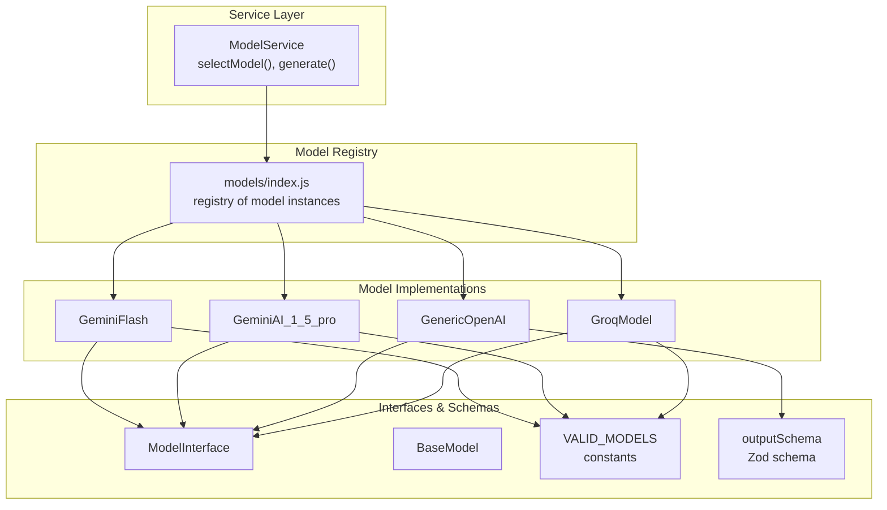
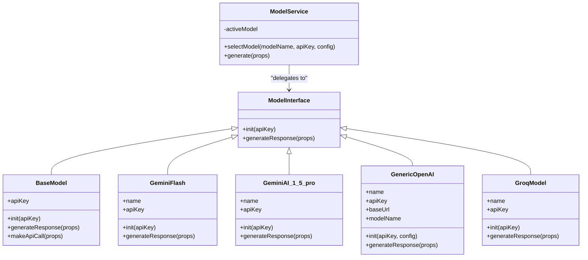
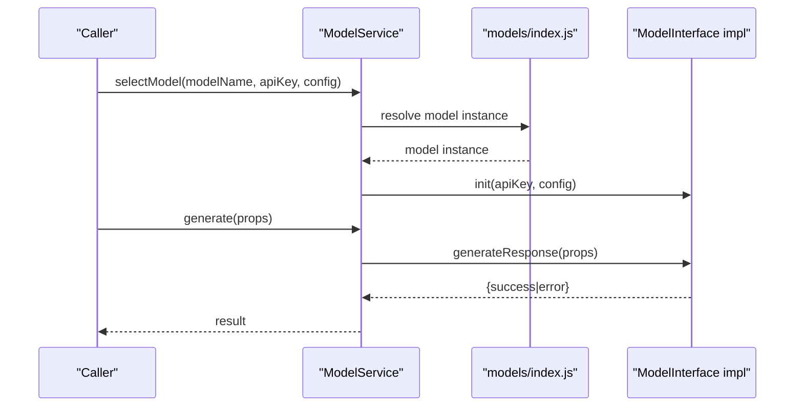
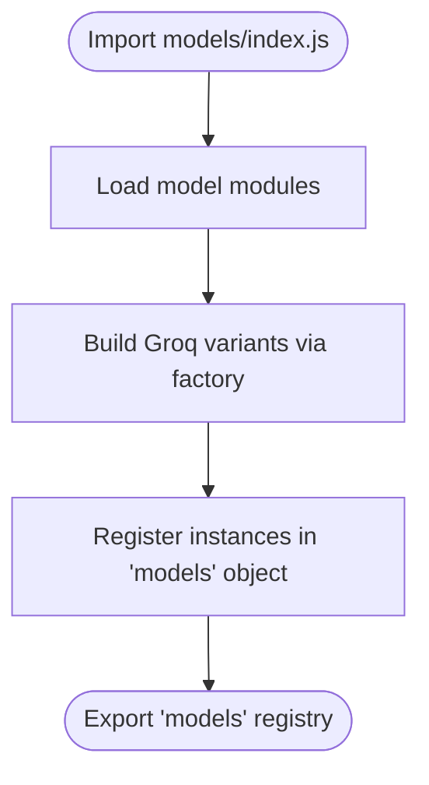
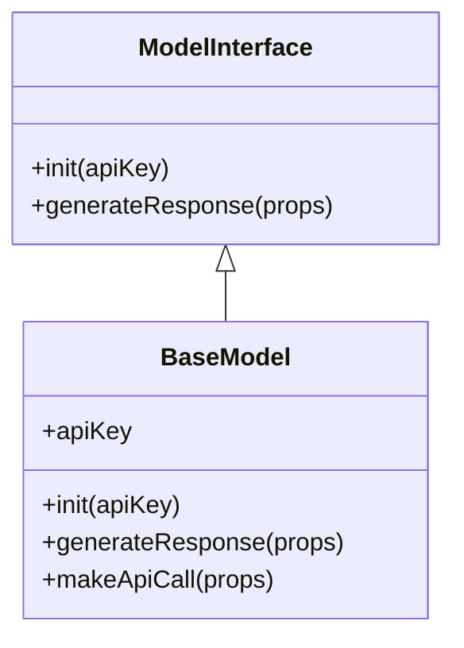
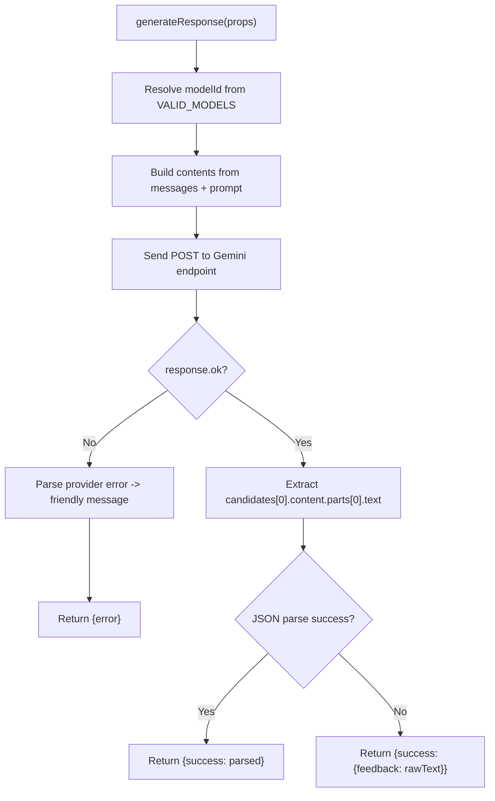
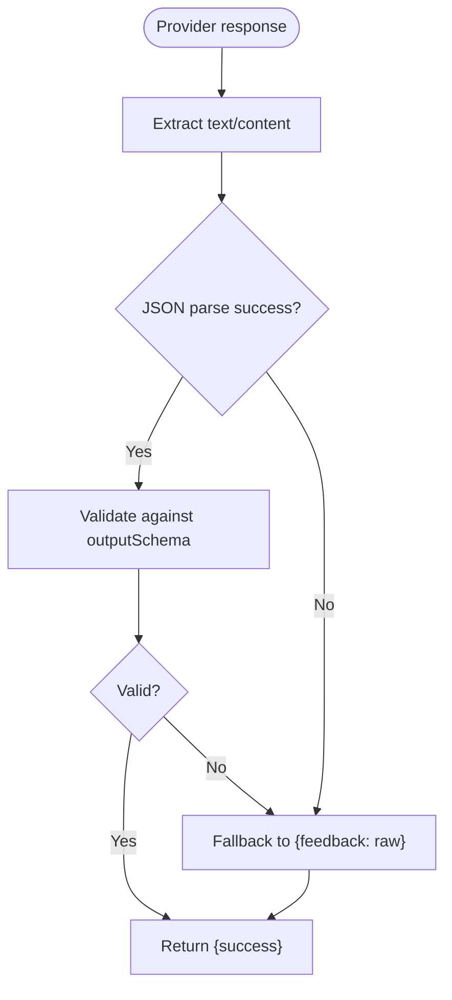
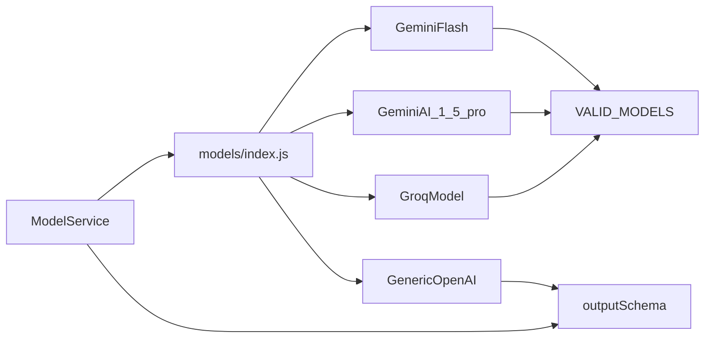

# Model Service Layer

<cite>
**Referenced Files in This Document**
- [ModelService.js](file://src/services/ModelService.js)
- [BaseModel.js](file://src/models/BaseModel.js)
- [ModelInterface.js](file://src/interface/ModelInterface.js)
- [index.js](file://src/models/index.js)
- [GeminiAI_1_5_pro.js](file://src/models/model/GeminiAI_1_5_pro.js)
- [GeminiFlash.js](file://src/models/model/GeminiFlash.js)
- [GenericOpenAI.js](file://src/models/model/GenericOpenAI.js)
- [GroqModel.js](file://src/models/model/GroqModel.js)
- [valid_models.js](file://src/constants/valid_models.js)
- [modelOutput.js](file://src/schema/modelOutput.js)
- [utils.js](file://src/models/utils.js)
</cite>

## Table of Contents
1. [Introduction](#introduction)
2. [Project Structure](#project-structure)
3. [Core Components](#core-components)
4. [Architecture Overview](#architecture-overview)
5. [Detailed Component Analysis](#detailed-component-analysis)
6. [Dependency Analysis](#dependency-analysis)
7. [Performance Considerations](#performance-considerations)
8. [Troubleshooting Guide](#troubleshooting-guide)
9. [Conclusion](#conclusion)

## Introduction
This document explains the Model Service Layer responsible for centralized model management in the Chrome Extension. It covers the factory pattern for dynamic model instantiation, runtime model switching, and model registry functionality. It documents the BaseModel abstract class structure, common interface methods, and model-specific implementations. It also details model configuration management, API key handling, and response processing workflows, including examples for adding new models, initialization sequences, error handling strategies, validation, fallback mechanisms, and performance considerations.

## Project Structure
The Model Service Layer is organized around a central service that selects and delegates to model implementations. Models are registered in a single location and instantiated dynamically. Each model encapsulates provider-specific logic while adhering to a shared interface.

**Diagram sources**
- [ModelService.js](file://src/services/ModelService.js#L4-L22)
- [index.js](file://src/models/index.js#L1-L19)
- [GeminiFlash.js](file://src/models/model/GeminiFlash.js#L20-L99)
- [GeminiAI_1_5_pro.js](file://src/models/model/GeminiAI_1_5_pro.js#L34-L85)
- [GenericOpenAI.js](file://src/models/model/GenericOpenAI.js#L5-L60)
- [GroqModel.js](file://src/models/model/GroqModel.js#L17-L69)
- [ModelInterface.js](file://src/interface/ModelInterface.js#L12-L17)
- [BaseModel.js](file://src/models/BaseModel.js#L3-L17)
- [valid_models.js](file://src/constants/valid_models.js#L1-L12)
- [modelOutput.js](file://src/schema/modelOutput.js#L9-L14)

**Section sources**
- [ModelService.js](file://src/services/ModelService.js#L1-L22)
- [index.js](file://src/models/index.js#L1-L19)

## Core Components
- ModelService: Central orchestrator that selects a model by name, initializes it with an API key and optional configuration, and delegates generation requests.
- ModelInterface: Defines the contract for all models with minimal methods for initialization and response generation.
- BaseModel: Provides a base implementation that forwards generation to a provider-specific makeApiCall method.
- Model Registry (models/index.js): Factory and registry that exposes named model instances and constructs Groq variants dynamically.
- Model Implementations: Provider-specific classes implementing API calls, error parsing, and response extraction.
- Validation and Schema: Zod schema for normalized output and a constants list of supported models.

Key responsibilities:
- Dynamic model selection via a factory-like registry.
- Runtime switching by re-initializing the active model.
- Unified API key and configuration handling per model.
- Consistent response shape with error-first design.

**Section sources**
- [ModelService.js](file://src/services/ModelService.js#L4-L22)
- [ModelInterface.js](file://src/interface/ModelInterface.js#L12-L17)
- [BaseModel.js](file://src/models/BaseModel.js#L3-L17)
- [index.js](file://src/models/index.js#L1-L19)

## Architecture Overview
The system follows a layered architecture:
- Service Layer: ModelService manages lifecycle and delegation.
- Registry Layer: models/index.js acts as a factory and registry.
- Implementation Layer: Provider-specific models implement API calls and response parsing.
- Contract Layer: ModelInterface defines the common interface.
- Validation Layer: Zod schema ensures consistent output structure.

**Diagram sources**
- [ModelInterface.js](file://src/interface/ModelInterface.js#L12-L17)
- [BaseModel.js](file://src/models/BaseModel.js#L3-L17)
- [GeminiFlash.js](file://src/models/model/GeminiFlash.js#L20-L99)
- [GeminiAI_1_5_pro.js](file://src/models/model/GeminiAI_1_5_pro.js#L34-L85)
- [GenericOpenAI.js](file://src/models/model/GenericOpenAI.js#L5-L60)
- [GroqModel.js](file://src/models/model/GroqModel.js#L17-L69)
- [ModelService.js](file://src/services/ModelService.js#L4-L22)

## Detailed Component Analysis

### ModelService: Centralized Selection and Delegation
- Responsibilities:
  - Select a model by name from the registry.
  - Initialize the selected model with an API key and optional configuration.
  - Delegate generation requests to the active model.
- Error handling:
  - Throws when a model name is not found.
  - Throws when no model is selected before generation.
- Runtime switching:
  - Re-selecting a model replaces the active model and reinitializes it.

**Diagram sources**
- [ModelService.js](file://src/services/ModelService.js#L7-L21)
- [index.js](file://src/models/index.js#L13-L19)

**Section sources**
- [ModelService.js](file://src/services/ModelService.js#L4-L22)

### Model Registry: Factory Pattern and Dynamic Instantiation
- Purpose:
  - Central registry of model instances keyed by name.
  - Dynamic construction of Groq variants using a helper that sets the model name.
- Behavior:
  - Exposes concrete instances for Gemini and OpenAI-compatible models.
  - Uses a factory function to create Groq variants with distinct names.

**Diagram sources**
- [index.js](file://src/models/index.js#L1-L19)

**Section sources**
- [index.js](file://src/models/index.js#L1-L19)

### ModelInterface and BaseModel: Common Contract and Base Implementation
- ModelInterface:
  - Defines the contract: init and generateResponse.
  - Provides helper utilities for chat history parsing.
- BaseModel:
  - Extends ModelInterface.
  - Implements a default generateResponse that delegates to makeApiCall.
  - Requires subclasses to implement makeApiCall.

**Diagram sources**
- [ModelInterface.js](file://src/interface/ModelInterface.js#L12-L17)
- [BaseModel.js](file://src/models/BaseModel.js#L3-L17)

**Section sources**
- [ModelInterface.js](file://src/interface/ModelInterface.js#L12-L17)
- [BaseModel.js](file://src/models/BaseModel.js#L3-L17)

### Model Implementations: Provider-Specific Logic

#### GeminiFlash
- Initialization: Stores API key.
- Generation:
  - Resolves the provider model ID from VALID_MODELS.
  - Builds a request payload with system instruction and chat contents.
  - Sends a POST request to the Gemini endpoint.
  - Parses JSON response and extracts the first candidate text.
  - Returns a normalized object with either success or error.
- Error handling:
  - Parses provider errors and maps common HTTP statuses to user-friendly messages.
  - Catches network and JSON parsing failures.

**Diagram sources**
- [GeminiFlash.js](file://src/models/model/GeminiFlash.js#L28-L97)
- [valid_models.js](file://src/constants/valid_models.js#L6-L8)

**Section sources**
- [GeminiFlash.js](file://src/models/model/GeminiFlash.js#L20-L99)
- [valid_models.js](file://src/constants/valid_models.js#L1-L12)

#### GeminiAI_1_5_pro
- Similar to GeminiFlash but uses a different model ID and includes a dedicated error parser with status-specific messages.

**Section sources**
- [GeminiAI_1_5_pro.js](file://src/models/model/GeminiAI_1_5_pro.js#L34-L85)
- [valid_models.js](file://src/constants/valid_models.js#L6-L8)

#### GenericOpenAI
- Initialization: Accepts apiKey and optional config (baseUrl, modelName).
- Generation:
  - Constructs a standard OpenAI-compatible request with JSON response format.
  - Extracts the assistant message content and parses JSON.
- Error handling: Returns a generic error message on HTTP failure.

**Section sources**
- [GenericOpenAI.js](file://src/models/model/GenericOpenAI.js#L5-L60)

#### GroqModel
- Initialization: Stores API key.
- Generation:
  - Resolves modelId from VALID_MODELS.
  - Sends a request to Groq’s OpenAI-compatible endpoint with JSON response format.
  - Parses the assistant message content and attempts JSON parsing.

**Section sources**
- [GroqModel.js](file://src/models/model/GroqModel.js#L17-L69)
- [valid_models.js](file://src/constants/valid_models.js#L2-L4)

### Response Processing and Validation
- Normalized response shape:
  - Success: { success: { feedback, hints?, snippet?, programmingLanguage? } }
  - Error: { error: { message } }
- Validation:
  - outputSchema enforces a strict structure for feedback, hints (up to two), snippet, and programmingLanguage.
- Utility:
  - generateObjectResponce demonstrates a higher-level orchestration using the ai library with a Zod schema.

**Diagram sources**
- [modelOutput.js](file://src/schema/modelOutput.js#L9-L14)
- [utils.js](file://src/models/utils.js#L16-L39)

**Section sources**
- [modelOutput.js](file://src/schema/modelOutput.js#L1-L14)
- [utils.js](file://src/models/utils.js#L1-L39)

## Dependency Analysis
- ModelService depends on:
  - models/index.js for model registry resolution.
  - outputSchema for validation in higher-level utilities.
- Model implementations depend on:
  - ModelInterface for the contract.
  - VALID_MODELS for provider model ID mapping.
  - Zod schema for validation in higher-level flows.
- Coupling and Cohesion:
  - High cohesion within each model class around provider specifics.
  - Low coupling via ModelInterface and registry abstraction.

**Diagram sources**
- [ModelService.js](file://src/services/ModelService.js#L1-L2)
- [index.js](file://src/models/index.js#L1-L19)
- [GeminiFlash.js](file://src/models/model/GeminiFlash.js#L1-L2)
- [GeminiAI_1_5_pro.js](file://src/models/model/GeminiAI_1_5_pro.js#L1-L2)
- [GenericOpenAI.js](file://src/models/model/GenericOpenAI.js#L1)
- [GroqModel.js](file://src/models/model/GroqModel.js#L1-L2)
- [valid_models.js](file://src/constants/valid_models.js#L1-L12)
- [modelOutput.js](file://src/schema/modelOutput.js#L1)

**Section sources**
- [ModelService.js](file://src/services/ModelService.js#L1-L2)
- [index.js](file://src/models/index.js#L1-L19)

## Performance Considerations
- Network latency:
  - All models perform synchronous fetch calls; consider batching or caching where appropriate.
- Response parsing:
  - JSON parsing occurs after successful responses; handle large payloads carefully.
- Model switching:
  - Re-initialization is lightweight; avoid frequent switches during long conversations.
- Validation overhead:
  - Zod validation adds CPU cost; reserve for critical outputs or optional validation paths.
- Retry/backoff:
  - Implement retry logic for rate-limited or transient failures when integrating higher-level flows.

[No sources needed since this section provides general guidance]

## Troubleshooting Guide
Common issues and resolutions:
- Model not found:
  - Ensure the requested model name exists in the registry.
  - Verify the model name casing and spelling.
- No model selected:
  - Call selectModel before generate.
- API key errors:
  - Invalid or missing API keys cause provider-specific errors; update keys in settings.
- Rate limits:
  - Provider returns rate-limit errors; wait for the suggested duration or switch models.
- Model unavailability:
  - Switch to another model listed in VALID_MODELS.
- JSON parsing failures:
  - Provider returned non-JSON; the system falls back to treating the response as plain feedback.

Operational checks:
- Confirm that the active model is initialized with the correct API key and configuration.
- Validate that the chat history is properly formatted before sending requests.
- Inspect the normalized response shape to ensure downstream consumers handle both success and error cases.

**Section sources**
- [ModelService.js](file://src/services/ModelService.js#L7-L21)
- [GeminiFlash.js](file://src/models/model/GeminiFlash.js#L62-L83)
- [GeminiAI_1_5_pro.js](file://src/models/model/GeminiAI_1_5_pro.js#L71-L83)
- [valid_models.js](file://src/constants/valid_models.js#L1-L12)

## Conclusion
The Model Service Layer provides a clean, extensible architecture for managing multiple AI models. Through a centralized registry and a shared interface, it enables dynamic model instantiation, runtime switching, and consistent response handling. By leveraging provider-specific implementations and robust error handling, the system remains maintainable and user-friendly. Extending support for new models requires minimal boilerplate while preserving safety through validation and error normalization.