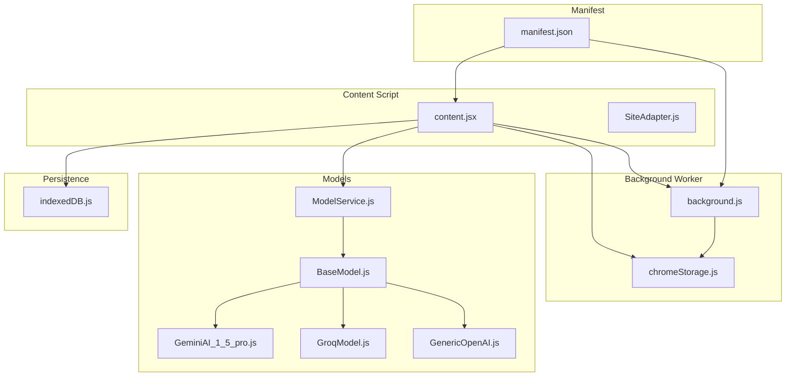
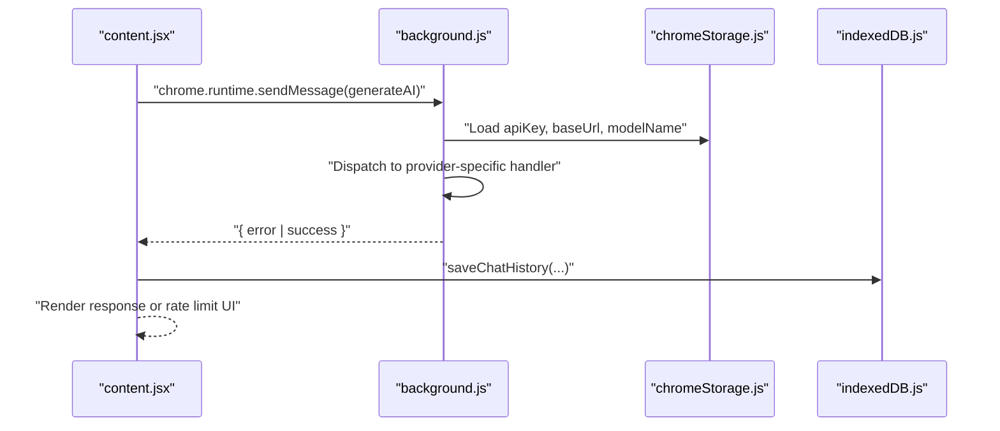
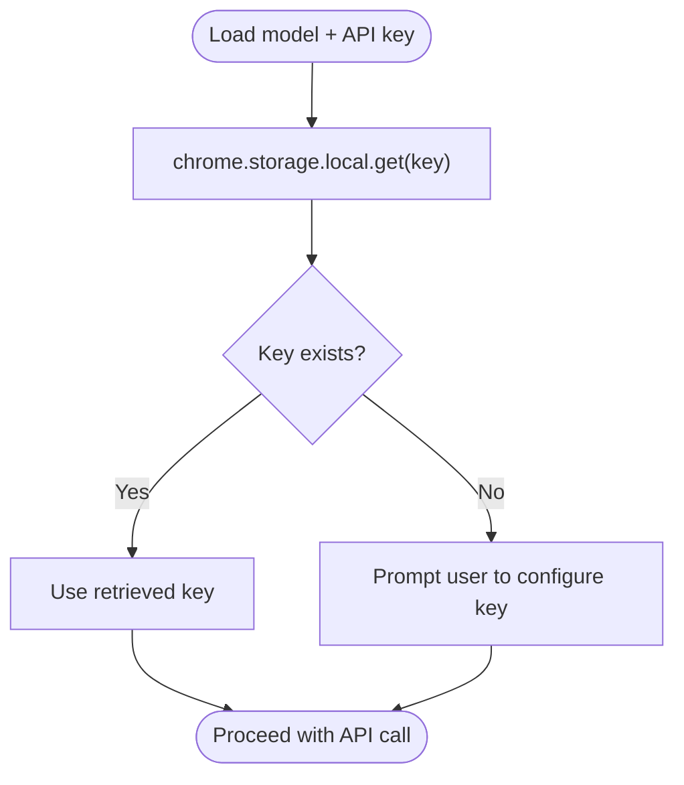
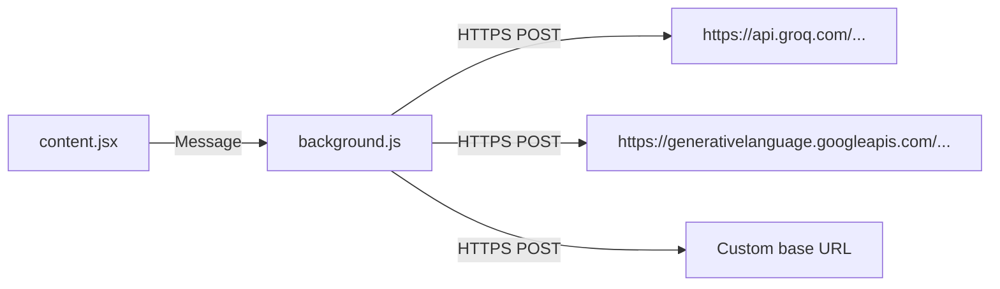
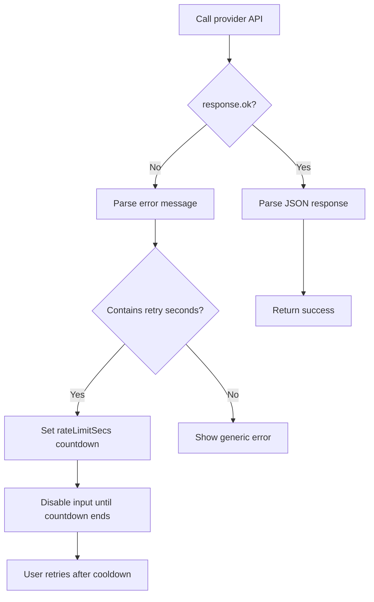
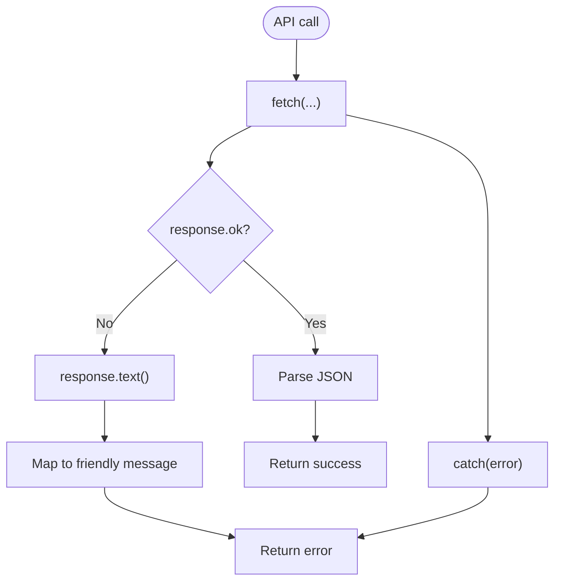
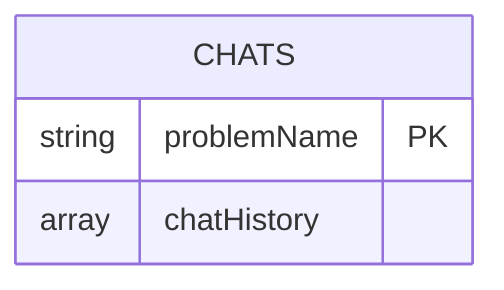
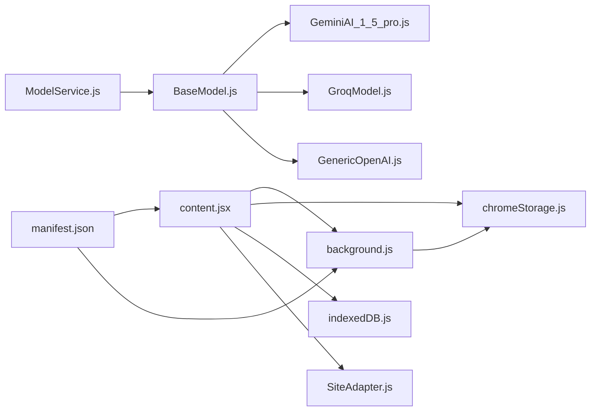
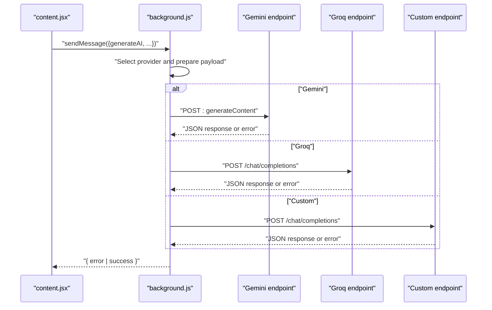

# Security and Performance Optimization

<cite>
**Referenced Files in This Document**
- [background.js](file://src/background.js)
- [chromeStorage.js](file://src/lib/chromeStorage.js)
- [content.jsx](file://src/content/content.jsx)
- [ModelService.js](file://src/services/ModelService.js)
- [BaseModel.js](file://src/models/BaseModel.js)
- [GeminiAI_1_5_pro.js](file://src/models/model/GeminiAI_1_5_pro.js)
- [GroqModel.js](file://src/models/model/GroqModel.js)
- [GenericOpenAI.js](file://src/models/model/GenericOpenAI.js)
- [SiteAdapter.js](file://src/content/adapters/SiteAdapter.js)
- [indexedDB.js](file://src/lib/indexedDB.js)
- [manifest.json](file://manifest.json)
- [valid_models.js](file://src/constants/valid_models.js)
</cite>

## Table of Contents
1. [Introduction](#introduction)
2. [Project Structure](#project-structure)
3. [Core Components](#core-components)
4. [Architecture Overview](#architecture-overview)
5. [Detailed Component Analysis](#detailed-component-analysis)
6. [Dependency Analysis](#dependency-analysis)
7. [Performance Considerations](#performance-considerations)
8. [Troubleshooting Guide](#troubleshooting-guide)
9. [Conclusion](#conclusion)
10. [Appendices](#appendices)

## Introduction
This document focuses on security and performance optimization for DSABuddy’s API communication system. It covers API key management, secure storage, and transmission security; rate limiting and user feedback; retry logic patterns; error handling and timeouts; graceful degradation; performance monitoring and caching; and cross-origin and secure communication considerations for external API calls.

## Project Structure
DSABuddy is a Chrome Extension with a content script UI, a background service worker for API calls, and modular model implementations. The content script communicates with the background worker via messaging to avoid direct browser-to-API calls and to centralize security controls.

**Diagram sources**
- [content.jsx](file://src/content/content.jsx#L1-L760)
- [background.js](file://src/background.js#L1-L156)
- [chromeStorage.js](file://src/lib/chromeStorage.js#L1-L36)
- [ModelService.js](file://src/services/ModelService.js#L1-L22)
- [BaseModel.js](file://src/models/BaseModel.js#L1-L17)
- [GeminiAI_1_5_pro.js](file://src/models/model/GeminiAI_1_5_pro.js#L1-L85)
- [GroqModel.js](file://src/models/model/GroqModel.js#L1-L69)
- [GenericOpenAI.js](file://src/models/model/GenericOpenAI.js#L1-L60)
- [SiteAdapter.js](file://src/content/adapters/SiteAdapter.js#L1-L28)
- [indexedDB.js](file://src/lib/indexedDB.js#L1-L38)
- [manifest.json](file://manifest.json#L1-L74)

**Section sources**
- [content.jsx](file://src/content/content.jsx#L1-L760)
- [background.js](file://src/background.js#L1-L156)
- [chromeStorage.js](file://src/lib/chromeStorage.js#L1-L36)
- [ModelService.js](file://src/services/ModelService.js#L1-L22)
- [BaseModel.js](file://src/models/BaseModel.js#L1-L17)
- [GeminiAI_1_5_pro.js](file://src/models/model/GeminiAI_1_5_pro.js#L1-L85)
- [GroqModel.js](file://src/models/model/GroqModel.js#L1-L69)
- [GenericOpenAI.js](file://src/models/model/GenericOpenAI.js#L1-L60)
- [SiteAdapter.js](file://src/content/adapters/SiteAdapter.js#L1-L28)
- [indexedDB.js](file://src/lib/indexedDB.js#L1-L38)
- [manifest.json](file://manifest.json#L1-L74)

## Core Components
- Background API orchestration: Centralizes external API calls and error handling.
- Model abstraction: Encapsulates provider-specific logic behind a shared interface.
- Storage abstraction: Manages API keys and model preferences securely in local storage.
- Content script messaging: Routes requests through the background worker to enforce CORS and security policies.
- Persistence: IndexedDB-backed chat history to reduce repeated network calls.

**Section sources**
- [background.js](file://src/background.js#L1-L156)
- [ModelService.js](file://src/services/ModelService.js#L1-L22)
- [BaseModel.js](file://src/models/BaseModel.js#L1-L17)
- [chromeStorage.js](file://src/lib/chromeStorage.js#L1-L36)
- [content.jsx](file://src/content/content.jsx#L1-L760)
- [indexedDB.js](file://src/lib/indexedDB.js#L1-L38)

## Architecture Overview
The extension routes all external API calls through the background service worker. The content script sends a message with the model selection, API key, and payload. The background worker executes the appropriate provider call, parses responses, and returns results. Local storage and IndexedDB persist user preferences and chat history.

**Diagram sources**
- [content.jsx](file://src/content/content.jsx#L152-L181)
- [background.js](file://src/background.js#L133-L155)
- [chromeStorage.js](file://src/lib/chromeStorage.js#L13-L26)
- [indexedDB.js](file://src/lib/indexedDB.js#L9-L12)

## Detailed Component Analysis

### API Key Management and Secure Storage
- Single-key sharing for Groq models: Keys are normalized so multiple Groq variants share one stored key.
- Local storage persistence: Keys and model metadata are stored in the extension’s local storage.
- Background retrieval: The background worker reads keys for the selected model before making API calls.
- Recommendation: Store keys only in extension-managed storage; avoid embedding in content scripts or manifests.

**Diagram sources**
- [chromeStorage.js](file://src/lib/chromeStorage.js#L13-L26)
- [content.jsx](file://src/content/content.jsx#L602-L622)

**Section sources**
- [chromeStorage.js](file://src/lib/chromeStorage.js#L1-L36)
- [content.jsx](file://src/content/content.jsx#L602-L622)

### Transmission Security Measures
- HTTPS endpoints: Calls are made to provider domains over HTTPS.
- Authorization headers: API keys are sent via Authorization headers.
- Background routing: All external calls are executed in the background worker to minimize exposure in content scripts.
- Manifest host permissions: Explicitly declare provider domains in host_permissions.

**Diagram sources**
- [background.js](file://src/background.js#L18-L29)
- [background.js](file://src/background.js#L59)
- [background.js](file://src/background.js#L87-L108)
- [manifest.json](file://manifest.json#L36-L40)

**Section sources**
- [background.js](file://src/background.js#L18-L29)
- [background.js](file://src/background.js#L59)
- [background.js](file://src/background.js#L87-L108)
- [manifest.json](file://manifest.json#L36-L40)

### Rate Limiting and Retry Logic
- Provider-side rate limit detection: Friendly error parsing for Gemini indicates rate limit with retry delay.
- Client-side rate limit UI: The content script parses retry seconds from error messages and starts a countdown.
- Retry logic pattern: On receiving a rate limit message, the UI disables input and shows a countdown; after expiry, the user can retry.

**Diagram sources**
- [GeminiAI_1_5_pro.js](file://src/models/model/GeminiAI_1_5_pro.js#L17-L32)
- [content.jsx](file://src/content/content.jsx#L183-L197)
- [content.jsx](file://src/content/content.jsx#L522-L548)

**Section sources**
- [GeminiAI_1_5_pro.js](file://src/models/model/GeminiAI_1_5_pro.js#L17-L32)
- [content.jsx](file://src/content/content.jsx#L183-L197)
- [content.jsx](file://src/content/content.jsx#L522-L548)

### Circuit Breaker Patterns
- Current state: No explicit circuit breaker is implemented in the codebase.
- Recommended pattern: Track consecutive failures and temporarily block requests for a model until a reset window elapses. Combine with rate-limit-aware UI disabling.

[No sources needed since this section provides general guidance]

### Error Handling Best Practices
- Provider errors: Catch and parse provider error responses; convert to friendly messages for the UI.
- Network errors: Wrap fetch calls in try/catch and return structured error objects.
- Background errors: Centralize error handling in the background worker and propagate user-friendly messages.

**Diagram sources**
- [background.js](file://src/background.js#L31-L43)
- [GeminiAI_1_5_pro.js](file://src/models/model/GeminiAI_1_5_pro.js#L71-L83)

**Section sources**
- [background.js](file://src/background.js#L31-L43)
- [GeminiAI_1_5_pro.js](file://src/models/model/GeminiAI_1_5_pro.js#L71-L83)

### Timeout Configurations and Graceful Degradation
- Current state: No explicit timeouts are configured for fetch calls.
- Recommendations:
  - Add AbortController-based timeouts per provider call.
  - On timeout or extended failure, degrade gracefully by returning cached partial results or a preconfigured fallback message.

[No sources needed since this section provides general guidance]

### Performance Monitoring and Caching Strategies
- Chat history caching: Persist conversations in IndexedDB to reduce repeated network calls and enable pagination.
- Message truncation and sliding window: Limit context size to stay within free-tier token budgets.
- Suggested enhancements:
  - Add lightweight in-memory cache keyed by problem and recent messages.
  - Implement LRU eviction and TTL to bound memory usage.

**Diagram sources**
- [indexedDB.js](file://src/lib/indexedDB.js#L3-L7)
- [content.jsx](file://src/content/content.jsx#L149-L150)

**Section sources**
- [indexedDB.js](file://src/lib/indexedDB.js#L1-L38)
- [content.jsx](file://src/content/content.jsx#L149-L150)

### Cross-Origin Security and CSP Implications
- Host permissions: Providers are declared in manifest host_permissions to allow HTTPS requests.
- Content security: The extension runs in a controlled environment; avoid injecting external scripts.
- Recommendations:
  - Keep host_permissions minimal and provider-specific.
  - Avoid eval or dynamic code execution in responses.

**Section sources**
- [manifest.json](file://manifest.json#L29-L40)

## Dependency Analysis
The content script depends on the background worker for API calls and on storage for credentials. Models encapsulate provider specifics behind a shared interface. IndexedDB persists chat history.

**Diagram sources**
- [content.jsx](file://src/content/content.jsx#L1-L760)
- [background.js](file://src/background.js#L1-L156)
- [chromeStorage.js](file://src/lib/chromeStorage.js#L1-L36)
- [ModelService.js](file://src/services/ModelService.js#L1-L22)
- [BaseModel.js](file://src/models/BaseModel.js#L1-L17)
- [GeminiAI_1_5_pro.js](file://src/models/model/GeminiAI_1_5_pro.js#L1-L85)
- [GroqModel.js](file://src/models/model/GroqModel.js#L1-L69)
- [GenericOpenAI.js](file://src/models/model/GenericOpenAI.js#L1-L60)
- [SiteAdapter.js](file://src/content/adapters/SiteAdapter.js#L1-L28)
- [manifest.json](file://manifest.json#L1-L74)

**Section sources**
- [content.jsx](file://src/content/content.jsx#L1-L760)
- [background.js](file://src/background.js#L1-L156)
- [chromeStorage.js](file://src/lib/chromeStorage.js#L1-L36)
- [ModelService.js](file://src/services/ModelService.js#L1-L22)
- [BaseModel.js](file://src/models/BaseModel.js#L1-L17)
- [GeminiAI_1_5_pro.js](file://src/models/model/GeminiAI_1_5_pro.js#L1-L85)
- [GroqModel.js](file://src/models/model/GroqModel.js#L1-L69)
- [GenericOpenAI.js](file://src/models/model/GenericOpenAI.js#L1-L60)
- [SiteAdapter.js](file://src/content/adapters/SiteAdapter.js#L1-L28)
- [manifest.json](file://manifest.json#L1-L74)

## Performance Considerations
- Reduce payload size:
  - Truncate user code and limit conversation history to recent messages.
- Minimize network calls:
  - Use IndexedDB to serve recent history and avoid redundant completions.
- Efficient rendering:
  - Lazy load and paginate chat history to avoid DOM thrashing.
- Resource optimization:
  - Avoid heavy client-side parsing; delegate to the background worker when feasible.

[No sources needed since this section provides general guidance]

## Troubleshooting Guide
- API key invalid or unauthorized:
  - Gemini maps 401/403 to a friendly message indicating invalid key.
- Rate limit exceeded:
  - Gemini returns a message with a retry delay; UI parses seconds and shows a countdown.
- No response from background:
  - The content script resolves a runtime error and displays a message.
- Provider errors:
  - Catch and return structured error objects; surface user-friendly messages.

**Section sources**
- [GeminiAI_1_5_pro.js](file://src/models/model/GeminiAI_1_5_pro.js#L17-L32)
- [content.jsx](file://src/content/content.jsx#L164-L181)
- [background.js](file://src/background.js#L41-L43)

## Conclusion
DSABuddy centralizes API communication in the background worker, uses HTTPS endpoints, and stores keys in extension-managed storage. The UI provides user-visible rate-limit feedback and caches chat history. To further strengthen security and performance, consider adding explicit timeouts, a circuit breaker, and lightweight in-memory caching.

[No sources needed since this section summarizes without analyzing specific files]

## Appendices

### API Communication Flow (Code-Level)

**Diagram sources**
- [content.jsx](file://src/content/content.jsx#L152-L181)
- [background.js](file://src/background.js#L133-L155)
- [GeminiAI_1_5_pro.js](file://src/models/model/GeminiAI_1_5_pro.js#L46-L69)
- [GroqModel.js](file://src/models/model/GroqModel.js#L39-L50)
- [GenericOpenAI.js](file://src/models/model/GenericOpenAI.js#L19-L41)