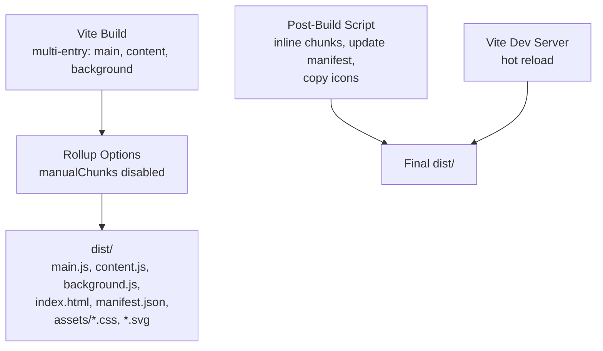
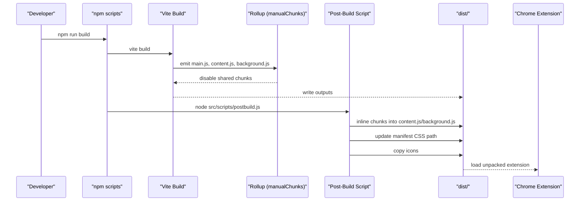
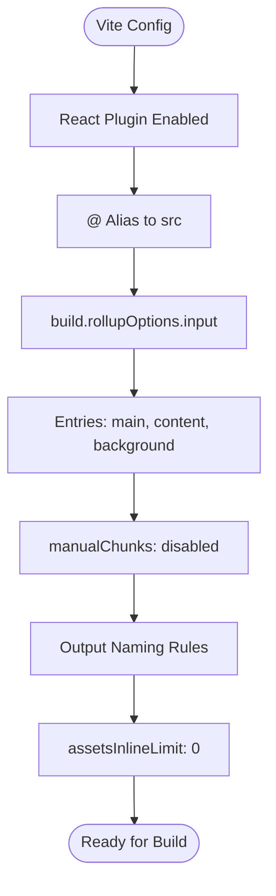
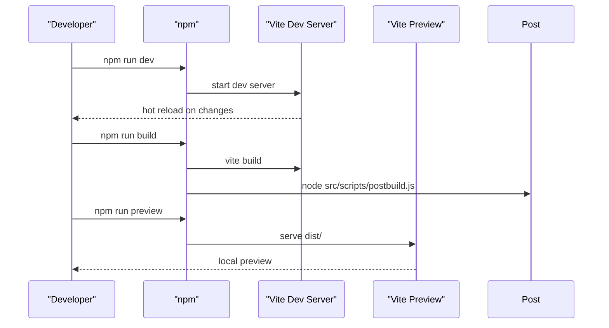
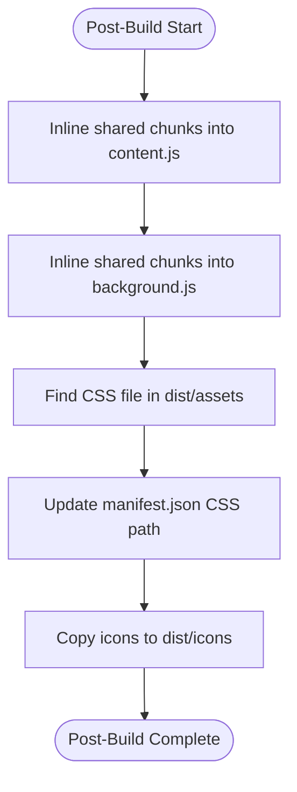
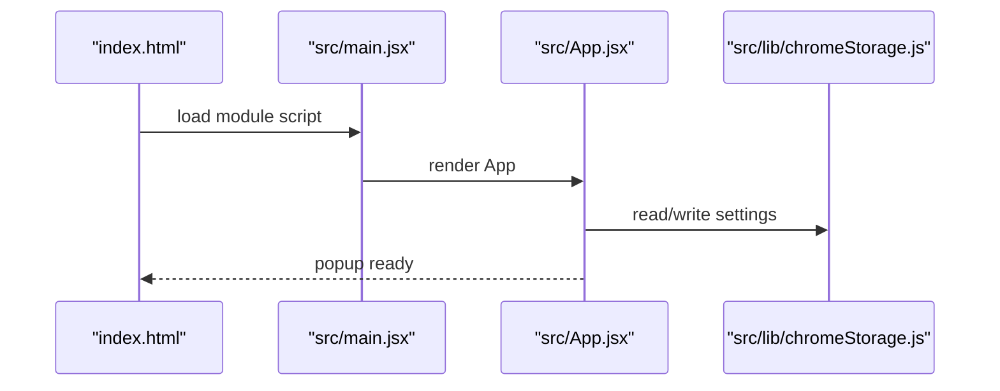
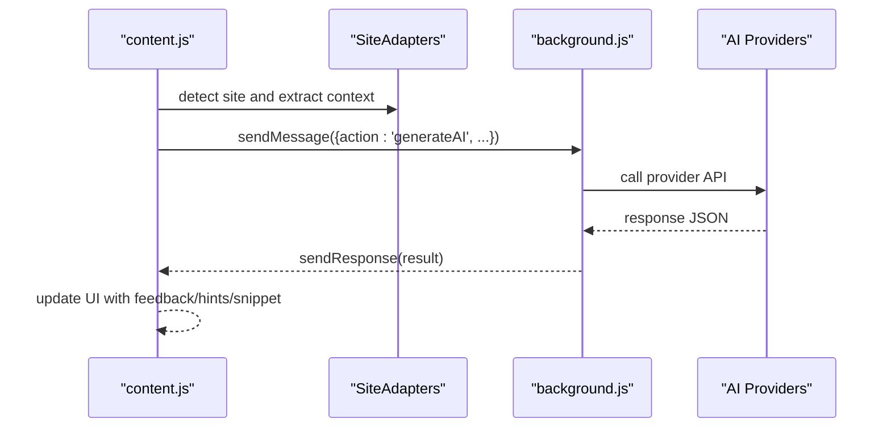
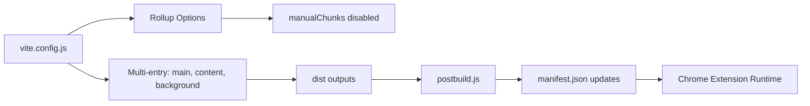

# Build System Configuration

<cite>
**Referenced Files in This Document**
- [vite.config.js](file://vite.config.js)
- [package.json](file://package.json)
- [manifest.json](file://manifest.json)
- [postbuild.js](file://src/scripts/postbuild.js)
- [release.js](file://src/scripts/release.js)
- [index.html](file://index.html)
- [main.jsx](file://src/main.jsx)
- [background.js](file://src/background.js)
- [content.jsx](file://src/content/content.jsx)
- [App.jsx](file://src/App.jsx)
- [index.css](file://src/index.css)
- [tailwind.config.js](file://tailwind.config.js)
- [postcss.config.js](file://postcss.config.js)
- [chromeStorage.js](file://src/lib/chromeStorage.js)
</cite>

## Table of Contents
1. [Introduction](#introduction)
2. [Project Structure](#project-structure)
3. [Core Components](#core-components)
4. [Architecture Overview](#architecture-overview)
5. [Detailed Component Analysis](#detailed-component-analysis)
6. [Dependency Analysis](#dependency-analysis)
7. [Performance Considerations](#performance-considerations)
8. [Troubleshooting Guide](#troubleshooting-guide)
9. [Conclusion](#conclusion)

## Introduction
This document explains DSABuddy's Vite build system tailored for Chrome Extension Manifest V3. It covers Vite configuration for multiple entry points, Rollup customization for Chrome compatibility, asset bundling and optimization, development server setup, production build pipeline, and the post-build packaging steps that ensure content scripts, background scripts, popup interface, and static assets work seamlessly in Chrome. It also provides development workflow guidance, debugging tips, and production deployment preparation.

## Project Structure
The build system centers around Vite's multi-entry configuration and a post-build script that adapts outputs for Chrome's content script restrictions. Key elements:
- Vite multi-entry: main (popup), content (content script), background (service worker)
- Rollup manualChunks disabled to prevent shared code extraction that would break content script ES module imports
- Post-build script inlines shared chunks into content.js and background.js, updates manifest CSS references, and copies icons
- Tailwind CSS and PostCSS for styling, with CSS emitted to assets with hashed filenames

**Diagram sources**
- [vite.config.js](file://vite.config.js#L12-L34)
- [postbuild.js](file://src/scripts/postbuild.js#L122-L171)

**Section sources**
- [vite.config.js](file://vite.config.js#L1-L35)
- [package.json](file://package.json#L6-L11)

## Core Components
- Vite configuration defines aliases, multi-entry points, Rollup options, and asset handling for Chrome compatibility.
- Package scripts orchestrate dev, build, and preview lifecycles, with post-build processing.
- Manifest declares permissions, content scripts, background service worker, web-accessible resources, commands, and icons.
- Post-build script performs chunk inlining for content and background scripts, updates CSS references in manifest, and copies icons.
- Release script synchronizes version between package.json and manifest.json.

**Section sources**
- [vite.config.js](file://vite.config.js#L5-L34)
- [package.json](file://package.json#L6-L11)
- [manifest.json](file://manifest.json#L1-L74)
- [postbuild.js](file://src/scripts/postbuild.js#L1-L171)
- [release.js](file://src/scripts/release.js#L1-L32)

## Architecture Overview
The build pipeline transforms React-based UI and content logic into Chrome-ready artifacts. Vite compiles three distinct entry points, Rollup prevents shared code extraction to satisfy content script constraints, and the post-build script ensures runtime compatibility and manifest correctness.

**Diagram sources**
- [package.json](file://package.json#L7-L8)
- [vite.config.js](file://vite.config.js#L12-L34)
- [postbuild.js](file://src/scripts/postbuild.js#L122-L171)

## Detailed Component Analysis

### Vite Configuration (vite.config.js)
- Plugins: React plugin enabled for JSX/TSX support.
- Aliases: @ resolves to src for clean imports.
- Multi-entry:
  - main: index.html entry for the popup UI
  - content: src/content/content.jsx for the content script
  - background: src/background.js for the service worker
- Rollup options:
  - manualChunks disabled to force each entry to bundle its own shared code, avoiding ES module import limitations in content scripts
  - Output naming: entryFileNames, chunkFileNames, assetFileNames with hash suffixes for cache busting
- Assets: assetsInlineLimit set to 0 to ensure all assets are emitted as files, simplifying manifest references.

**Diagram sources**
- [vite.config.js](file://vite.config.js#L5-L34)

**Section sources**
- [vite.config.js](file://vite.config.js#L1-L35)

### Package Scripts and Workflow (package.json)
- Scripts:
  - dev: starts Vite dev server with hot reload
  - build: runs Vite build, then executes postbuild.js
  - preview: serves built files locally
- Dependencies and devDependencies include React, Vite, Tailwind, and related tooling.

**Diagram sources**
- [package.json](file://package.json#L6-L11)

**Section sources**
- [package.json](file://package.json#L1-L50)

### Post-Build Script (src/scripts/postbuild.js)
Purpose: Make Chrome-compatible outputs by inlining shared chunks into content.js and background.js, updating manifest CSS references, and copying icons.

Key steps:
- Inline shared chunks into content.js and background.js using IIFE pattern to avoid ES module import issues.
- Discover CSS filename from dist/assets and update manifest.json content_scripts.css entries.
- Copy icons directory to dist/icons for runtime accessibility.

**Diagram sources**
- [postbuild.js](file://src/scripts/postbuild.js#L122-L171)

**Section sources**
- [postbuild.js](file://src/scripts/postbuild.js#L1-L171)

### Release Script (src/scripts/release.js)
Purpose: Synchronize version between package.json and manifest.json, then instruct users to build and load the extension.

Workflow:
- Read current version from package.json
- Update manifest.json version to match
- Log build and load instructions

**Section sources**
- [release.js](file://src/scripts/release.js#L1-L32)

### Manifest (manifest.json) and Chrome Compatibility
- Manifest V3 with permissions, host_permissions, action popup, background service worker, web_accessible_resources, commands, and icons.
- CSS path in content_scripts is dynamically updated by the post-build script to match hashed filename.

**Section sources**
- [manifest.json](file://manifest.json#L1-L74)
- [postbuild.js](file://src/scripts/postbuild.js#L138-L154)

### Entry Points and Build Outputs

#### Popup Entry (index.html + src/main.jsx + src/App.jsx)
- index.html loads a module script pointing to src/main.jsx.
- src/main.jsx renders the React root into the DOM.
- src/App.jsx provides the popup UI and interacts with Chrome storage via src/lib/chromeStorage.js.

**Diagram sources**
- [index.html](file://index.html#L8)
- [main.jsx](file://src/main.jsx#L1-L13)
- [App.jsx](file://src/App.jsx#L1-L233)
- [chromeStorage.js](file://src/lib/chromeStorage.js#L1-L36)

**Section sources**
- [index.html](file://index.html#L1-L13)
- [main.jsx](file://src/main.jsx#L1-L13)
- [App.jsx](file://src/App.jsx#L1-L233)
- [chromeStorage.js](file://src/lib/chromeStorage.js#L1-L36)

#### Content Script Entry (src/content/content.jsx)
- Single-page React app injected into target pages (LeetCode, HackerRank, GeeksforGeeks).
- Uses MutationObserver to re-inject UI after SPA navigation.
- Communicates with background via chrome.runtime.sendMessage for AI responses.

**Diagram sources**
- [content.jsx](file://src/content/content.jsx#L122-L181)
- [background.js](file://src/background.js#L127-L155)

**Section sources**
- [content.jsx](file://src/content/content.jsx#L1-L760)
- [background.js](file://src/background.js#L1-L156)

#### Background Script Entry (src/background.js)
- Implements model-specific API calls (Groq, Gemini, custom) and exposes a message handler for the content script.
- Runs as a module-type service worker per manifest.

**Section sources**
- [background.js](file://src/background.js#L1-L156)
- [manifest.json](file://manifest.json#L45-L48)

### Asset Bundling and Optimization
- CSS: Generated via Tailwind and PostCSS, emitted to dist/assets with hashed filenames.
- Images/SVG: public assets copied as-is; icons are copied to dist/icons by the post-build script.
- JavaScript: Separate entry bundles per target (popup, content, background) with manualChunks disabled to avoid ES module import issues in content scripts.

**Section sources**
- [vite.config.js](file://vite.config.js#L20-L28)
- [postbuild.js](file://src/scripts/postbuild.js#L128-L136)
- [postbuild.js](file://src/scripts/postbuild.js#L156-L169)

### Development Server and Hot Reload
- Dev server is started via npm run dev, enabling live reload when source files change.
- The popup UI is served from index.html, and content/background logic is compiled for testing.

**Section sources**
- [package.json](file://package.json#L7)
- [index.html](file://index.html#L1-L13)

### Production Build and Packaging
- Build command runs Vite, then postbuild.js to inline chunks and update manifest.
- Final dist/ contains:
  - main.js (popup)
  - content.js (content script)
  - background.js (service worker)
  - index.html
  - manifest.json
  - assets/ (hashed CSS and other assets)
  - icons/

**Section sources**
- [package.json](file://package.json#L8)
- [postbuild.js](file://src/scripts/postbuild.js#L122-L171)

## Dependency Analysis
The build system exhibits clear separation of concerns:
- Vite/Vite plugins handle transpilation and bundling
- Rollup options enforce Chrome compatibility for content scripts
- Post-build script enforces runtime compatibility and manifest correctness
- Manifest governs Chrome permissions, entry points, and resource exposure

**Diagram sources**
- [vite.config.js](file://vite.config.js#L12-L34)
- [postbuild.js](file://src/scripts/postbuild.js#L122-L171)
- [manifest.json](file://manifest.json#L1-L74)

**Section sources**
- [vite.config.js](file://vite.config.js#L1-L35)
- [postbuild.js](file://src/scripts/postbuild.js#L1-L171)
- [manifest.json](file://manifest.json#L1-L74)

## Performance Considerations
- Shared code inlining: By disabling manualChunks, each entry becomes self-contained, increasing bundle sizes but ensuring content script compatibility.
- CSS hashing: Hashed CSS filenames enable long-term caching; the post-build script updates manifest references accordingly.
- Asset emission: assetsInlineLimit set to 0 ensures deterministic asset paths and avoids base64 blobs for assets.
- Tailwind purging: Tailwind content globs focus on src, minimizing CSS size.

[No sources needed since this section provides general guidance]

## Troubleshooting Guide
Common issues and resolutions:
- Content script fails to load:
  - Verify content.js is fully self-contained after post-build inlining.
  - Ensure no ES module imports remain in content.js.
- CSS not applied:
  - Confirm manifest.json content_scripts.css points to the hashed CSS filename generated in dist/assets.
- Icons missing:
  - Ensure icons directory is copied to dist/icons by the post-build script.
- Version mismatch:
  - Run the release script to synchronize manifest.json version with package.json.
- Hot reload not working:
  - Check Vite dev server logs for errors and ensure index.html is served correctly.

**Section sources**
- [postbuild.js](file://src/scripts/postbuild.js#L122-L171)
- [manifest.json](file://manifest.json#L138-L154)
- [release.js](file://src/scripts/release.js#L18-L32)
- [package.json](file://package.json#L7)

## Conclusion
DSABuddy's build system leverages Vite's multi-entry configuration and targeted Rollup options to meet Chrome Extension requirements. The post-build script ensures content scripts remain compatible by inlining shared code and updating manifest references. With Tailwind and PostCSS for styling, the system produces optimized, cache-friendly assets while maintaining a smooth development experience with hot reload. Following the documented workflow and troubleshooting steps will streamline both development and production deployment.