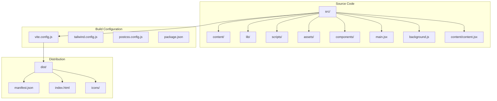
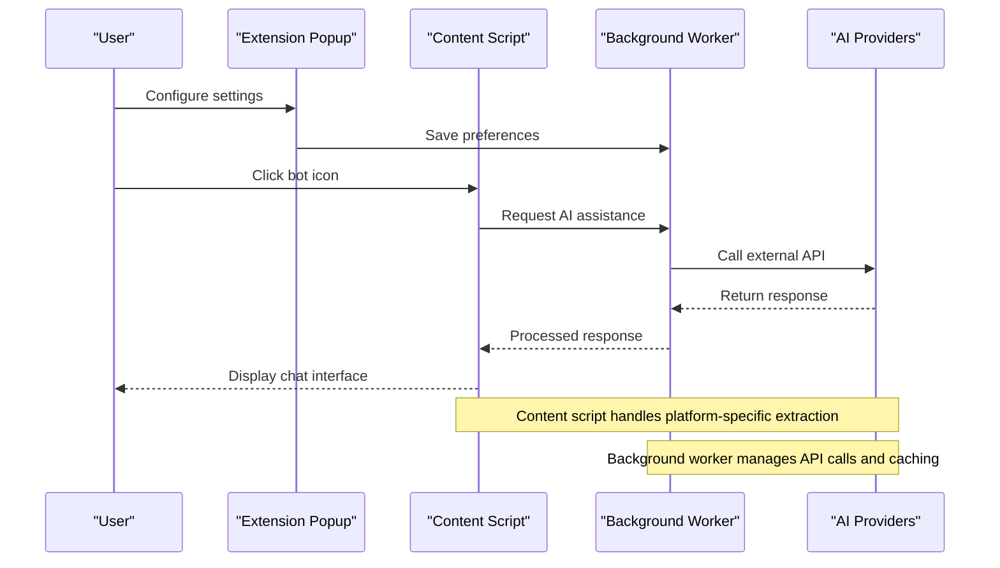
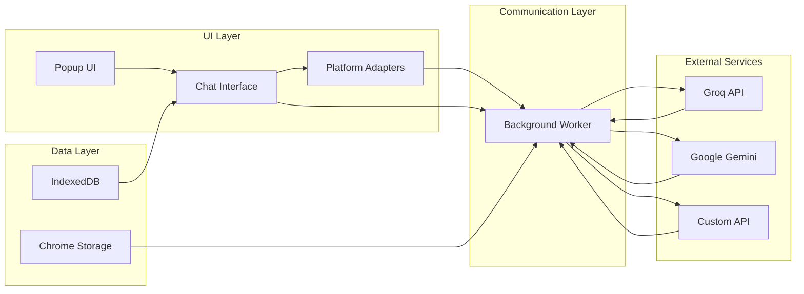

# Chrome Extension Configuration

<cite>
**Referenced Files in This Document**
- [manifest.json](file://manifest.json)
- [package.json](file://package.json)
- [vite.config.js](file://vite.config.js)
- [postbuild.js](file://src/scripts/postbuild.js)
- [release.js](file://src/scripts/release.js)
- [background.js](file://src/background.js)
- [content.jsx](file://src/content/content.jsx)
- [main.jsx](file://src/main.jsx)
- [index.html](file://index.html)
- [chromeStorage.js](file://src/lib/chromeStorage.js)
- [indexedDB.js](file://src/lib/indexedDB.js)
- [tailwind.config.js](file://tailwind.config.js)
- [postcss.config.js](file://postcss.config.js)
- [README.md](file://README.md)
</cite>

## Table of Contents
1. [Introduction](#introduction)
2. [Project Structure](#project-structure)
3. [Core Components](#core-components)
4. [Architecture Overview](#architecture-overview)
5. [Detailed Component Analysis](#detailed-component-analysis)
6. [Dependency Analysis](#dependency-analysis)
7. [Performance Considerations](#performance-considerations)
8. [Security and Permissions](#security-and-permissions)
9. [Build and Packaging](#build-and-packaging)
10. [Deployment and Distribution](#deployment-and-distribution)
11. [Troubleshooting Guide](#troubleshooting-guide)
12. [Conclusion](#conclusion)

## Introduction
This document provides comprehensive documentation for DSABuddy's Chrome Extension configuration and build system. It covers manifest.json configuration, Vite build configuration with custom Rollup settings for Chrome extension compatibility, asset handling, development versus production differences, post-build and release scripts for extension packaging and distribution, Chrome Web Store submission requirements, extension signing process, deployment strategies, security considerations, permission management, and extension update mechanisms.

## Project Structure
The DSABuddy Chrome Extension follows a modern React + Vite architecture with a clear separation between content scripts, background scripts, and the extension UI. The project structure is organized to support efficient development and production builds tailored for Chrome extension environments.

**Diagram sources**
- [vite.config.js](file://vite.config.js#L1-L35)
- [package.json](file://package.json#L1-L50)
- [manifest.json](file://manifest.json#L1-L74)

**Section sources**
- [README.md](file://README.md#L55-L78)
- [vite.config.js](file://vite.config.js#L1-L35)

## Core Components
The extension consists of several core components that work together to provide DSA assistance on popular coding platforms:

### Manifest Configuration
The manifest.json defines all extension metadata, permissions, and entry points. It specifies Chrome Extension Manifest Version 3 with comprehensive permissions for supported platforms and AI APIs.

### Build System
Vite serves as the primary build tool with custom Rollup configuration to handle Chrome extension-specific requirements, particularly around content script compatibility and asset bundling.

### Content Scripts
The content script runs on target websites (LeetCode, HackerRank, GeeksforGeeks) to provide interactive DSA assistance and chat functionality.

### Background Service Worker
Handles AI API calls, manages model configurations, and coordinates communication between content scripts and external APIs.

**Section sources**
- [manifest.json](file://manifest.json#L1-L74)
- [vite.config.js](file://vite.config.js#L12-L32)
- [content.jsx](file://src/content/content.jsx#L1-L760)
- [background.js](file://src/background.js#L1-L156)

## Architecture Overview
The DSABuddy extension follows a client-server architecture pattern adapted for Chrome extensions, with distinct roles for each component:

**Diagram sources**
- [content.jsx](file://src/content/content.jsx#L122-L181)
- [background.js](file://src/background.js#L133-L155)

## Detailed Component Analysis

### Manifest Configuration Analysis
The manifest.json defines comprehensive permissions and configurations for the extension:

#### Permissions and Host Permissions
- Storage permission for persisting user preferences and chat history
- Active tab permission for accessing current page context
- Scripting permission for programmatic DOM manipulation
- Extensive host permissions covering major coding platforms and AI API endpoints

#### Content Scripts Registration
The extension registers content scripts for six major platforms:
- LeetCode (primary and international domains)
- HackerRank (global and regional domains)
- GeeksforGeeks (main and mirror domains)

#### Browser Action Configuration
- Default popup configured to index.html
- Keyboard shortcut (Ctrl+Shift+D) for quick access
- Custom icon set with multiple resolutions

#### Background Script Setup
- Service worker type with ES module support
- Module-based architecture for better maintainability

**Section sources**
- [manifest.json](file://manifest.json#L6-L48)

### Vite Build Configuration
The Vite configuration includes specialized settings for Chrome extension compatibility:

#### Multi-entry Point Configuration
The build system creates three distinct entry points:
- Main application entry (popup UI)
- Content script entry (platform integration)
- Background script entry (service worker)

#### Rollup Customization for Chrome Compatibility
Critical Rollup settings ensure content scripts work correctly in Chrome:
- Prevents code splitting to avoid ES module import limitations
- Forces all shared code into each entry point
- Disables asset inlining for predictable file handling

#### Asset Handling Strategy
- CSS files are bundled separately and dynamically referenced
- Assets are hashed for cache busting
- Base path is set to relative for proper extension loading

**Section sources**
- [vite.config.js](file://vite.config.js#L14-L32)

### Post-build Processing System
The post-build script performs essential transformations for Chrome extension compatibility:

#### Content Script Inlining
The script automatically inlines shared JavaScript chunks into content.js and background.js to eliminate ES module import statements that Chrome content scripts cannot handle.

#### Dynamic Manifest Updates
Updates the manifest.json with the correct CSS filename after Vite's asset hashing process.

#### Asset Organization
Copies icons and other static assets to the dist directory with proper file naming.

**Section sources**
- [postbuild.js](file://src/scripts/postbuild.js#L14-L123)

### Content Script Implementation
The content script provides the main user interface and platform integration:

#### Platform Adapters
Supports three major coding platforms through dedicated adapter classes:
- LeetCodeAdapter for LeetCode problems
- HackerRankAdapter for HackerRank challenges
- GFGAdapter for GeeksforGeeks problems

#### Chat Interface Management
Provides a sophisticated chat interface with:
- Real-time message display
- Code highlighting and copying
- Hint and solution presentation
- Scrollable message history

#### API Communication
Routes all AI API calls through the background script to bypass CORS restrictions and manage authentication securely.

**Section sources**
- [content.jsx](file://src/content/content.jsx#L1-L760)

### Background Service Worker
The background worker handles all external API communications and model management:

#### Model Integration
Directly implements multiple AI model providers:
- Groq API integration with multiple model variants
- Google Gemini API integration
- Custom OpenAI-compatible API support

#### Message Handling
Processes requests from content scripts and responds with structured AI-generated content following a standardized JSON format.

#### Error Management
Comprehensive error handling for network failures, API rate limits, and malformed responses.

**Section sources**
- [background.js](file://src/background.js#L1-L156)

## Dependency Analysis
The extension maintains clean dependency boundaries between components:

**Diagram sources**
- [content.jsx](file://src/content/content.jsx#L122-L181)
- [background.js](file://src/background.js#L133-L155)
- [chromeStorage.js](file://src/lib/chromeStorage.js#L1-L36)
- [indexedDB.js](file://src/lib/indexedDB.js#L1-L38)

**Section sources**
- [chromeStorage.js](file://src/lib/chromeStorage.js#L1-L36)
- [indexedDB.js](file://src/lib/indexedDB.js#L1-L38)

## Performance Considerations
Several optimizations are implemented to ensure optimal performance:

### Asset Loading Strategy
- CSS files are loaded separately to enable efficient caching
- JavaScript chunks are inlined to reduce HTTP requests
- Hashed filenames prevent stale cache issues

### Memory Management
- IndexedDB is used for persistent chat history storage
- Content scripts are designed to minimize DOM manipulation overhead
- API calls are rate-limited to respect provider quotas

### Build Optimizations
- Manual chunking prevents unnecessary code splitting
- Asset inlining eliminates dynamic import overhead
- Tailwind CSS purging reduces bundle size

## Security and Permissions
The extension implements comprehensive security measures:

### Permission Management
- Minimal permissions principle: only requests necessary permissions
- Explicit host permissions for target platforms and AI APIs
- Storage permissions limited to extension-specific data

### Data Protection
- API keys are stored in Chrome's secure storage
- No sensitive data is transmitted to third-party servers
- Local IndexedDB storage ensures user data stays on device

### Cross-Origin Security
- All external API calls are routed through the background script
- Content scripts operate with restricted permissions
- Proper CORS handling through service worker proxy

**Section sources**
- [manifest.json](file://manifest.json#L6-L10)
- [chromeStorage.js](file://src/lib/chromeStorage.js#L1-L36)

## Build and Packaging
The build system provides a streamlined development and production workflow:

### Development Environment
- Hot module replacement for rapid iteration
- Source maps for debugging
- Live reload capabilities

### Production Build Process
- Multi-entry point compilation
- Asset optimization and minification
- Post-build processing for Chrome compatibility

### Asset Pipeline
- Tailwind CSS preprocessing with autoprefixer
- React component compilation
- Static asset copying and hashing

**Section sources**
- [package.json](file://package.json#L6-L11)
- [postbuild.js](file://src/scripts/postbuild.js#L1-L171)

## Deployment and Distribution
The extension supports multiple deployment strategies:

### Local Development
- Developer mode activation in Chrome extensions page
- Unpacked extension loading for testing
- Automatic reloading during development

### Production Distribution
- ZIP packaging for Chrome Web Store submission
- Version synchronization between package.json and manifest.json
- Automated release script for consistent builds

### Update Mechanisms
- Chrome extension auto-update system
- Manifest version field controls update detection
- Background worker handles model updates and feature enhancements

**Section sources**
- [release.js](file://src/scripts/release.js#L1-L32)
- [README.md](file://README.md#L49-L54)

## Troubleshooting Guide
Common issues and their solutions:

### Content Script Not Loading
- Verify host permissions in manifest.json
- Check content script registration matches target URLs
- Ensure proper CSS file references after build

### API Integration Issues
- Confirm API keys are properly stored in Chrome storage
- Verify background script has necessary permissions
- Check network connectivity and rate limit status

### Build Problems
- Clear node_modules and reinstall dependencies
- Verify Vite configuration matches Chrome requirements
- Check post-build script execution logs

### Performance Issues
- Monitor IndexedDB storage usage
- Optimize content script DOM operations
- Review API call frequency and rate limiting

**Section sources**
- [postbuild.js](file://src/scripts/postbuild.js#L1-L171)
- [background.js](file://src/background.js#L133-L155)

## Conclusion
DSABuddy demonstrates a well-architected Chrome Extension that effectively balances functionality with security and performance. The modular design, comprehensive build system, and careful attention to Chrome extension requirements make it a robust foundation for educational tooling. The implementation showcases best practices for content script integration, service worker architecture, and cross-origin communication while maintaining user privacy and security.

The extension's configuration provides a solid template for similar educational tools, with clear separation of concerns, efficient asset handling, and comprehensive platform support. The automated build and release processes ensure consistent deployments while the security-first approach protects user data and privacy.