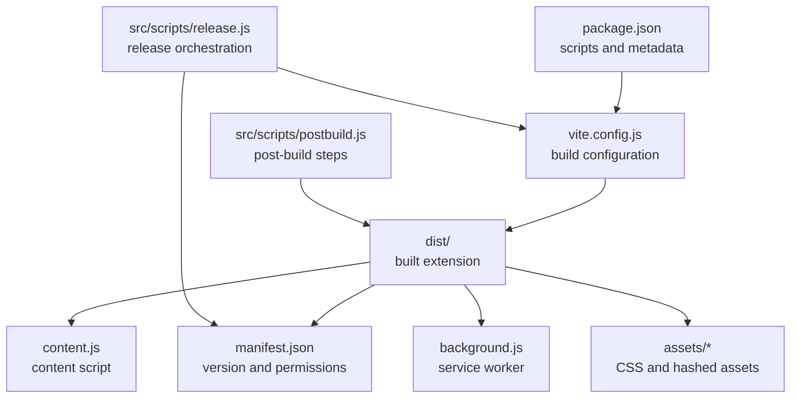
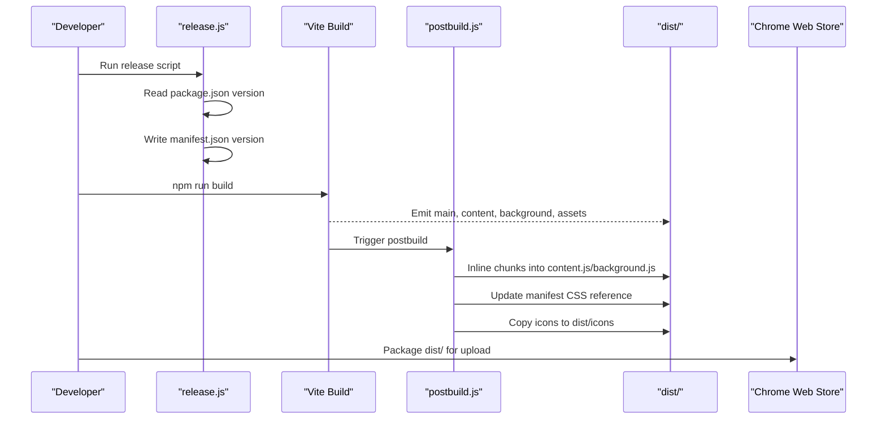
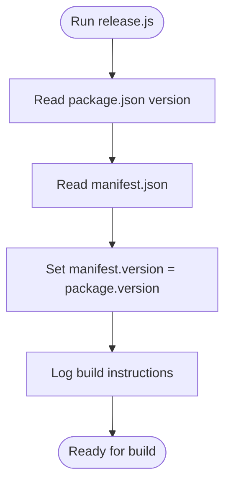
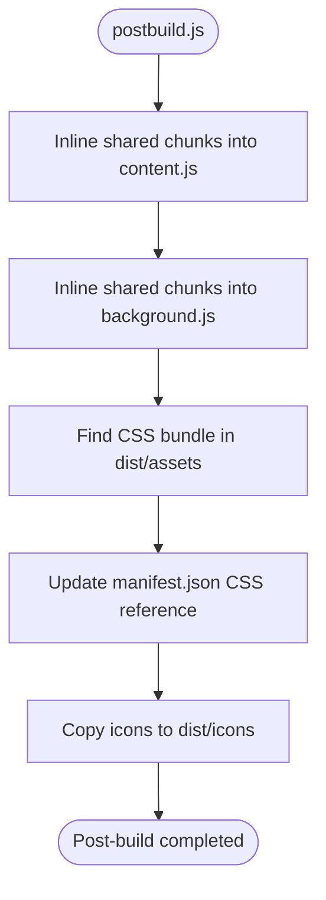
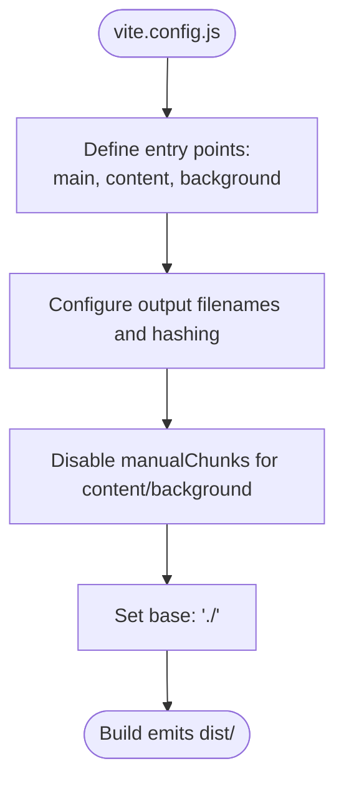
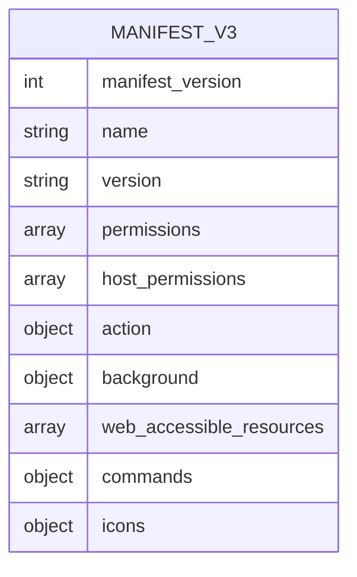
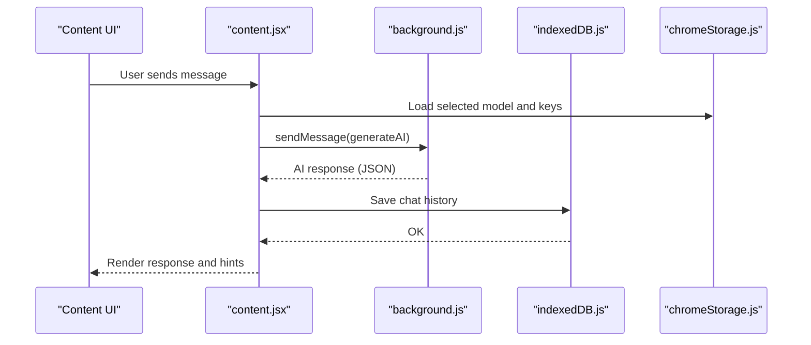
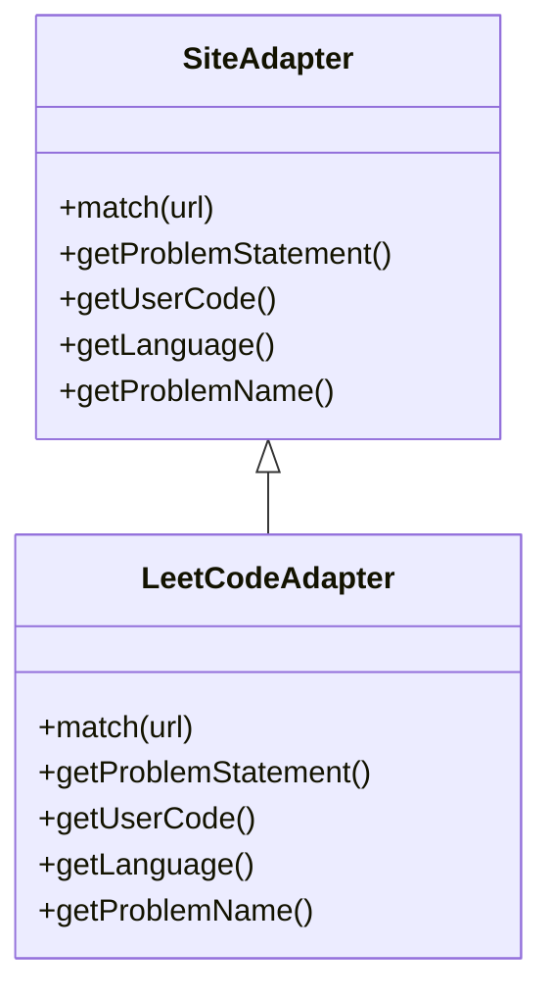
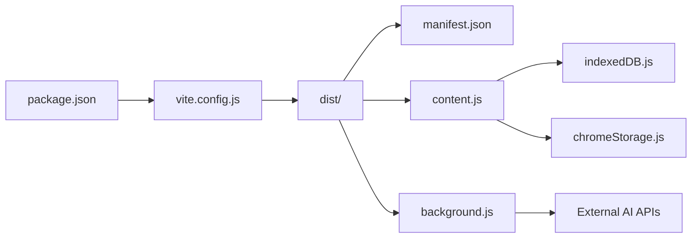

# Deployment and Packaging

<cite>
**Referenced Files in This Document**
- [release.js](file://src/scripts/release.js)
- [postbuild.js](file://src/scripts/postbuild.js)
- [package.json](file://package.json)
- [manifest.json](file://manifest.json)
- [vite.config.js](file://vite.config.js)
- [README.md](file://README.md)
- [background.js](file://src/background.js)
- [content.jsx](file://src/content/content.jsx)
- [chromeStorage.js](file://src/lib/chromeStorage.js)
- [indexedDB.js](file://src/lib/indexedDB.js)
- [valid_models.js](file://src/constants/valid_models.js)
- [LeetCodeAdapter.js](file://src/content/adapters/LeetCodeAdapter.js)
</cite>

## Table of Contents
1. [Introduction](#introduction)
2. [Project Structure](#project-structure)
3. [Core Components](#core-components)
4. [Architecture Overview](#architecture-overview)
5. [Detailed Component Analysis](#detailed-component-analysis)
6. [Dependency Analysis](#dependency-analysis)
7. [Performance Considerations](#performance-considerations)
8. [Troubleshooting Guide](#troubleshooting-guide)
9. [Conclusion](#conclusion)
10. [Appendices](#appendices)

## Introduction
This document explains DSABuddy’s deployment and packaging pipeline for Chrome Web Store distribution. It covers the release script functionality, automated packaging workflows, version management strategies, Chrome Web Store submission requirements, extension signing, zip creation, pre-submission testing, update mechanisms, compatibility best practices, rollback procedures, and user data preservation during updates.

## Project Structure
DSABuddy uses Vite for building the extension and a small post-build script to prepare artifacts for distribution. The build targets Manifest V3 and produces a dist/ folder suitable for loading in developer mode and later for packaging and publishing.

**Diagram sources**
- [package.json](file://package.json#L6-L11)
- [vite.config.js](file://vite.config.js#L12-L34)
- [postbuild.js](file://src/scripts/postbuild.js#L11-L171)
- [release.js](file://src/scripts/release.js#L1-L32)
- [manifest.json](file://manifest.json#L1-L74)

**Section sources**
- [README.md](file://README.md#L49-L54)
- [vite.config.js](file://vite.config.js#L12-L34)
- [package.json](file://package.json#L6-L11)

## Core Components
- Version management: The release script synchronizes the manifest version with package.json, ensuring consistency for Chrome Web Store submissions.
- Build pipeline: Vite compiles entries for main UI, content script, and background service worker. Rollup options prevent shared chunks from being extracted so content scripts remain compatible.
- Post-build preparation: The post-build script inlines shared imports into content.js and background.js, updates the manifest CSS reference, and copies icons into dist/.
- Distribution readiness: The dist/ folder contains all necessary files for loading in developer mode and packaging for the store.

**Section sources**
- [release.js](file://src/scripts/release.js#L11-L27)
- [postbuild.js](file://src/scripts/postbuild.js#L35-L120)
- [postbuild.js](file://src/scripts/postbuild.js#L138-L154)
- [postbuild.js](file://src/scripts/postbuild.js#L156-L169)
- [vite.config.js](file://vite.config.js#L14-L30)

## Architecture Overview
The deployment pipeline ties together versioning, building, and packaging into a single release workflow.

**Diagram sources**
- [release.js](file://src/scripts/release.js#L11-L27)
- [package.json](file://package.json#L8-L8)
- [postbuild.js](file://src/scripts/postbuild.js#L35-L120)
- [postbuild.js](file://src/scripts/postbuild.js#L138-L154)
- [postbuild.js](file://src/scripts/postbuild.js#L156-L169)

## Detailed Component Analysis

### Release Script (version synchronization and build trigger)
- Reads the current version from package.json.
- Updates manifest.json version to match.
- Logs instructions to build and load the extension locally.

**Diagram sources**
- [release.js](file://src/scripts/release.js#L11-L27)

**Section sources**
- [release.js](file://src/scripts/release.js#L11-L27)

### Post-Build Script (inlining, manifest updates, icons)
- Inlines shared imports into content.js and background.js to satisfy Chrome content script restrictions.
- Scans dist/assets for the CSS bundle and updates manifest.json accordingly.
- Copies icons from icons/ to dist/icons/.

**Diagram sources**
- [postbuild.js](file://src/scripts/postbuild.js#L35-L120)
- [postbuild.js](file://src/scripts/postbuild.js#L138-L154)
- [postbuild.js](file://src/scripts/postbuild.js#L156-L169)

**Section sources**
- [postbuild.js](file://src/scripts/postbuild.js#L35-L120)
- [postbuild.js](file://src/scripts/postbuild.js#L138-L154)
- [postbuild.js](file://src/scripts/postbuild.js#L156-L169)

### Build Configuration (Vite + Rollup)
- Defines three entry points: main UI, content script, and background service worker.
- Disables code splitting for content/background to ensure they are self-contained.
- Sets asset naming and base path for correct resource resolution.

**Diagram sources**
- [vite.config.js](file://vite.config.js#L14-L34)

**Section sources**
- [vite.config.js](file://vite.config.js#L12-L34)

### Manifest (version, permissions, resources)
- Manifest V3 with permissions for storage, activeTab, scripting.
- Host permissions for supported sites plus provider APIs.
- Action popup, background service worker, web-accessible resources, keyboard shortcut, and icons.

**Diagram sources**
- [manifest.json](file://manifest.json#L1-L74)

**Section sources**
- [manifest.json](file://manifest.json#L6-L48)
- [manifest.json](file://manifest.json#L49-L73)

### Content Script Runtime (communication and data persistence)
- Content script injects UI and communicates with background via chrome.runtime.sendMessage.
- Uses IndexedDB to persist chat history per problem.
- Loads model and API keys from Chrome storage.

**Diagram sources**
- [content.jsx](file://src/content/content.jsx#L153-L181)
- [background.js](file://src/background.js#L127-L155)
- [indexedDB.js](file://src/lib/indexedDB.js#L9-L31)
- [chromeStorage.js](file://src/lib/chromeStorage.js#L13-L26)

**Section sources**
- [content.jsx](file://src/content/content.jsx#L122-L217)
- [content.jsx](file://src/content/content.jsx#L219-L252)
- [background.js](file://src/background.js#L127-L155)
- [chromeStorage.js](file://src/lib/chromeStorage.js#L1-L36)
- [indexedDB.js](file://src/lib/indexedDB.js#L1-L38)

### Adapter Pattern (site-specific extraction)
- Adapts DOM selectors and extraction logic for supported platforms (e.g., LeetCode).

**Diagram sources**
- [LeetCodeAdapter.js](file://src/content/adapters/LeetCodeAdapter.js#L1-L51)

**Section sources**
- [LeetCodeAdapter.js](file://src/content/adapters/LeetCodeAdapter.js#L5-L49)

## Dependency Analysis
- Build-time dependencies: Vite, Rollup, and plugins produce deterministic outputs.
- Runtime dependencies: Manifest permissions and host permissions enable site access and provider API calls.
- Data persistence: IndexedDB stores chat history; Chrome storage persists model selection and keys.

**Diagram sources**
- [package.json](file://package.json#L6-L11)
- [vite.config.js](file://vite.config.js#L12-L34)
- [postbuild.js](file://src/scripts/postbuild.js#L11-L171)
- [manifest.json](file://manifest.json#L29-L40)
- [chromeStorage.js](file://src/lib/chromeStorage.js#L1-L36)
- [indexedDB.js](file://src/lib/indexedDB.js#L1-L38)

**Section sources**
- [package.json](file://package.json#L12-L47)
- [manifest.json](file://manifest.json#L6-L48)

## Performance Considerations
- Content script compatibility: Keeping content.js and background.js self-contained avoids dynamic imports and ensures reliable injection.
- Asset naming: Hashed asset filenames improve caching; the post-build script updates manifest references to the latest CSS bundle.
- Network calls: The background routes API requests to external providers, minimizing repeated network overhead in the content script.

[No sources needed since this section provides general guidance]

## Troubleshooting Guide
Common deployment issues and resolutions:
- Version mismatch: Ensure manifest version equals package.json version before building and uploading.
- Content script errors: Verify that shared imports were inlined; confirm content.js and background.js are self-contained after post-build.
- Missing CSS: Confirm the post-build script detected the CSS bundle and updated manifest.json accordingly.
- Icons missing: Ensure icons are copied into dist/icons/ during post-build.
- Developer mode load failures: Rebuild and reload the unpacked extension from dist/.
- Provider API errors: Validate API keys and model configurations; the background handles provider-specific endpoints and error responses.

**Section sources**
- [release.js](file://src/scripts/release.js#L22-L26)
- [postbuild.js](file://src/scripts/postbuild.js#L122-L123)
- [postbuild.js](file://src/scripts/postbuild.js#L138-L154)
- [postbuild.js](file://src/scripts/postbuild.js#L156-L169)
- [README.md](file://README.md#L49-L54)

## Conclusion
DSABuddy’s deployment pipeline centers on a release script that aligns versions, a Vite build that emits self-contained entries, and a post-build script that prepares artifacts for distribution. By following the outlined workflows and best practices, maintainers can reliably package, test, and publish updates to the Chrome Web Store while preserving user data and ensuring compatibility across Chrome versions.

[No sources needed since this section summarizes without analyzing specific files]

## Appendices

### Chrome Web Store Submission Requirements
- Version alignment: manifest version must match package.json version.
- Permissions review: Ensure permissions and host permissions are minimal and justified.
- Assets: Upload the packaged dist/ folder; verify icons and CSS are present.
- Privacy policy and terms: Provide required links in the store listing.

**Section sources**
- [release.js](file://src/scripts/release.js#L22-L26)
- [manifest.json](file://manifest.json#L6-L48)

### Extension Signing and Packaging
- Build the extension using the documented build script.
- Package the dist/ folder for upload to the Chrome Web Store Developer Dashboard.
- Use the Developer Dashboard to manage listings, screenshots, and release channels.

**Section sources**
- [package.json](file://package.json#L8-L8)
- [README.md](file://README.md#L49-L54)

### Testing Procedures Before Submission
- Local testing: Load the unpacked extension from dist/ in developer mode.
- Functionality checks: Verify content script injection, popup behavior, and background messaging.
- Data persistence: Confirm chat history loads and clears correctly using IndexedDB.
- Storage: Validate model selection and API key persistence in Chrome storage.

**Section sources**
- [README.md](file://README.md#L49-L54)
- [content.jsx](file://src/content/content.jsx#L219-L252)
- [chromeStorage.js](file://src/lib/chromeStorage.js#L1-L36)
- [indexedDB.js](file://src/lib/indexedDB.js#L1-L38)

### Update Mechanisms and Compatibility
- Manifest V3: Updates are handled automatically by Chrome; ensure manifest keys remain compatible.
- Permission changes: Request new permissions in the store listing and handle gracefully in code.
- Backward compatibility: Avoid breaking changes to content script APIs; keep background service worker self-contained.

**Section sources**
- [manifest.json](file://manifest.json#L1-L74)
- [vite.config.js](file://vite.config.js#L24-L29)

### Rollback Procedures
- Version rollback: Publish a previous version in the Developer Dashboard to revert users.
- Data safety: IndexedDB and Chrome storage are preserved; verify data integrity after rollback.
- Communication: Inform users about the rollback and any actions they need to take.

**Section sources**
- [indexedDB.js](file://src/lib/indexedDB.js#L1-L38)
- [chromeStorage.js](file://src/lib/chromeStorage.js#L1-L36)

### Managing User Data During Updates
- IndexedDB: Chat histories are stored per problem; no migration required unless schema changes.
- Chrome storage: Model selection and keys are keyed by model family; ensure continuity across updates.
- Validation: On load, verify stored values and provide defaults if missing.

**Section sources**
- [indexedDB.js](file://src/lib/indexedDB.js#L9-L31)
- [chromeStorage.js](file://src/lib/chromeStorage.js#L1-L36)
- [valid_models.js](file://src/constants/valid_models.js#L1-L12)