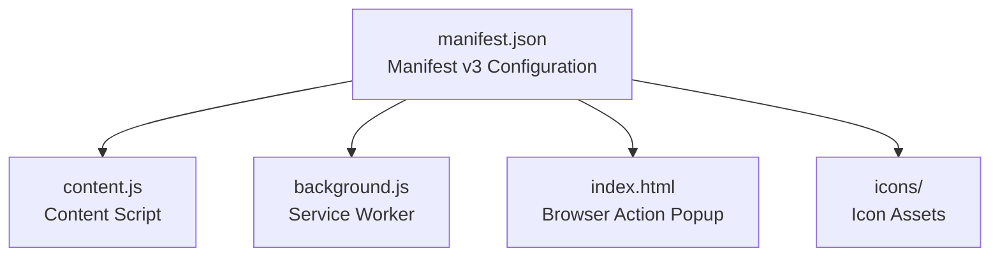
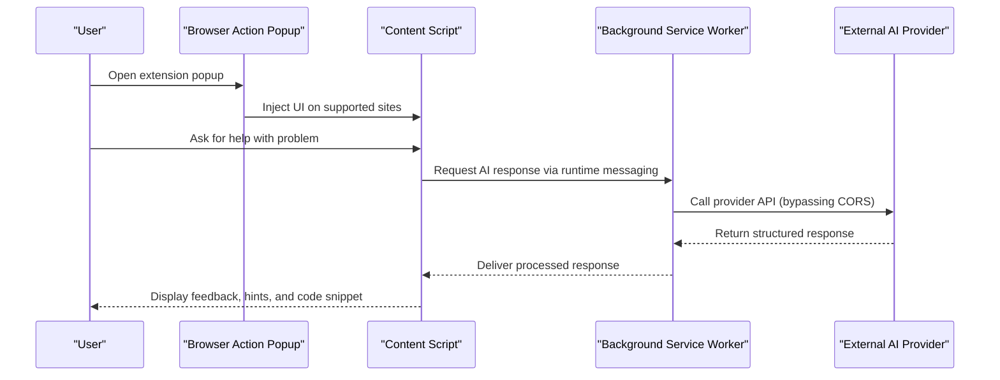
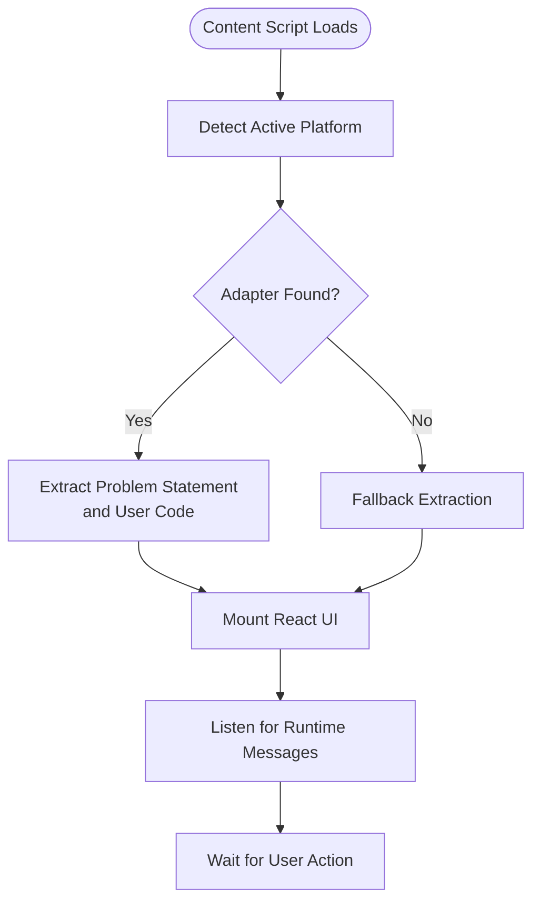
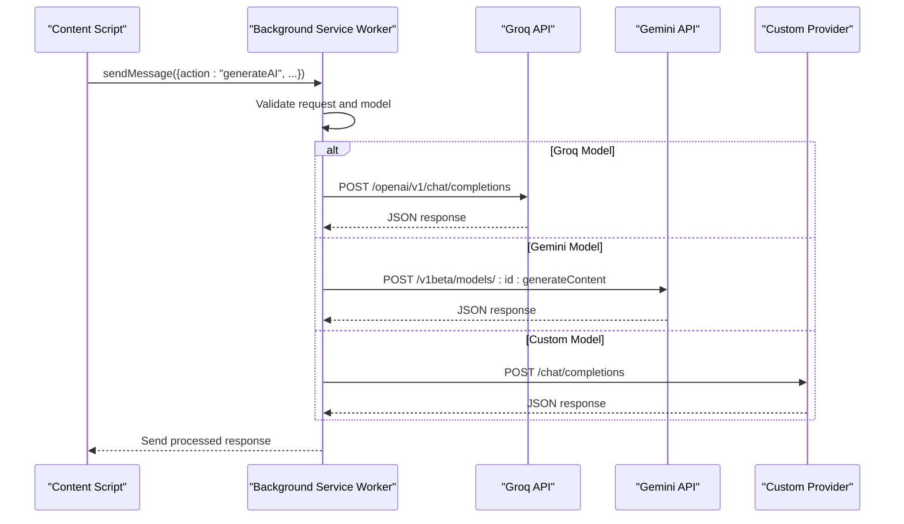
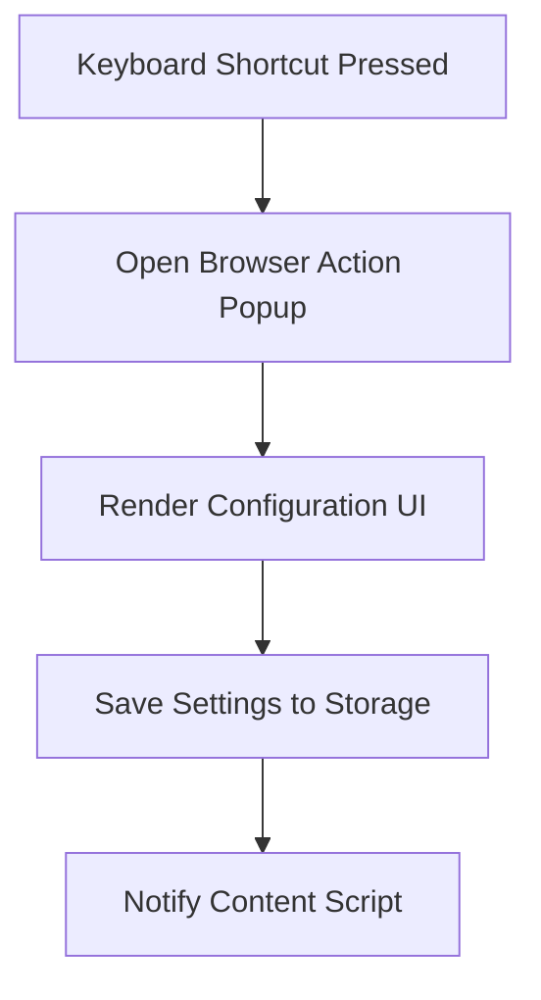
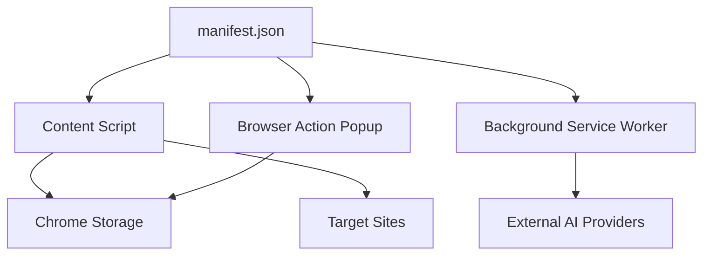

# Manifest Configuration

<cite>
**Referenced Files in This Document**
- [manifest.json](file://manifest.json)
- [dist/manifest.json](file://dist/manifest.json)
- [src/content/content.jsx](file://src/content/content.jsx)
- [src/content.jsx](file://src/content.jsx)
- [src/background.js](file://src/background.js)
- [src/content/adapters/LeetCodeAdapter.js](file://src/content/adapters/LeetCodeAdapter.js)
- [src/content/adapters/HackerRankAdapter.js](file://src/content/adapters/HackerRankAdapter.js)
- [src/content/adapters/GFGAdapter.js](file://src/content/adapters/GFGAdapter.js)
- [src/constants/selectors.js](file://src/constants/selectors.js)
- [src/constants/prompt.js](file://src/constants/prompt.js)
- [src/lib/chromeStorage.js](file://src/lib/chromeStorage.js)
</cite>

## Table of Contents
1. [Introduction](#introduction)
2. [Project Structure](#project-structure)
3. [Core Components](#core-components)
4. [Architecture Overview](#architecture-overview)
5. [Detailed Component Analysis](#detailed-component-analysis)
6. [Dependency Analysis](#dependency-analysis)
7. [Performance Considerations](#performance-considerations)
8. [Troubleshooting Guide](#troubleshooting-guide)
9. [Conclusion](#conclusion)

## Introduction
This document provides comprehensive documentation for DSABuddy's Chrome Extension manifest.json configuration. It explains the manifest v3 structure, covering permissions, host_permissions, content_scripts registration for multiple competitive programming platforms, background service worker setup, browser action popup configuration, web_accessible_resources, keyboard shortcuts, and icon specifications. It also documents the security implications of each permission, best practices for permission minimization, and how the manifest enables cross-origin communication with target platforms.

## Project Structure
The manifest configuration resides in the project root and is built into the distribution folder. The content script integrates with three competitive programming platforms (LeetCode, HackerRank, GeeksforGeeks) and communicates with a background service worker for API calls to external AI providers.

**Diagram sources**
- [manifest.json](file://manifest.json#L1-L74)
- [dist/manifest.json](file://dist/manifest.json#L1-L73)

**Section sources**
- [manifest.json](file://manifest.json#L1-L74)
- [dist/manifest.json](file://dist/manifest.json#L1-L73)

## Core Components
This section outlines the key manifest components and their roles in enabling DSABuddy's functionality.

- Manifest Version: v3
- Name, Version, Description: Identifies the extension and its purpose
- Permissions:
  - storage: Allows persistent storage for user preferences and API keys
  - activeTab: Grants access to the currently active tab for content script injection
  - scripting: Enables programmatic insertion of content scripts and DOM manipulation
- Host Permissions: Extends network access to target websites and external AI providers
- Content Scripts: Injects the React-based UI into supported sites
- Background Service Worker: Handles API requests and model selection
- Browser Action: Provides a popup UI for configuration and controls
- Web Accessible Resources: Exposes assets to target websites
- Keyboard Shortcuts: Adds a global shortcut to open the extension
- Icons: Defines icon sizes for the extension UI

**Section sources**
- [manifest.json](file://manifest.json#L6-L10)
- [manifest.json](file://manifest.json#L11-L28)
- [manifest.json](file://manifest.json#L29-L40)
- [manifest.json](file://manifest.json#L41-L48)
- [manifest.json](file://manifest.json#L49-L58)
- [manifest.json](file://manifest.json#L59-L67)
- [manifest.json](file://manifest.json#L68-L72)

## Architecture Overview
The manifest orchestrates a secure and efficient architecture that enables cross-origin integration with competitive programming platforms while maintaining user privacy and minimizing unnecessary permissions.

**Diagram sources**
- [manifest.json](file://manifest.json#L41-L48)
- [src/content/content.jsx](file://src/content/content.jsx#L152-L181)
- [src/background.js](file://src/background.js#L127-L155)

## Detailed Component Analysis

### Permissions Array
- storage
  - Purpose: Persist user-selected model, API keys, and chat history
  - Security Implication: Read/write access to extension storage; minimal risk when scoped to extension context
  - Best Practice: Store only necessary data; avoid sensitive data in plaintext; use encryption where applicable
- activeTab
  - Purpose: Access the active tab's DOM for content script injection and problem extraction
  - Security Implication: Limited to the active tab; reduces risk of cross-site data theft
  - Best Practice: Use only when necessary; avoid broad tab access
- scripting
  - Purpose: Programmatic injection of content scripts and DOM manipulation
  - Security Implication: Elevated capability to modify page content; requires careful validation
  - Best Practice: Restrict injection to trusted URLs; sanitize inputs and outputs

**Section sources**
- [manifest.json](file://manifest.json#L6-L10)
- [src/lib/chromeStorage.js](file://src/lib/chromeStorage.js#L1-L36)

### Host Permissions
Host permissions enable cross-origin communication with target platforms and external AI providers.

- Target Websites:
  - https://leetcode.com/*
  - https://*.leetcode.com/*
  - https://hackerrank.com/*
  - https://*.hackerrank.com/*
  - https://geeksforgeeks.org/*
  - https://*.geeksforgeeks.org/*
- External AI Providers:
  - https://generativelanguage.googleapis.com/*
  - https://api.openai.com/*
  - https://*.openai.com/*
  - https://api.groq.com/*

Security Implications:
- Cross-Origin Requests: Required for accessing external APIs and platform pages
- Least Privilege: Limit to only necessary hosts; avoid wildcard domains where possible
- HTTPS Enforcement: All hosts use HTTPS to protect data in transit

Best Practices:
- Minimize host permissions to only required domains
- Use specific subpaths when possible
- Regularly audit permissions to remove unused hosts

**Section sources**
- [manifest.json](file://manifest.json#L29-L40)

### Content Scripts Registration
The content script is registered to run on all supported competitive programming platforms.

- Matches:
  - LeetCode, HackerRank, and GeeksforGeeks domains and subdomains
- JavaScript: content.js
- CSS: assets/main-<hash>.css

Integration Details:
- The content script mounts a React-based UI that adapts to each platform
- Platform-specific adapters extract problem statements, user code, and language
- The UI communicates with the background service worker via runtime messaging

**Diagram sources**
- [manifest.json](file://manifest.json#L11-L28)
- [src/content/content.jsx](file://src/content/content.jsx#L89-L98)
- [src/content/adapters/LeetCodeAdapter.js](file://src/content/adapters/LeetCodeAdapter.js#L5-L8)
- [src/content/adapters/HackerRankAdapter.js](file://src/content/adapters/HackerRankAdapter.js#L18-L31)
- [src/content/adapters/GFGAdapter.js](file://src/content/adapters/GFGAdapter.js#L18-L29)

**Section sources**
- [manifest.json](file://manifest.json#L11-L28)
- [src/content/content.jsx](file://src/content/content.jsx#L89-L98)
- [src/content/adapters/LeetCodeAdapter.js](file://src/content/adapters/LeetCodeAdapter.js#L5-L8)
- [src/content/adapters/HackerRankAdapter.js](file://src/content/adapters/HackerRankAdapter.js#L18-L31)
- [src/content/adapters/GFGAdapter.js](file://src/content/adapters/GFGAdapter.js#L18-L29)

### Background Script Configuration (Service Worker)
The background service worker handles API calls to external AI providers and manages model selection.

- Service Worker: background.js
- Type: module
- Messaging: Listens for runtime messages from the content script
- Model Selection: Supports Groq, Gemini, and custom provider configurations
- CORS Bypass: Performs API calls from the background context to avoid browser restrictions

**Diagram sources**
- [manifest.json](file://manifest.json#L45-L48)
- [src/background.js](file://src/background.js#L127-L155)
- [src/background.js](file://src/background.js#L7-L44)
- [src/background.js](file://src/background.js#L46-L83)
- [src/background.js](file://src/background.js#L85-L123)

**Section sources**
- [manifest.json](file://manifest.json#L45-L48)
- [src/background.js](file://src/background.js#L127-L155)

### Browser Action Popup Configuration
The browser action popup provides a user interface for configuration and controls.

- Default Popup: index.html
- Default Title: DSA Buddy
- Shortcut: Ctrl+Shift+D (Windows/Linux), Command+Shift+D (macOS)

**Diagram sources**
- [manifest.json](file://manifest.json#L41-L44)
- [manifest.json](file://manifest.json#L59-L67)
- [src/content/content.jsx](file://src/content/content.jsx#L602-L622)

**Section sources**
- [manifest.json](file://manifest.json#L41-L44)
- [manifest.json](file://manifest.json#L59-L67)
- [src/content/content.jsx](file://src/content/content.jsx#L602-L622)

### Web Accessible Resources
Web accessible resources expose assets to target websites, enabling the content script to apply styles consistently.

- Resources: assets/*
- Matches: <all_urls>

Security Considerations:
- Expose only necessary assets
- Avoid exposing sensitive files
- Use hashed filenames to prevent cache poisoning

**Section sources**
- [manifest.json](file://manifest.json#L49-L58)

### Keyboard Shortcuts
The manifest defines a global keyboard shortcut to open the extension popup.

- Command: _execute_action
- Default: Ctrl+Shift+D
- macOS: Command+Shift+D
- Description: Open DSA Buddy

Implementation:
- The shortcut triggers the browser action, which opens the popup
- The popup can then trigger content script injection on supported sites

**Section sources**
- [manifest.json](file://manifest.json#L59-L67)

### Icon Specifications
The manifest defines icons for different UI contexts.

- Sizes: 16, 48, 128
- Assets: icons/data.png, icons/diagram.png, icons/hierarchical-structure.png

Best Practices:
- Provide multiple sizes for different contexts (toolbar, popup, notifications)
- Use vector graphics when possible for scalability
- Ensure icons are recognizable and brand-consistent

**Section sources**
- [manifest.json](file://manifest.json#L68-L72)

## Dependency Analysis
The manifest establishes dependencies between components and external systems.

**Diagram sources**
- [manifest.json](file://manifest.json#L1-L74)
- [src/content/content.jsx](file://src/content/content.jsx#L23-L42)
- [src/background.js](file://src/background.js#L127-L155)

**Section sources**
- [manifest.json](file://manifest.json#L1-L74)
- [src/content/content.jsx](file://src/content/content.jsx#L23-L42)
- [src/background.js](file://src/background.js#L127-L155)

## Performance Considerations
- Permission Minimization: Only grant necessary permissions to reduce attack surface
- Content Script Efficiency: Keep content script lightweight; defer heavy operations to the background
- API Call Optimization: Batch requests and cache responses where appropriate
- Resource Loading: Use hashed asset filenames and leverage browser caching
- Memory Management: Unmount React components when leaving supported sites

## Troubleshooting Guide
Common issues and resolutions:

- Content Script Not Loading
  - Verify matches in manifest content_scripts
  - Check that activeTab and scripting permissions are granted
  - Confirm that the content script is built and included in the extension bundle

- Cross-Origin API Errors
  - Ensure host_permissions include the external AI provider domains
  - Verify HTTPS endpoints are used
  - Check that the background service worker performs API calls

- Popup Not Opening
  - Confirm browser action popup path is correct
  - Verify keyboard shortcut is not conflicting with other extensions
  - Check that the popup HTML is present in the extension bundle

- Storage Issues
  - Validate storage keys and scopes
  - Ensure storage operations are awaited properly
  - Check for storage quota limits

**Section sources**
- [manifest.json](file://manifest.json#L11-L28)
- [manifest.json](file://manifest.json#L29-L40)
- [manifest.json](file://manifest.json#L41-L44)
- [src/lib/chromeStorage.js](file://src/lib/chromeStorage.js#L1-L36)

## Conclusion
DSABuddy's manifest configuration provides a secure and efficient foundation for integrating with competitive programming platforms while enabling powerful AI-assisted problem-solving. By carefully managing permissions, leveraging a service worker for cross-origin communication, and structuring content scripts for platform-specific adaptation, the extension delivers a seamless user experience. Following the outlined best practices ensures continued security and performance as the extension evolves.