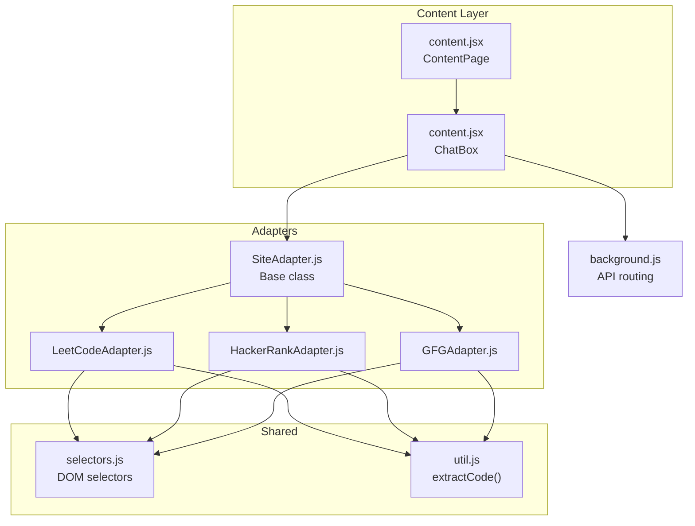
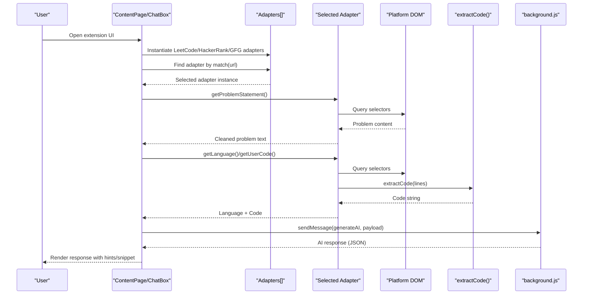
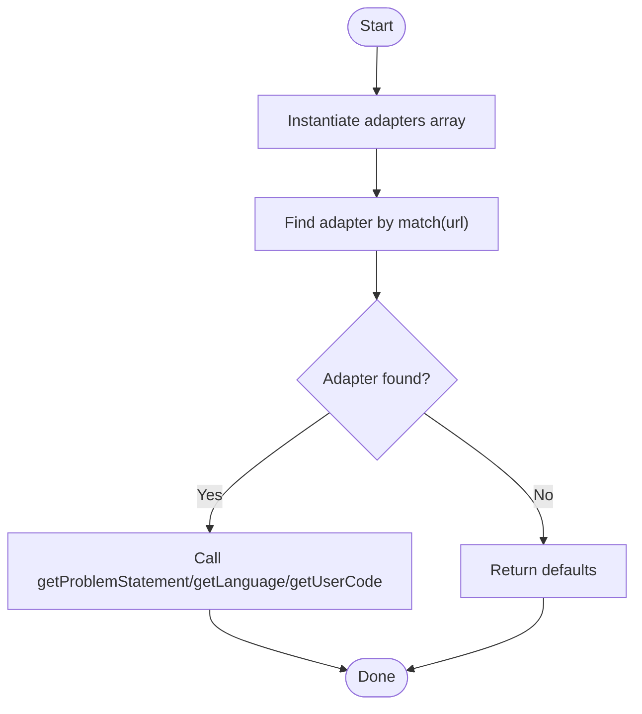
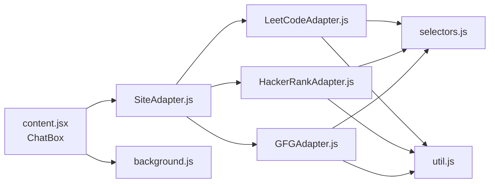

# Adapter Pattern System

<cite>
**Referenced Files in This Document**
- [SiteAdapter.js](file://src/content/adapters/SiteAdapter.js)
- [LeetCodeAdapter.js](file://src/content/adapters/LeetCodeAdapter.js)
- [HackerRankAdapter.js](file://src/content/adapters/HackerRankAdapter.js)
- [GFGAdapter.js](file://src/content/adapters/GFGAdapter.js)
- [selectors.js](file://src/constants/selectors.js)
- [util.js](file://src/content/util.js)
- [content.jsx](file://src/content/content.jsx)
- [content.jsx](file://src/content.jsx)
- [background.js](file://src/background.js)
</cite>

## Table of Contents
1. [Introduction](#introduction)
2. [Project Structure](#project-structure)
3. [Core Components](#core-components)
4. [Architecture Overview](#architecture-overview)
5. [Detailed Component Analysis](#detailed-component-analysis)
6. [Dependency Analysis](#dependency-analysis)
7. [Performance Considerations](#performance-considerations)
8. [Troubleshooting Guide](#troubleshooting-guide)
9. [Conclusion](#conclusion)

## Introduction
This document explains the adapter pattern system used for platform-specific integrations in the DSA Buddy Chrome extension. The system enables the extension to extract problem statements, user code, and programming language information from multiple competitive programming platforms (LeetCode, HackerRank, GeeksforGeeks) while maintaining a consistent interface across platforms. It covers the abstract SiteAdapter base class, platform-specific implementations, selector-based DOM targeting, adapter registration and selection, and robust error handling for dynamic content loading.

## Project Structure
The adapter pattern is implemented within the content script and constants modules:
- Adapters: Platform-specific implementations of SiteAdapter
- Selectors: Shared DOM selectors for each platform
- Utilities: Helper functions for code extraction
- Content scripts: Orchestration of adapter instantiation, matching, and data extraction

**Diagram sources**
- [content.jsx](file://src/content/content.jsx#L89-L98)
- [content.jsx](file://src/content/content.jsx#L122-L135)
- [SiteAdapter.js](file://src/content/adapters/SiteAdapter.js#L1-L27)
- [LeetCodeAdapter.js](file://src/content/adapters/LeetCodeAdapter.js#L1-L51)
- [HackerRankAdapter.js](file://src/content/adapters/HackerRankAdapter.js#L1-L86)
- [GFGAdapter.js](file://src/content/adapters/GFGAdapter.js#L1-L84)
- [selectors.js](file://src/constants/selectors.js#L1-L27)
- [util.js](file://src/content/util.js#L1-L8)
- [background.js](file://src/background.js#L127-L155)

**Section sources**
- [content.jsx](file://src/content/content.jsx#L1-L760)
- [SiteAdapter.js](file://src/content/adapters/SiteAdapter.js#L1-L27)
- [selectors.js](file://src/constants/selectors.js#L1-L27)

## Core Components
- SiteAdapter: Abstract base class defining the contract for platform-specific adapters. It enforces implementation of match(), getProblemStatement(), getUserCode(), getLanguage(), and getProblemName().
- Platform Adapters: Concrete implementations for LeetCode, HackerRank, and GeeksforGeeks, each overriding the base methods to extract platform-specific data.
- Selectors: Centralized DOM selectors for each platform, enabling consistent targeting across adapters.
- Utilities: Helper functions for extracting code from DOM elements.
- Content Scripts: Instantiate adapters, detect the current platform, and orchestrate data extraction and API communication.

**Section sources**
- [SiteAdapter.js](file://src/content/adapters/SiteAdapter.js#L1-L27)
- [LeetCodeAdapter.js](file://src/content/adapters/LeetCodeAdapter.js#L1-L51)
- [HackerRankAdapter.js](file://src/content/adapters/HackerRankAdapter.js#L1-L86)
- [GFGAdapter.js](file://src/content/adapters/GFGAdapter.js#L1-L84)
- [selectors.js](file://src/constants/selectors.js#L1-L27)
- [util.js](file://src/content/util.js#L1-L8)
- [content.jsx](file://src/content/content.jsx#L89-L98)
- [content.jsx](file://src/content/content.jsx#L122-L135)

## Architecture Overview
The system follows a classic adapter pattern:
- A base interface (SiteAdapter) defines the methods that each platform adapter must implement.
- Platform adapters encapsulate platform-specific logic for DOM traversal, content extraction, and metadata identification.
- A centralized content script instantiates adapters and selects the appropriate one based on the current URL.
- Selectors and utilities are shared across adapters to reduce duplication and improve maintainability.

**Diagram sources**
- [content.jsx](file://src/content/content.jsx#L89-L98)
- [content.jsx](file://src/content/content.jsx#L122-L135)
- [LeetCodeAdapter.js](file://src/content/adapters/LeetCodeAdapter.js#L10-L28)
- [HackerRankAdapter.js](file://src/content/adapters/HackerRankAdapter.js#L33-L43)
- [GFGAdapter.js](file://src/content/adapters/GFGAdapter.js#L31-L41)
- [util.js](file://src/content/util.js#L1-L8)
- [background.js](file://src/background.js#L127-L155)

## Detailed Component Analysis

### SiteAdapter Base Class
- Purpose: Defines the contract for platform adapters and prevents instantiation of the abstract class.
- Methods:
  - match(url): Determines if the adapter applies to the given URL.
  - getProblemStatement(): Extracts the problem description from the DOM.
  - getUserCode(): Extracts the user’s current code from the editor.
  - getLanguage(): Identifies the programming language from the DOM.
  - getProblemName(): Generates a stable problem identifier.

Implementation pattern:
- Throws descriptive errors for unimplemented methods to enforce contract compliance.
- Enforced via constructor guard to prevent direct instantiation.

**Section sources**
- [SiteAdapter.js](file://src/content/adapters/SiteAdapter.js#L1-L27)

### LeetCodeAdapter
- match(url): Checks for LeetCode problem URLs.
- getProblemStatement():
  - Attempts to locate the full description container using multiple selectors.
  - Falls back to meta description if the primary container is unavailable.
  - Truncates content to manage token limits.
- getUserCode():
  - Uses shared selectors to collect editor lines and extracts code via extractCode().
- getLanguage():
  - Reads the language button text to determine the selected language.
  - Defaults to UNKNOWN if not found.
- getProblemName():
  - Parses the problem slug from the URL.

Selector usage:
- LeetCode-specific selectors are defined centrally and reused.

**Section sources**
- [LeetCodeAdapter.js](file://src/content/adapters/LeetCodeAdapter.js#L1-L51)
- [selectors.js](file://src/constants/selectors.js#L2-L7)
- [util.js](file://src/content/util.js#L1-L8)

### HackerRankAdapter
- match(url):
  - Validates hostname and checks for challenge/test/contest paths.
  - Uses URL parsing for robustness and returns false on exceptions.
- getProblemStatement():
  - Uses a helper to find the first element with sufficient text length.
  - Falls back to meta description if needed.
- getUserCode():
  - Targets Monaco editor lines and falls back to selectors if Monaco is not present.
- getLanguage():
  - Handles both SELECT and non-SELECT elements, extracting normalized text.
  - Returns UNKNOWN if no suitable candidate is found.
- getProblemName():
  - Normalizes and formats the problem title, with fallbacks to URL parsing.

Normalization helpers:
- normalizeText() and firstElementByText() improve robustness across dynamic content.

**Section sources**
- [HackerRankAdapter.js](file://src/content/adapters/HackerRankAdapter.js#L1-L86)
- [selectors.js](file://src/constants/selectors.js#L8-L16)
- [util.js](file://src/content/util.js#L1-L8)

### GFGAdapter
- match(url):
  - Validates hostname and checks for problem/problem pages.
  - Uses URL parsing for safety.
- getProblemStatement():
  - Similar strategy to HackerRank: finds sufficiently long text or falls back to meta description.
- getUserCode():
  - Targets Monaco editor lines or falls back to selectors.
- getLanguage():
  - Handles SELECT and text-based candidates with normalization.
- getProblemName():
  - Normalizes and formats the title, with URL-based fallback.

**Section sources**
- [GFGAdapter.js](file://src/content/adapters/GFGAdapter.js#L1-L84)
- [selectors.js](file://src/constants/selectors.js#L17-L26)
- [util.js](file://src/content/util.js#L1-L8)

### Selector-Based DOM Targeting
- Centralized selectors:
  - LeetCode: meta description, user code lines, language button.
  - HackerRank: problem title/statement, editor lines, language selector.
  - GeeksforGeeks: problem title/statement, editor lines, language selector.
- Benefits:
  - Reduces duplication across adapters.
  - Simplifies maintenance when platform DOM changes.

**Section sources**
- [selectors.js](file://src/constants/selectors.js#L1-L27)

### Adapter Registration and Selection Mechanism
- Instantiation:
  - Adapters are instantiated in arrays within ContentPage and ChatBox.
- Matching:
  - The first adapter whose match(url) returns true is selected.
- Extraction:
  - After selection, the chosen adapter’s methods are invoked to gather problem statement, language, and user code.
- Dynamic content handling:
  - A MutationObserver monitors document changes to update the problem statement reactively.

**Diagram sources**
- [content.jsx](file://src/content/content.jsx#L89-L98)
- [content.jsx](file://src/content/content.jsx#L122-L135)
- [content.jsx](file://src/content/content.jsx#L569-L580)

**Section sources**
- [content.jsx](file://src/content/content.jsx#L89-L98)
- [content.jsx](file://src/content/content.jsx#L122-L135)
- [content.jsx](file://src/content/content.jsx#L569-L580)

### Platform-Specific DOM Manipulation Strategies
- LeetCode:
  - Uses multiple selectors to locate the description container and language button.
  - Employs truncation to avoid token limits.
- HackerRank:
  - Uses a normalization helper to handle whitespace and mixed content.
  - Falls back to meta description when the primary content is unavailable.
- GeeksforGeeks:
  - Similar normalization and fallback strategy as HackerRank.
  - Targets Monaco editor lines when present.

**Section sources**
- [LeetCodeAdapter.js](file://src/content/adapters/LeetCodeAdapter.js#L10-L28)
- [HackerRankAdapter.js](file://src/content/adapters/HackerRankAdapter.js#L33-L43)
- [GFGAdapter.js](file://src/content/adapters/GFGAdapter.js#L31-L41)

### Error Handling for Dynamic Content Loading
- URL parsing:
  - Adapters use URL parsing to avoid errors from malformed URLs.
- Fallback mechanisms:
  - Selectors and meta descriptions serve as fallbacks when primary targets are missing.
- MutationObserver:
  - Continuously monitors DOM changes to refresh problem statements on SPAs.
- Rate limiting:
  - Content script parses rate limit messages and displays countdown timers.

**Section sources**
- [HackerRankAdapter.js](file://src/content/adapters/HackerRankAdapter.js#L19-L31)
- [GFGAdapter.js](file://src/content/adapters/GFGAdapter.js#L19-L29)
- [content.jsx](file://src/content/content.jsx#L584-L586)
- [content.jsx](file://src/content/content.jsx#L184-L186)

## Dependency Analysis
The adapter system exhibits low coupling and high cohesion:
- SiteAdapter defines a stable interface.
- Each adapter depends on shared selectors and utilities.
- Content scripts depend on adapters but not on platform-specific logic.
- background.js handles API communication independently.

**Diagram sources**
- [SiteAdapter.js](file://src/content/adapters/SiteAdapter.js#L1-L27)
- [LeetCodeAdapter.js](file://src/content/adapters/LeetCodeAdapter.js#L1-L51)
- [HackerRankAdapter.js](file://src/content/adapters/HackerRankAdapter.js#L1-L86)
- [GFGAdapter.js](file://src/content/adapters/GFGAdapter.js#L1-L84)
- [selectors.js](file://src/constants/selectors.js#L1-L27)
- [util.js](file://src/content/util.js#L1-L8)
- [content.jsx](file://src/content/content.jsx#L122-L135)
- [background.js](file://src/background.js#L127-L155)

**Section sources**
- [content.jsx](file://src/content/content.jsx#L122-L135)
- [SiteAdapter.js](file://src/content/adapters/SiteAdapter.js#L1-L27)

## Performance Considerations
- Selector specificity:
  - Prefer precise selectors to minimize DOM traversal overhead.
- Content truncation:
  - Limit extracted content lengths to manage token usage and reduce payload sizes.
- Observer scope:
  - Monitor only necessary DOM subtrees to reduce mutation observer overhead.
- API payload limits:
  - Truncate user code before sending to the background script to stay within free-tier limits.

## Troubleshooting Guide
Common issues and resolutions:
- Adapter not detected:
  - Verify match() logic for the platform URL and ensure selectors are still valid.
- Empty problem statement:
  - Confirm that fallback selectors (meta description) are present and accessible.
- Incorrect language detection:
  - Check language selector availability and normalization logic.
- Rate limiting:
  - Inspect rate limit messages and ensure the countdown timer is displayed.

**Section sources**
- [content.jsx](file://src/content/content.jsx#L184-L186)
- [LeetCodeAdapter.js](file://src/content/adapters/LeetCodeAdapter.js#L25-L28)
- [HackerRankAdapter.js](file://src/content/adapters/HackerRankAdapter.js#L39-L42)
- [GFGAdapter.js](file://src/content/adapters/GFGAdapter.js#L37-L40)

## Conclusion
The adapter pattern system provides a clean, extensible way to integrate multiple competitive programming platforms. By centralizing selectors and utilities, enforcing a strict interface, and leveraging reactive DOM observation, the system remains maintainable and resilient to platform changes. The separation of concerns ensures that content extraction logic is isolated within platform adapters, while the content scripts remain focused on orchestration and user interaction.