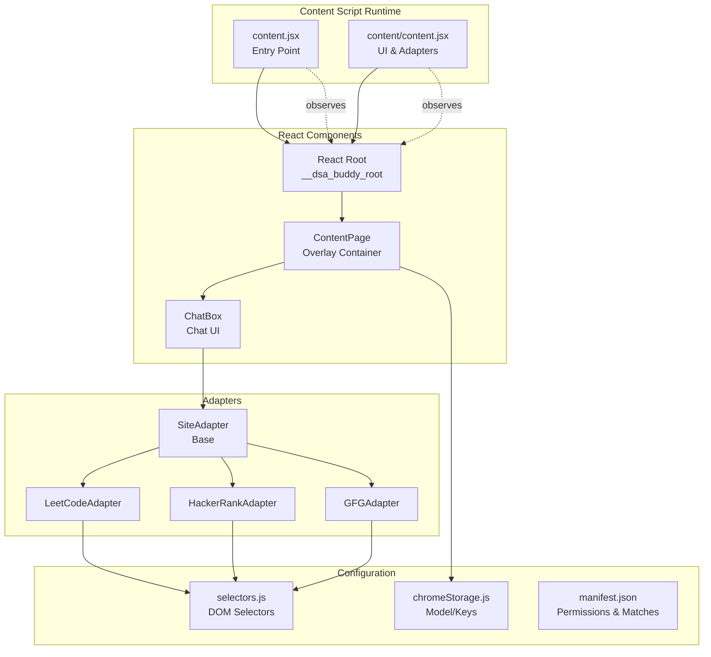
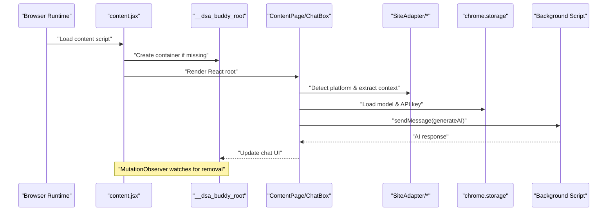
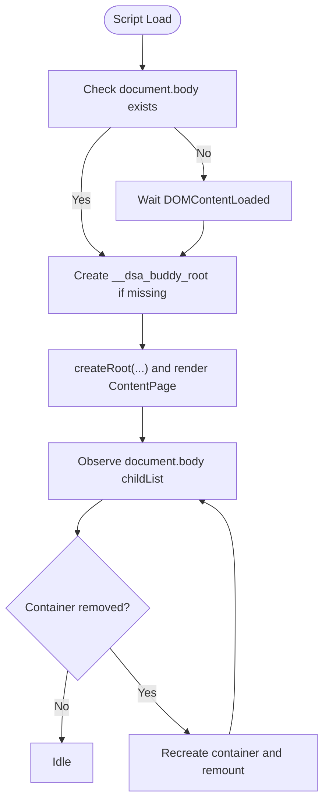
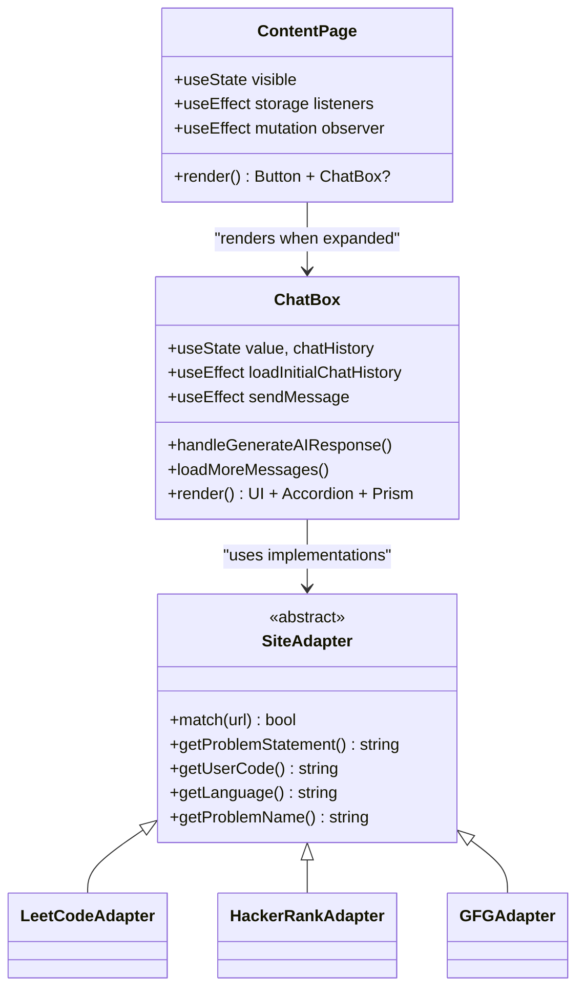
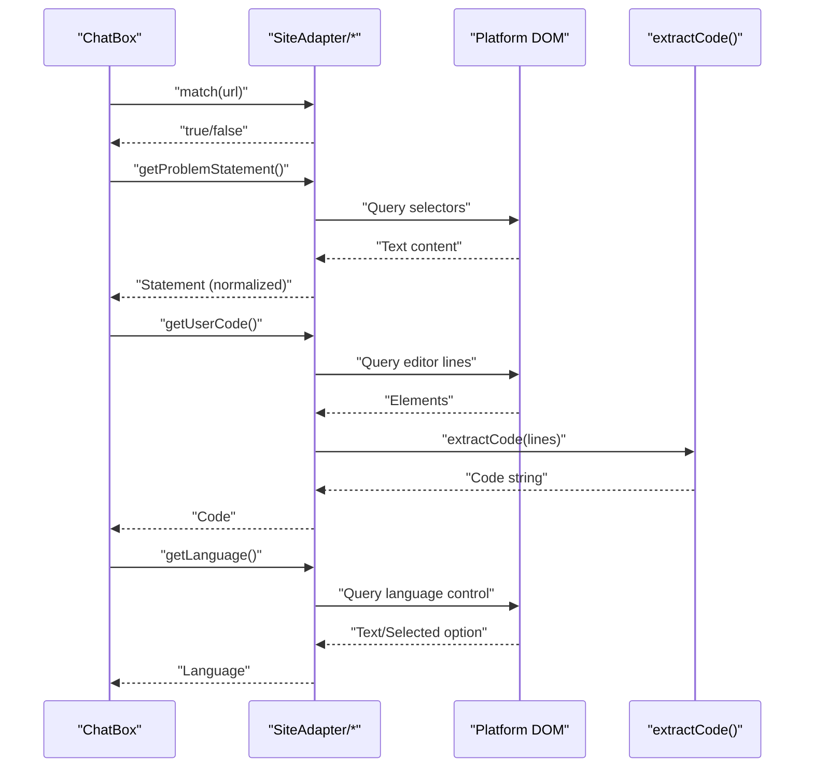
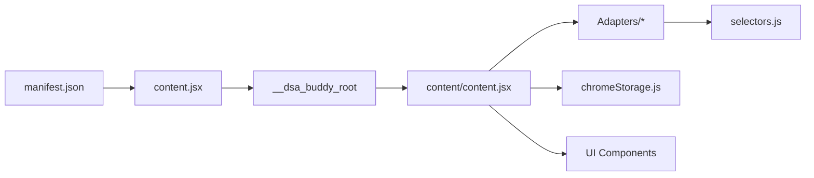

# Content Script Architecture

<cite>
**Referenced Files in This Document**
- [src/content/content.jsx](file://src/content/content.jsx)
- [src/content.jsx](file://src/content.jsx)
- [src/content/adapters/SiteAdapter.js](file://src/content/adapters/SiteAdapter.js)
- [src/content/adapters/LeetCodeAdapter.js](file://src/content/adapters/LeetCodeAdapter.js)
- [src/content/adapters/HackerRankAdapter.js](file://src/content/adapters/HackerRankAdapter.js)
- [src/content/adapters/GFGAdapter.js](file://src/content/adapters/GFGAdapter.js)
- [src/constants/selectors.js](file://src/constants/selectors.js)
- [src/lib/chromeStorage.js](file://src/lib/chromeStorage.js)
- [manifest.json](file://manifest.json)
- [src/App.jsx](file://src/App.jsx)
- [src/components/ui/button.jsx](file://src/components/ui/button.jsx)
- [src/components/Show.jsx](file://src/components/Show.jsx)
</cite>

## Table of Contents
1. [Introduction](#introduction)
2. [Project Structure](#project-structure)
3. [Core Components](#core-components)
4. [Architecture Overview](#architecture-overview)
5. [Detailed Component Analysis](#detailed-component-analysis)
6. [Dependency Analysis](#dependency-analysis)
7. [Performance Considerations](#performance-considerations)
8. [Cross-Browser Compatibility](#cross-browser-compatibility)
9. [Troubleshooting Guide](#troubleshooting-guide)
10. [Conclusion](#conclusion)

## Introduction
This document explains the content script architecture that injects a React-powered overlay UI into external coding platforms (LeetCode, HackerRank, GeeksforGeeks). It covers the DOM injection strategy using MutationObserver to support Single Page Application (SPA) navigation, the React component hierarchy (ContentPage and ChatBox), fixed positioning and z-index management, cross-browser compatibility considerations, and performance optimization techniques.

## Project Structure
The content script entry point and React rendering pipeline are implemented in two complementary files:
- A lightweight content entry that creates a dedicated container and mounts the root component.
- A richer content module that encapsulates the full UI logic, adapter-based site integration, and SPA-aware re-injection.

**Diagram sources**
- [src/content.jsx](file://src/content.jsx#L1-L35)
- [src/content/content.jsx](file://src/content/content.jsx#L1-L760)
- [src/content/adapters/SiteAdapter.js](file://src/content/adapters/SiteAdapter.js#L1-L28)
- [src/content/adapters/LeetCodeAdapter.js](file://src/content/adapters/LeetCodeAdapter.js#L1-L51)
- [src/content/adapters/HackerRankAdapter.js](file://src/content/adapters/HackerRankAdapter.js#L1-L86)
- [src/content/adapters/GFGAdapter.js](file://src/content/adapters/GFGAdapter.js#L1-L84)
- [src/constants/selectors.js](file://src/constants/selectors.js#L1-L27)
- [src/lib/chromeStorage.js](file://src/lib/chromeStorage.js#L1-L36)
- [manifest.json](file://manifest.json#L1-L74)

**Section sources**
- [src/content.jsx](file://src/content.jsx#L1-L35)
- [src/content/content.jsx](file://src/content/content.jsx#L1-L760)
- [manifest.json](file://manifest.json#L1-L74)

## Core Components
- ContentPage: Fixed-position overlay container that manages visibility, adapts to platform-specific problem contexts, loads model and keys from storage, and hosts ChatBox.
- ChatBox: Interactive chat UI that fetches problem context via adapters, streams AI responses through the background script, manages pagination and rate limiting, and renders structured hints/code snippets.
- SiteAdapter family: Platform-specific adapters for LeetCode, HackerRank, and GeeksforGeeks that extract problem statements, current user code, and language metadata.

Key responsibilities:
- DOM injection and re-injection using MutationObserver to survive SPA navigation.
- Fixed overlay with high z-index to remain above platform UI.
- Cross-platform DOM selector normalization and robust fallbacks.
- Storage-driven model/key configuration and live updates.

**Section sources**
- [src/content/content.jsx](file://src/content/content.jsx#L61-L760)
- [src/content/adapters/SiteAdapter.js](file://src/content/adapters/SiteAdapter.js#L1-L28)
- [src/content/adapters/LeetCodeAdapter.js](file://src/content/adapters/LeetCodeAdapter.js#L1-L51)
- [src/content/adapters/HackerRankAdapter.js](file://src/content/adapters/HackerRankAdapter.js#L1-L86)
- [src/content/adapters/GFGAdapter.js](file://src/content/adapters/GFGAdapter.js#L1-L84)

## Architecture Overview
The content script architecture consists of:
- A minimal content entry that ensures a persistent container exists and mounts the React root.
- A rich content module that:
  - Renders the overlay UI with fixed positioning.
  - Uses MutationObserver to detect when SPA navigation removes the container and re-injects it.
  - Integrates platform adapters to extract context for AI prompts.
  - Manages model selection and API keys via Chrome storage.
  - Communicates with the background script for API calls to bypass CORS.

**Diagram sources**
- [src/content.jsx](file://src/content.jsx#L1-L35)
- [src/content/content.jsx](file://src/content/content.jsx#L555-L760)
- [src/content/adapters/SiteAdapter.js](file://src/content/adapters/SiteAdapter.js#L1-L28)
- [src/lib/chromeStorage.js](file://src/lib/chromeStorage.js#L1-L36)

## Detailed Component Analysis

### DOM Injection and SPA Navigation Support
- Initial injection: Creates a dedicated container element and mounts the React root when the document body is ready.
- Re-injection: A MutationObserver monitors direct children of the document body. If the container is removed (common during SPA navigation), the script re-creates it and re-mounts the UI.
- Strategy rationale: Using subtree: false for the body observer reduces overhead by focusing on top-level removals typical in SPA frameworks.

**Diagram sources**
- [src/content.jsx](file://src/content.jsx#L8-L35)
- [src/content/content.jsx](file://src/content/content.jsx#L725-L760)

**Section sources**
- [src/content.jsx](file://src/content.jsx#L1-L35)
- [src/content/content.jsx](file://src/content/content.jsx#L725-L760)

### React Component Hierarchy: ContentPage and ChatBox
- ContentPage:
  - Fixed overlay with extremely high z-index to stay above platform UI.
  - Visibility toggled by a floating bot button.
  - Loads model and keys from storage and listens for storage changes.
  - Uses MutationObserver to update problem context on SPA navigation.
  - Hosts ChatBox when expanded and visible.
- ChatBox:
  - Maintains chat history and paginates older messages.
  - Extracts problem context via adapters and sends messages to the background script.
  - Handles rate-limiting with a countdown and displays structured hints/code snippets.
  - Integrates with Prism for syntax-highlighted code display.

**Diagram sources**
- [src/content/content.jsx](file://src/content/content.jsx#L61-L760)
- [src/content/adapters/SiteAdapter.js](file://src/content/adapters/SiteAdapter.js#L1-L28)
- [src/content/adapters/LeetCodeAdapter.js](file://src/content/adapters/LeetCodeAdapter.js#L1-L51)
- [src/content/adapters/HackerRankAdapter.js](file://src/content/adapters/HackerRankAdapter.js#L1-L86)
- [src/content/adapters/GFGAdapter.js](file://src/content/adapters/GFGAdapter.js#L1-L84)

**Section sources**
- [src/content/content.jsx](file://src/content/content.jsx#L555-L760)
- [src/content/adapters/SiteAdapter.js](file://src/content/adapters/SiteAdapter.js#L1-L28)

### Adapter Pattern and Platform-Specific Extraction
- SiteAdapter defines the contract for platform-specific extraction.
- LeetCodeAdapter, HackerRankAdapter, and GFGAdapter implement extraction of:
  - Problem statement with fallbacks to meta tags.
  - Current user code from editor DOM nodes.
  - Programming language from UI controls.
  - Problem name for chat history scoping.
- Selectors are centralized to minimize duplication and improve maintainability.

**Diagram sources**
- [src/content/content.jsx](file://src/content/content.jsx#L89-L140)
- [src/content/adapters/LeetCodeAdapter.js](file://src/content/adapters/LeetCodeAdapter.js#L10-L43)
- [src/content/adapters/HackerRankAdapter.js](file://src/content/adapters/HackerRankAdapter.js#L33-L69)
- [src/content/adapters/GFGAdapter.js](file://src/content/adapters/GFGAdapter.js#L31-L67)
- [src/constants/selectors.js](file://src/constants/selectors.js#L1-L27)
- [src/content/util.js](file://src/content/util.js#L1-L8)

**Section sources**
- [src/content/content.jsx](file://src/content/content.jsx#L89-L140)
- [src/content/adapters/LeetCodeAdapter.js](file://src/content/adapters/LeetCodeAdapter.js#L1-L51)
- [src/content/adapters/HackerRankAdapter.js](file://src/content/adapters/HackerRankAdapter.js#L1-L86)
- [src/content/adapters/GFGAdapter.js](file://src/content/adapters/GFGAdapter.js#L1-L84)
- [src/constants/selectors.js](file://src/constants/selectors.js#L1-L27)
- [src/content/util.js](file://src/content/util.js#L1-L8)

### Fixed Positioning and Z-Index Management
- Overlay container is fixed positioned near the viewport corner.
- Extremely high z-index ensures visibility above platform overlays and modals.
- The floating bot button remains accessible at all times.

Best practices:
- Keep z-index high but avoid global page-wide stacking contexts.
- Prefer fixed positioning for persistent overlays.
- Ensure sufficient padding/margins to prevent overlap with platform UI controls.

**Section sources**
- [src/content/content.jsx](file://src/content/content.jsx#L631-L719)

### Storage Integration and Live Updates
- Model and API key are loaded from Chrome storage and updated when the popup saves new settings.
- The content script listens for storage changes and refreshes UI accordingly.

**Section sources**
- [src/content/content.jsx](file://src/content/content.jsx#L602-L622)
- [src/lib/chromeStorage.js](file://src/lib/chromeStorage.js#L1-L36)
- [src/App.jsx](file://src/App.jsx#L56-L87)

## Dependency Analysis
- Content entry depends on the React root and the overlay container.
- Content module depends on:
  - Adapters for platform-specific DOM extraction.
  - Selectors for robust DOM queries.
  - Chrome storage for model/key configuration.
  - Manifest permissions for host access and content script injection.
- UI components depend on shared design primitives and animations.

**Diagram sources**
- [manifest.json](file://manifest.json#L1-L74)
- [src/content.jsx](file://src/content.jsx#L1-L35)
- [src/content/content.jsx](file://src/content/content.jsx#L1-L760)
- [src/content/adapters/SiteAdapter.js](file://src/content/adapters/SiteAdapter.js#L1-L28)
- [src/constants/selectors.js](file://src/constants/selectors.js#L1-L27)
- [src/lib/chromeStorage.js](file://src/lib/chromeStorage.js#L1-L36)

**Section sources**
- [manifest.json](file://manifest.json#L1-L74)
- [src/content.jsx](file://src/content.jsx#L1-L35)
- [src/content/content.jsx](file://src/content/content.jsx#L1-L760)

## Performance Considerations
- MutationObserver scope: Monitor only direct children of the body to reduce observation overhead.
- Debounce or throttle expensive DOM reads (already implicit via targeted observers).
- Limit payload sizes: Truncate user code and restrict message history to avoid token limits.
- Efficient rendering: Use memoization and conditional rendering for heavy components.
- Avoid unnecessary re-renders: Keep state granular and update only when needed.
- CSS animations: Prefer hardware-accelerated properties for smooth transitions.

[No sources needed since this section provides general guidance]

## Cross-Browser Compatibility
- Manifest v3 permissions and matches define supported hosts and capabilities.
- Content script injection is controlled by matches; ensure selectors and APIs used are available on target browsers.
- Storage APIs are provided by the extension runtime; verify availability across browsers.

Recommendations:
- Test on Chromium-based browsers first; validate selectors on target sites.
- Avoid browser-specific APIs unless absolutely necessary.
- Keep DOM queries resilient with fallbacks.

**Section sources**
- [manifest.json](file://manifest.json#L11-L27)

## Troubleshooting Guide
Common issues and resolutions:
- Container removed during navigation:
  - Verify MutationObserver is observing the correct parent and childList changes are detected.
  - Confirm the container ID is unique and not inadvertently removed by the platform.
- Adapters failing to extract content:
  - Check selectors for correctness and update them if platform DOM changes.
  - Validate fallbacks (meta tags) are present.
- Rate limiting errors:
  - Inspect rate limit countdown and adjust usage frequency.
  - Review truncation logic for code and message history.
- Storage not updating:
  - Ensure storage change listeners are registered and the popup writes to storage correctly.

**Section sources**
- [src/content/content.jsx](file://src/content/content.jsx#L584-L599)
- [src/content/content.jsx](file://src/content/content.jsx#L183-L197)
- [src/content/adapters/LeetCodeAdapter.js](file://src/content/adapters/LeetCodeAdapter.js#L10-L28)
- [src/content/adapters/HackerRankAdapter.js](file://src/content/adapters/HackerRankAdapter.js#L33-L43)
- [src/content/adapters/GFGAdapter.js](file://src/content/adapters/GFGAdapter.js#L31-L41)
- [src/lib/chromeStorage.js](file://src/lib/chromeStorage.js#L28-L36)

## Conclusion
The content script architecture cleanly separates concerns between DOM injection, UI rendering, and platform-specific context extraction. By leveraging MutationObserver for SPA navigation resilience, a robust adapter pattern for multiple platforms, and careful z-index management, the overlay remains reliable and user-friendly. Performance and cross-browser considerations further ensure stability across diverse environments.