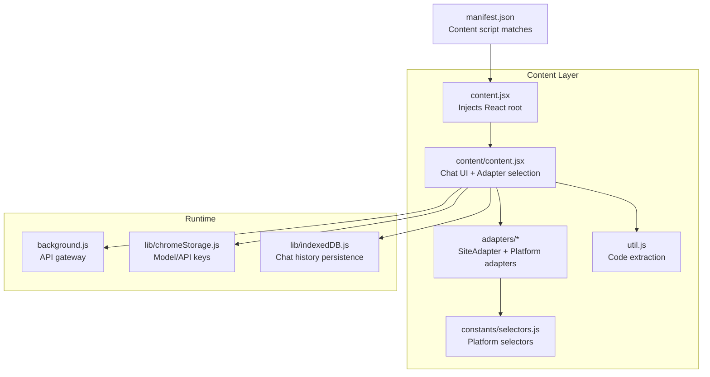
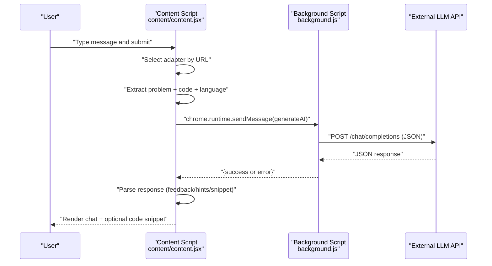
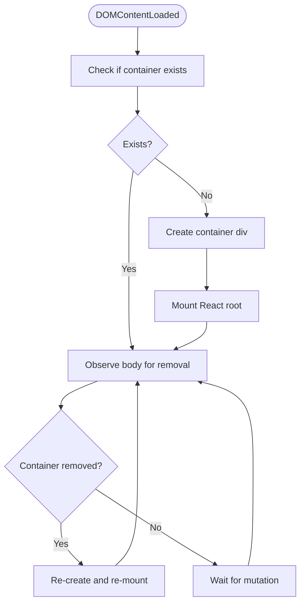
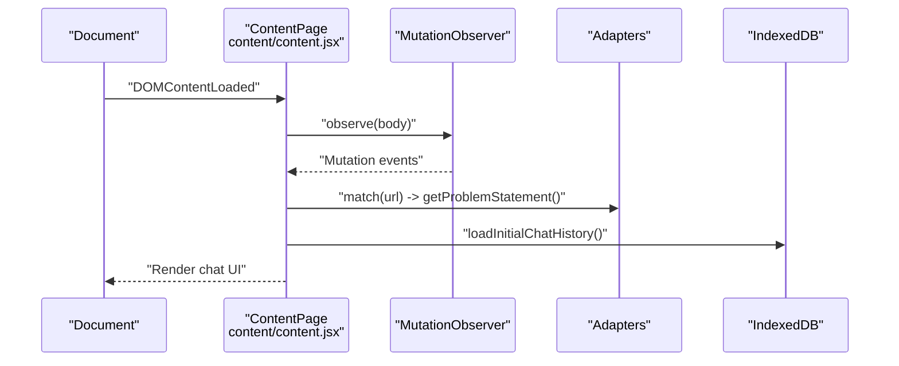
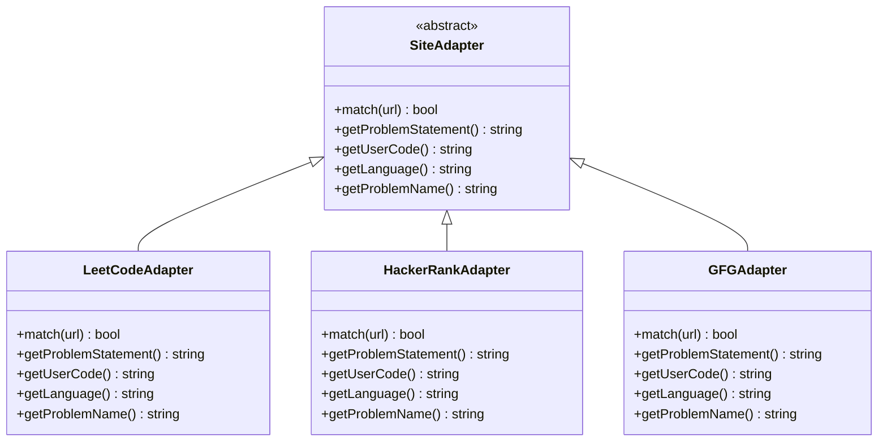
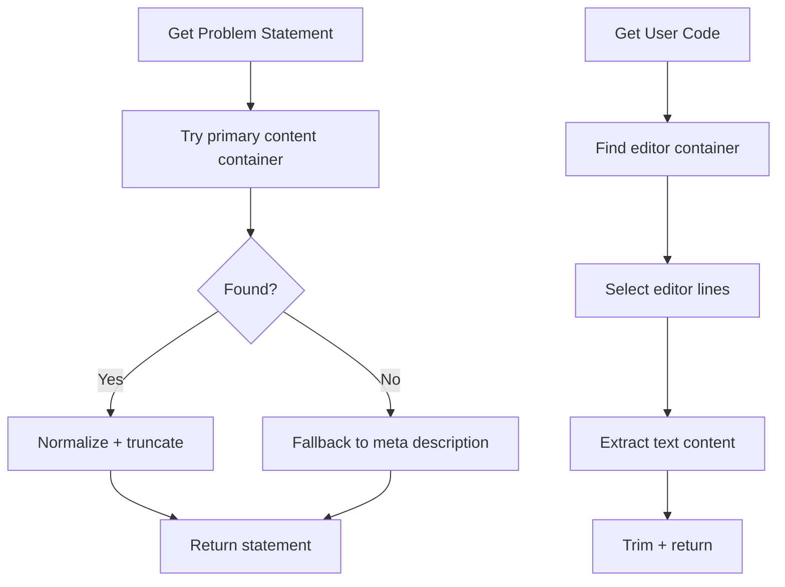
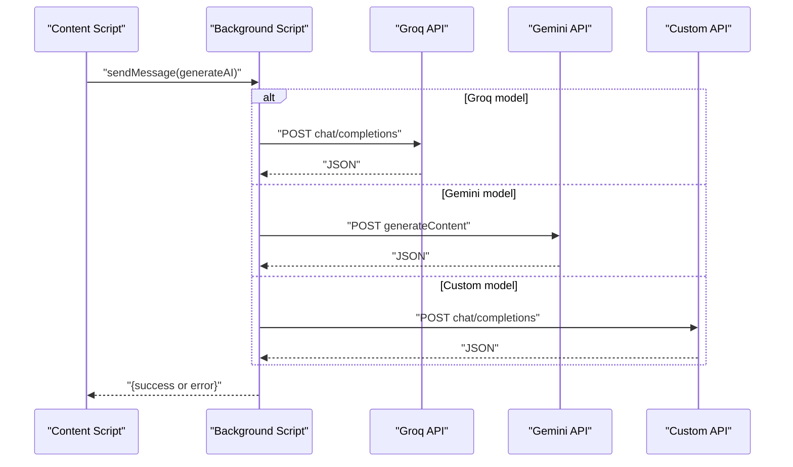
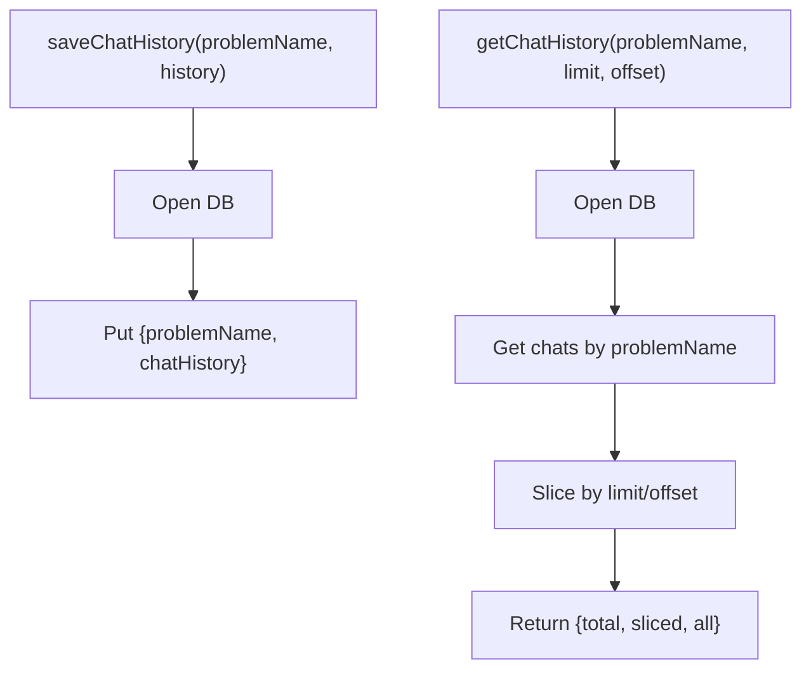
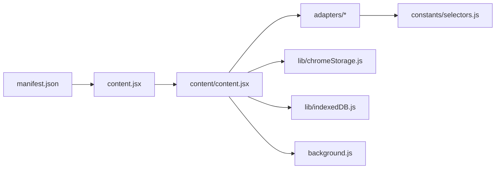

# Content Script Integration

<cite>
**Referenced Files in This Document**
- [content.jsx](file://src/content.jsx)
- [content/content.jsx](file://src/content/content.jsx)
- [adapters/SiteAdapter.js](file://src/content/adapters/SiteAdapter.js)
- [adapters/LeetCodeAdapter.js](file://src/content/adapters/LeetCodeAdapter.js)
- [adapters/HackerRankAdapter.js](file://src/content/adapters/HackerRankAdapter.js)
- [adapters/GFGAdapter.js](file://src/content/adapters/GFGAdapter.js)
- [util.js](file://src/content/util.js)
- [selectors.js](file://src/constants/selectors.js)
- [prompt.js](file://src/constants/prompt.js)
- [chromeStorage.js](file://src/lib/chromeStorage.js)
- [indexedDB.js](file://src/lib/indexedDB.js)
- [background.js](file://src/background.js)
- [manifest.json](file://manifest.json)
- [valid_models.js](file://src/constants/valid_models.js)
- [package.json](file://package.json)
</cite>

## Table of Contents
1. [Introduction](#introduction)
2. [Project Structure](#project-structure)
3. [Core Components](#core-components)
4. [Architecture Overview](#architecture-overview)
5. [Detailed Component Analysis](#detailed-component-analysis)
6. [Dependency Analysis](#dependency-analysis)
7. [Performance Considerations](#performance-considerations)
8. [Troubleshooting Guide](#troubleshooting-guide)
9. [Conclusion](#conclusion)
10. [Appendices](#appendices)

## Introduction
This document explains DSABuddy’s content script integration system that injects a chat interface into external coding platforms (LeetCode, HackerRank, GeeksforGeeks). It covers DOM injection strategies, MutationObserver-based re-injection for Single Page Application (SPA) navigation, the adapter pattern for platform-specific integrations, DOM extraction strategies, cross-origin communication via the background script, cross-browser compatibility considerations, performance optimizations, error handling, and security considerations.

## Project Structure
The content script system is organized around:
- A content entry point that injects a React root into the page
- A chat UI component that manages state, history, and API communication
- Platform adapters implementing a shared interface for DOM extraction
- Utilities for code extraction and selector-based targeting
- Cross-origin communication handled by the background script
- Manifest configuration enabling content script injection on target sites

**Diagram sources**
- [content.jsx](file://src/content.jsx#L1-L35)
- [content/content.jsx](file://src/content/content.jsx#L1-L760)
- [adapters/SiteAdapter.js](file://src/content/adapters/SiteAdapter.js#L1-L28)
- [adapters/LeetCodeAdapter.js](file://src/content/adapters/LeetCodeAdapter.js#L1-L51)
- [adapters/HackerRankAdapter.js](file://src/content/adapters/HackerRankAdapter.js#L1-L86)
- [adapters/GFGAdapter.js](file://src/content/adapters/GFGAdapter.js#L1-L84)
- [util.js](file://src/content/util.js#L1-L8)
- [selectors.js](file://src/constants/selectors.js#L1-L27)
- [chromeStorage.js](file://src/lib/chromeStorage.js#L1-L36)
- [indexedDB.js](file://src/lib/indexedDB.js#L1-L38)
- [background.js](file://src/background.js#L1-L156)
- [manifest.json](file://manifest.json#L1-L74)

**Section sources**
- [manifest.json](file://manifest.json#L11-L27)
- [content.jsx](file://src/content.jsx#L1-L35)
- [content/content.jsx](file://src/content/content.jsx#L1-L760)

## Core Components
- Content entry point: Creates a fixed-position React root and ensures it remains present across SPA navigations using a MutationObserver.
- Chat UI: Hosts the chat box, handles user input, loads/saves chat history, and communicates with the background script for AI responses.
- Adapters: Platform-specific implementations of a shared SiteAdapter interface for extracting problem statements, user code, language, and problem names.
- Utilities and selectors: Provide normalized text extraction and robust DOM selectors for each platform.
- Storage and persistence: Chrome storage for model and API keys; IndexedDB for chat history.
- Background script: Implements model-specific API calls and responds to content script messages.

**Section sources**
- [content.jsx](file://src/content.jsx#L1-L35)
- [content/content.jsx](file://src/content/content.jsx#L61-L760)
- [adapters/SiteAdapter.js](file://src/content/adapters/SiteAdapter.js#L1-L28)
- [util.js](file://src/content/util.js#L1-L8)
- [selectors.js](file://src/constants/selectors.js#L1-L27)
- [chromeStorage.js](file://src/lib/chromeStorage.js#L1-L36)
- [indexedDB.js](file://src/lib/indexedDB.js#L1-L38)
- [background.js](file://src/background.js#L127-L156)

## Architecture Overview
The content script runs on target domains and injects a React chat UI. User actions trigger a message to the background script, which performs cross-origin API calls and returns structured JSON responses. The UI parses and renders feedback, hints, and code snippets.

**Diagram sources**
- [content/content.jsx](file://src/content/content.jsx#L122-L217)
- [background.js](file://src/background.js#L127-L156)

## Detailed Component Analysis

### Content Entry Point and DOM Injection
- Ensures a single global container exists and mounts the React app inside it.
- Observes document.body to re-inject the container if the SPA removes it (e.g., client-side navigation).
- Uses a high z-index and fixed positioning to overlay the UI.

**Diagram sources**
- [content.jsx](file://src/content.jsx#L8-L35)

**Section sources**
- [content.jsx](file://src/content.jsx#L1-L35)

### Chat UI and SPA Navigation Support
- Initializes adapters and selects the appropriate one based on the current URL.
- Uses a MutationObserver to update problem statements on SPA navigation.
- Manages chat history with IndexedDB pagination and scrolling behavior.
- Communicates with the background script via chrome.runtime.sendMessage and handles rate limiting.

**Diagram sources**
- [content/content.jsx](file://src/content/content.jsx#L568-L600)
- [content/content.jsx](file://src/content/content.jsx#L219-L231)

**Section sources**
- [content/content.jsx](file://src/content/content.jsx#L555-L760)
- [indexedDB.js](file://src/lib/indexedDB.js#L14-L31)

### Adapter Pattern Implementation
- SiteAdapter defines the contract for platform-specific implementations.
- LeetCodeAdapter, HackerRankAdapter, and GFGAdapter implement match(), getProblemStatement(), getUserCode(), getLanguage(), and getProblemName().
- Selectors are centralized to minimize brittle DOM queries.

**Diagram sources**
- [adapters/SiteAdapter.js](file://src/content/adapters/SiteAdapter.js#L1-L28)
- [adapters/LeetCodeAdapter.js](file://src/content/adapters/LeetCodeAdapter.js#L1-L51)
- [adapters/HackerRankAdapter.js](file://src/content/adapters/HackerRankAdapter.js#L1-L86)
- [adapters/GFGAdapter.js](file://src/content/adapters/GFGAdapter.js#L1-L84)

**Section sources**
- [adapters/SiteAdapter.js](file://src/content/adapters/SiteAdapter.js#L1-L28)
- [adapters/LeetCodeAdapter.js](file://src/content/adapters/LeetCodeAdapter.js#L1-L51)
- [adapters/HackerRankAdapter.js](file://src/content/adapters/HackerRankAdapter.js#L1-L86)
- [adapters/GFGAdapter.js](file://src/content/adapters/GFGAdapter.js#L1-L84)

### DOM Extraction Strategies and Element Targeting
- Problem statements are extracted from primary content containers or fallback meta tags.
- User code is extracted from editor line elements, with normalization and trimming.
- Language detection reads the visible text of language controls or select elements.
- Selectors are grouped per platform to improve maintainability and resilience.

**Diagram sources**
- [LeetCodeAdapter.js](file://src/content/adapters/LeetCodeAdapter.js#L10-L33)
- [HackerRankAdapter.js](file://src/content/adapters/HackerRankAdapter.js#L33-L52)
- [GFGAdapter.js](file://src/content/adapters/GFGAdapter.js#L31-L50)
- [util.js](file://src/content/util.js#L1-L8)
- [selectors.js](file://src/constants/selectors.js#L1-L27)

**Section sources**
- [LeetCodeAdapter.js](file://src/content/adapters/LeetCodeAdapter.js#L10-L49)
- [HackerRankAdapter.js](file://src/content/adapters/HackerRankAdapter.js#L33-L84)
- [GFGAdapter.js](file://src/content/adapters/GFGAdapter.js#L31-L82)
- [util.js](file://src/content/util.js#L1-L8)
- [selectors.js](file://src/constants/selectors.js#L1-L27)

### Cross-Origin Communication Patterns
- The content script sends a generateAI message to the background script with model configuration, system prompt, messages, and extracted code.
- The background script routes requests to Groq, Gemini, or a custom OpenAI-compatible endpoint and returns structured JSON.
- The content script parses the response and updates the UI accordingly.

**Diagram sources**
- [content/content.jsx](file://src/content/content.jsx#L152-L181)
- [background.js](file://src/background.js#L133-L156)

**Section sources**
- [content/content.jsx](file://src/content/content.jsx#L152-L217)
- [background.js](file://src/background.js#L127-L156)

### Storage and Persistence
- Model and API keys are stored per-model with a shared key for Groq variants.
- Chat history is persisted in IndexedDB with pagination and retrieval by problem name.

**Diagram sources**
- [chromeStorage.js](file://src/lib/chromeStorage.js#L4-L26)
- [indexedDB.js](file://src/lib/indexedDB.js#L9-L31)

**Section sources**
- [chromeStorage.js](file://src/lib/chromeStorage.js#L1-L36)
- [indexedDB.js](file://src/lib/indexedDB.js#L1-L38)

### Security Considerations
- API keys are stored locally and accessed only by the background script; content script requests are mediated via chrome.runtime.sendMessage.
- System prompts and user messages are truncated to reduce token usage and potential prompt injection risk.
- DOM selectors are scoped to platform-specific classes and attributes to minimize unintended extraction.

**Section sources**
- [content/content.jsx](file://src/content/content.jsx#L137-L150)
- [background.js](file://src/background.js#L1-L156)

## Dependency Analysis
- Content entry point depends on React and the chat component.
- Chat component depends on adapters, selectors, storage, IndexedDB, and the background script.
- Adapters depend on selectors and a shared base class.
- Manifest enables the content script on target domains and grants permissions for storage and scripting.

**Diagram sources**
- [manifest.json](file://manifest.json#L11-L27)
- [content.jsx](file://src/content.jsx#L1-L35)
- [content/content.jsx](file://src/content/content.jsx#L1-L760)
- [adapters/SiteAdapter.js](file://src/content/adapters/SiteAdapter.js#L1-L28)
- [selectors.js](file://src/constants/selectors.js#L1-L27)
- [chromeStorage.js](file://src/lib/chromeStorage.js#L1-L36)
- [indexedDB.js](file://src/lib/indexedDB.js#L1-L38)
- [background.js](file://src/background.js#L1-L156)

**Section sources**
- [manifest.json](file://manifest.json#L1-L74)
- [content.jsx](file://src/content.jsx#L1-L35)
- [content/content.jsx](file://src/content/content.jsx#L1-L760)

## Performance Considerations
- DOM observation scope is minimized (childList on document.body) to reduce overhead.
- Problem statement and code extraction use targeted selectors and truncation to limit payload sizes.
- Chat history pagination reduces memory usage and rendering cost.
- React StrictMode is used in development; production builds optimize bundle size.

[No sources needed since this section provides general guidance]

## Troubleshooting Guide
- If the chat does not appear:
  - Verify the content script is active on the target domain via manifest matches.
  - Check that the container was re-injected after SPA navigation.
- If API responses fail:
  - Confirm model selection and API keys are stored and retrievable.
  - Inspect background script logs for network errors.
- If problem statement or code is missing:
  - Review platform selectors and ensure they match current site markup.
  - Confirm MutationObserver is observing body and updating state.

**Section sources**
- [manifest.json](file://manifest.json#L11-L27)
- [content.jsx](file://src/content.jsx#L27-L35)
- [chromeStorage.js](file://src/lib/chromeStorage.js#L13-L26)
- [background.js](file://src/background.js#L127-L156)

## Conclusion
DSABuddy’s content script integration cleanly separates concerns across DOM injection, platform adapters, and cross-origin API handling. The adapter pattern simplifies maintenance across multiple platforms, while MutationObserver ensures robust SPA navigation support. Centralized selectors, storage, and IndexedDB provide a scalable foundation for future enhancements.

[No sources needed since this section summarizes without analyzing specific files]

## Appendices

### Cross-Browser Compatibility Notes
- Manifest v3 permissions and content script injection are used consistently for Chromium-based browsers.
- For Firefox, ensure manifest keys align with web-ext expectations and that host permissions are granted.

**Section sources**
- [manifest.json](file://manifest.json#L1-L74)

### Model Configuration
- Supported models include Groq and Gemini variants plus a custom OpenAI-compatible option.

**Section sources**
- [valid_models.js](file://src/constants/valid_models.js#L1-L12)