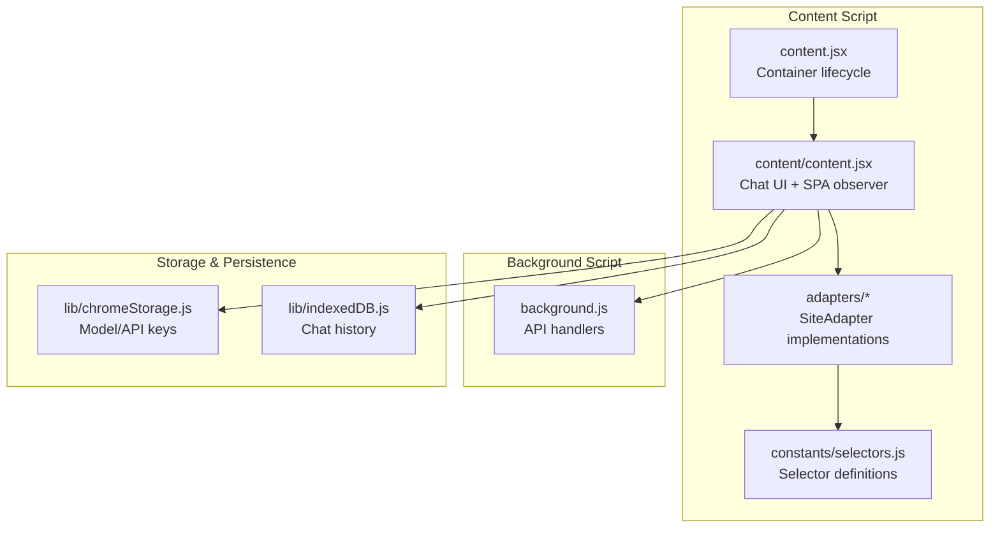
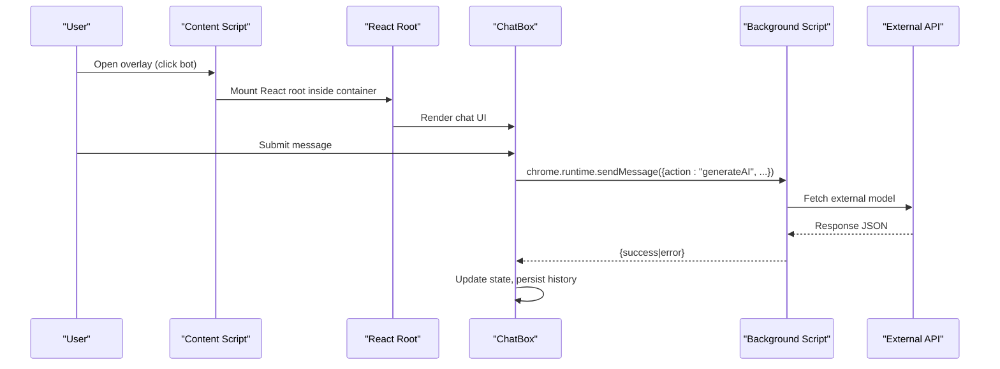
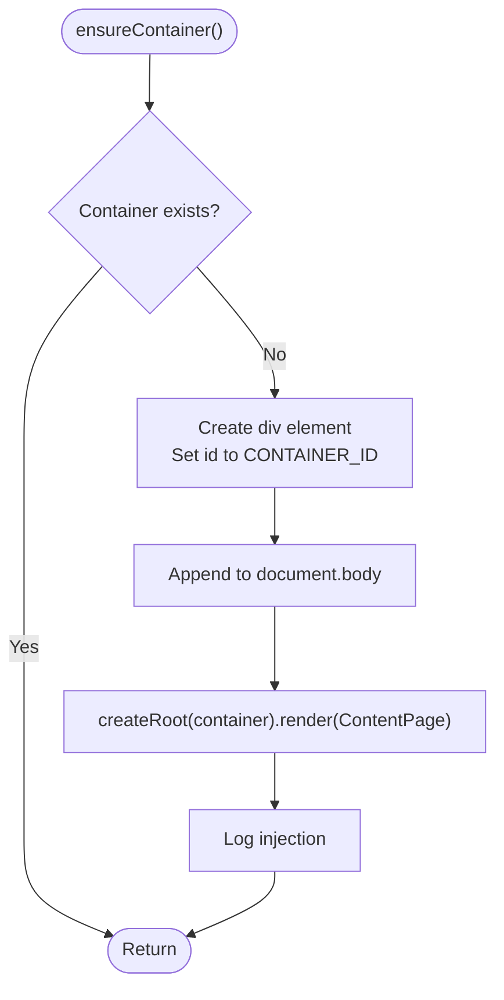
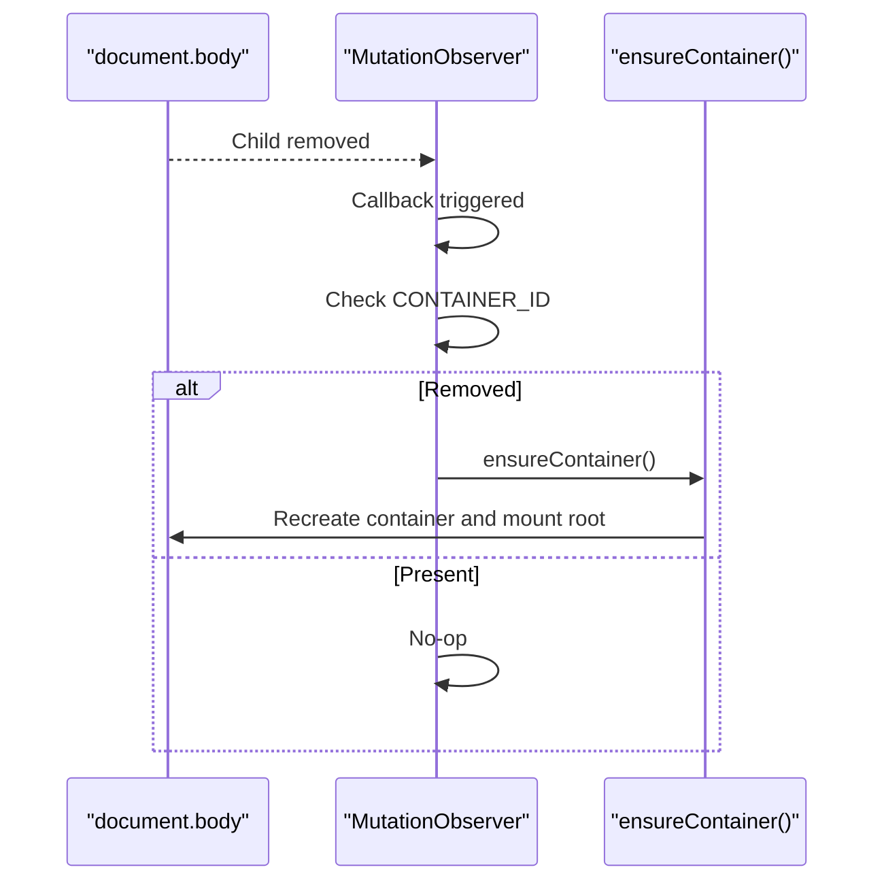
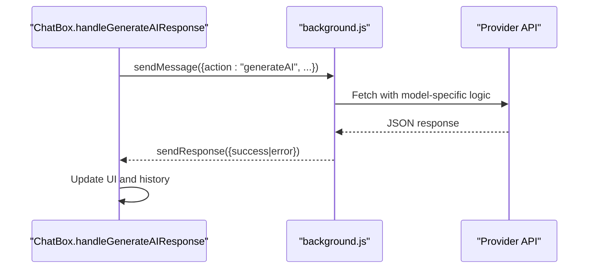
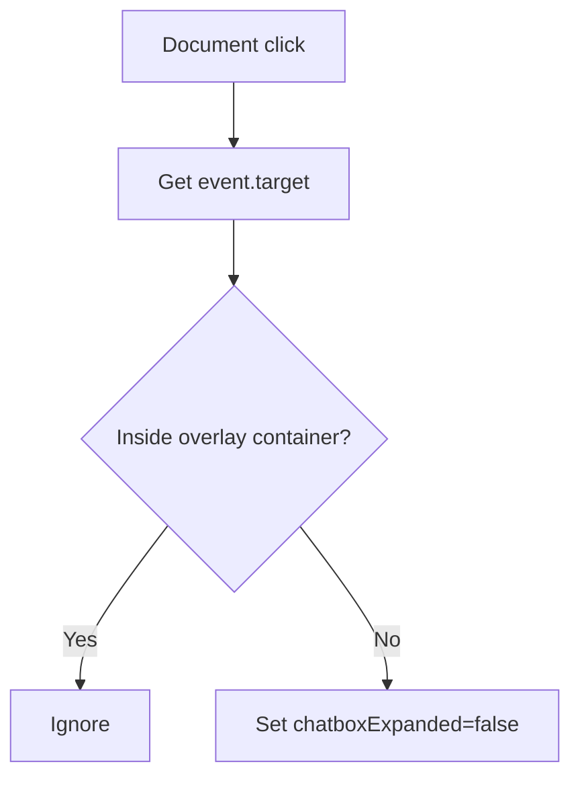
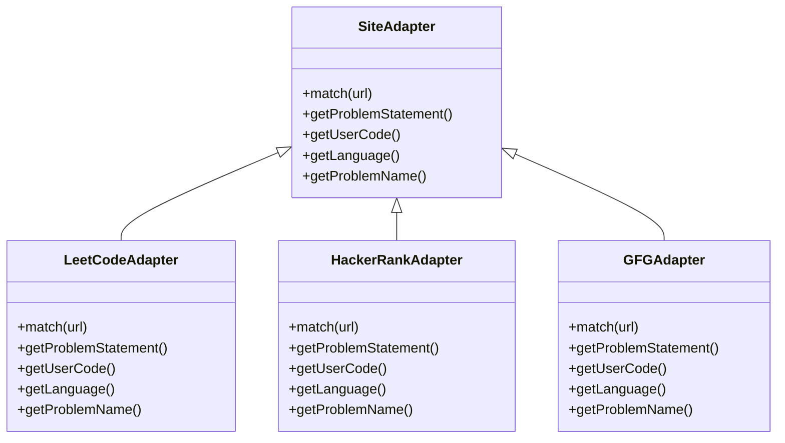
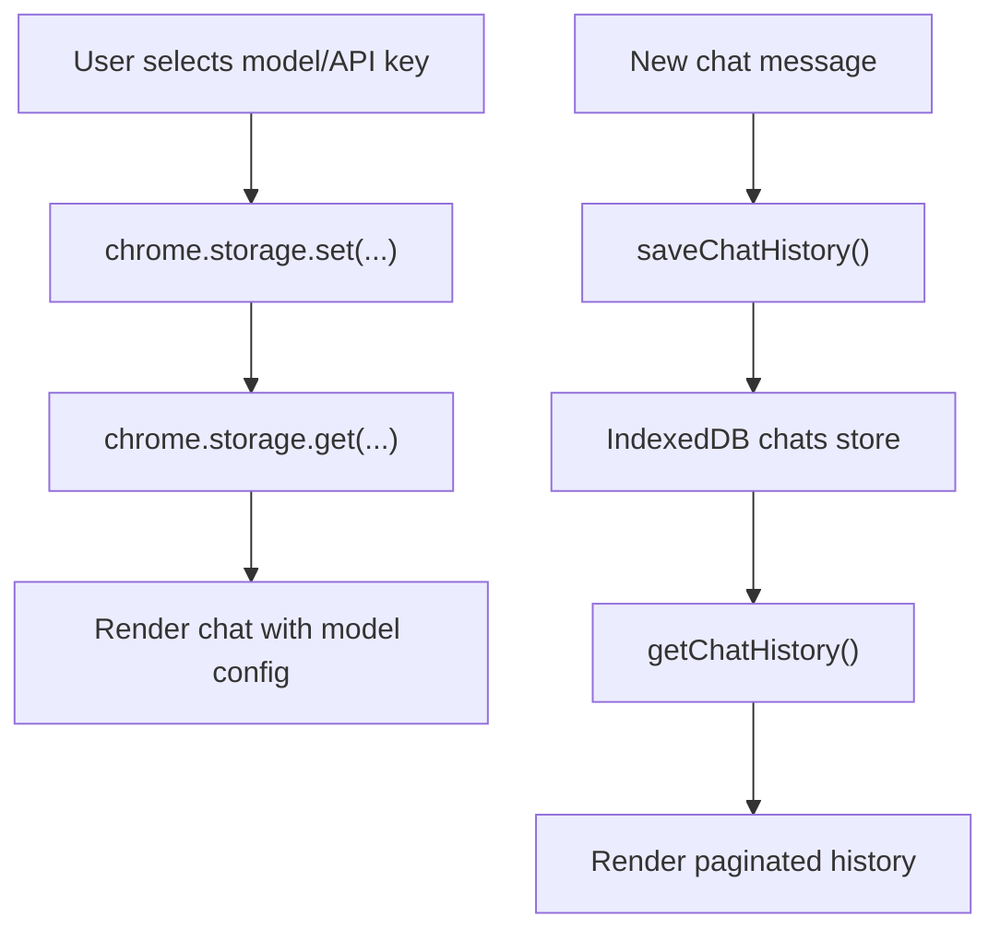
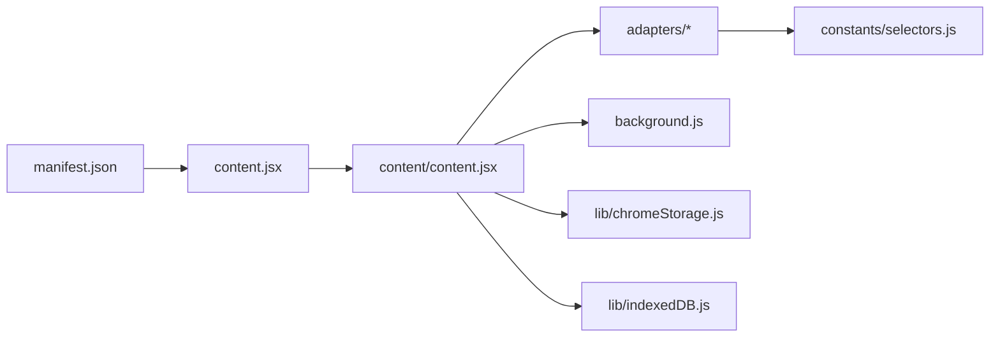

# DOM Manipulation Strategies

<cite>
**Referenced Files in This Document**
- [content.jsx](file://src/content.jsx)
- [content/content.jsx](file://src/content/content.jsx)
- [adapters/SiteAdapter.js](file://src/content/adapters/SiteAdapter.js)
- [adapters/LeetCodeAdapter.js](file://src/content/adapters/LeetCodeAdapter.js)
- [adapters/HackerRankAdapter.js](file://src/content/adapters/HackerRankAdapter.js)
- [adapters/GFGAdapter.js](file://src/content/adapters/GFGAdapter.js)
- [constants/selectors.js](file://src/constants/selectors.js)
- [lib/chromeStorage.js](file://src/lib/chromeStorage.js)
- [lib/indexedDB.js](file://src/lib/indexedDB.js)
- [background.js](file://src/background.js)
- [manifest.json](file://manifest.json)
</cite>

## Table of Contents
1. [Introduction](#introduction)
2. [Project Structure](#project-structure)
3. [Core Components](#core-components)
4. [Architecture Overview](#architecture-overview)
5. [Detailed Component Analysis](#detailed-component-analysis)
6. [Dependency Analysis](#dependency-analysis)
7. [Performance Considerations](#performance-considerations)
8. [Troubleshooting Guide](#troubleshooting-guide)
9. [Conclusion](#conclusion)

## Introduction
This document explains the DOM manipulation strategies used in the content script integration of the extension. It focuses on:
- Container creation and management using a dedicated container ID and React root mounting
- MutationObserver-based re-injection for SPA navigation
- Cross-origin communication via chrome.runtime.sendMessage for API requests and responses
- Click-outside detection to close chat interfaces
- Overlay z-index management for proper stacking
- Security considerations, performance optimizations, and strategies for dynamic content updates

## Project Structure
The content script integrates with three major areas:
- Content script entry and container lifecycle
- Site-specific adapters for DOM extraction
- Cross-origin API routing through the background script

**Diagram sources**
- [content.jsx](file://src/content.jsx#L1-L35)
- [content/content.jsx](file://src/content/content.jsx#L1-L760)
- [adapters/SiteAdapter.js](file://src/content/adapters/SiteAdapter.js#L1-L28)
- [constants/selectors.js](file://src/constants/selectors.js#L1-L27)
- [background.js](file://src/background.js#L1-L156)
- [lib/chromeStorage.js](file://src/lib/chromeStorage.js#L1-L36)
- [lib/indexedDB.js](file://src/lib/indexedDB.js#L1-L38)

**Section sources**
- [content.jsx](file://src/content.jsx#L1-L35)
- [content/content.jsx](file://src/content/content.jsx#L1-L760)
- [manifest.json](file://manifest.json#L11-L27)

## Core Components
- Container lifecycle and React root mounting
- SPA navigation detection and re-injection
- Cross-origin API communication via background script
- Click-outside detection and overlay z-index management
- Site adapters and selector-driven DOM extraction
- Storage and persistence for model configuration and chat history

**Section sources**
- [content.jsx](file://src/content.jsx#L5-L21)
- [content/content.jsx](file://src/content/content.jsx#L725-L760)
- [background.js](file://src/background.js#L127-L156)
- [adapters/SiteAdapter.js](file://src/content/adapters/SiteAdapter.js#L1-L28)
- [lib/chromeStorage.js](file://src/lib/chromeStorage.js#L1-L36)
- [lib/indexedDB.js](file://src/lib/indexedDB.js#L1-L38)

## Architecture Overview
The content script creates a fixed-position overlay with a high z-index and mounts a React root inside a dedicated container. The overlay hosts a floating chat interface that:
- Detects SPA navigation via MutationObserver and re-injects the container if removed
- Uses site adapters to extract problem statements, user code, and language
- Sends API requests to the background script to bypass CORS restrictions
- Persists chat history using IndexedDB and loads model/API keys from Chrome storage

**Diagram sources**
- [content/content.jsx](file://src/content/content.jsx#L152-L181)
- [background.js](file://src/background.js#L133-L155)

## Detailed Component Analysis

### Container Creation and Management Strategy
- Dedicated container ID ensures uniqueness and reliable targeting
- Initial injection occurs immediately if document.body exists; otherwise waits for DOMContentLoaded
- A MutationObserver watches document.body for removal of the container and re-injects automatically
- React StrictMode is used when rendering the root for development safety

Implementation highlights:
- Container ID constant and existence check
- Dynamic div creation and appending to document.body
- React root creation and rendering of the main component
- MutationObserver configured to watch direct children of document.body

**Diagram sources**
- [content.jsx](file://src/content.jsx#L8-L21)

**Section sources**
- [content.jsx](file://src/content.jsx#L5-L21)
- [content/content.jsx](file://src/content/content.jsx#L730-L745)

### React Root Mounting and Overlay Positioning
- The overlay is positioned fixed at the bottom-right corner
- A high z-index is applied to ensure visibility above page content
- The overlay contains a floating button to toggle the chat panel and the chat panel itself

Key behaviors:
- Fixed positioning with bottom/right offsets
- High z-index to prevent clipping by page elements
- Conditional rendering based on visibility state

**Section sources**
- [content/content.jsx](file://src/content/content.jsx#L631-L718)

### MutationObserver Implementation for SPA Navigation and Re-injection Timing
- A MutationObserver monitors document.body for child removals
- If the container is removed (common during SPA navigation), ensureContainer() is invoked to re-mount the overlay
- Observes only direct children to minimize overhead

**Diagram sources**
- [content.jsx](file://src/content.jsx#L27-L32)
- [content/content.jsx](file://src/content/content.jsx#L754-L759)

**Section sources**
- [content.jsx](file://src/content.jsx#L27-L32)
- [content/content.jsx](file://src/content/content.jsx#L754-L759)

### Cross-Origin Communication Patterns Using chrome.runtime.sendMessage
- The content script sends a structured message to the background script with action and payload
- The background script routes the request to the appropriate provider (Groq, Gemini, or custom)
- Responses are sent back to the content script via the callback mechanism
- The content script parses rate-limit errors and updates UI accordingly

**Diagram sources**
- [content/content.jsx](file://src/content/content.jsx#L152-L181)
- [background.js](file://src/background.js#L133-L155)

**Section sources**
- [content/content.jsx](file://src/content/content.jsx#L152-L181)
- [background.js](file://src/background.js#L127-L156)

### Click-Outside Detection Mechanism for Closing Chat Interfaces
- A document-level click listener checks whether the click target is outside the overlay container
- If so, the chat panel is collapsed
- Listener is attached on mount and detached on unmount to prevent leaks

**Diagram sources**
- [content/content.jsx](file://src/content/content.jsx#L588-L598)

**Section sources**
- [content/content.jsx](file://src/content/content.jsx#L588-L598)

### Z-Index Management for Overlay Positioning
- The overlay container applies a very high z-index to ensure it appears above page content
- This prevents clipping by site overlays, modals, or other elements

**Section sources**
- [content/content.jsx](file://src/content/content.jsx#L634-L639)

### Site Adapters and Selector-Based DOM Extraction
- An abstract base adapter defines the contract for site-specific implementations
- Each adapter implements matching logic and methods to extract:
  - Problem statement
  - User code
  - Programming language
  - Problem name
- Selectors are centralized to support multiple sites and reduce duplication

**Diagram sources**
- [adapters/SiteAdapter.js](file://src/content/adapters/SiteAdapter.js#L1-L28)
- [adapters/LeetCodeAdapter.js](file://src/content/adapters/LeetCodeAdapter.js#L1-L51)
- [adapters/HackerRankAdapter.js](file://src/content/adapters/HackerRankAdapter.js#L1-L86)
- [adapters/GFGAdapter.js](file://src/content/adapters/GFGAdapter.js#L1-L84)

**Section sources**
- [adapters/SiteAdapter.js](file://src/content/adapters/SiteAdapter.js#L1-L28)
- [adapters/LeetCodeAdapter.js](file://src/content/adapters/LeetCodeAdapter.js#L1-L51)
- [adapters/HackerRankAdapter.js](file://src/content/adapters/HackerRankAdapter.js#L1-L86)
- [adapters/GFGAdapter.js](file://src/content/adapters/GFGAdapter.js#L1-L84)
- [constants/selectors.js](file://src/constants/selectors.js#L1-L27)

### Storage and Persistence for Model Configuration and Chat History
- Model selection and API keys are persisted in Chrome storage
- Chat history is stored in IndexedDB with pagination support
- The content script listens for storage changes to refresh configuration

**Diagram sources**
- [lib/chromeStorage.js](file://src/lib/chromeStorage.js#L1-L36)
- [lib/indexedDB.js](file://src/lib/indexedDB.js#L1-L38)
- [content/content.jsx](file://src/content/content.jsx#L602-L622)

**Section sources**
- [lib/chromeStorage.js](file://src/lib/chromeStorage.js#L1-L36)
- [lib/indexedDB.js](file://src/lib/indexedDB.js#L1-L38)
- [content/content.jsx](file://src/content/content.jsx#L602-L622)

## Dependency Analysis
- Content script depends on:
  - Site adapters for DOM extraction
  - Background script for API calls
  - Chrome storage for model configuration
  - IndexedDB for chat history
- Adapters depend on centralized selectors for robust DOM targeting
- Manifest defines content script matches and host permissions

**Diagram sources**
- [content.jsx](file://src/content.jsx#L1-L35)
- [content/content.jsx](file://src/content/content.jsx#L1-L760)
- [adapters/SiteAdapter.js](file://src/content/adapters/SiteAdapter.js#L1-L28)
- [constants/selectors.js](file://src/constants/selectors.js#L1-L27)
- [background.js](file://src/background.js#L1-L156)
- [lib/chromeStorage.js](file://src/lib/chromeStorage.js#L1-L36)
- [lib/indexedDB.js](file://src/lib/indexedDB.js#L1-L38)
- [manifest.json](file://manifest.json#L11-L27)

**Section sources**
- [manifest.json](file://manifest.json#L11-L27)

## Performance Considerations
- Minimize DOM queries:
  - Use targeted selectors from centralized constants
  - Cache adapter instances and avoid repeated DOM scans
- Reduce MutationObserver overhead:
  - Watch only direct children of document.body
  - Avoid observing subtree unless necessary
- Efficient React rendering:
  - Keep state minimal and update only when needed
  - Use refs for DOM access instead of frequent queries
- Pagination for chat history:
  - Load chunks incrementally to avoid large renders
- Debounce or throttle expensive operations (e.g., scrolling to bottom)

## Troubleshooting Guide
- Container not appearing:
  - Verify the container ID exists and React root is mounted
  - Confirm MutationObserver is active and not disconnected prematurely
- Chat panel does not close on outside click:
  - Ensure the click handler targets the overlay container
  - Check that the listener is attached and not blocked by event propagation
- API requests fail:
  - Confirm background script is registered and handles the action
  - Verify host permissions in manifest for external APIs
- Rate limiting:
  - The content script parses retry seconds from error messages and disables input until cooldown
- Adapter failures:
  - Validate selectors and ensure the page structure matches expectations
  - Add fallbacks for missing elements

**Section sources**
- [content/content.jsx](file://src/content/content.jsx#L588-L598)
- [content/content.jsx](file://src/content/content.jsx#L183-L197)
- [manifest.json](file://manifest.json#L29-L40)

## Conclusion
The content script employs a robust DOM manipulation strategy centered around a dedicated container, React root mounting, and MutationObserver-based re-injection. Cross-origin API calls are safely routed through the background script, while site adapters provide extensible DOM extraction. Overlay z-index management ensures visibility, and storage/persistence enable seamless user experiences across sessions. Following the outlined performance and troubleshooting guidance helps maintain reliability and responsiveness.