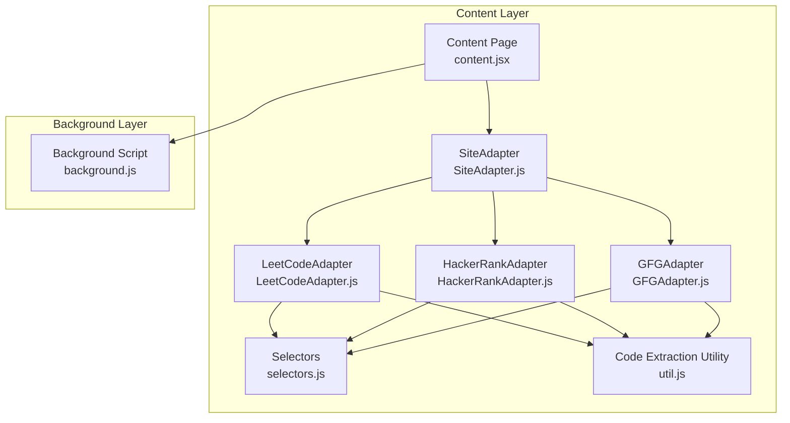
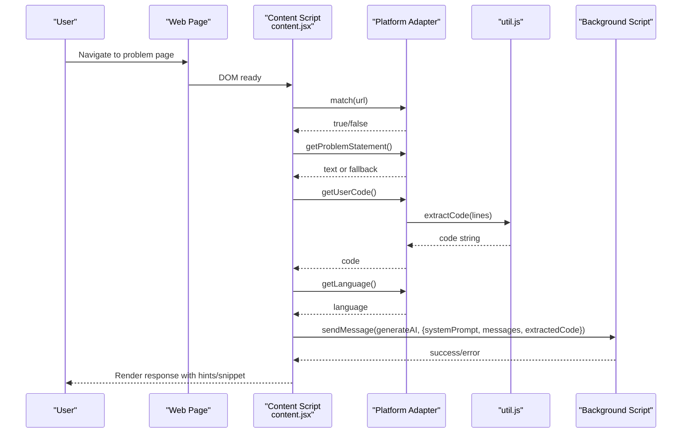
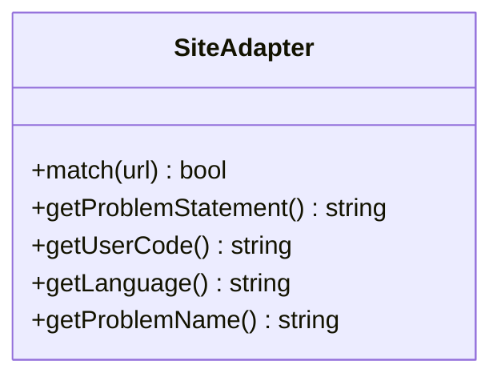
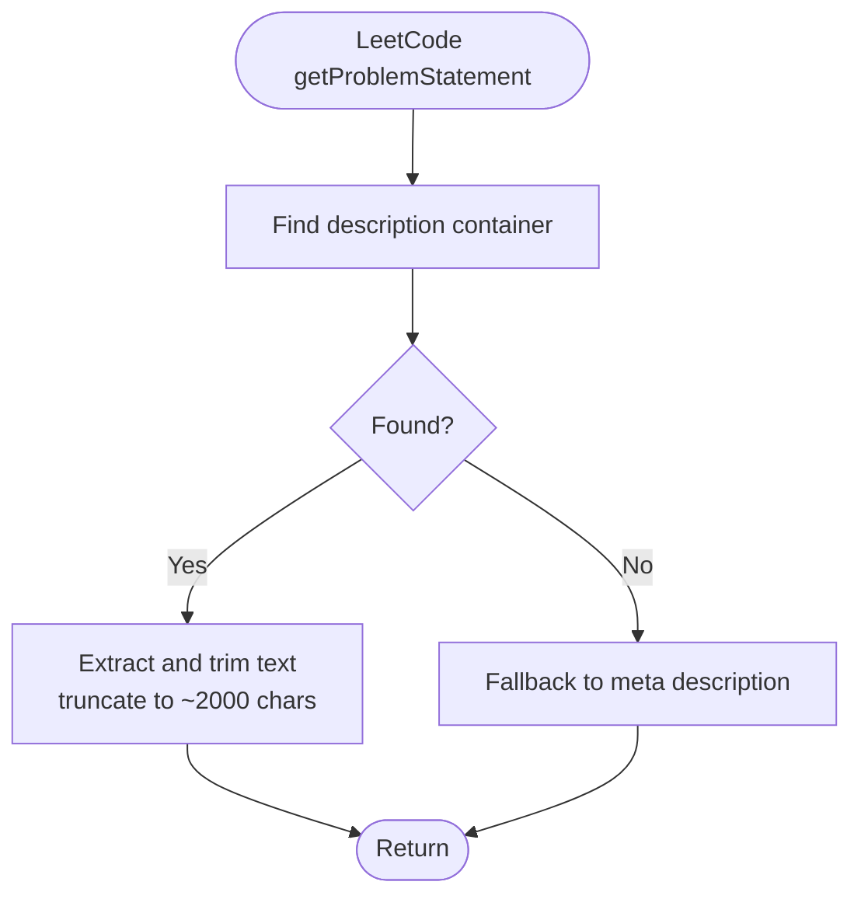
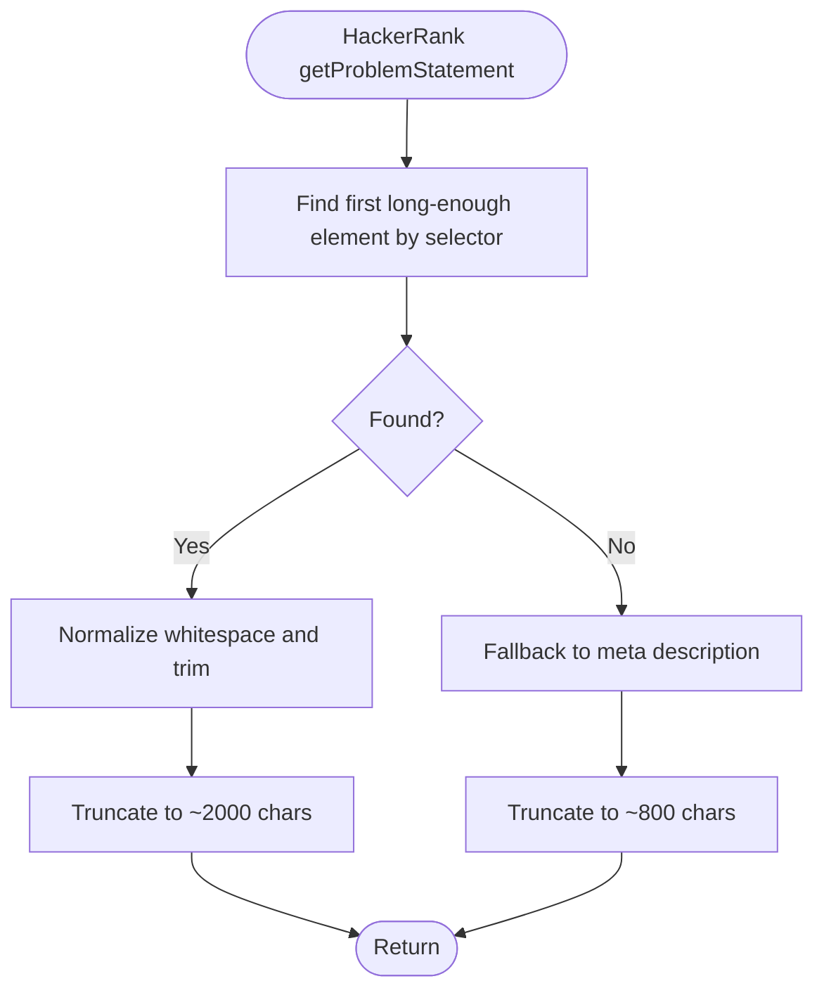
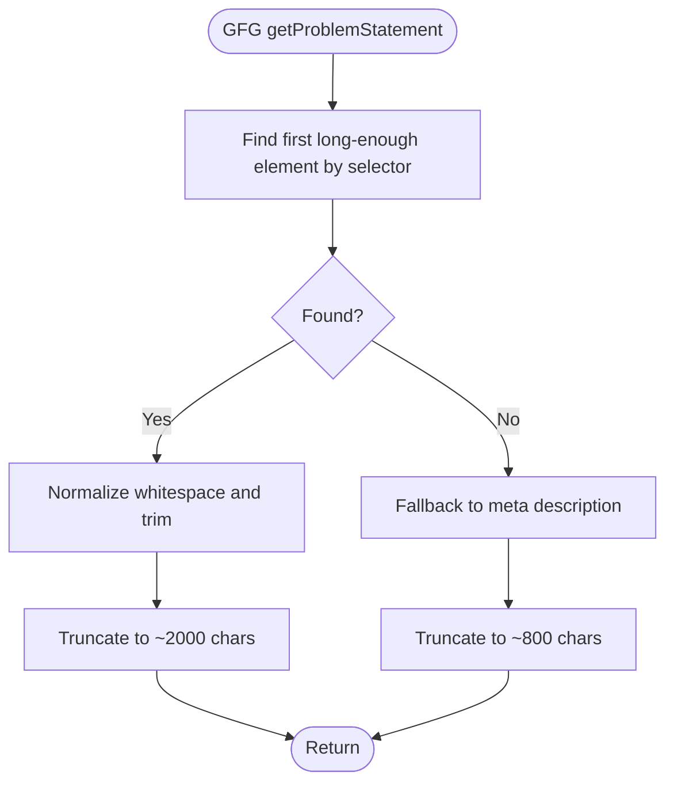
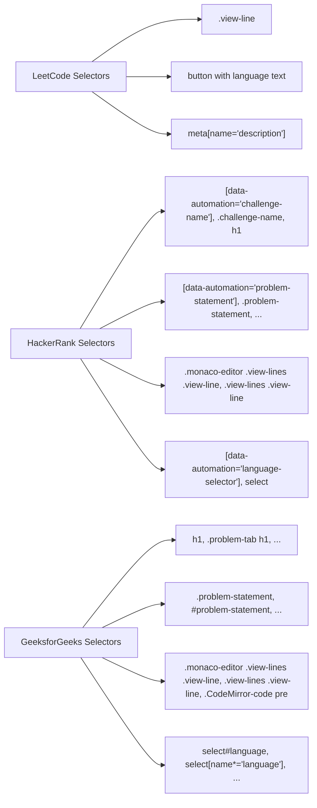
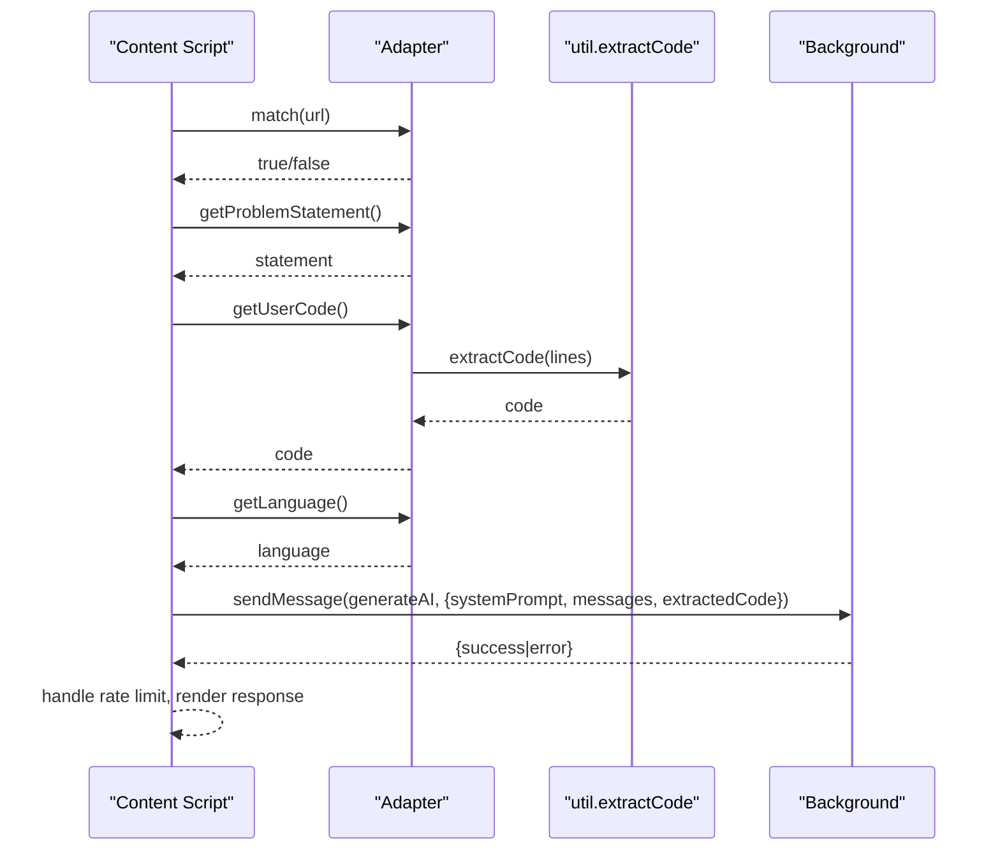
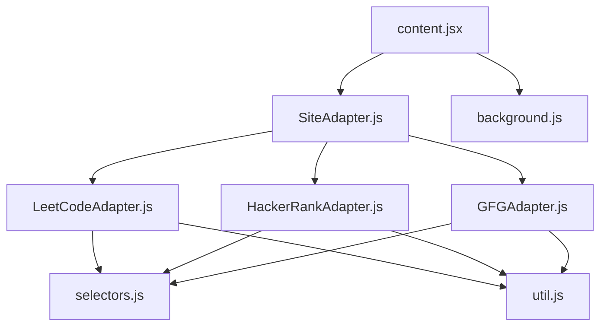

# Platform Integrations

<cite>
**Referenced Files in This Document**
- [SiteAdapter.js](file://src/content/adapters/SiteAdapter.js)
- [LeetCodeAdapter.js](file://src/content/adapters/LeetCodeAdapter.js)
- [HackerRankAdapter.js](file://src/content/adapters/HackerRankAdapter.js)
- [GFGAdapter.js](file://src/content/adapters/GFGAdapter.js)
- [selectors.js](file://src/constants/selectors.js)
- [util.js](file://src/content/util.js)
- [content.jsx](file://src/content/content.jsx)
- [content.jsx (entry)](file://src/content.jsx)
- [prompt.js](file://src/constants/prompt.js)
- [valid_models.js](file://src/constants/valid_models.js)
</cite>

## Table of Contents
1. [Introduction](#introduction)
2. [Project Structure](#project-structure)
3. [Core Components](#core-components)
4. [Architecture Overview](#architecture-overview)
5. [Detailed Component Analysis](#detailed-component-analysis)
6. [Dependency Analysis](#dependency-analysis)
7. [Performance Considerations](#performance-considerations)
8. [Troubleshooting Guide](#troubleshooting-guide)
9. [Conclusion](#conclusion)

## Introduction
This document explains the platform-specific integrations for LeetCode, HackerRank, and GeeksforGeeks within the extension. It covers how each site’s DOM structure is detected and parsed, how problem statements, user code, and programming languages are extracted, and how the extension adapts to dynamic page changes. It also documents fallback mechanisms, error handling, and troubleshooting strategies for each platform.

## Project Structure
The platform integrations are implemented as adapters that conform to a shared interface. A central content script detects the active platform, extracts problem context, and routes requests to the background service worker for AI assistance.

**Diagram sources**
- [content.jsx](file://src/content/content.jsx#L89-L136)
- [SiteAdapter.js](file://src/content/adapters/SiteAdapter.js#L1-L28)
- [LeetCodeAdapter.js](file://src/content/adapters/LeetCodeAdapter.js#L1-L51)
- [HackerRankAdapter.js](file://src/content/adapters/HackerRankAdapter.js#L1-L86)
- [GFGAdapter.js](file://src/content/adapters/GFGAdapter.js#L1-L84)
- [selectors.js](file://src/constants/selectors.js#L1-L27)
- [util.js](file://src/content/util.js#L1-L8)

**Section sources**
- [content.jsx](file://src/content/content.jsx#L89-L136)
- [SiteAdapter.js](file://src/content/adapters/SiteAdapter.js#L1-L28)
- [selectors.js](file://src/constants/selectors.js#L1-L27)

## Core Components
- SiteAdapter: Abstract base class defining the contract for platform adapters.
- LeetCodeAdapter: Implements detection and extraction for LeetCode problems.
- HackerRankAdapter: Implements detection and extraction for HackerRank challenges/tests.
- GFGAdapter: Implements detection and extraction for GeeksforGeeks practice problems.
- selectors.js: Centralized selector definitions for each platform.
- util.js: Shared code extraction routine for monaco/editor line content.
- content.jsx: Orchestrates platform detection, problem statement polling, and API routing.

Key responsibilities:
- Platform detection via URL patterns.
- Problem statement extraction with fallbacks to meta tags.
- User code extraction from editor lines.
- Programming language detection from UI controls.
- Problem name normalization for chat history grouping.

**Section sources**
- [SiteAdapter.js](file://src/content/adapters/SiteAdapter.js#L1-L28)
- [LeetCodeAdapter.js](file://src/content/adapters/LeetCodeAdapter.js#L1-L51)
- [HackerRankAdapter.js](file://src/content/adapters/HackerRankAdapter.js#L1-L86)
- [GFGAdapter.js](file://src/content/adapters/GFGAdapter.js#L1-L84)
- [selectors.js](file://src/constants/selectors.js#L1-L27)
- [util.js](file://src/content/util.js#L1-L8)
- [content.jsx](file://src/content/content.jsx#L89-L136)

## Architecture Overview
The extension injects a React UI into the page and selects the appropriate adapter based on the current URL. The adapter extracts problem context and sends it to the background script for AI processing. The UI displays structured responses with hints and code snippets.

**Diagram sources**
- [content.jsx](file://src/content/content.jsx#L122-L181)
- [LeetCodeAdapter.js](file://src/content/adapters/LeetCodeAdapter.js#L10-L43)
- [HackerRankAdapter.js](file://src/content/adapters/HackerRankAdapter.js#L45-L69)
- [GFGAdapter.js](file://src/content/adapters/GFGAdapter.js#L43-L67)
- [util.js](file://src/content/util.js#L1-L8)

## Detailed Component Analysis

### SiteAdapter Base Contract
- Enforces implementation of match, getProblemStatement, getUserCode, getLanguage, getProblemName.
- Prevents instantiation of the abstract class.

**Diagram sources**
- [SiteAdapter.js](file://src/content/adapters/SiteAdapter.js#L1-L28)

**Section sources**
- [SiteAdapter.js](file://src/content/adapters/SiteAdapter.js#L1-L28)

### LeetCodeAdapter
- Detection: Matches URLs containing the LeetCode problems path.
- Problem Statement: Attempts to extract the full description from DOM containers, falls back to meta description if needed.
- User Code: Uses a selector targeting editor lines and delegates extraction to the shared utility.
- Language: Reads the language button text; defaults to UNKNOWN if unavailable.
- Problem Name: Extracts slug from URL; otherwise returns a default.

Integration challenges:
- LeetCode uses a Next.js SPA; the extension injects a persistent container and re-injects it if removed by navigation.

**Diagram sources**
- [LeetCodeAdapter.js](file://src/content/adapters/LeetCodeAdapter.js#L10-L28)

**Section sources**
- [LeetCodeAdapter.js](file://src/content/adapters/LeetCodeAdapter.js#L1-L51)
- [content.jsx (entry)](file://src/content.jsx#L725-L760)

### HackerRankAdapter
- Detection: Validates hostname and checks path segments for challenges, contests, or tests.
- Problem Statement: Selects the first element with sufficient text length from configured selectors; falls back to meta description.
- User Code: Detects Monaco editor lines; falls back to configured selectors if Monaco is not present.
- Language: Supports both SELECT elements and static text; normalizes text and applies length checks.
- Problem Name: Normalizes title text or derives from URL path.

**Diagram sources**
- [HackerRankAdapter.js](file://src/content/adapters/HackerRankAdapter.js#L33-L43)

**Section sources**
- [HackerRankAdapter.js](file://src/content/adapters/HackerRankAdapter.js#L1-L86)

### GFGAdapter
- Detection: Validates hostname and checks path segments for problems or problem.
- Problem Statement: Similar approach to HackerRank with a selector-first strategy and meta fallback.
- User Code: Detects Monaco editor lines; falls back to configured selectors.
- Language: Similar logic to HackerRank with SELECT and text handling.
- Problem Name: Normalizes title text or derives from URL path.

**Diagram sources**
- [GFGAdapter.js](file://src/content/adapters/GFGAdapter.js#L31-L41)

**Section sources**
- [GFGAdapter.js](file://src/content/adapters/GFGAdapter.js#L1-L84)

### Selector Patterns and DOM Structures
- LeetCode: Description containers, meta description, editor line selectors, language button.
- HackerRank: Problem title, problem statement, editor lines, language selector.
- GeeksforGeeks: Problem title, problem statement, editor lines, language selector.

**Diagram sources**
- [selectors.js](file://src/constants/selectors.js#L1-L27)

**Section sources**
- [selectors.js](file://src/constants/selectors.js#L1-L27)

### Content Script Orchestration
- Platform selection: Iterates adapters until match(url) succeeds.
- Problem statement polling: Uses a MutationObserver to re-detect content after DOM changes.
- API routing: Sends a structured prompt to the background script via chrome.runtime.sendMessage.
- Rate limiting: Parses retry seconds from error messages and disables input temporarily.

**Diagram sources**
- [content.jsx](file://src/content/content.jsx#L122-L181)
- [util.js](file://src/content/util.js#L1-L8)

**Section sources**
- [content.jsx](file://src/content/content.jsx#L89-L136)
- [content.jsx](file://src/content/content.jsx#L568-L600)
- [content.jsx](file://src/content/content.jsx#L122-L181)

## Dependency Analysis
- Adapters depend on selectors.js for platform-specific selectors and on util.js for code extraction.
- Content script depends on adapters for context extraction and on the background script for AI responses.
- The content entry script ensures the React UI is injected and re-injected when removed by SPA navigation.

**Diagram sources**
- [SiteAdapter.js](file://src/content/adapters/SiteAdapter.js#L1-L28)
- [LeetCodeAdapter.js](file://src/content/adapters/LeetCodeAdapter.js#L1-L51)
- [HackerRankAdapter.js](file://src/content/adapters/HackerRankAdapter.js#L1-L86)
- [GFGAdapter.js](file://src/content/adapters/GFGAdapter.js#L1-L84)
- [selectors.js](file://src/constants/selectors.js#L1-L27)
- [util.js](file://src/content/util.js#L1-L8)
- [content.jsx](file://src/content/content.jsx#L122-L181)

**Section sources**
- [content.jsx](file://src/content/content.jsx#L89-L136)
- [content.jsx (entry)](file://src/content.jsx#L725-L760)

## Performance Considerations
- Code truncation: User code is truncated to reduce token usage and API costs.
- Message window: Only the last few messages are sent to keep under free-tier limits.
- DOM polling: MutationObserver triggers updates only when DOM changes occur.
- Editor line extraction: Uses efficient iteration over matched elements.

[No sources needed since this section provides general guidance]

## Troubleshooting Guide

Common issues and remedies:
- Selector updates
  - Symptom: Problem statement or code not extracted.
  - Action: Verify selectors in selectors.js for the affected platform; confirm presence of target elements in the DOM.
  - References:
    - [selectors.js](file://src/constants/selectors.js#L1-L27)

- DOM changes and SPA navigation
  - Symptom: UI disappears after navigation.
  - Action: Confirm the content entry script re-injection logic is active; ensure MutationObserver detects removal and re-injects the container.
  - References:
    - [content.jsx (entry)](file://src/content.jsx#L725-L760)
    - [content.jsx](file://src/content/content.jsx#L747-L760)

- Language detection failures
  - Symptom: Language shows as UNKNOWN.
  - Action: Check language selector availability and text content; ensure adapter logic handles SELECT vs static text.
  - References:
    - [LeetCodeAdapter.js](file://src/content/adapters/LeetCodeAdapter.js#L35-L43)
    - [HackerRankAdapter.js](file://src/content/adapters/HackerRankAdapter.js#L54-L69)
    - [GFGAdapter.js](file://src/content/adapters/GFGAdapter.js#L52-L67)

- Problem name normalization
  - Symptom: Chat history not grouped correctly.
  - Action: Ensure getProblemName returns a normalized identifier; confirm adapter-specific normalization logic.
  - References:
    - [LeetCodeAdapter.js](file://src/content/adapters/LeetCodeAdapter.js#L45-L49)
    - [HackerRankAdapter.js](file://src/content/adapters/HackerRankAdapter.js#L71-L84)
    - [GFGAdapter.js](file://src/content/adapters/GFGAdapter.js#L69-L82)

- Rate limiting and retries
  - Symptom: Input disabled with countdown.
  - Action: Parse retry seconds from error messages and wait; verify background script error handling.
  - References:
    - [content.jsx](file://src/content/content.jsx#L183-L197)

- Prompt and context
  - Symptom: Responses lack context.
  - Action: Confirm system prompt substitution placeholders are replaced and problem statement is populated.
  - References:
    - [prompt.js](file://src/constants/prompt.js#L1-L51)
    - [content.jsx](file://src/content/content.jsx#L142-L147)

- Editor line extraction
  - Symptom: Empty or partial code.
  - Action: Validate editor line selectors and ensure util.extractCode iterates over visible lines.
  - References:
    - [util.js](file://src/content/util.js#L1-L8)
    - [selectors.js](file://src/constants/selectors.js#L1-L27)

## Conclusion
The platform integrations leverage a clean adapter pattern with centralized selectors and a shared extraction utility. They adapt to dynamic DOM changes and provide robust fallbacks while maintaining performance through truncation and selective message windows. The content orchestration layer coordinates platform detection, context extraction, and AI response rendering, with explicit error handling for rate limits and missing resources.