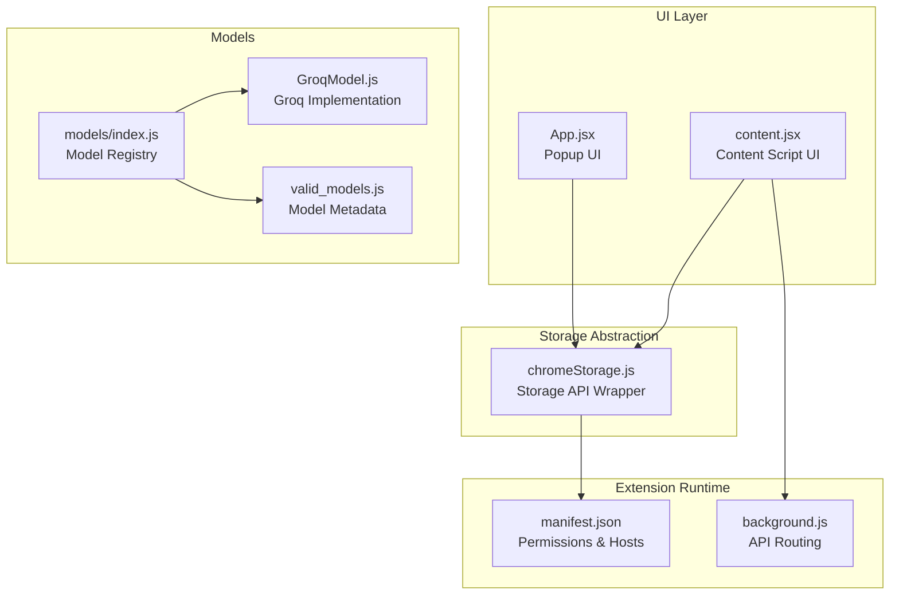
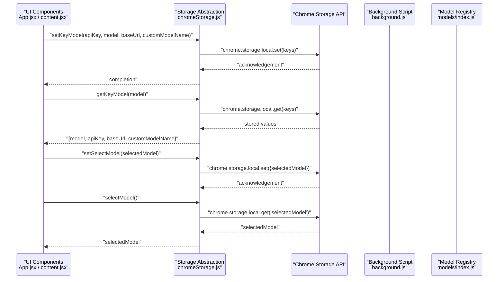
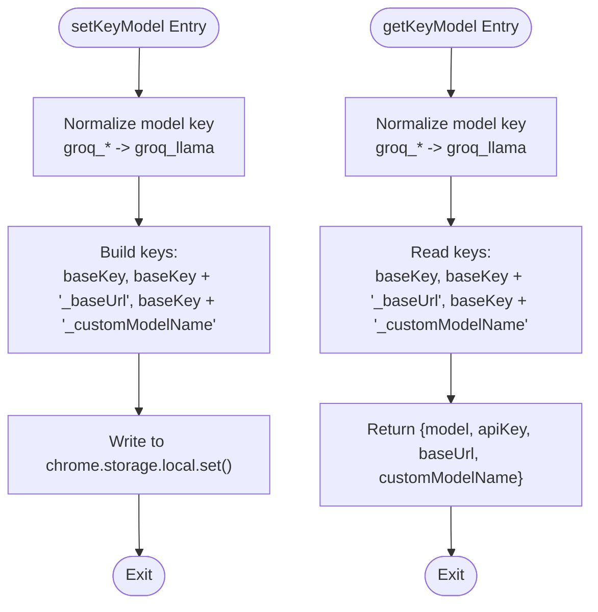
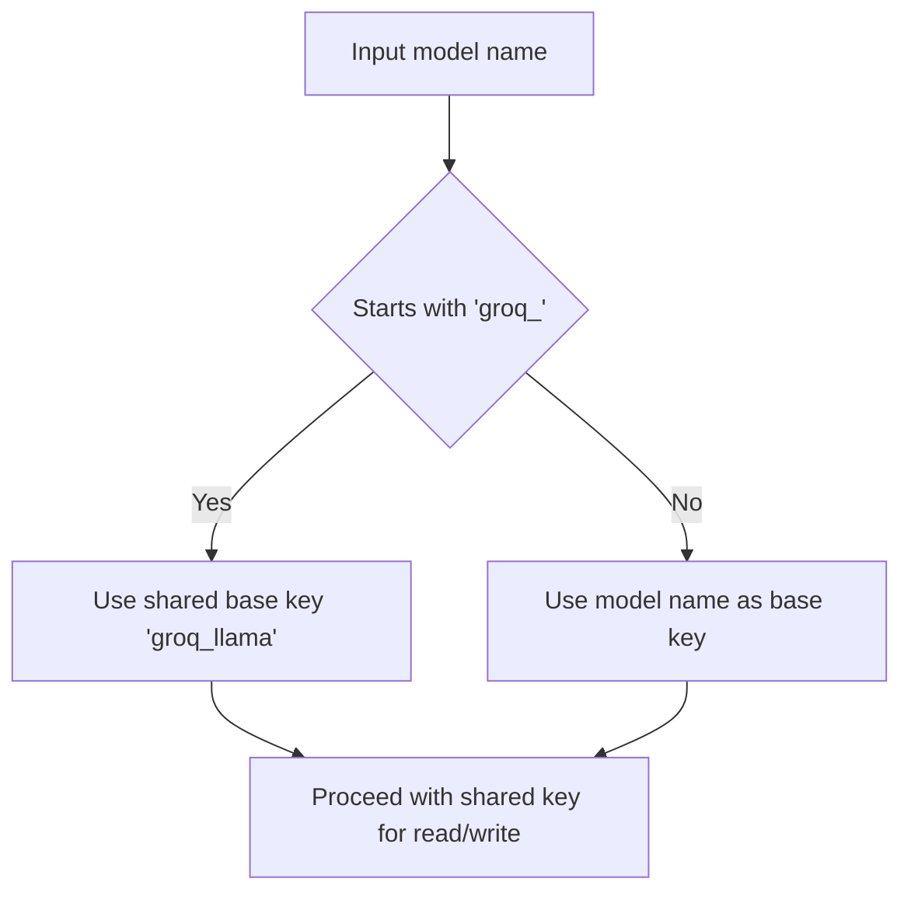
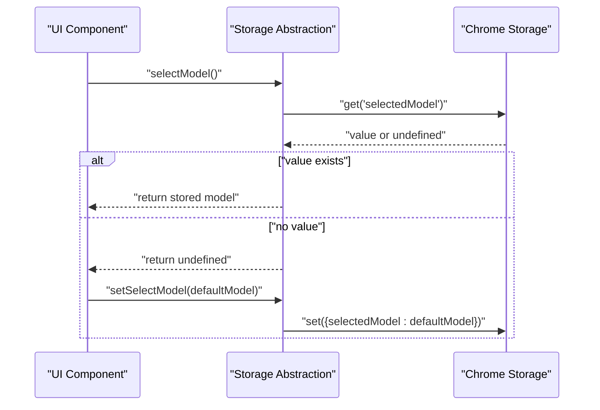
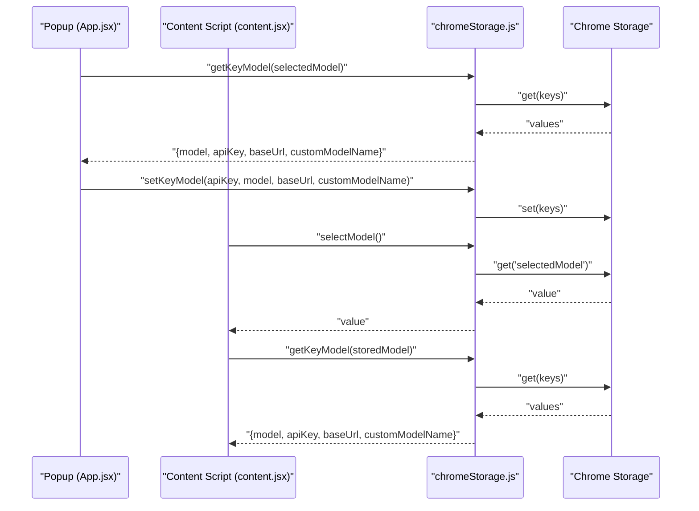
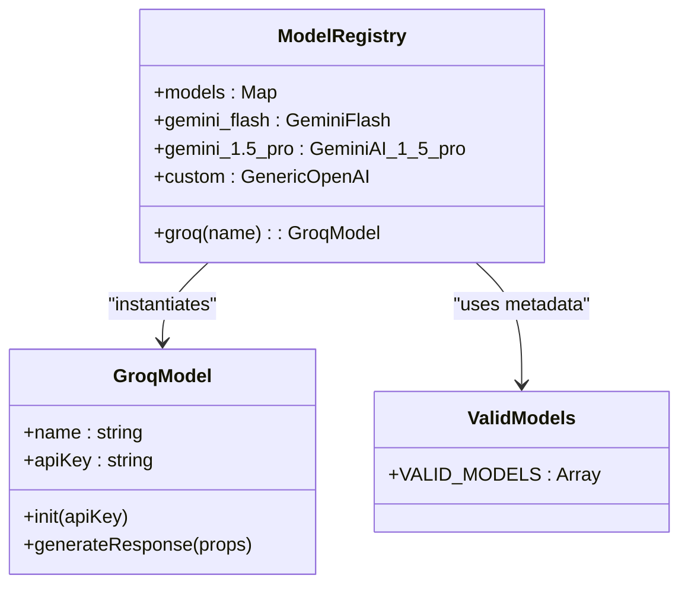
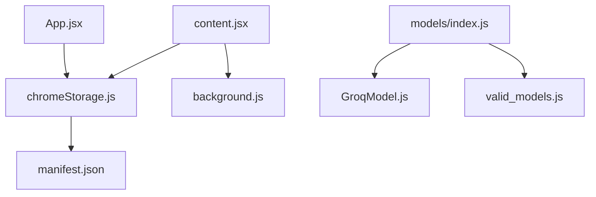

# Chrome Storage API Integration

<cite>
**Referenced Files in This Document**
- [chromeStorage.js](file://src/lib/chromeStorage.js)
- [App.jsx](file://src/App.jsx)
- [content.jsx](file://src/content/content.jsx)
- [GroqModel.js](file://src/models/model/GroqModel.js)
- [valid_models.js](file://src/constants/valid_models.js)
- [models/index.js](file://src/models/index.js)
- [background.js](file://src/background.js)
- [manifest.json](file://manifest.json)
</cite>

## Table of Contents
1. [Introduction](#introduction)
2. [Project Structure](#project-structure)
3. [Core Components](#core-components)
4. [Architecture Overview](#architecture-overview)
5. [Detailed Component Analysis](#detailed-component-analysis)
6. [Dependency Analysis](#dependency-analysis)
7. [Performance Considerations](#performance-considerations)
8. [Troubleshooting Guide](#troubleshooting-guide)
9. [Conclusion](#conclusion)

## Introduction
This document provides comprehensive technical documentation for DSABuddy's Chrome Storage API integration. It explains the storage abstraction layer that manages API keys, model configurations, and user preferences. The focus areas include the `setKeyModel` and `getKeyModel` functions, model-specific key handling for shared API keys across Groq models, the `setSelectModel` and `selectModel` functions for managing selected AI model preferences, storage key naming conventions, data serialization patterns, and error handling strategies. Practical examples demonstrate storing and retrieving configuration data, handling storage quota limitations, and implementing fallback mechanisms for failed storage operations.

## Project Structure
The storage integration spans several key files:
- Storage abstraction layer: `src/lib/chromeStorage.js`
- UI components that use storage: `src/App.jsx` (popup) and `src/content/content.jsx` (content script)
- Model definitions and selection: `src/models/index.js` and `src/models/model/GroqModel.js`
- Model metadata: `src/constants/valid_models.js`
- Extension manifest: `manifest.json`
- Background script for API routing: `src/background.js`

**Diagram sources**
- [chromeStorage.js](file://src/lib/chromeStorage.js#L1-L36)
- [App.jsx](file://src/App.jsx#L1-L233)
- [content.jsx](file://src/content/content.jsx#L1-L760)
- [models/index.js](file://src/models/index.js#L1-L19)
- [GroqModel.js](file://src/models/model/GroqModel.js#L1-L69)
- [valid_models.js](file://src/constants/valid_models.js#L1-L12)
- [manifest.json](file://manifest.json#L1-L74)
- [background.js](file://src/background.js#L1-L156)

**Section sources**
- [chromeStorage.js](file://src/lib/chromeStorage.js#L1-L36)
- [App.jsx](file://src/App.jsx#L1-L233)
- [content.jsx](file://src/content/content.jsx#L1-L760)
- [models/index.js](file://src/models/index.js#L1-L19)
- [GroqModel.js](file://src/models/model/GroqModel.js#L1-L69)
- [valid_models.js](file://src/constants/valid_models.js#L1-L12)
- [manifest.json](file://manifest.json#L1-L74)

## Core Components
This section documents the primary storage functions and their roles in the system.

- Storage key naming convention:
  - For Groq models, the base key is normalized to a single shared key to support multiple Groq model variants under one API credential.
  - For non-Groq models, the model name itself serves as the base key.
  - Three keys are written per model: base key for the API key, and two suffixes for base URL and custom model name.

- Data serialization pattern:
  - Values are stored as primitive JavaScript types (strings and booleans) directly in Chrome storage.
  - No explicit serialization is performed; Chrome storage handles conversion automatically.

- Error handling strategy:
  - UI components wrap storage operations in try/catch blocks and surface user-friendly messages.
  - Background script and model implementations handle runtime errors and network failures gracefully.

**Section sources**
- [chromeStorage.js](file://src/lib/chromeStorage.js#L1-L36)
- [App.jsx](file://src/App.jsx#L33-L87)
- [content.jsx](file://src/content/content.jsx#L602-L622)

## Architecture Overview
The storage architecture integrates UI components, the storage abstraction, and model configuration. The flow below illustrates how configuration data moves through the system.

**Diagram sources**
- [chromeStorage.js](file://src/lib/chromeStorage.js#L4-L35)
- [App.jsx](file://src/App.jsx#L33-L99)
- [content.jsx](file://src/content/content.jsx#L602-L629)
- [models/index.js](file://src/models/index.js#L13-L19)
- [background.js](file://src/background.js#L127-L156)

## Detailed Component Analysis

### Storage Abstraction Layer (`chromeStorage.js`)
The storage abstraction provides four primary functions:
- `setKeyModel`: Writes API key, base URL, and custom model name for a given model.
- `getKeyModel`: Reads the three associated values for a given model.
- `setSelectModel`: Stores the currently selected model.
- `selectModel`: Retrieves the previously selected model.

Key behaviors:
- Model-specific key normalization:
  - Groq models share a single API key by normalizing their base key to a shared identifier.
  - Non-Groq models use their model name as the base key.
- Multi-key reads/writes:
  - Each model configuration is persisted across three keys: base key, base URL suffix, and custom model name suffix.
- Asynchronous operations:
  - All operations use async/await with Chrome storage APIs.

**Diagram sources**
- [chromeStorage.js](file://src/lib/chromeStorage.js#L1-L26)

**Section sources**
- [chromeStorage.js](file://src/lib/chromeStorage.js#L1-L36)

### Model-Specific Key Handling for Groq Models
Groq models share a single API key across variants:
- The storage key normalization maps all Groq model names to a single base key.
- This ensures that configuring an API key for one Groq model applies to all Groq variants.
- Retrieval logic reads the shared key regardless of the specific Groq model requested.

**Diagram sources**
- [chromeStorage.js](file://src/lib/chromeStorage.js#L1-L2)
- [GroqModel.js](file://src/models/model/GroqModel.js#L18)

**Section sources**
- [chromeStorage.js](file://src/lib/chromeStorage.js#L1-L2)
- [GroqModel.js](file://src/models/model/GroqModel.js#L18)

### Selected Model Management (`setSelectModel` and `selectModel`)
These functions manage the user's preferred model selection:
- `setSelectModel` persists the selected model name.
- `selectModel` retrieves the stored selection, defaulting to the first available model if none is found.

Usage patterns:
- On initial load, the UI queries the selected model and falls back to the first valid model if missing.
- When the user switches models, the selection is updated and immediately reflected in subsequent retrievals.

**Diagram sources**
- [chromeStorage.js](file://src/lib/chromeStorage.js#L28-L35)
- [App.jsx](file://src/App.jsx#L56-L87)

**Section sources**
- [chromeStorage.js](file://src/lib/chromeStorage.js#L28-L35)
- [App.jsx](file://src/App.jsx#L56-L87)

### UI Integration and Data Flow
The popup and content script integrate with the storage layer to persist and retrieve configuration:
- Popup UI:
  - Loads stored model and credentials on mount.
  - Saves API key, base URL, and custom model name when the user submits.
  - Updates selected model and reloads credentials when the user changes the model.
- Content script:
  - Loads stored model and credentials on mount.
  - Subscribes to storage change events to refresh configuration when other parts of the extension write to storage.
  - Provides a fallback UI when no model or API key is configured.

**Diagram sources**
- [App.jsx](file://src/App.jsx#L33-L99)
- [content.jsx](file://src/content/content.jsx#L602-L629)
- [chromeStorage.js](file://src/lib/chromeStorage.js#L13-L26)

**Section sources**
- [App.jsx](file://src/App.jsx#L33-L99)
- [content.jsx](file://src/content/content.jsx#L602-L629)

### Model Selection and Configuration
Model metadata and registry:
- The model registry defines available models and their display names.
- Groq models are represented by a factory that instantiates a shared class with different names.
- The UI presents selectable models based on the metadata.

**Diagram sources**
- [models/index.js](file://src/models/index.js#L6-L11)
- [GroqModel.js](file://src/models/model/GroqModel.js#L17-L23)
- [valid_models.js](file://src/constants/valid_models.js#L1-L12)

**Section sources**
- [models/index.js](file://src/models/index.js#L6-L11)
- [GroqModel.js](file://src/models/model/GroqModel.js#L17-L23)
- [valid_models.js](file://src/constants/valid_models.js#L1-L12)

## Dependency Analysis
The storage layer interacts with multiple parts of the application. The diagram below highlights these dependencies.

**Diagram sources**
- [chromeStorage.js](file://src/lib/chromeStorage.js#L1-L36)
- [App.jsx](file://src/App.jsx#L1-L233)
- [content.jsx](file://src/content/content.jsx#L1-L760)
- [models/index.js](file://src/models/index.js#L1-L19)
- [GroqModel.js](file://src/models/model/GroqModel.js#L1-L69)
- [valid_models.js](file://src/constants/valid_models.js#L1-L12)
- [manifest.json](file://manifest.json#L1-L74)
- [background.js](file://src/background.js#L1-L156)

**Section sources**
- [chromeStorage.js](file://src/lib/chromeStorage.js#L1-L36)
- [App.jsx](file://src/App.jsx#L1-L233)
- [content.jsx](file://src/content/content.jsx#L1-L760)
- [models/index.js](file://src/models/index.js#L1-L19)
- [GroqModel.js](file://src/models/model/GroqModel.js#L1-L69)
- [valid_models.js](file://src/constants/valid_models.js#L1-L12)
- [manifest.json](file://manifest.json#L1-L74)
- [background.js](file://src/background.js#L1-L156)

## Performance Considerations
- Single-key reads/writes: The storage abstraction performs minimal operations per transaction, reducing overhead.
- Batched retrieval: `getKeyModel` reads three keys in a single `get` operation, minimizing round trips.
- Shared keys for Groq models: Reduces storage footprint and simplifies maintenance for multiple Groq variants.
- UI responsiveness: Storage operations are asynchronous but short-lived; UI components manage loading states appropriately.

## Troubleshooting Guide
Common issues and resolutions:
- Missing storage permission:
  - Ensure the extension has the `storage` permission declared in the manifest.
  - Without this permission, storage operations will fail silently or throw errors.
- Empty or missing values:
  - The UI defaults to the first available model if none is stored.
  - Verify that `setSelectModel` is called after the first configuration.
- Groq model key mismatch:
  - Confirm that the model name starts with the expected prefix so the shared key normalization applies.
  - Check that `getKeyModel` is invoked with the intended Groq model name; the underlying key remains normalized.
- Network and runtime errors:
  - Background script and model implementations handle HTTP errors and exceptions, returning structured error objects.
  - UI components parse rate limit messages and apply cooldown logic.

Practical examples:
- Storing configuration:
  - Call `setKeyModel(apiKey, model, baseUrl, customModelName)` from the popup after collecting user input.
  - Verify persistence by calling `getKeyModel(model)` immediately afterward.
- Retrieving configuration:
  - On component mount, call `selectModel()` to get the preferred model, then call `getKeyModel(selectedModel)` to load credentials.
- Handling quota limitations:
  - Chrome storage has quotas; avoid storing excessively large payloads.
  - Prefer compact keys and minimal data per model configuration.
- Fallback mechanisms:
  - If `getKeyModel` returns undefined values, present a configuration prompt to the user.
  - If `selectModel` returns undefined, default to the first model in the metadata list.

**Section sources**
- [manifest.json](file://manifest.json#L6-L10)
- [App.jsx](file://src/App.jsx#L56-L87)
- [content.jsx](file://src/content/content.jsx#L602-L629)
- [chromeStorage.js](file://src/lib/chromeStorage.js#L13-L26)
- [background.js](file://src/background.js#L7-L44)

## Conclusion
DSABuddy's Chrome Storage API integration provides a clean, model-aware abstraction for managing API keys, model configurations, and user preferences. The shared key strategy for Groq models simplifies configuration while maintaining flexibility for other providers. The UI components consistently handle storage operations with robust fallbacks, ensuring a reliable user experience. By following the documented patterns and troubleshooting steps, developers can extend or modify the storage layer with confidence.