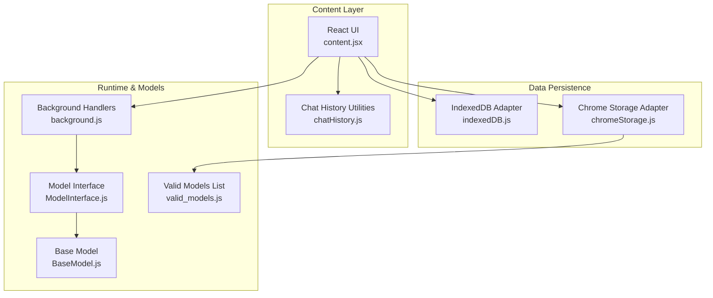
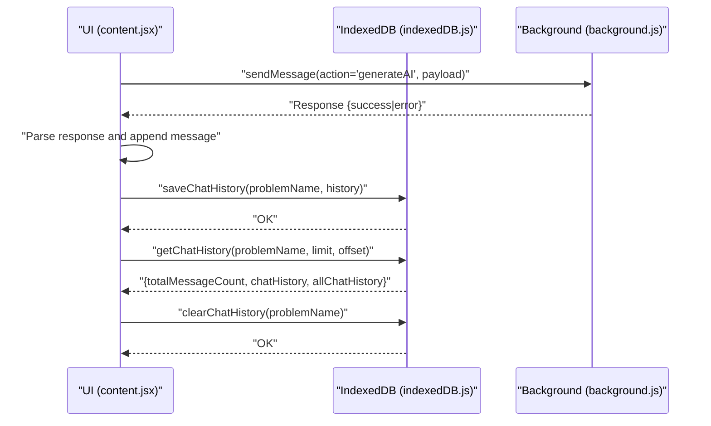
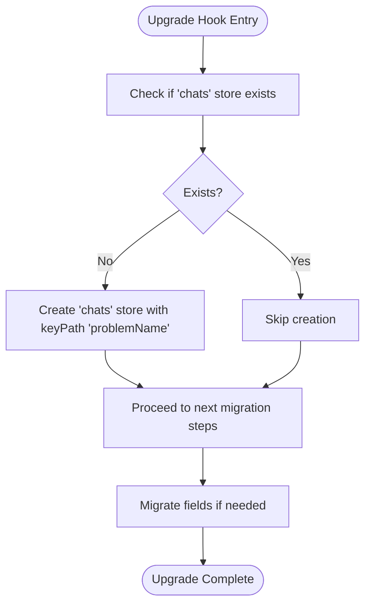
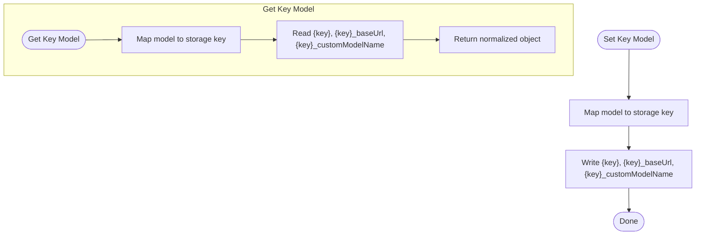
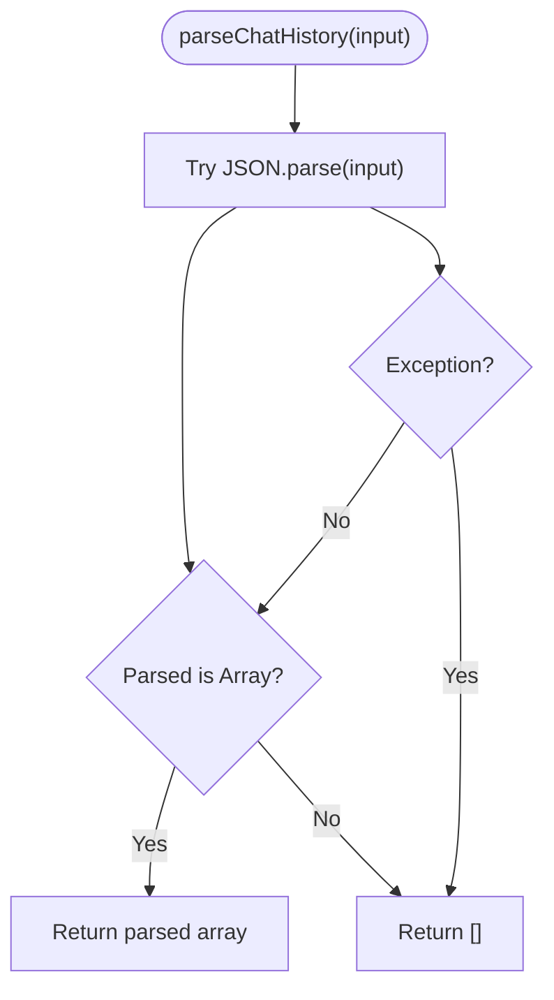
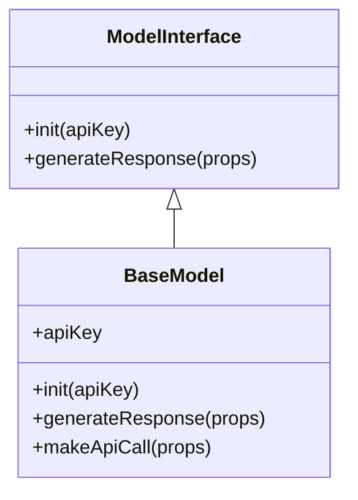
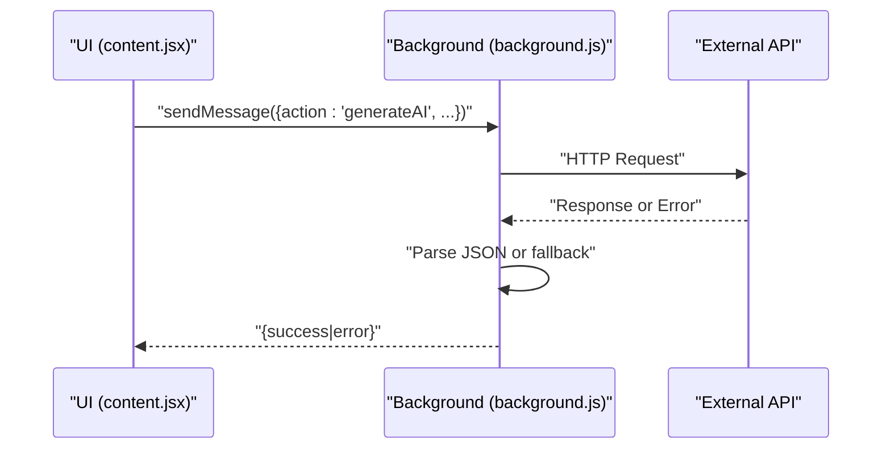
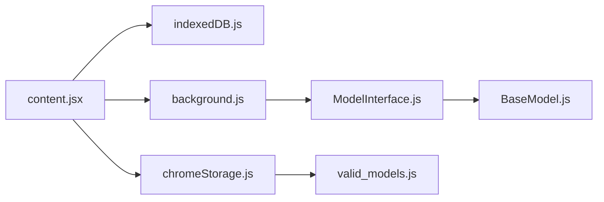

# Data Migration and Cleanup Strategies

<cite>
**Referenced Files in This Document**
- [indexedDB.js](file://src/lib/indexedDB.js)
- [chromeStorage.js](file://src/lib/chromeStorage.js)
- [content.jsx](file://src/content/content.jsx)
- [chatHistory.js](file://src/interface/chatHistory.js)
- [ModelInterface.js](file://src/interface/ModelInterface.js)
- [BaseModel.js](file://src/models/BaseModel.js)
- [valid_models.js](file://src/constants/valid_models.js)
- [background.js](file://src/background.js)
</cite>

## Table of Contents
1. [Introduction](#introduction)
2. [Project Structure](#project-structure)
3. [Core Components](#core-components)
4. [Architecture Overview](#architecture-overview)
5. [Detailed Component Analysis](#detailed-component-analysis)
6. [Dependency Analysis](#dependency-analysis)
7. [Performance Considerations](#performance-considerations)
8. [Troubleshooting Guide](#troubleshooting-guide)
9. [Conclusion](#conclusion)
10. [Appendices](#appendices)

## Introduction
This document explains DSABuddy’s data migration and cleanup strategies with a focus on:
- Database versioning and schema evolution for IndexedDB
- Backward compatibility maintenance
- Data migration procedures for model updates, storage format changes, and user preference updates
- Cleanup strategies for expired chat sessions, orphaned records, and storage optimization
- Data archival processes, retention policies, and automated cleanup mechanisms
- Data integrity checks, validation procedures, and recovery strategies for corrupted or inconsistent data
- Examples of migration scripts and cleanup operations with proper error handling and rollback procedures

## Project Structure
DSABuddy organizes data-related concerns across three primary areas:
- IndexedDB-backed chat history persistence
- Chrome Extension storage for user preferences and API keys
- Runtime orchestration for model selection and API communication

**Diagram sources**
- [content.jsx](file://src/content/content.jsx#L1-L760)
- [indexedDB.js](file://src/lib/indexedDB.js#L1-L38)
- [chromeStorage.js](file://src/lib/chromeStorage.js#L1-L36)
- [chatHistory.js](file://src/interface/chatHistory.js#L1-L19)
- [ModelInterface.js](file://src/interface/ModelInterface.js#L1-L18)
- [BaseModel.js](file://src/models/BaseModel.js#L1-L17)
- [valid_models.js](file://src/constants/valid_models.js#L1-L12)
- [background.js](file://src/background.js#L1-L156)

**Section sources**
- [content.jsx](file://src/content/content.jsx#L1-L760)
- [indexedDB.js](file://src/lib/indexedDB.js#L1-L38)
- [chromeStorage.js](file://src/lib/chromeStorage.js#L1-L36)
- [chatHistory.js](file://src/interface/chatHistory.js#L1-L19)
- [ModelInterface.js](file://src/interface/ModelInterface.js#L1-L18)
- [BaseModel.js](file://src/models/BaseModel.js#L1-L17)
- [valid_models.js](file://src/constants/valid_models.js#L1-L12)
- [background.js](file://src/background.js#L1-L156)

## Core Components
- IndexedDB adapter manages chat history persistence with a single object store and versioned upgrade path.
- Chrome storage adapter persists user-selected model, API keys, and related preferences.
- Content UI integrates saving/loading chat history, clearing sessions, and pagination.
- Model interface and base model define the abstraction for model-specific API calls and response parsing.

Key responsibilities:
- Persist per-problemName chat histories
- Support pagination and slicing of histories
- Clear specific chat sessions
- Store and retrieve model preferences and credentials
- Provide fallback parsing for chat history strings

**Section sources**
- [indexedDB.js](file://src/lib/indexedDB.js#L1-L38)
- [chromeStorage.js](file://src/lib/chromeStorage.js#L1-L36)
- [content.jsx](file://src/content/content.jsx#L1-L760)
- [chatHistory.js](file://src/interface/chatHistory.js#L1-L19)
- [ModelInterface.js](file://src/interface/ModelInterface.js#L1-L18)
- [BaseModel.js](file://src/models/BaseModel.js#L1-L17)

## Architecture Overview
The runtime flow for saving and retrieving chat history is as follows:

**Diagram sources**
- [content.jsx](file://src/content/content.jsx#L122-L217)
- [content.jsx](file://src/content/content.jsx#L219-L252)
- [content.jsx](file://src/content/content.jsx#L112-L116)
- [indexedDB.js](file://src/lib/indexedDB.js#L9-L36)
- [background.js](file://src/background.js#L127-L156)

## Detailed Component Analysis

### IndexedDB: Versioning, Schema Evolution, and Backward Compatibility
- Database name: chat-db
- Current version: 1
- Object store: chats with keyPath problemName
- Upgrade hook creates the chats store on first run or version bump

Schema evolution pattern:
- Use the upgrade callback to add stores or indexes when incrementing the version number
- Maintain backward compatibility by checking for existing stores and avoiding destructive changes

Backward compatibility maintenance:
- New fields can be added to stored chatHistory entries without breaking reads
- Reads should guard against missing fields and provide defaults

Data migration procedures:
- Example: Adding timestamps to messages
  - Increment DB version
  - In upgrade, iterate existing chats and add timestamp fields to messages
  - On subsequent reads, treat missing timestamps as needing migration
- Example: Renaming a field
  - Add new field with migrated value
  - Mark records as migrated
  - Future writes use new field only

Cleanup strategies:
- Clear specific chat sessions via clearChatHistory
- Periodic cleanup of orphaned records by iterating stores and removing entries whose keys are no longer present in the current problem set

**Diagram sources**
- [indexedDB.js](file://src/lib/indexedDB.js#L3-L7)

**Section sources**
- [indexedDB.js](file://src/lib/indexedDB.js#L1-L38)

### Chrome Storage: User Preferences and Credentials
- Consolidates API keys for multiple models under shared keys for certain model families
- Stores selected model, base URL, and custom model name
- Provides getters/setters for model selection and credentials

Migration procedures:
- Normalize storage keys when introducing new model families
- Migrate legacy keys to shared keys for models that share credentials
- Add new keys for extended configurations (e.g., base URLs) while preserving existing values

Cleanup strategies:
- Remove stale keys when models are deprecated
- Clear credentials for models no longer supported

**Diagram sources**
- [chromeStorage.js](file://src/lib/chromeStorage.js#L2-L10)
- [chromeStorage.js](file://src/lib/chromeStorage.js#L13-L26)

**Section sources**
- [chromeStorage.js](file://src/lib/chromeStorage.js#L1-L36)
- [valid_models.js](file://src/constants/valid_models.js#L1-L12)

### Chat History: Parsing, Pagination, and Integrity
- parseChatHistory safely parses raw strings into arrays, returning empty arrays on failure
- UI loads recent messages by default and supports loading older messages via pagination
- Integrity checks:
  - Guard against malformed JSON
  - Ensure chatHistory is an array before slicing
  - Append timestamps to new messages

Migration procedures:
- Normalize message content to strings when migrating from structured objects
- Add timestamps to existing messages during upgrade
- Maintain backward compatibility by treating missing timestamps as needing migration

Cleanup strategies:
- Clear entire chat sessions via clearChatHistory
- Truncate very long histories to stay within token limits

**Diagram sources**
- [chatHistory.js](file://src/interface/chatHistory.js#L11-L18)

**Section sources**
- [chatHistory.js](file://src/interface/chatHistory.js#L1-L19)
- [content.jsx](file://src/content/content.jsx#L219-L252)
- [content.jsx](file://src/content/content.jsx#L112-L116)

### Model Abstractions: Extensibility and Validation
- ModelInterface defines a contract for initialization and response generation
- BaseModel enforces subclassing and provides a default generateResponse wrapper
- Model-specific implementations (e.g., Gemini, Groq, Custom) encapsulate API differences

Validation procedures:
- Validate response shape and content before integrating into chat history
- Fallback parsing for non-JSON responses

**Diagram sources**
- [ModelInterface.js](file://src/interface/ModelInterface.js#L12-L17)
- [BaseModel.js](file://src/models/BaseModel.js#L3-L17)

**Section sources**
- [ModelInterface.js](file://src/interface/ModelInterface.js#L1-L18)
- [BaseModel.js](file://src/models/BaseModel.js#L1-L17)

### Background Handlers: API Orchestration and Error Handling
- Routes model-specific API calls through background handlers to avoid CORS issues
- Implements robust error handling and graceful fallbacks for network failures and parsing errors

**Diagram sources**
- [content.jsx](file://src/content/content.jsx#L153-L181)
- [background.js](file://src/background.js#L7-L44)
- [background.js](file://src/background.js#L46-L83)
- [background.js](file://src/background.js#L85-L123)

**Section sources**
- [background.js](file://src/background.js#L1-L156)

## Dependency Analysis
- content.jsx depends on indexedDB.js for persistence and chromeStorage.js for preferences
- ModelInterface and BaseModel provide abstractions consumed by content.jsx indirectly through background handlers
- background.js orchestrates model-specific API calls and returns results to content.jsx

**Diagram sources**
- [content.jsx](file://src/content/content.jsx#L1-L760)
- [indexedDB.js](file://src/lib/indexedDB.js#L1-L38)
- [chromeStorage.js](file://src/lib/chromeStorage.js#L1-L36)
- [ModelInterface.js](file://src/interface/ModelInterface.js#L1-L18)
- [BaseModel.js](file://src/models/BaseModel.js#L1-L17)
- [valid_models.js](file://src/constants/valid_models.js#L1-L12)
- [background.js](file://src/background.js#L1-L156)

**Section sources**
- [content.jsx](file://src/content/content.jsx#L1-L760)
- [indexedDB.js](file://src/lib/indexedDB.js#L1-L38)
- [chromeStorage.js](file://src/lib/chromeStorage.js#L1-L36)
- [ModelInterface.js](file://src/interface/ModelInterface.js#L1-L18)
- [BaseModel.js](file://src/models/BaseModel.js#L1-L17)
- [valid_models.js](file://src/constants/valid_models.js#L1-L12)
- [background.js](file://src/background.js#L1-L156)

## Performance Considerations
- IndexedDB operations are asynchronous; batch writes and reads to minimize latency
- Limit message history retrieval to recent N messages for UI performance
- Avoid storing extremely large payloads; truncate or summarize content when necessary
- Use pagination to load older messages on demand

[No sources needed since this section provides general guidance]

## Troubleshooting Guide
Common issues and remedies:
- Corrupted chat history
  - Use parseChatHistory to sanitize incoming strings
  - On failure, initialize with an empty array and log warnings
- Missing or invalid API keys
  - Verify selected model and credentials via chromeStorage helpers
  - Prompt user to reconfigure if keys are absent
- Excessive storage usage
  - Clear specific chat sessions using clearChatHistory
  - Implement periodic cleanup jobs to remove old or unused sessions
- Migration failures
  - Increment DB version and add guarded migration steps in upgrade
  - Rollback by preserving original data until migration completes successfully

**Section sources**
- [chatHistory.js](file://src/interface/chatHistory.js#L1-L19)
- [chromeStorage.js](file://src/lib/chromeStorage.js#L1-L36)
- [indexedDB.js](file://src/lib/indexedDB.js#L1-L38)
- [content.jsx](file://src/content/content.jsx#L112-L116)

## Conclusion
DSABuddy’s data layer is designed around two complementary persistence mechanisms:
- IndexedDB for chat history with a versioned upgrade path enabling safe schema evolution
- Chrome storage for user preferences and credentials with key normalization and migration support

By following the outlined migration and cleanup strategies—incrementing versions, guarding upgrades, validating data, and implementing robust error handling—the system can evolve reliably while maintaining backward compatibility and user trust.

[No sources needed since this section summarizes without analyzing specific files]

## Appendices

### Migration Script Template: IndexedDB Upgrade
- Increment the database version
- In the upgrade callback:
  - Create or alter stores and indexes as needed
  - Iterate existing records and migrate fields
  - Set a flag or metadata to mark records as migrated
- Ensure reads gracefully handle missing fields and trigger on-demand migrations

**Section sources**
- [indexedDB.js](file://src/lib/indexedDB.js#L3-L7)

### Cleanup Operations Template: Clearing Sessions
- Identify sessions to remove (by problemName or criteria)
- Call clearChatHistory(problemName) to delete entries
- Optionally, implement a scheduled job to remove sessions older than a threshold

**Section sources**
- [indexedDB.js](file://src/lib/indexedDB.js#L33-L36)
- [content.jsx](file://src/content/content.jsx#L112-L116)

### Data Integrity and Recovery Template
- Validate parsed chat history; fall back to empty arrays on parse errors
- Validate API responses; fallback to structured feedback when JSON parsing fails
- Maintain logs for migration and cleanup operations to enable rollbacks

**Section sources**
- [chatHistory.js](file://src/interface/chatHistory.js#L11-L18)
- [background.js](file://src/background.js#L38-L40)
- [background.js](file://src/background.js#L78-L80)