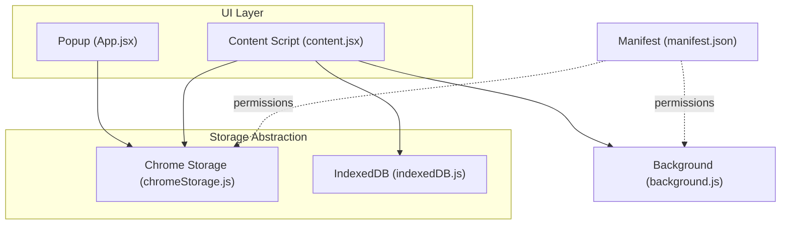
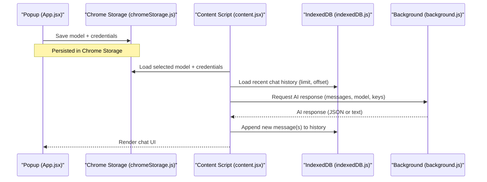
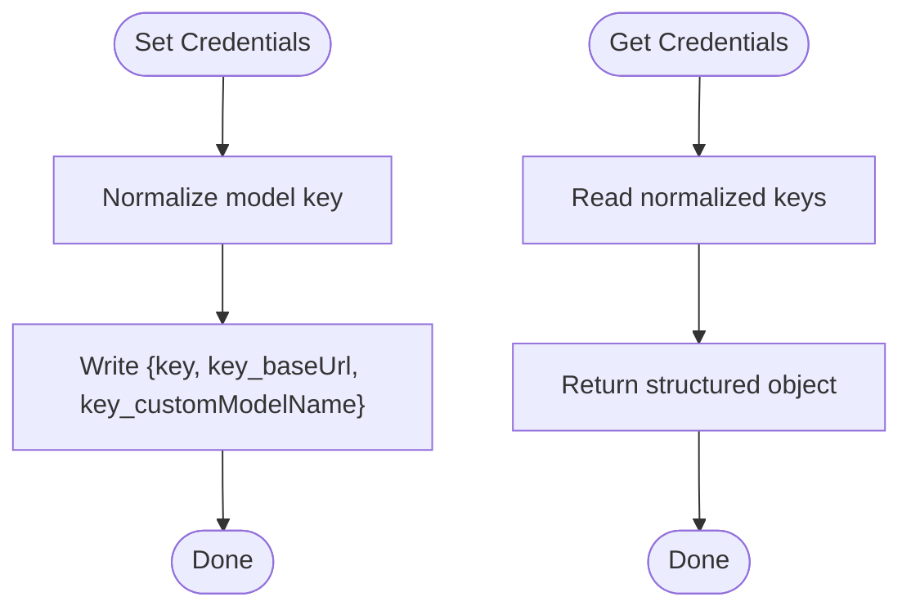
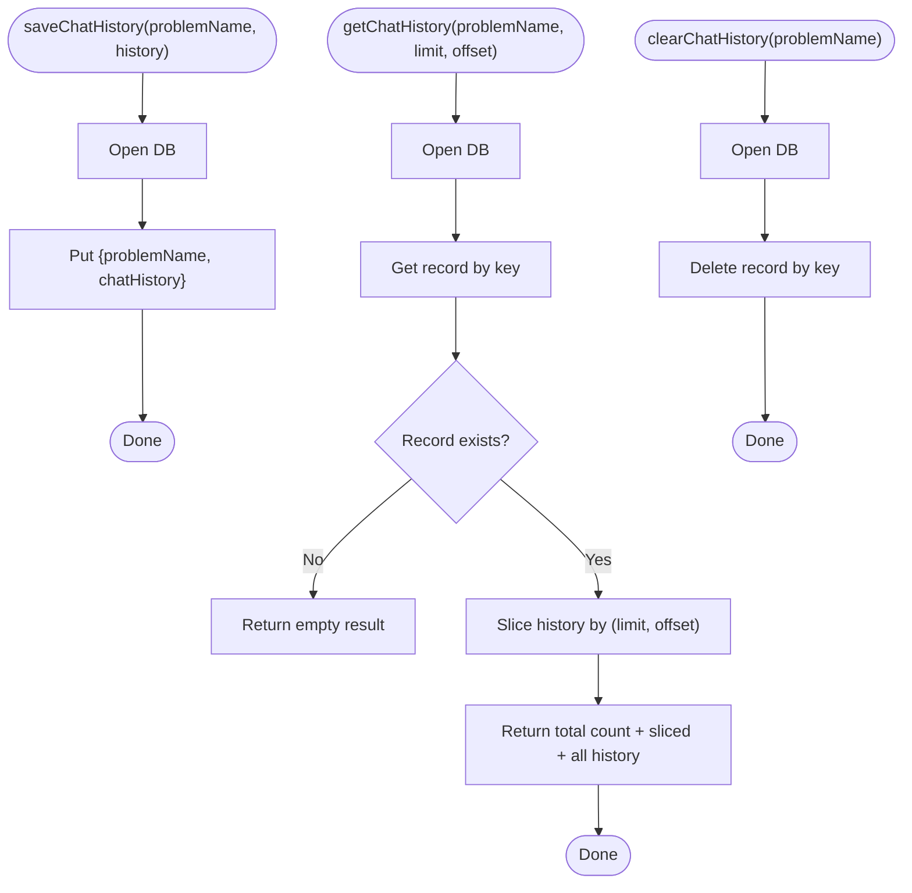
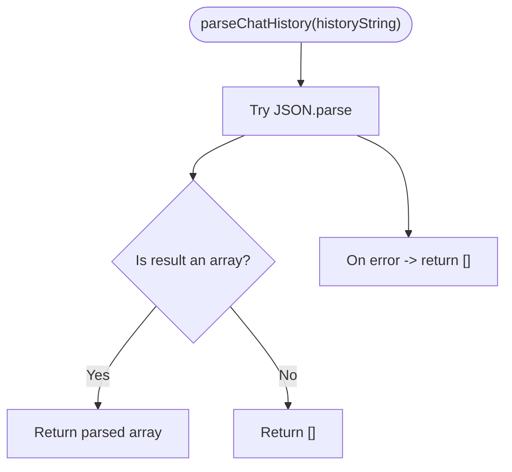
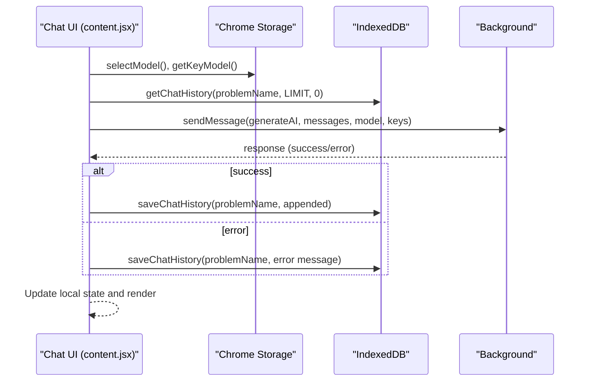
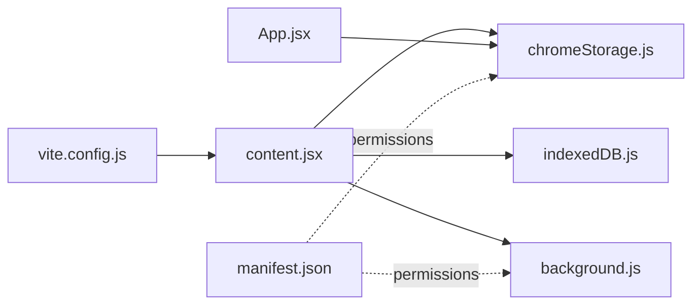

# Data Persistence and Storage

<cite>
**Referenced Files in This Document**
- [chromeStorage.js](file://src/lib/chromeStorage.js)
- [indexedDB.js](file://src/lib/indexedDB.js)
- [chatHistory.js](file://src/interface/chatHistory.js)
- [content.jsx](file://src/content/content.jsx)
- [App.jsx](file://src/App.jsx)
- [background.js](file://src/background.js)
- [manifest.json](file://manifest.json)
- [vite.config.js](file://vite.config.js)
</cite>

## Table of Contents
1. [Introduction](#introduction)
2. [Project Structure](#project-structure)
3. [Core Components](#core-components)
4. [Architecture Overview](#architecture-overview)
5. [Detailed Component Analysis](#detailed-component-analysis)
6. [Dependency Analysis](#dependency-analysis)
7. [Performance Considerations](#performance-considerations)
8. [Troubleshooting Guide](#troubleshooting-guide)
9. [Conclusion](#conclusion)
10. [Appendices](#appendices)

## Introduction
This document explains DSABuddy’s data persistence and storage architecture. The system uses a dual-storage approach:
- Chrome Storage API for small, frequently accessed configuration and credentials
- IndexedDB for persistent chat history and larger datasets

It covers the storage abstraction layer, data lifecycle, serialization/deserialization, migration strategies, privacy considerations, performance implications, offline handling, and backup/restore mechanisms.

## Project Structure
The storage-related code is organized into focused modules:
- Configuration and credentials: Chrome Storage helpers
- Persistent chat history: IndexedDB wrapper
- UI integration: Content script and popup components
- Background messaging: Cross-frame communication for API calls

**Diagram sources**
- [chromeStorage.js](file://src/lib/chromeStorage.js#L1-L36)
- [indexedDB.js](file://src/lib/indexedDB.js#L1-L38)
- [content.jsx](file://src/content/content.jsx#L1-L760)
- [App.jsx](file://src/App.jsx#L1-L233)
- [background.js](file://src/background.js#L1-L156)
- [manifest.json](file://manifest.json#L1-L74)

**Section sources**
- [chromeStorage.js](file://src/lib/chromeStorage.js#L1-L36)
- [indexedDB.js](file://src/lib/indexedDB.js#L1-L38)
- [content.jsx](file://src/content/content.jsx#L1-L760)
- [App.jsx](file://src/App.jsx#L1-L233)
- [background.js](file://src/background.js#L1-L156)
- [manifest.json](file://manifest.json#L1-L74)

## Core Components
- Chrome Storage helpers manage model selection and credentials, including a special case for shared Groq keys.
- IndexedDB wrapper persists chat histories keyed by problem identifiers with pagination support.
- UI components load and persist configuration in the popup and persist chat messages in IndexedDB.
- Background script handles model-specific API calls and relays responses to the content script.

Key responsibilities:
- Configuration persistence: selected model and credentials per model
- Chat history persistence: append-only logs per problem
- Serialization: JSON for messages and history
- Pagination: sliding window retrieval for performance
- Offline handling: IndexedDB enables offline chat viewing and partial editing

**Section sources**
- [chromeStorage.js](file://src/lib/chromeStorage.js#L1-L36)
- [indexedDB.js](file://src/lib/indexedDB.js#L1-L38)
- [content.jsx](file://src/content/content.jsx#L1-L760)
- [App.jsx](file://src/App.jsx#L1-L233)
- [background.js](file://src/background.js#L1-L156)

## Architecture Overview
The storage architecture separates concerns:
- Small, fast configuration and credentials live in Chrome Storage
- Large, structured chat histories live in IndexedDB
- UI components coordinate reads/writes and maintain local state
- Background script mediates external API calls

**Diagram sources**
- [App.jsx](file://src/App.jsx#L33-L54)
- [chromeStorage.js](file://src/lib/chromeStorage.js#L4-L26)
- [content.jsx](file://src/content/content.jsx#L183-L222)
- [indexedDB.js](file://src/lib/indexedDB.js#L9-L31)
- [background.js](file://src/background.js#L127-L156)

## Detailed Component Analysis

### Chrome Storage Abstraction
Purpose:
- Store model selection and credentials per model
- Normalize Groq models to a single shared key for simplicity

Implementation highlights:
- Key normalization: Groq models share a single credential key
- Batched writes: credentials, base URL, and custom model name are written together
- Reads return structured data for immediate use

**Diagram sources**
- [chromeStorage.js](file://src/lib/chromeStorage.js#L1-L36)

**Section sources**
- [chromeStorage.js](file://src/lib/chromeStorage.js#L1-L36)

### IndexedDB Abstraction
Purpose:
- Persist chat histories per problem identifier
- Support pagination via limit/offset slicing
- Provide append-only updates and targeted clears

Implementation highlights:
- Single-object-store schema keyed by problemName
- Sliding window retrieval with total count and sliced history
- Clear history by key

**Diagram sources**
- [indexedDB.js](file://src/lib/indexedDB.js#L1-L38)

**Section sources**
- [indexedDB.js](file://src/lib/indexedDB.js#L1-L38)

### Chat History Interface and Serialization
Purpose:
- Provide a simple parser for chat history strings
- Ensure robustness against malformed data

Implementation highlights:
- JSON.parse with fallback to empty array
- Used primarily for UI rendering and validation

**Diagram sources**
- [chatHistory.js](file://src/interface/chatHistory.js#L1-L19)

**Section sources**
- [chatHistory.js](file://src/interface/chatHistory.js#L1-L19)

### UI Integration and Data Lifecycle
Purpose:
- Load configuration from Chrome Storage
- Persist chat messages to IndexedDB
- Paginate and render chat history
- Handle rate limiting and offline scenarios

Key flows:
- On mount, content script loads selected model and credentials from Chrome Storage
- On each user message, content script sends a background request and appends the response to IndexedDB
- Chat history is loaded in pages using limit/offset and merged into the UI state
- Clear chat removes the IndexedDB record for the current problem

**Diagram sources**
- [content.jsx](file://src/content/content.jsx#L183-L222)
- [chromeStorage.js](file://src/lib/chromeStorage.js#L32-L35)
- [indexedDB.js](file://src/lib/indexedDB.js#L9-L31)
- [background.js](file://src/background.js#L127-L156)

**Section sources**
- [content.jsx](file://src/content/content.jsx#L1-L760)
- [chromeStorage.js](file://src/lib/chromeStorage.js#L1-L36)
- [indexedDB.js](file://src/lib/indexedDB.js#L1-L38)
- [background.js](file://src/background.js#L1-L156)

### Backup and Restore Mechanisms
Recommended approach:
- Export IndexedDB data periodically by retrieving all records and serializing to JSON
- Import by writing records back to IndexedDB
- For Chrome Storage, export keys and values from the extension’s storage area and re-import after reinstall or device change

Operational steps:
- Use browser devtools or a dedicated script to enumerate IndexedDB records
- Serialize chat histories and store securely
- To restore, write serialized data back to IndexedDB and re-save Chrome Storage entries

Note: Implementing a UI for export/import is out of scope for the current codebase but straightforward given the existing storage APIs.

[No sources needed since this section provides general guidance]

## Dependency Analysis
- Content script depends on Chrome Storage for credentials and IndexedDB for history
- Popup depends on Chrome Storage for configuration
- Background script depends on host permissions and is invoked via runtime messaging
- Build configuration forces all shared code into entry points to satisfy content script constraints

**Diagram sources**
- [content.jsx](file://src/content/content.jsx#L1-L760)
- [chromeStorage.js](file://src/lib/chromeStorage.js#L1-L36)
- [indexedDB.js](file://src/lib/indexedDB.js#L1-L38)
- [App.jsx](file://src/App.jsx#L1-L233)
- [background.js](file://src/background.js#L1-L156)
- [manifest.json](file://manifest.json#L1-L74)
- [vite.config.js](file://vite.config.js#L1-L34)

**Section sources**
- [content.jsx](file://src/content/content.jsx#L1-L760)
- [App.jsx](file://src/App.jsx#L1-L233)
- [chromeStorage.js](file://src/lib/chromeStorage.js#L1-L36)
- [indexedDB.js](file://src/lib/indexedDB.js#L1-L38)
- [background.js](file://src/background.js#L1-L156)
- [manifest.json](file://manifest.json#L1-L74)
- [vite.config.js](file://vite.config.js#L1-L34)

## Performance Considerations
- IndexedDB pagination: Limit retrieval size with limit/offset to reduce memory usage and improve responsiveness
- Local state merging: Merge fetched slices into existing arrays to minimize re-renders
- Message truncation: Limit upstream code length to stay within free-tier token budgets
- Background messaging: Offloads network requests to background to avoid CORS and keep content script lightweight
- Build constraints: Preventing shared chunks ensures deterministic loading in content scripts

[No sources needed since this section provides general guidance]

## Troubleshooting Guide
Common issues and resolutions:
- Missing credentials: If no API key is found for the selected model, prompt the user to configure the popup
- Rate limiting: UI displays countdown timers parsed from error messages; temporarily disable input until cooldown ends
- Storage errors: Wrap reads/writes with try/catch and log warnings; fall back gracefully
- Migration: If IndexedDB schema changes, increment version and implement upgrade blocks; ensure backward compatibility

**Section sources**
- [content.jsx](file://src/content/content.jsx#L183-L222)
- [chromeStorage.js](file://src/lib/chromeStorage.js#L1-L36)
- [indexedDB.js](file://src/lib/indexedDB.js#L1-L38)

## Conclusion
DSABuddy’s storage architecture cleanly separates small configuration data from large chat histories, leveraging Chrome Storage for speed and IndexedDB for durability. The abstraction layers are minimal and focused, enabling easy maintenance and future enhancements. Robust error handling, pagination, and offline capabilities ensure a reliable user experience.

[No sources needed since this section summarizes without analyzing specific files]

## Appendices

### Privacy Considerations
- Store only necessary configuration and chat data locally
- Avoid logging sensitive credentials; mask display in UI
- Respect user control by providing clear options to clear chat history

[No sources needed since this section provides general guidance]

### Storage Quotas and Limits
- Chrome Storage: Practical limits apply; avoid storing large documents in local storage
- IndexedDB: Larger capacity suitable for chat histories; monitor growth and implement periodic cleanup

[No sources needed since this section provides general guidance]

### Data Migration Strategies
- IndexedDB: Increment version number and implement upgrade handlers to evolve schema safely
- Chrome Storage: Maintain backward-compatible key names or provide migration routines on load

[No sources needed since this section provides general guidance]