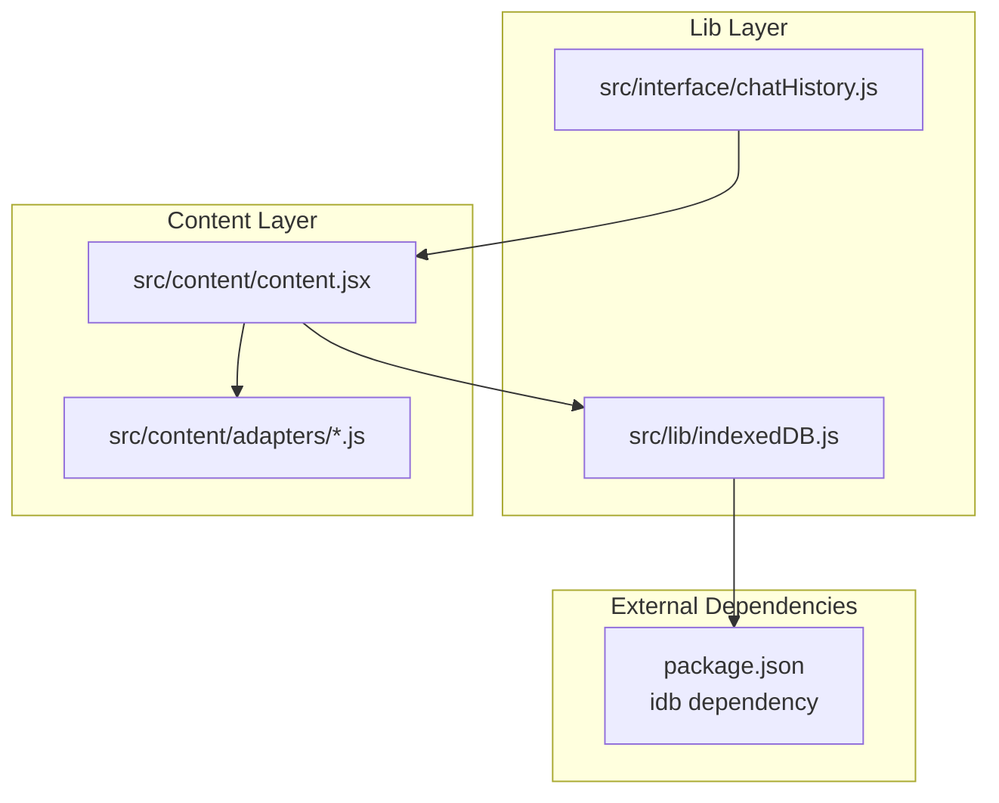
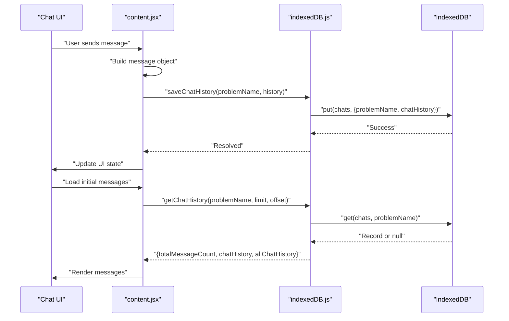
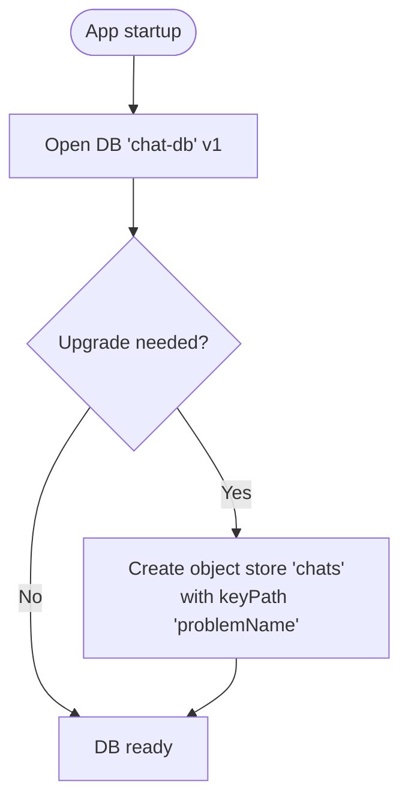
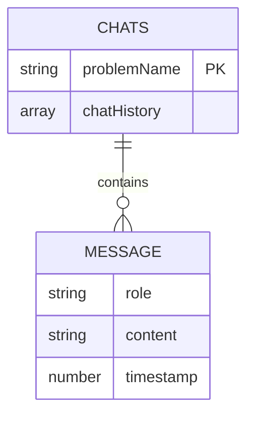
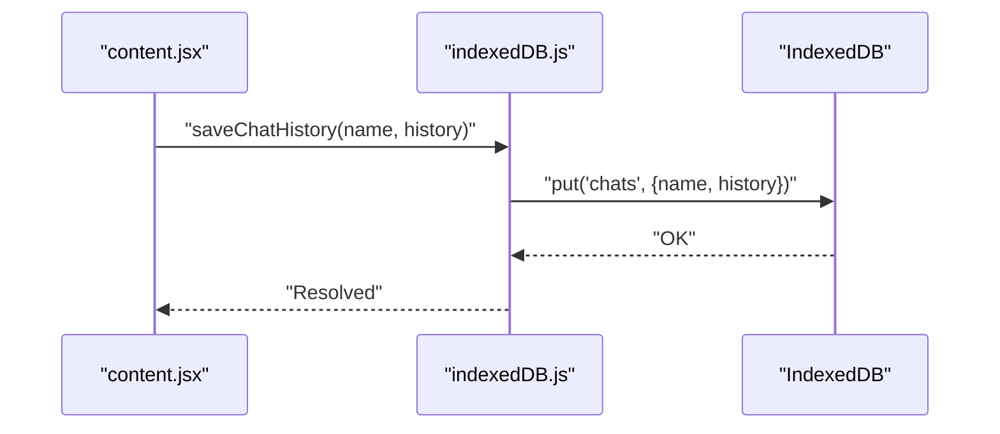
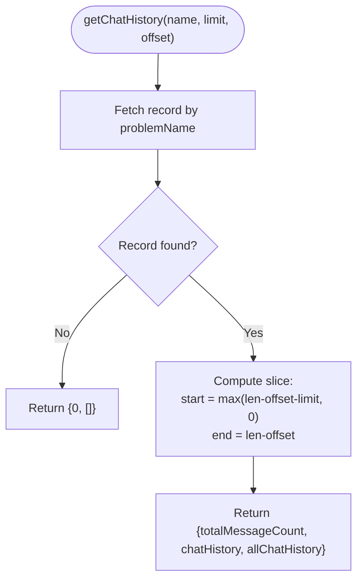
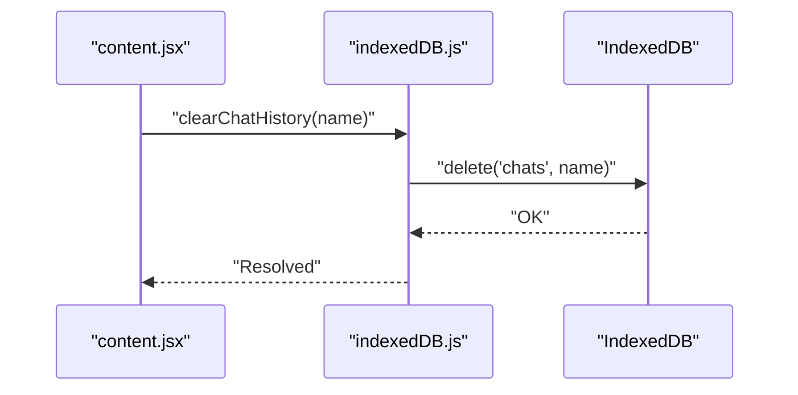
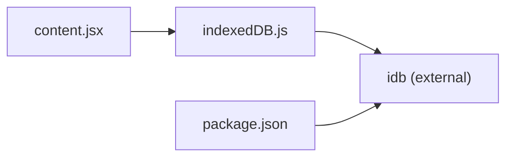

# IndexedDB Implementation

<cite>
**Referenced Files in This Document**
- [indexedDB.js](file://src/lib/indexedDB.js)
- [content.jsx](file://src/content/content.jsx)
- [chatHistory.js](file://src/interface/chatHistory.js)
- [package.json](file://package.json)
- [LeetCodeAdapter.js](file://src/content/adapters/LeetCodeAdapter.js)
- [SiteAdapter.js](file://src/content/adapters/SiteAdapter.js)
</cite>

## Table of Contents
1. [Introduction](#introduction)
2. [Project Structure](#project-structure)
3. [Core Components](#core-components)
4. [Architecture Overview](#architecture-overview)
5. [Detailed Component Analysis](#detailed-component-analysis)
6. [Dependency Analysis](#dependency-analysis)
7. [Performance Considerations](#performance-considerations)
8. [Troubleshooting Guide](#troubleshooting-guide)
9. [Conclusion](#conclusion)

## Introduction
This document provides comprehensive documentation for DSABuddy's IndexedDB implementation used for persistent chat history storage. It covers database schema design, object store creation, transaction management, CRUD operations, query patterns, error handling, and performance considerations. The implementation leverages the idb library to manage asynchronous IndexedDB operations and stores conversation histories keyed by problem identifiers.

## Project Structure
The IndexedDB-related functionality is encapsulated in a dedicated module and consumed by the content script that manages the chat UI and interaction flow.

**Diagram sources**
- [indexedDB.js](file://src/lib/indexedDB.js#L1-L38)
- [content.jsx](file://src/content/content.jsx#L1-L760)
- [chatHistory.js](file://src/interface/chatHistory.js#L1-L19)
- [package.json](file://package.json#L12-L34)

**Section sources**
- [indexedDB.js](file://src/lib/indexedDB.js#L1-L38)
- [content.jsx](file://src/content/content.jsx#L1-L760)
- [package.json](file://package.json#L12-L34)

## Core Components
- Database initialization and schema: The database is initialized with a single object store named chats and uses problemName as the primary key.
- Persistence functions: saveChatHistory persists the entire conversation array for a given problem; getChatHistory retrieves paginated slices; clearChatHistory removes a record.
- Consumption pattern: The content script orchestrates saving and loading chat history while managing UI state and pagination.

Key implementation references:
- Database initialization and object store creation: [indexedDB.js](file://src/lib/indexedDB.js#L3-L7)
- Save operation: [indexedDB.js](file://src/lib/indexedDB.js#L9-L12)
- Retrieve operation with pagination: [indexedDB.js](file://src/lib/indexedDB.js#L14-L31)
- Clear operation: [indexedDB.js](file://src/lib/indexedDB.js#L33-L36)
- Limit constant: [indexedDB.js](file://src/lib/indexedDB.js#L38)
- Usage in content script: [content.jsx](file://src/content/content/content.jsx#L37-L42)

**Section sources**
- [indexedDB.js](file://src/lib/indexedDB.js#L1-L38)
- [content.jsx](file://src/content/content.jsx#L37-L42)

## Architecture Overview
The IndexedDB layer sits beneath the content script, which handles UI events, API communication, and pagination. The content script triggers save and load operations, while the IndexedDB module abstracts IndexedDB specifics.

**Diagram sources**
- [content.jsx](file://src/content/content.jsx#L183-L227)
- [indexedDB.js](file://src/lib/indexedDB.js#L9-L31)

## Detailed Component Analysis

### Database Schema and Initialization
- Database name: chat-db
- Version: 1
- Object store: chats
- Key path: problemName (auto-increment disabled; application-provided key)
- Upgrade handler: Creates the chats object store on first run or version upgrade

**Diagram sources**
- [indexedDB.js](file://src/lib/indexedDB.js#L3-L7)

**Section sources**
- [indexedDB.js](file://src/lib/indexedDB.js#L3-L7)

### Data Models and Message Persistence
- Record structure: Each record in the chats object store contains:
  - problemName: string (primary key)
  - chatHistory: array of message objects
- Message object shape (from usage): Each message includes role, content, and timestamp fields.
- Persistence strategy: Entire chatHistory array is stored per problemName; updates append new messages to the array and persist the full array.

**Diagram sources**
- [indexedDB.js](file://src/lib/indexedDB.js#L9-L12)
- [content.jsx](file://src/content/content.jsx#L188-L211)

**Section sources**
- [indexedDB.js](file://src/lib/indexedDB.js#L9-L12)
- [content.jsx](file://src/content/content.jsx#L188-L211)

### CRUD Operations

#### Save Chat History
- Operation: put
- Target: chats object store
- Payload: { problemName, chatHistory }
- Behavior: Upserts the record; replaces existing chatHistory for the problem

**Diagram sources**
- [indexedDB.js](file://src/lib/indexedDB.js#L9-L12)
- [content.jsx](file://src/content/content.jsx#L193-L207)

**Section sources**
- [indexedDB.js](file://src/lib/indexedDB.js#L9-L12)
- [content.jsx](file://src/content/content.jsx#L193-L207)

#### Get Chat History (Paginated)
- Operation: get
- Target: chats object store by primary key (problemName)
- Pagination logic: Computes slice indices based on totalMessageCount, limit, and offset
- Returns: totalMessageCount, chatHistory (paginated slice), and allChatHistory (full array)

**Diagram sources**
- [indexedDB.js](file://src/lib/indexedDB.js#L14-L31)

**Section sources**
- [indexedDB.js](file://src/lib/indexedDB.js#L14-L31)
- [content.jsx](file://src/content/content.jsx#L219-L247)

#### Clear Chat History
- Operation: delete
- Target: chats object store by primary key (problemName)
- Effect: Removes the entire record for the problem

**Diagram sources**
- [indexedDB.js](file://src/lib/indexedDB.js#L33-L36)
- [content.jsx](file://src/content/content.jsx#L112-L116)

**Section sources**
- [indexedDB.js](file://src/lib/indexedDB.js#L33-L36)
- [content.jsx](file://src/content/content.jsx#L112-L116)

### Transaction Management
- The idb library abstracts IndexedDB transactions. Each operation (get, put, delete) runs within an implicit transaction managed by idb.
- Concurrency: Multiple concurrent operations are queued and executed serially by idb.
- Error propagation: Exceptions thrown inside idb operations propagate to the caller.

[No sources needed since this section explains general behavior of the idb library]

### Query Patterns and Indexing Strategies
- Current queries:
  - Primary key lookup by problemName
  - Full array slicing client-side
- Indexing opportunities:
  - Add secondary indexes if queries by timestamp or message metadata become frequent
  - Consider compound indexes if filtering by role and timestamp combinations are needed
- Recommendation: Introduce indexes in future versions to support efficient range queries and sorting by timestamp.

[No sources needed since this section provides general guidance]

### Error Handling
- Database errors: Not explicitly handled in the IndexedDB module; callers should wrap calls in try/catch blocks.
- Typical failure modes:
  - Quota exceeded
  - Storage disabled
  - Database locked
- Recovery strategies:
  - Fallback to in-memory state
  - Retry with exponential backoff
  - Notify user and disable persistence temporarily

[No sources needed since this section provides general guidance]

## Dependency Analysis
The IndexedDB module depends on the idb library for IndexedDB abstraction. The content script consumes the module for persistence and retrieval.

**Diagram sources**
- [content.jsx](file://src/content/content.jsx#L37-L42)
- [indexedDB.js](file://src/lib/indexedDB.js#L1)
- [package.json](file://package.json#L25)

**Section sources**
- [content.jsx](file://src/content/content.jsx#L37-L42)
- [indexedDB.js](file://src/lib/indexedDB.js#L1)
- [package.json](file://package.json#L25)

## Performance Considerations
- Data size: Storing entire chatHistory arrays can grow large over time. Consider:
  - Periodic pruning of old messages
  - Storing only recent N messages
  - Compressing or deduplicating repeated content
- Pagination: The current implementation loads the full array and slices client-side. For very large histories:
  - Implement server-side pagination or IndexedDB-backed pagination
  - Add indexes for timestamp-based queries
- Memory usage: Large arrays in memory can impact UI responsiveness. Consider:
  - Lazy rendering of older messages
  - Virtualized lists for long histories
- Network and storage: Persisting after each message ensures durability but increases write frequency. Consider batching writes with debouncing.

[No sources needed since this section provides general guidance]

## Troubleshooting Guide
- Symptoms: Chat history not loading
  - Verify problemName matches across sessions
  - Check that getChatHistory is called with correct limit and offset values
- Symptoms: History overwritten unexpectedly
  - Ensure saveChatHistory receives the complete updated history (not just new messages)
  - Confirm that the content script appends new messages before saving
- Symptoms: Storage quota exceeded
  - Implement pruning or compression strategies
  - Consider clearing old histories periodically
- Symptoms: UI not updating after save
  - Confirm that the content script updates local state after successful save
  - Verify that error handling does not swallow exceptions silently

**Section sources**
- [content.jsx](file://src/content/content.jsx#L193-L207)
- [content.jsx](file://src/content/content.jsx#L219-L247)

## Conclusion
DSABuddy's IndexedDB implementation provides a straightforward, effective mechanism for persisting chat histories keyed by problem identifiers. The design leverages idb for robust asynchronous operations and supports essential CRUD actions with simple pagination. While the current implementation focuses on reliability and simplicity, future enhancements could include indexing strategies, pruning policies, and improved error handling to scale with larger datasets and more complex query patterns.