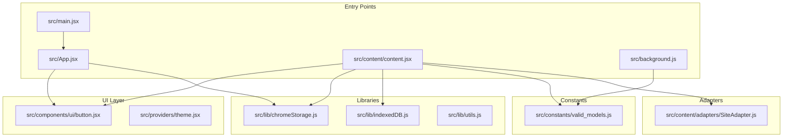
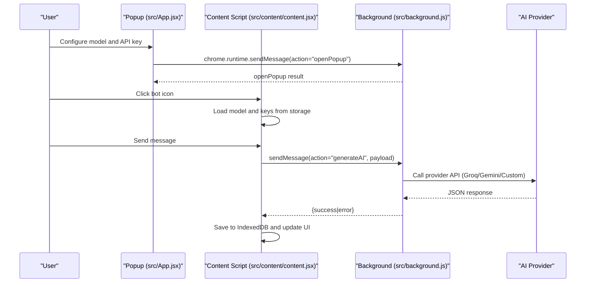
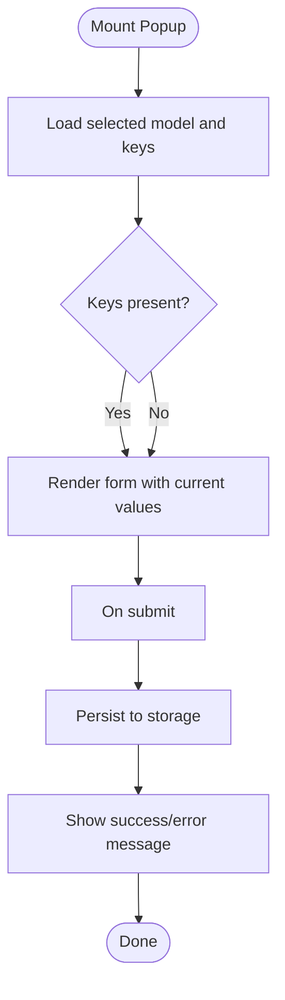
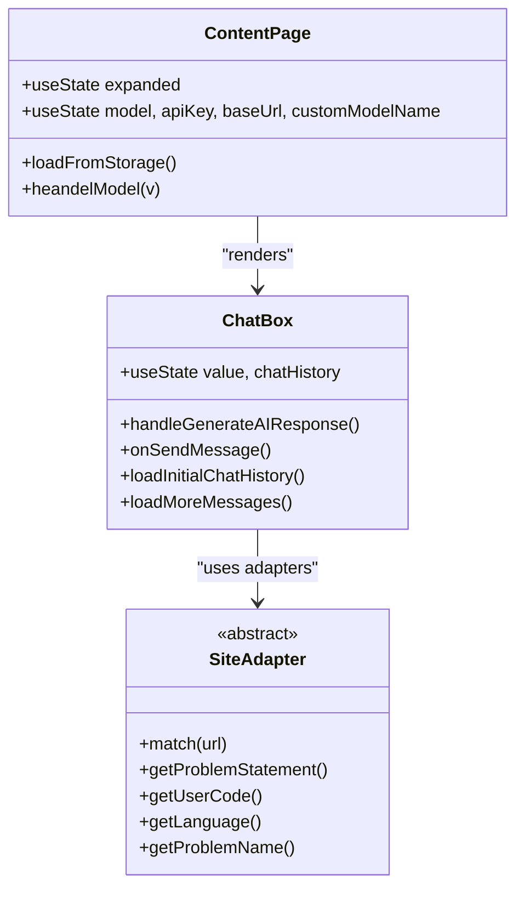
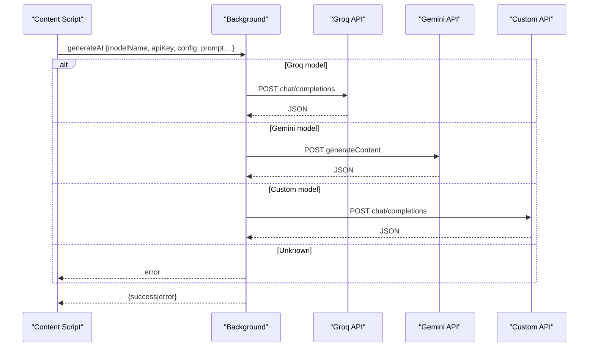
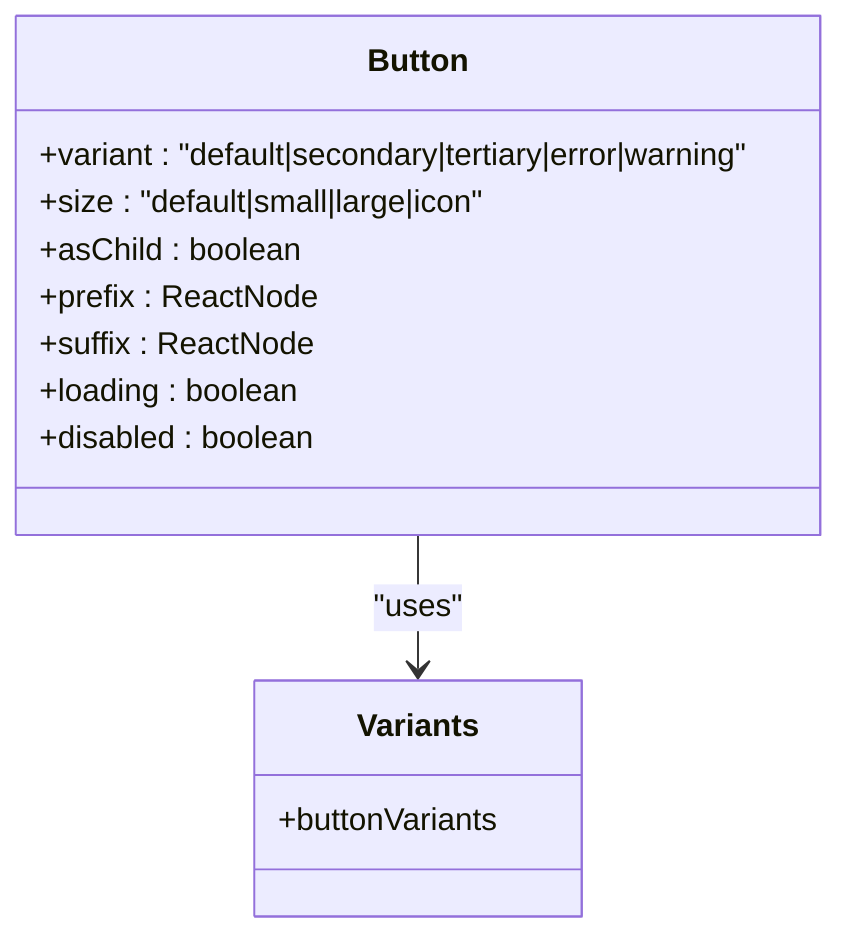
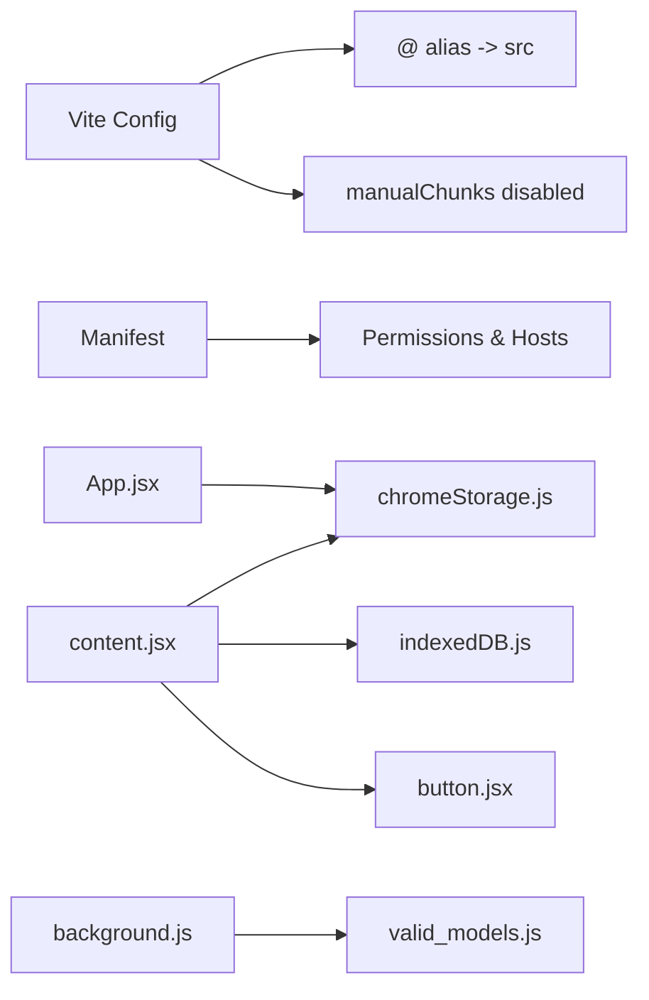

# Development Guidelines and Best Practices

<cite>
**Referenced Files in This Document**
- [package.json](file://package.json)
- [eslint.config.js](file://eslint.config.js)
- [.prettierrc](file://.prettierrc)
- [vite.config.js](file://vite.config.js)
- [manifest.json](file://manifest.json)
- [src/main.jsx](file://src/main.jsx)
- [src/App.jsx](file://src/App.jsx)
- [src/content/content.jsx](file://src/content/content.jsx)
- [src/background.js](file://src/background.js)
- [src/components/ui/button.jsx](file://src/components/ui/button.jsx)
- [src/lib/chromeStorage.js](file://src/lib/chromeStorage.js)
- [src/lib/indexedDB.js](file://src/lib/indexedDB.js)
- [src/lib/utils.js](file://src/lib/utils.js)
- [src/constants/valid_models.js](file://src/constants/valid_models.js)
- [src/content/adapters/SiteAdapter.js](file://src/content/adapters/SiteAdapter.js)
</cite>

## Table of Contents
1. [Introduction](#introduction)
2. [Project Structure](#project-structure)
3. [Core Components](#core-components)
4. [Architecture Overview](#architecture-overview)
5. [Detailed Component Analysis](#detailed-component-analysis)
6. [Dependency Analysis](#dependency-analysis)
7. [Performance Considerations](#performance-considerations)
8. [Testing Strategies](#testing-strategies)
9. [Debugging Techniques for Chrome Extensions](#debugging-techniques-for-chrome-extensions)
10. [Code Review and Contribution Workflow](#code-review-and-contribution-workflow)
11. [Documentation Standards](#documentation-standards)
12. [Practical Examples](#practical-examples)
13. [Common Pitfalls and Troubleshooting](#common-pitfalls-and-troubleshooting)
14. [Conclusion](#conclusion)

## Introduction
This document provides comprehensive development guidelines for contributors working on DSABuddy, a Chrome Extension built with React and Vite. It covers code standards and conventions for JavaScript/JSX, ESLint configuration, Prettier formatting, component development guidelines, architectural patterns, testing strategies, debugging techniques specific to Chrome Extensions, performance optimization, code review processes, contribution workflows, and documentation standards. Practical examples demonstrate proper component implementation, state management patterns, and integration testing approaches.

## Project Structure
The project follows a feature-based structure with clear separation of concerns:
- Entry points: main application, content script, and background service worker
- UI primitives and composite components
- Utilities for storage, IndexedDB, and Tailwind helpers
- Adapters for site-specific integrations
- Constants and configuration files for models and permissions

**Diagram sources**
- [src/main.jsx](file://src/main.jsx#L1-L13)
- [src/App.jsx](file://src/App.jsx#L1-L233)
- [src/content/content.jsx](file://src/content/content.jsx#L1-L760)
- [src/background.js](file://src/background.js#L1-L156)
- [src/components/ui/button.jsx](file://src/components/ui/button.jsx#L1-L115)
- [src/lib/chromeStorage.js](file://src/lib/chromeStorage.js#L1-L36)
- [src/lib/indexedDB.js](file://src/lib/indexedDB.js#L1-L38)
- [src/lib/utils.js](file://src/lib/utils.js#L1-L3)
- [src/constants/valid_models.js](file://src/constants/valid_models.js#L1-L12)
- [src/content/adapters/SiteAdapter.js](file://src/content/adapters/SiteAdapter.js#L1-L28)

**Section sources**
- [src/main.jsx](file://src/main.jsx#L1-L13)
- [src/App.jsx](file://src/App.jsx#L1-L233)
- [src/content/content.jsx](file://src/content/content.jsx#L1-L760)
- [src/background.js](file://src/background.js#L1-L156)
- [src/components/ui/button.jsx](file://src/components/ui/button.jsx#L1-L115)
- [src/lib/chromeStorage.js](file://src/lib/chromeStorage.js#L1-L36)
- [src/lib/indexedDB.js](file://src/lib/indexedDB.js#L1-L38)
- [src/lib/utils.js](file://src/lib/utils.js#L1-L3)
- [src/constants/valid_models.js](file://src/constants/valid_models.js#L1-L12)
- [src/content/adapters/SiteAdapter.js](file://src/content/adapters/SiteAdapter.js#L1-L28)

## Core Components
- Application shell and popup: Orchestrates model selection, API key storage, and user input handling.
- Content script: Injects a React-powered chat UI into supported sites, manages chat history, and communicates with the background script.
- Background script: Implements model-specific API calls, routes requests, and handles rate limiting.
- UI primitives: Reusable components with variant and size configurations.
- Storage utilities: Encapsulate Chrome storage and IndexedDB operations.
- Adapter pattern: Site-specific adapters for problem extraction and context.

**Section sources**
- [src/App.jsx](file://src/App.jsx#L1-L233)
- [src/content/content.jsx](file://src/content/content.jsx#L1-L760)
- [src/background.js](file://src/background.js#L1-L156)
- [src/components/ui/button.jsx](file://src/components/ui/button.jsx#L1-L115)
- [src/lib/chromeStorage.js](file://src/lib/chromeStorage.js#L1-L36)
- [src/lib/indexedDB.js](file://src/lib/indexedDB.js#L1-L38)
- [src/content/adapters/SiteAdapter.js](file://src/content/adapters/SiteAdapter.js#L1-L28)

## Architecture Overview
The extension uses a multi-entry build with Vite, injecting a React app into web pages and routing AI API calls through a background service worker to avoid CORS restrictions.

**Diagram sources**
- [src/App.jsx](file://src/App.jsx#L1-L233)
- [src/content/content.jsx](file://src/content/content.jsx#L122-L217)
- [src/background.js](file://src/background.js#L127-L155)

**Section sources**
- [vite.config.js](file://vite.config.js#L1-L35)
- [manifest.json](file://manifest.json#L1-L74)
- [src/content/content.jsx](file://src/content/content.jsx#L122-L217)
- [src/background.js](file://src/background.js#L127-L155)

## Detailed Component Analysis

### Popup Component (Settings and Model Selection)
- Responsibilities: Manage model selection, API key persistence, and form submission.
- State management: Uses local state for UI and effects to hydrate from Chrome storage.
- Storage integration: Persists keys per model family to simplify shared keys across compatible models.

**Diagram sources**
- [src/App.jsx](file://src/App.jsx#L56-L100)

**Section sources**
- [src/App.jsx](file://src/App.jsx#L1-L233)
- [src/lib/chromeStorage.js](file://src/lib/chromeStorage.js#L1-L36)

### Content Script and Chat UI
- Responsibilities: Inject UI into target pages, manage chat history, and communicate with background.
- State management: Tracks visibility, messages, rate limits, and pagination.
- Persistence: Uses IndexedDB for chat history with configurable limits.
- Adapter pattern: Delegates site-specific logic to adapters.

**Diagram sources**
- [src/content/content.jsx](file://src/content/content.jsx#L555-L723)
- [src/content/content.jsx](file://src/content/content.jsx#L61-L553)
- [src/content/adapters/SiteAdapter.js](file://src/content/adapters/SiteAdapter.js#L1-L28)

**Section sources**
- [src/content/content.jsx](file://src/content/content.jsx#L1-L760)
- [src/lib/indexedDB.js](file://src/lib/indexedDB.js#L1-L38)
- [src/content/adapters/SiteAdapter.js](file://src/content/adapters/SiteAdapter.js#L1-L28)

### Background Service Worker
- Responsibilities: Route messages to appropriate provider implementations, handle errors, and respond to UI actions.
- Provider implementations: Groq, Gemini, and custom OpenAI-compatible endpoints.
- Message handling: Keeps communication channel open for async responses.

**Diagram sources**
- [src/background.js](file://src/background.js#L7-L123)
- [src/background.js](file://src/background.js#L127-L155)

**Section sources**
- [src/background.js](file://src/background.js#L1-L156)

### UI Primitive: Button Component
- Variants and sizes: Configured via a variant factory for consistent styling.
- Composition: Supports children, prefix/suffix elements, and loading states.
- Motion: Optional animations for interactive feedback.

**Diagram sources**
- [src/components/ui/button.jsx](file://src/components/ui/button.jsx#L10-L38)
- [src/components/ui/button.jsx](file://src/components/ui/button.jsx#L62-L113)

**Section sources**
- [src/components/ui/button.jsx](file://src/components/ui/button.jsx#L1-L115)

## Dependency Analysis
- Build toolchain: Vite with React plugin and path aliases.
- Runtime dependencies: React, Radix UI, Tailwind utilities, AI SDKs, and IDB.
- Manifest permissions: Storage, activeTab, scripting, and host permissions for providers.
- Shared code strategy: Prevents Rollup from splitting shared modules to satisfy content script classic script constraints.

**Diagram sources**
- [vite.config.js](file://vite.config.js#L1-L35)
- [manifest.json](file://manifest.json#L1-L74)
- [src/App.jsx](file://src/App.jsx#L1-L233)
- [src/content/content.jsx](file://src/content/content.jsx#L1-L760)
- [src/background.js](file://src/background.js#L1-L156)

**Section sources**
- [vite.config.js](file://vite.config.js#L1-L35)
- [manifest.json](file://manifest.json#L1-L74)
- [src/App.jsx](file://src/App.jsx#L1-L233)
- [src/content/content.jsx](file://src/content/content.jsx#L1-L760)
- [src/background.js](file://src/background.js#L1-L156)

## Performance Considerations
- Build configuration: Disables code splitting for content scripts to ensure compatibility; bundles shared code into each entry.
- Network calls: Limits messages sent to providers and truncates user code to stay within token budgets.
- UI rendering: Uses virtualized-like pagination and avoids unnecessary re-renders by managing state efficiently.
- Storage: IndexedDB operations are batched and scoped to problem names to minimize overhead.

[No sources needed since this section provides general guidance]

## Testing Strategies
- Unit tests for utilities:
  - Storage helpers: Verify key mapping and retrieval for model families.
  - IndexedDB helpers: Validate save, load, and pagination logic.
- Integration tests for content script:
  - Simulate runtime messaging and ensure correct provider routing.
  - Mock adapters to validate problem extraction and context building.
- End-to-end tests:
  - Launch extension in automation mode, navigate to supported sites, and verify UI injection and message flow.
- Linting and formatting:
  - Enforce style and quality rules via ESLint and Prettier to maintain consistency.

[No sources needed since this section provides general guidance]

## Debugging Techniques for Chrome Extensions
- Background and content script logs:
  - Use DevTools for the extension’s background page and the target tab to inspect console output.
- Messaging verification:
  - Confirm message payloads and response shapes in background listeners.
- Storage inspection:
  - Use the Extensions DevTools storage panel to verify persisted keys and selected model.
- Network monitoring:
  - Observe provider API calls and rate limit responses.
- UI injection:
  - Verify DOM container creation and React root mounting in the target page.

[No sources needed since this section provides general guidance]

## Code Review and Contribution Workflow
- Branching:
  - Feature branches per task; keep commits focused and descriptive.
- Pull requests:
  - Include a summary of changes, rationale, and test coverage.
- Linting and formatting:
  - Run lint and format checks locally before submitting PRs.
- Permissions and manifest updates:
  - Update permissions and hosts in the manifest when adding new provider integrations.
- Accessibility and UX:
  - Ensure components are keyboard accessible and responsive.

[No sources needed since this section provides general guidance]

## Documentation Standards
- Inline documentation:
  - Add JSDoc-style comments for complex functions and exported APIs.
- Component documentation:
  - Document props, variants, and usage examples for UI primitives.
- Architecture decisions:
  - Record trade-offs for build configuration, adapter pattern, and storage choices.
- Changelog:
  - Maintain a concise changelog highlighting breaking changes and new features.

[No sources needed since this section provides general guidance]

## Practical Examples

### Proper Component Implementation Pattern
- Use variant factories for consistent styling across components.
- Compose smaller components and pass props explicitly for clarity.
- Example reference: [Button component](file://src/components/ui/button.jsx#L10-L38)

**Section sources**
- [src/components/ui/button.jsx](file://src/components/ui/button.jsx#L1-L115)

### State Management Patterns
- Hydrate UI state from storage on mount and subscribe to storage changes.
- Example reference: [Popup hydration and updates](file://src/App.jsx#L56-L100)

**Section sources**
- [src/App.jsx](file://src/App.jsx#L1-L233)

### Integration Testing Approaches
- Mock runtime.sendMessage responses and simulate provider endpoints.
- Validate IndexedDB persistence and pagination behavior.
- Example reference: [Background message handling](file://src/background.js#L127-L155)

**Section sources**
- [src/background.js](file://src/background.js#L127-L155)

## Common Pitfalls and Troubleshooting
- Content script module errors:
  - Avoid ES module imports in injected scripts; rely on bundled entry points.
- CORS and API calls:
  - Always route external API calls through the background script.
- Storage key collisions:
  - Use model-family-aware keys to prevent conflicts across related models.
- Rate limiting:
  - Parse rate limit messages and enforce cooldown timers.
- UI injection failures:
  - Re-injection via MutationObserver ensures resilience against SPA navigations.

**Section sources**
- [vite.config.js](file://vite.config.js#L24-L28)
- [src/background.js](file://src/background.js#L127-L155)
- [src/lib/chromeStorage.js](file://src/lib/chromeStorage.js#L1-L36)
- [src/content/content.jsx](file://src/content/content.jsx#L182-L197)
- [src/content/content.jsx](file://src/content/content.jsx#L754-L759)

## Conclusion
By adhering to these development guidelines—consistent code style, robust architecture, disciplined testing, and effective debugging—you can contribute reliably to DSABuddy. Focus on clear component boundaries, predictable state management, and secure cross-script communication to deliver a high-quality Chrome Extension.