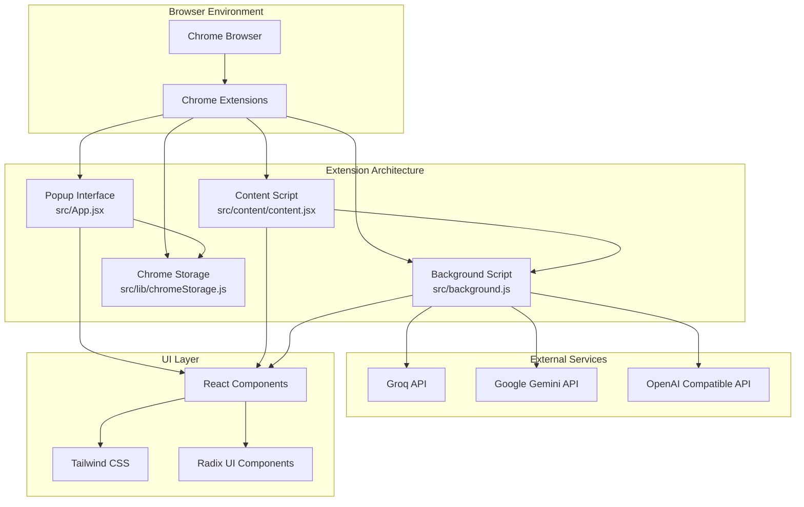
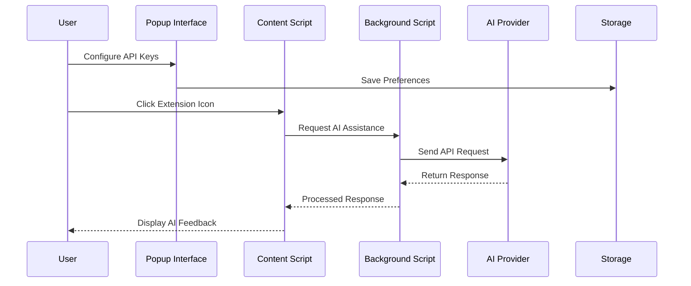

# Getting Started

<cite>
**Referenced Files in This Document**
- [README.md](file://README.md)
- [package.json](file://package.json)
- [manifest.json](file://manifest.json)
- [vite.config.js](file://vite.config.js)
- [tailwind.config.js](file://tailwind.config.js)
- [eslint.config.js](file://eslint.config.js)
- [src/main.jsx](file://src/main.jsx)
- [src/App.jsx](file://src/App.jsx)
- [src/background.js](file://src/background.js)
- [src/content/content.jsx](file://src/content/content.jsx)
- [src/lib/chromeStorage.js](file://src/lib/chromeStorage.js)
- [src/constants/valid_models.js](file://src/constants/valid_models.js)
- [src/scripts/postbuild.js](file://src/scripts/postbuild.js)
- [src/scripts/release.js](file://src/scripts/release.js)
</cite>

## Table of Contents
1. [Introduction](#introduction)
2. [Prerequisites](#prerequisites)
3. [Installation](#installation)
4. [Development Workflow](#development-workflow)
5. [Production Build](#production-build)
6. [Chrome Extension Loading](#chrome-extension-loading)
7. [Environment Setup](#environment-setup)
8. [IDE Configuration Recommendations](#ide-configuration-recommendations)
9. [Initial Project Exploration](#initial-project-exploration)
10. [Common Setup Issues and Troubleshooting](#common-setup-issues-and-troubleshooting)
11. [Architecture Overview](#architecture-overview)
12. [Conclusion](#conclusion)

## Introduction
DSA Buddy is a Chrome extension designed to help users practice and learn Data Structures and Algorithms (DSA) efficiently. Built with React and Vite, it provides an interactive interface, curated resources, and productivity tools for DSA enthusiasts. The extension integrates with popular platforms like LeetCode, HackerRank, and GeeksforGeeks, offering AI-powered assistance for problem-solving.

## Prerequisites
Before you begin, ensure you have the following installed:

- **Node.js**: Version 16 or higher (recommended for optimal compatibility)
- **Package Manager**: Choose one of the following:
  - pnpm (recommended for faster installs)
  - npm (Node Package Manager)
  - yarn (Yarn Classic)
- **Chrome Browser**: Latest stable version for extension development and testing

These requirements are essential for running the development server, building the extension, and loading it in Chrome for testing.

**Section sources**
- [README.md](file://README.md#L15-L18)

## Installation
Follow these step-by-step instructions to set up the DSA Buddy development environment:

### Step 1: Clone the Repository
Clone the repository to your local machine using Git:
```bash
git clone https://github.com/your-username/DSABuddy.git
cd DSABuddy
```

### Step 2: Install Dependencies
Choose your preferred package manager and install dependencies:
```bash
# Using pnpm (recommended)
pnpm install

# Using npm
npm install

# Using yarn
yarn install
```

### Step 3: Start Development Server
Launch the development server with hot module replacement:
```bash
# Using pnpm
pnpm dev

# Using npm
npm run dev

# Using yarn
yarn dev
```

The development server will start and watch for file changes, automatically rebuilding the extension as you work.

**Section sources**
- [README.md](file://README.md#L20-L47)
- [package.json](file://package.json#L6-L11)

## Development Workflow
The DSA Buddy project follows a modern React + Vite development workflow optimized for Chrome extension development:

### Project Structure Overview
The project is organized into several key directories:
- `src/`: Contains all source code including React components, content scripts, and background scripts
- `public/`: Static assets and public files
- `dist/`: Build output directory (auto-generated)
- `icons/`: Extension icons for different sizes
- `src/scripts/`: Build automation scripts

### Key Development Scripts
The project provides several npm scripts for different development tasks:
- `dev`: Starts the Vite development server with hot reloading
- `build`: Creates a production build and runs post-processing
- `preview`: Serves the built extension locally for testing
- `lint`: Runs ESLint for code quality checks

**Section sources**
- [package.json](file://package.json#L6-L11)
- [vite.config.js](file://vite.config.js#L1-L35)

## Production Build
To create a production-ready build of the extension:

### Build Process
Run the production build script:
```bash
# Using pnpm
pnpm build

# Using npm
npm run build

# Using yarn
yarn build
```

The build process performs several steps:
1. Compiles React components with Vite
2. Bundles JavaScript and CSS assets
3. Runs the post-build script to optimize content scripts
4. Generates the final distribution in the `dist/` directory

### Build Output
The production build creates:
- Optimized JavaScript bundles for content scripts and background
- Minified CSS files
- Manifest.json with updated asset references
- Extension icons copied to the distribution directory

**Section sources**
- [package.json](file://package.json#L8)
- [src/scripts/postbuild.js](file://src/scripts/postbuild.js#L1-L171)

## Chrome Extension Loading
After building the extension, you need to load it into Chrome for testing:

### Loading Steps
1. **Build the extension** using the production build command
2. **Open Chrome Extensions Page**: Navigate to `chrome://extensions/`
3. **Enable Developer Mode**: Toggle the developer mode switch in the top-right corner
4. **Load Unpacked Extension**: Click "Load unpacked" and select the `dist` folder

### Extension Permissions
The extension requires several permissions for full functionality:
- Storage access for saving user preferences and API keys
- Active tab access for interacting with supported websites
- Scripting permissions for content injection
- Host permissions for accessing LeetCode, HackerRank, and GeeksforGeeks

### Testing Platforms
The extension works with the following platforms:
- LeetCode (leetcode.com and *.leetcode.com)
- HackerRank (hackerrank.com and *.hackerrank.com)
- GeeksforGeeks (geeksforgeeks.org and *.geeksforgeeks.org)

**Section sources**
- [README.md](file://README.md#L49-L54)
- [manifest.json](file://manifest.json#L6-L48)

## Environment Setup
Configure your development environment for optimal productivity:

### Node.js Version Management
Ensure you're using Node.js 16 or higher. Consider using a version manager like nvm (Node Version Manager) to easily switch between Node.js versions.

### Package Manager Choice
While all major package managers work, pnpm is recommended for:
- Faster installation times
- Better disk space usage
- Consistent dependency resolution

### Environment Variables
The extension uses environment variables for API configurations:
- API keys for different AI providers (Groq, Gemini, OpenAI-compatible)
- Base URLs for custom model endpoints
- Model selection preferences

### Build Configuration
The Vite configuration includes:
- React plugin for JSX support
- Path aliases for cleaner imports
- Custom Rollup configuration for Chrome compatibility
- Asset handling optimized for extension packaging

**Section sources**
- [vite.config.js](file://vite.config.js#L1-L35)
- [tailwind.config.js](file://tailwind.config.js#L1-L78)

## IDE Configuration Recommendations
Enhance your development experience with these IDE configurations:

### Recommended VS Code Extensions
- **ESLint**: For JavaScript/JSX linting
- **Prettier**: For code formatting
- **Tailwind CSS IntelliSense**: For CSS class completion
- **React Developer Tools**: For React component inspection

### ESLint Configuration
The project includes comprehensive ESLint configuration:
- JavaScript/JSX recommended rules
- React Hooks plugin
- React Refresh plugin
- Chrome extension globals support
- Ignored directories for build artifacts

### Prettier Configuration
Code formatting is handled by Prettier with:
- Consistent indentation and spacing
- Quote preference settings
- Trailing comma configuration

### Editor Settings
Recommended editor configurations:
- Tab size: 2 spaces
- End-of-line: LF
- Insert final newline: enabled
- Trim trailing whitespace: enabled

**Section sources**
- [eslint.config.js](file://eslint.config.js#L1-L28)
- [tailwind.config.js](file://tailwind.config.js#L1-L78)

## Initial Project Exploration
Explore the project structure and key components to understand the architecture:

### Main Application Entry Point
The React application starts from `src/main.jsx`, which:
- Sets up the React root
- Wraps the app with theme provider
- Imports global styles

### Popup Interface
The extension popup (`src/App.jsx`) provides:
- Model selection interface
- API key management
- User settings configuration
- Real-time feedback system

### Content Script Architecture
The content script (`src/content/content.jsx`) handles:
- Problem statement extraction
- AI interaction routing
- Chat history management
- Code highlighting and display

### Background Service Worker
The background script (`src/background.js`) manages:
- AI model communication
- API request routing
- Error handling and retries
- Response formatting

### Storage Management
Chrome storage integration (`src/lib/chromeStorage.js`) provides:
- Secure API key storage
- Model preference persistence
- Cross-component data sharing
- Key normalization for shared models

**Section sources**
- [src/main.jsx](file://src/main.jsx#L1-L13)
- [src/App.jsx](file://src/App.jsx#L1-L233)
- [src/content/content.jsx](file://src/content/content.jsx#L1-L760)
- [src/background.js](file://src/background.js#L1-L156)
- [src/lib/chromeStorage.js](file://src/lib/chromeStorage.js#L1-L36)

## Common Setup Issues and Troubleshooting
Address frequent development and deployment problems:

### Node.js Version Compatibility
**Issue**: Build fails with Node.js versions below 16
**Solution**: Upgrade to Node.js 16+ or use nvm to manage versions

### Package Manager Conflicts
**Issue**: Different package managers produce inconsistent builds
**Solution**: Choose one package manager and stick with it consistently

### Port Conflicts During Development
**Issue**: Development server fails to start due to port conflicts
**Solution**: Change the Vite port in configuration or kill conflicting processes

### Chrome Extension Loading Failures
**Issue**: Extension fails to load with permission errors
**Solution**: 
1. Clear existing extension instances
2. Re-enable developer mode
3. Check manifest.json permissions
4. Verify build artifacts exist

### Content Script Not Injecting
**Issue**: Extension icon appears but content script doesn't work
**Solution**:
1. Check console for errors
2. Verify host permissions in manifest
3. Ensure content script matches target URLs
4. Test on supported platforms only

### API Key Storage Issues
**Issue**: API keys not persisting between sessions
**Solution**:
1. Verify chrome.storage permissions
2. Check storage quota limits
3. Ensure proper key normalization for shared models

### Build Optimization Problems
**Issue**: Content scripts fail due to ES module imports
**Solution**: The post-build script automatically inlines shared chunks - ensure it runs successfully

**Section sources**
- [src/scripts/postbuild.js](file://src/scripts/postbuild.js#L14-L32)
- [manifest.json](file://manifest.json#L6-L48)

## Architecture Overview
DSA Buddy follows a modular architecture optimized for Chrome extension development:



**Diagram sources**
- [src/App.jsx](file://src/App.jsx#L1-L233)
- [src/content/content.jsx](file://src/content/content.jsx#L1-L760)
- [src/background.js](file://src/background.js#L1-L156)
- [src/lib/chromeStorage.js](file://src/lib/chromeStorage.js#L1-L36)

### Component Interaction Flow
The extension follows a clear data flow pattern:



**Diagram sources**
- [src/App.jsx](file://src/App.jsx#L33-L54)
- [src/content/content.jsx](file://src/content/content.jsx#L152-L181)
- [src/background.js](file://src/background.js#L133-L155)

## Conclusion
DSA Buddy provides a comprehensive development environment for creating AI-powered DSA learning tools. By following this guide, you can quickly set up your development environment, understand the project architecture, and start contributing to the extension.

Key takeaways:
- The project uses modern React + Vite tooling optimized for Chrome extensions
- Multiple AI providers are supported with unified configuration
- The build process includes Chrome-specific optimizations
- Comprehensive testing is possible across multiple DSA platforms
- The architecture supports easy extension and customization

For ongoing development, refer to the project's documentation and consider contributing improvements to the extension's functionality and user experience.