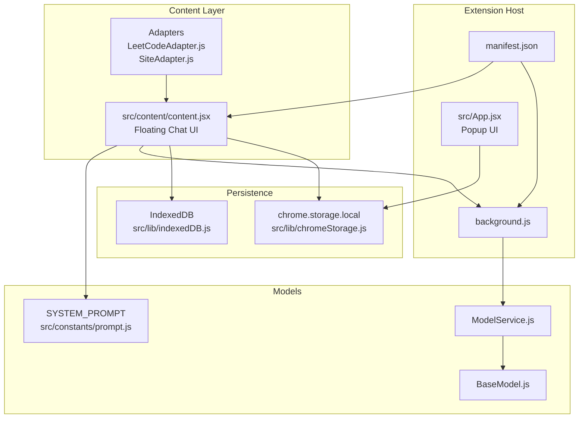
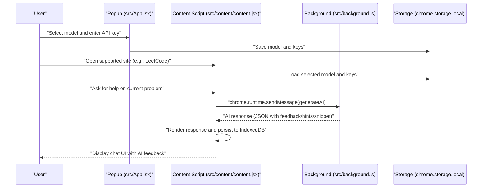
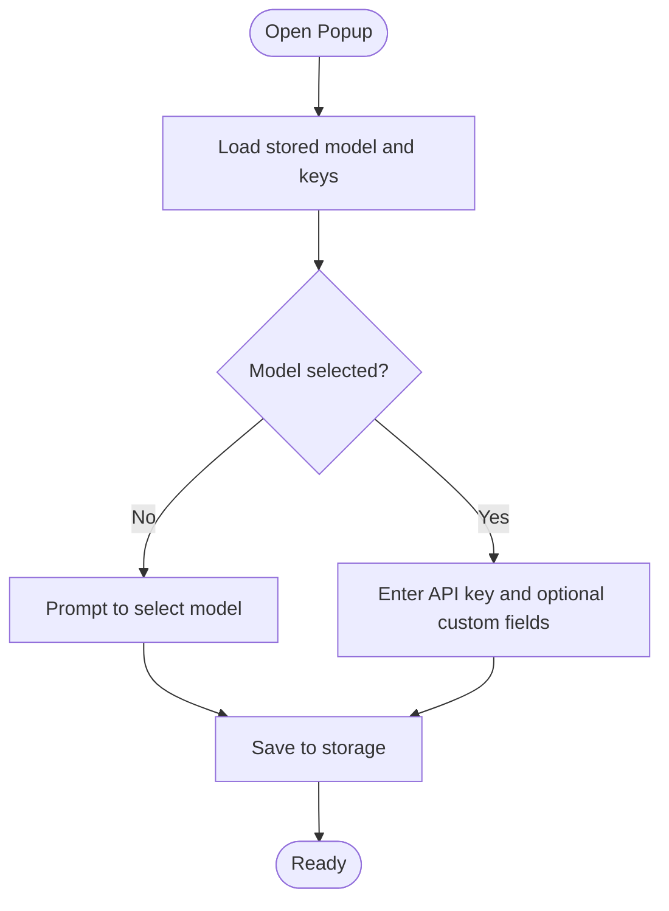
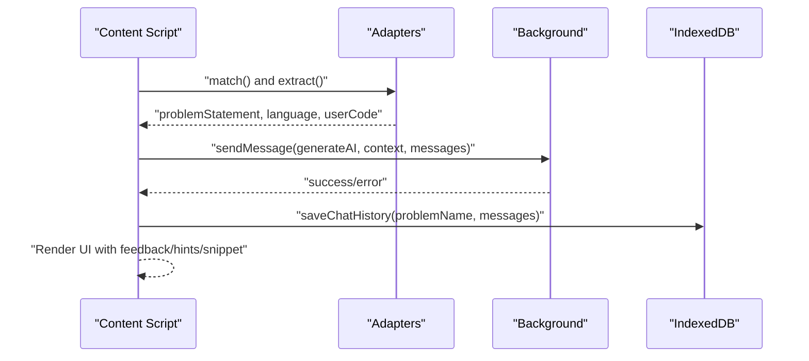
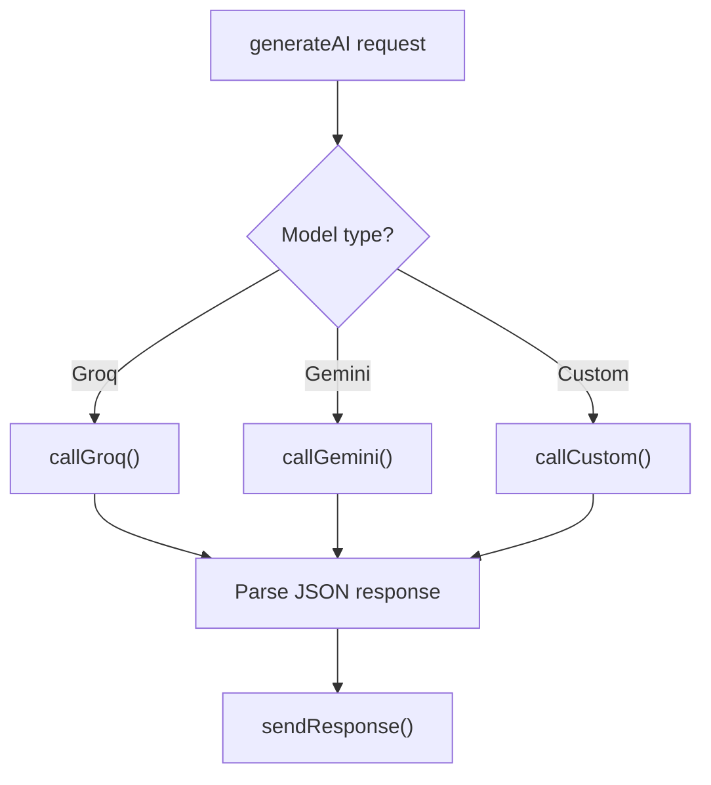
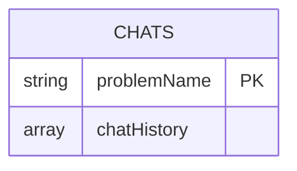
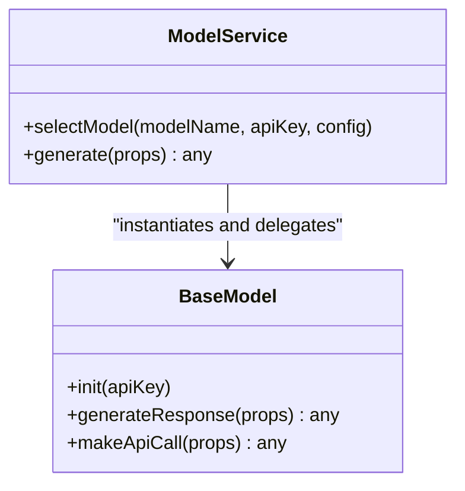
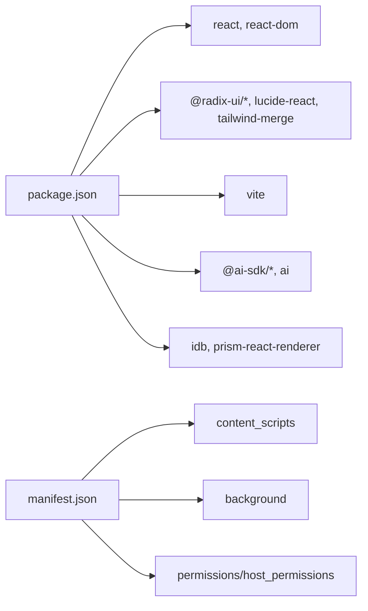

# Project Overview

<cite>
**Referenced Files in This Document**
- [README.md](file://README.md)
- [package.json](file://package.json)
- [manifest.json](file://manifest.json)
- [src/main.jsx](file://src/main.jsx)
- [src/App.jsx](file://src/App.jsx)
- [src/content/content.jsx](file://src/content/content.jsx)
- [src/content/adapters/SiteAdapter.js](file://src/content/adapters/SiteAdapter.js)
- [src/content/adapters/LeetCodeAdapter.js](file://src/content/adapters/LeetCodeAdapter.js)
- [src/constants/valid_models.js](file://src/constants/valid_models.js)
- [src/constants/prompt.js](file://src/constants/prompt.js)
- [src/lib/chromeStorage.js](file://src/lib/chromeStorage.js)
- [src/lib/indexedDB.js](file://src/lib/indexedDB.js)
- [src/background.js](file://src/background.js)
- [src/services/ModelService.js](file://src/services/ModelService.js)
- [src/models/BaseModel.js](file://src/models/BaseModel.js)
</cite>

## Table of Contents
1. [Introduction](#introduction)
2. [Project Structure](#project-structure)
3. [Core Components](#core-components)
4. [Architecture Overview](#architecture-overview)
5. [Detailed Component Analysis](#detailed-component-analysis)
6. [Dependency Analysis](#dependency-analysis)
7. [Performance Considerations](#performance-considerations)
8. [Troubleshooting Guide](#troubleshooting-guide)
9. [Conclusion](#conclusion)
10. [Appendices](#appendices)

## Introduction
DSA Buddy is a Chrome Extension AI-powered learning companion focused on Data Structures and Algorithms (DSA). Its primary goal is to accelerate coding interview preparation by offering contextual, on-page assistance while practicing on popular platforms. It integrates seamlessly with LeetCode, HackerRank, and GeeksforGeeks, enabling users to receive targeted guidance, hints, and code snippets without leaving the problem page.

Key value propositions:
- On-page AI tutoring that understands the current problem and the user’s code
- Multi-model support with free tiers (Groq, Google Gemini) and custom OpenAI-compatible endpoints
- Persistent chat history per problem for iterative learning
- Minimal friction: one-click activation via browser action and keyboard shortcut

Target audience:
- Coding enthusiasts preparing for technical interviews
- Students and professionals solving algorithmic challenges regularly

## Project Structure
At a high level, the extension comprises:
- Manifest v3 configuration for permissions, content scripts, and background service worker
- A React-based popup UI for model selection and API key management
- A content script that injects a floating chat assistant onto supported sites
- Adapters for platform-specific DOM extraction
- Background script orchestrating AI model calls and routing
- Storage and persistence utilities for settings and chat history

**Diagram sources**
- [manifest.json](file://manifest.json#L1-L74)
- [src/background.js](file://src/background.js#L1-L156)
- [src/App.jsx](file://src/App.jsx#L1-L233)
- [src/content/content.jsx](file://src/content/content.jsx#L1-L760)
- [src/content/adapters/LeetCodeAdapter.js](file://src/content/adapters/LeetCodeAdapter.js#L1-L51)
- [src/content/adapters/SiteAdapter.js](file://src/content/adapters/SiteAdapter.js#L1-L28)
- [src/lib/chromeStorage.js](file://src/lib/chromeStorage.js#L1-L36)
- [src/lib/indexedDB.js](file://src/lib/indexedDB.js#L1-L38)
- [src/services/ModelService.js](file://src/services/ModelService.js#L1-L22)
- [src/models/BaseModel.js](file://src/models/BaseModel.js#L1-L17)
- [src/constants/prompt.js](file://src/constants/prompt.js#L1-L51)

**Section sources**
- [README.md](file://README.md#L55-L78)
- [manifest.json](file://manifest.json#L1-L74)

## Core Components
- Popup UI (src/App.jsx): Allows selecting a model, entering API keys, and saving configuration. Integrates with chrome.storage for persistence.
- Content Script (src/content/content.jsx): Injects a floating chat assistant on supported sites, extracts problem context and user code, and communicates with the background script for AI responses.
- Adapters (SiteAdapter.js, LeetCodeAdapter.js): Platform-specific logic to locate problem statements, user code, language, and problem identifiers.
- Background Script (src/background.js): Implements model-specific API calls (Groq, Gemini, Custom) and routes requests initiated by the content script.
- Storage and Persistence (src/lib/chromeStorage.js, src/lib/indexedDB.js): Stores model/API keys and persists chat history per problem.
- Prompt and Models (src/constants/prompt.js, src/services/ModelService.js, src/models/BaseModel.js): Defines the system prompt and provides a model abstraction for generating AI responses.

**Section sources**
- [src/App.jsx](file://src/App.jsx#L1-L233)
- [src/content/content.jsx](file://src/content/content.jsx#L1-L760)
- [src/content/adapters/SiteAdapter.js](file://src/content/adapters/SiteAdapter.js#L1-L28)
- [src/content/adapters/LeetCodeAdapter.js](file://src/content/adapters/LeetCodeAdapter.js#L1-L51)
- [src/background.js](file://src/background.js#L1-L156)
- [src/lib/chromeStorage.js](file://src/lib/chromeStorage.js#L1-L36)
- [src/lib/indexedDB.js](file://src/lib/indexedDB.js#L1-L38)
- [src/constants/prompt.js](file://src/constants/prompt.js#L1-L51)
- [src/services/ModelService.js](file://src/services/ModelService.js#L1-L22)
- [src/models/BaseModel.js](file://src/models/BaseModel.js#L1-L17)

## Architecture Overview
DSA Buddy follows a layered architecture:
- UI Layer: React-based popup and floating chat UI
- Content Layer: Content script that injects UI and extracts context
- Background Layer: Service worker that performs AI inference and manages model integrations
- Persistence Layer: Chrome storage and IndexedDB for settings and chat history
- Integration Layer: Platform adapters for DOM extraction

**Diagram sources**
- [src/App.jsx](file://src/App.jsx#L33-L54)
- [src/content/content.jsx](file://src/content/content.jsx#L122-L217)
- [src/background.js](file://src/background.js#L133-L155)
- [src/lib/chromeStorage.js](file://src/lib/chromeStorage.js#L28-L35)
- [src/lib/indexedDB.js](file://src/lib/indexedDB.js#L9-L31)

## Detailed Component Analysis

### Popup UI and Configuration
- Purpose: Centralized configuration for model selection and API keys
- Key behaviors:
  - Loads stored model and credentials on startup
  - Supports multiple built-in models and a custom OpenAI-compatible endpoint
  - Persists selections to chrome.storage for cross-session availability
- Typical flow:
  - User opens the extension popup
  - Selects a model from the dropdown
  - Enters API key and optional base URL/custom model name
  - Saves configuration; popup shows success/error feedback

**Diagram sources**
- [src/App.jsx](file://src/App.jsx#L56-L87)
- [src/App.jsx](file://src/App.jsx#L33-L54)
- [src/constants/valid_models.js](file://src/constants/valid_models.js#L1-L12)
- [src/lib/chromeStorage.js](file://src/lib/chromeStorage.js#L28-L35)

**Section sources**
- [src/App.jsx](file://src/App.jsx#L1-L233)
- [src/constants/valid_models.js](file://src/constants/valid_models.js#L1-L12)
- [src/lib/chromeStorage.js](file://src/lib/chromeStorage.js#L1-L36)

### Content Script and Floating Assistant
- Purpose: Injects a floating chat assistant on supported sites, captures problem context, and manages AI interactions
- Key behaviors:
  - Detects current platform via adapters and extracts problem statement, language, and user code
  - Sends a structured prompt to the background script via chrome.runtime.sendMessage
  - Renders AI feedback with optional hints and code snippets
  - Manages chat history with pagination and persistence
- Integration points:
  - Uses VALID_MODELS and chrome storage for model configuration
  - Uses IndexedDB to persist and paginate chat history

**Diagram sources**
- [src/content/content.jsx](file://src/content/content.jsx#L89-L98)
- [src/content/content.jsx](file://src/content/content.jsx#L122-L217)
- [src/content/content.jsx](file://src/content/content.jsx#L219-L252)
- [src/content/adapters/LeetCodeAdapter.js](file://src/content/adapters/LeetCodeAdapter.js#L1-L51)
- [src/lib/indexedDB.js](file://src/lib/indexedDB.js#L9-L31)

**Section sources**
- [src/content/content.jsx](file://src/content/content.jsx#L1-L760)
- [src/content/adapters/SiteAdapter.js](file://src/content/adapters/SiteAdapter.js#L1-L28)
- [src/content/adapters/LeetCodeAdapter.js](file://src/content/adapters/LeetCodeAdapter.js#L1-L51)
- [src/lib/indexedDB.js](file://src/lib/indexedDB.js#L1-L38)

### Background Script and Model Integrations
- Purpose: Implements model-specific API calls and routes content-script requests
- Supported models:
  - Groq: llama-3.3-70b-versatile, deepseek-r1-distill-llama-70b
  - Gemini: gemini-2.0-flash, gemini-2.0-flash-lite
  - Custom: OpenAI-compatible endpoints with configurable base URL and model name
- Behavior:
  - Receives generateAI requests from the content script
  - Normalizes messages and system prompts
  - Calls the appropriate provider and returns structured JSON responses
  - Handles errors and rate-limit messaging

**Diagram sources**
- [src/background.js](file://src/background.js#L7-L44)
- [src/background.js](file://src/background.js#L46-L83)
- [src/background.js](file://src/background.js#L85-L123)
- [src/background.js](file://src/background.js#L133-L155)

**Section sources**
- [src/background.js](file://src/background.js#L1-L156)

### Storage and Persistence
- chrome.storage.local:
  - Stores API keys per model family (shared for Groq models)
  - Stores selected model and optional custom base URL and model name
- IndexedDB:
  - Stores chat history per problem name with pagination support

**Diagram sources**
- [src/lib/indexedDB.js](file://src/lib/indexedDB.js#L3-L7)
- [src/lib/indexedDB.js](file://src/lib/indexedDB.js#L9-L31)
- [src/lib/chromeStorage.js](file://src/lib/chromeStorage.js#L1-L11)

**Section sources**
- [src/lib/chromeStorage.js](file://src/lib/chromeStorage.js#L1-L36)
- [src/lib/indexedDB.js](file://src/lib/indexedDB.js#L1-L38)

### Prompt and Model Abstraction
- System prompt defines the persona and output format expectations for the AI
- ModelService and BaseModel provide a consistent interface for model initialization and response generation

**Diagram sources**
- [src/services/ModelService.js](file://src/services/ModelService.js#L1-L22)
- [src/models/BaseModel.js](file://src/models/BaseModel.js#L1-L17)
- [src/constants/prompt.js](file://src/constants/prompt.js#L1-L51)

**Section sources**
- [src/constants/prompt.js](file://src/constants/prompt.js#L1-L51)
- [src/services/ModelService.js](file://src/services/ModelService.js#L1-L22)
- [src/models/BaseModel.js](file://src/models/BaseModel.js#L1-L17)

## Dependency Analysis
- Technology stack:
  - Frontend: React, Radix UI, Tailwind CSS, Framer Motion
  - Build: Vite
  - AI SDKs: @ai-sdk/google, @ai-sdk/openai, ai
  - Utilities: idb (IndexedDB wrapper), prism-react-renderer (syntax highlighting)
- Manifest dependencies:
  - Permissions: storage, activeTab, scripting
  - Host permissions: LeetCode, HackerRank, GeeksforGeeks, and AI provider domains
  - Content script matches: supported URLs
  - Action popup and background service worker

**Diagram sources**
- [package.json](file://package.json#L12-L34)
- [package.json](file://package.json#L35-L48)
- [manifest.json](file://manifest.json#L6-L40)

**Section sources**
- [package.json](file://package.json#L1-L50)
- [manifest.json](file://manifest.json#L1-L74)

## Performance Considerations
- Token and message limits:
  - Content script truncates user code and limits recent messages to reduce token usage and stay within free-tier quotas
- Rate limiting:
  - UI displays countdown timers when providers signal rate limits
- Pagination:
  - IndexedDB stores chat history with fixed-size pages to manage memory and rendering performance
- Model selection:
  - Free-tier models (Groq, Gemini) are prioritized for cost-conscious users

[No sources needed since this section provides general guidance]

## Troubleshooting Guide
Common issues and resolutions:
- No API key configured:
  - The content script detects missing keys and prompts the user to open the popup to configure
- Rate limit exceeded:
  - The UI shows a countdown; wait until the timer completes before sending another message
- Provider errors:
  - Errors from background handlers are surfaced to the chat UI; check model selection and network connectivity
- Chat history not loading:
  - Ensure IndexedDB is accessible and the problem name is correctly derived from the adapter

**Section sources**
- [src/content/content.jsx](file://src/content/content.jsx#L183-L197)
- [src/content/content.jsx](file://src/content/content.jsx#L521-L525)
- [src/background.js](file://src/background.js#L31-L43)
- [src/background.js](file://src/background.js#L70-L82)
- [src/background.js](file://src/background.js#L110-L122)

## Conclusion
DSA Buddy streamlines DSA practice by embedding an AI tutor directly into coding platforms. Its modular architecture separates concerns across UI, content injection, background AI orchestration, and persistence, while supporting flexible model choices and free-tier providers. Users benefit from contextual guidance, persistent learning logs, and a frictionless workflow tailored for interview prep.

[No sources needed since this section summarizes without analyzing specific files]

## Appendices

### Installation and Setup
- Prerequisites:
  - Node.js v16+ recommended
  - pnpm (or npm/yarn)
- Steps:
  - Clone repository and install dependencies
  - Start development server or build for production
  - Load the unpacked extension in Chrome via the Extensions page

**Section sources**
- [README.md](file://README.md#L15-L54)

### System Requirements
- Browser: Chrome (Manifest v3)
- Permissions: storage, activeTab, scripting
- Host permissions: LeetCode, HackerRank, GeeksforGeeks, and AI provider domains

**Section sources**
- [manifest.json](file://manifest.json#L6-L40)

### Basic Usage Scenarios
- Configure model and API key in the popup
- Navigate to a supported platform and click the extension icon to open the chat assistant
- Ask for explanations, hints, or code suggestions tailored to the current problem and your code
- Review previous messages and load older entries as needed

**Section sources**
- [src/App.jsx](file://src/App.jsx#L33-L54)
- [src/content/content.jsx](file://src/content/content.jsx#L696-L707)
- [src/content/content.jsx](file://src/content/content.jsx#L233-L252)