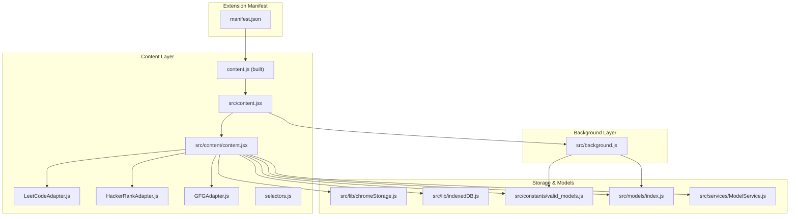
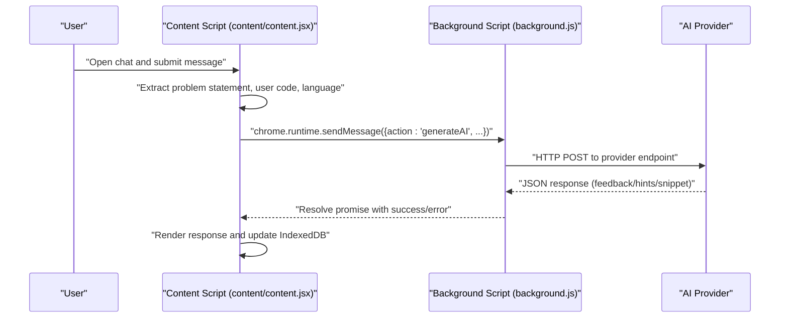
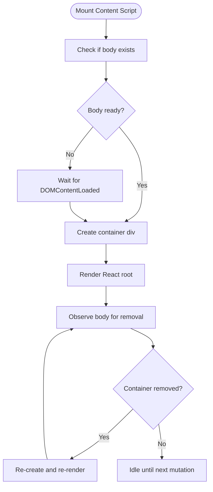
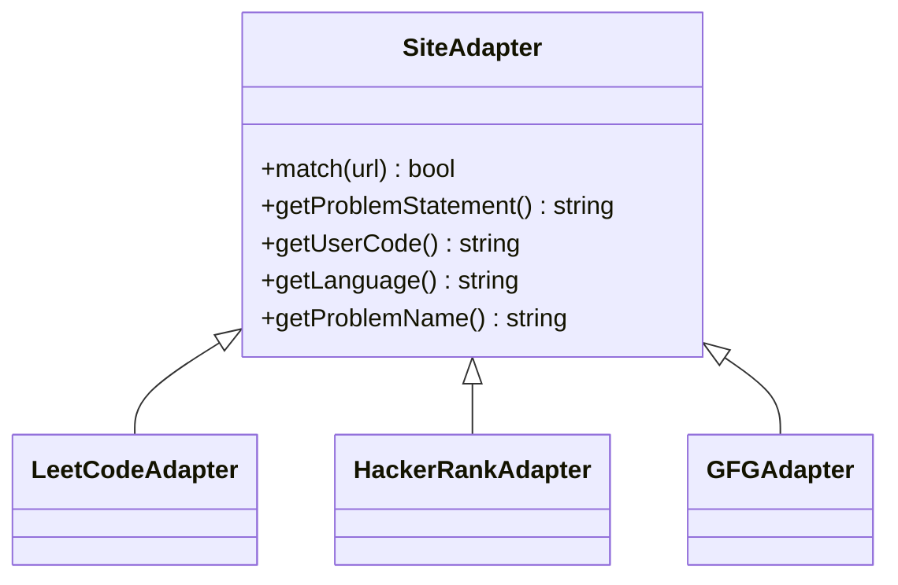
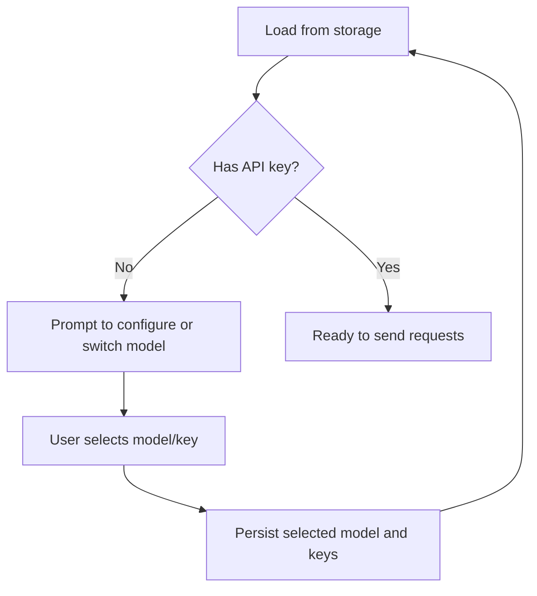
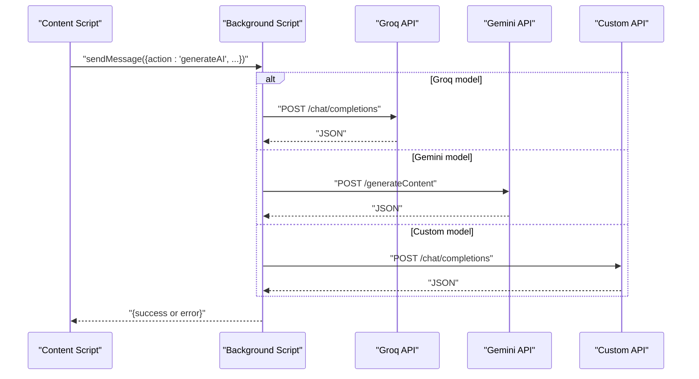
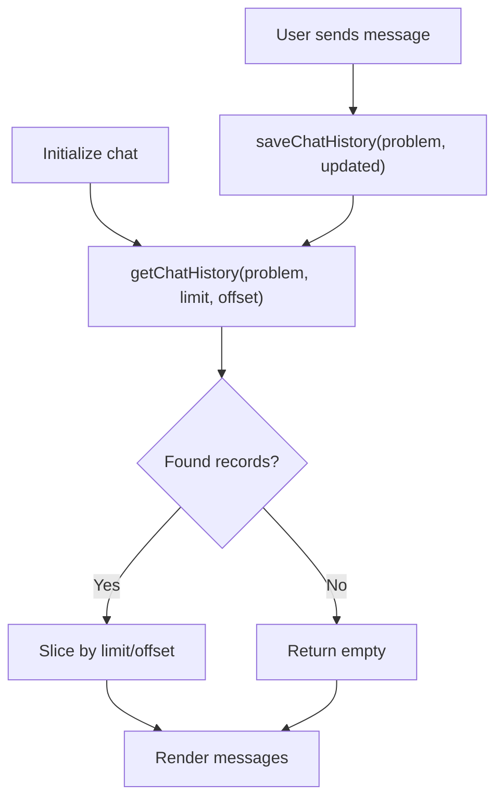
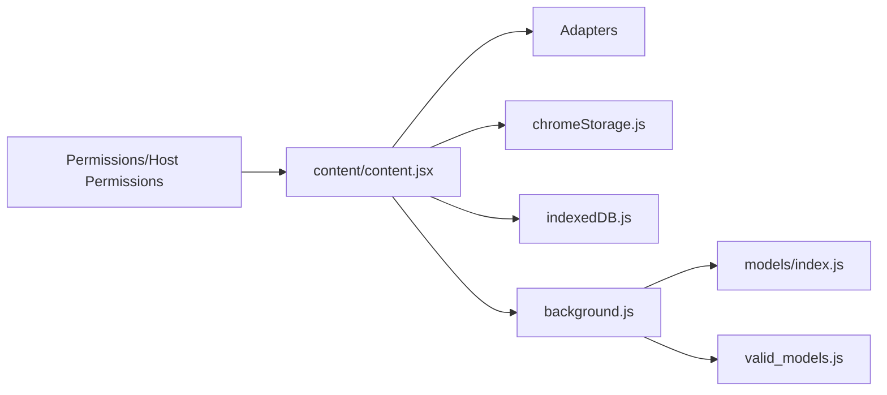

# Troubleshooting and FAQ

<cite>
**Referenced Files in This Document**
- [manifest.json](file://manifest.json)
- [README.md](file://README.md)
- [background.js](file://src/background.js)
- [content.jsx](file://src/content.jsx)
- [content/content.jsx](file://src/content/content.jsx)
- [LeetCodeAdapter.js](file://src/content/adapters/LeetCodeAdapter.js)
- [HackerRankAdapter.js](file://src/content/adapters/HackerRankAdapter.js)
- [GFGAdapter.js](file://src/content/adapters/GFGAdapter.js)
- [selectors.js](file://src/constants/selectors.js)
- [chromeStorage.js](file://src/lib/chromeStorage.js)
- [indexedDB.js](file://src/lib/indexedDB.js)
- [valid_models.js](file://src/constants/valid_models.js)
- [index.js](file://src/models/index.js)
- [ModelService.js](file://src/services/ModelService.js)
- [package.json](file://package.json)
</cite>

## Table of Contents
1. [Introduction](#introduction)
2. [Project Structure](#project-structure)
3. [Core Components](#core-components)
4. [Architecture Overview](#architecture-overview)
5. [Detailed Component Analysis](#detailed-component-analysis)
6. [Dependency Analysis](#dependency-analysis)
7. [Performance Considerations](#performance-considerations)
8. [Troubleshooting Guide](#troubleshooting-guide)
9. [Conclusion](#conclusion)
10. [Appendices](#appendices)

## Introduction
This document provides a comprehensive troubleshooting guide and FAQ for DSABuddy, a Chrome Extension that helps with Data Structures and Algorithms practice on coding platforms. It covers extension loading, content script injection, AI API connectivity, platform-specific issues, configuration, performance, and security/perms. It also includes developer-focused debugging techniques using DevTools and practical steps to diagnose and fix common problems.

## Project Structure
DSABuddy is organized around a content script that injects a React UI into supported sites, a background script that handles AI API calls, and local storage/indexedDB for settings and chat history persistence.

**Diagram sources**
- [manifest.json](file://manifest.json#L1-L74)
- [content.jsx](file://src/content.jsx#L1-L35)
- [content/content.jsx](file://src/content/content.jsx#L1-L760)
- [LeetCodeAdapter.js](file://src/content/adapters/LeetCodeAdapter.js#L1-L51)
- [HackerRankAdapter.js](file://src/content/adapters/HackerRankAdapter.js#L1-L86)
- [GFGAdapter.js](file://src/content/adapters/GFGAdapter.js#L1-L84)
- [selectors.js](file://src/constants/selectors.js#L1-L27)
- [chromeStorage.js](file://src/lib/chromeStorage.js#L1-L36)
- [indexedDB.js](file://src/lib/indexedDB.js#L1-L38)
- [valid_models.js](file://src/constants/valid_models.js#L1-L12)
- [index.js](file://src/models/index.js#L1-L19)
- [ModelService.js](file://src/services/ModelService.js#L1-L22)

**Section sources**
- [README.md](file://README.md#L55-L78)
- [manifest.json](file://manifest.json#L1-L74)

## Core Components
- Content script injection and UI lifecycle: Ensures the React app mounts and re-mounts after SPA navigation.
- Platform adapters: Extract problem statements, user code, and language from LeetCode, HackerRank, and GeeksforGeeks.
- Storage utilities: Persist API keys, base URLs, and selected model; deduplicate shared keys for Groq models.
- IndexedDB: Persist chat histories per problem.
- Background messaging: Routes AI requests through the background script to avoid CORS and centralize API logic.
- Model registry and selection: Map model names to implementations and initialize models with keys/config.

**Section sources**
- [content.jsx](file://src/content.jsx#L1-L35)
- [content/content.jsx](file://src/content/content.jsx#L1-L760)
- [LeetCodeAdapter.js](file://src/content/adapters/LeetCodeAdapter.js#L1-L51)
- [HackerRankAdapter.js](file://src/content/adapters/HackerRankAdapter.js#L1-L86)
- [GFGAdapter.js](file://src/content/adapters/GFGAdapter.js#L1-L84)
- [chromeStorage.js](file://src/lib/chromeStorage.js#L1-L36)
- [indexedDB.js](file://src/lib/indexedDB.js#L1-L38)
- [background.js](file://src/background.js#L127-L156)
- [valid_models.js](file://src/constants/valid_models.js#L1-L12)
- [index.js](file://src/models/index.js#L1-L19)
- [ModelService.js](file://src/services/ModelService.js#L1-L22)

## Architecture Overview
The extension uses a content script to render a React UI and communicate with a background script for AI API calls. The content script extracts context from the current page and sends it to the background script, which performs the actual API request and returns structured results.

**Diagram sources**
- [content/content.jsx](file://src/content/content.jsx#L122-L217)
- [background.js](file://src/background.js#L127-L156)

## Detailed Component Analysis

### Content Script Injection and SPA Navigation
- The content script creates a fixed-position React root and renders the chat UI.
- A MutationObserver re-injects the container if it is removed by SPA navigation (notably observed on LeetCode).
- Logs indicate successful injection and re-injection attempts.

**Diagram sources**
- [content.jsx](file://src/content.jsx#L1-L35)
- [content/content.jsx](file://src/content/content.jsx#L725-L760)

**Section sources**
- [content.jsx](file://src/content.jsx#L1-L35)
- [content/content.jsx](file://src/content/content.jsx#L725-L760)

### Platform Adapters and Selector Strategy
- Each adapter matches a supported site and extracts:
  - Problem statement
  - User’s current code
  - Programming language
  - Problem identifier for chat history
- Selectors are defined centrally and adapted per site.

**Diagram sources**
- [LeetCodeAdapter.js](file://src/content/adapters/LeetCodeAdapter.js#L1-L51)
- [HackerRankAdapter.js](file://src/content/adapters/HackerRankAdapter.js#L1-L86)
- [GFGAdapter.js](file://src/content/adapters/GFGAdapter.js#L1-L84)

**Section sources**
- [LeetCodeAdapter.js](file://src/content/adapters/LeetCodeAdapter.js#L1-L51)
- [HackerRankAdapter.js](file://src/content/adapters/HackerRankAdapter.js#L1-L86)
- [GFGAdapter.js](file://src/content/adapters/GFGAdapter.js#L1-L84)
- [selectors.js](file://src/constants/selectors.js#L1-L27)

### Storage and Model Selection
- API keys are stored per model; Groq models share a single key slot to simplify configuration.
- Selected model is persisted locally and reloaded when changed.
- The UI prompts for configuration if model or key is missing.

**Diagram sources**
- [chromeStorage.js](file://src/lib/chromeStorage.js#L1-L36)
- [content/content.jsx](file://src/content/content.jsx#L602-L622)

**Section sources**
- [chromeStorage.js](file://src/lib/chromeStorage.js#L1-L36)
- [content/content.jsx](file://src/content/content.jsx#L602-L622)
- [valid_models.js](file://src/constants/valid_models.js#L1-L12)

### Background Messaging and AI API Calls
- The content script sends a message to the background script with model, key, prompt, system prompt, and chat history.
- The background script routes to provider-specific handlers and returns structured JSON.
- Errors propagate back to the UI with rate-limit hints when present.

**Diagram sources**
- [content/content.jsx](file://src/content/content.jsx#L152-L181)
- [background.js](file://src/background.js#L7-L123)

**Section sources**
- [content/content.jsx](file://src/content/content.jsx#L152-L181)
- [background.js](file://src/background.js#L7-L123)

### Chat History Persistence
- Chat histories are stored per problem using IndexedDB.
- Pagination loads recent messages first and supports loading older messages.

**Diagram sources**
- [indexedDB.js](file://src/lib/indexedDB.js#L1-L38)
- [content/content.jsx](file://src/content/content.jsx#L219-L252)

**Section sources**
- [indexedDB.js](file://src/lib/indexedDB.js#L1-L38)
- [content/content.jsx](file://src/content/content.jsx#L219-L252)

## Dependency Analysis
- Permissions and host permissions define where the extension runs and where it can call APIs.
- The content script depends on adapters and selectors; the background script depends on model implementations and provider endpoints.
- Storage and IndexedDB are decoupled from providers via the background script.

**Diagram sources**
- [manifest.json](file://manifest.json#L6-L40)
- [content/content.jsx](file://src/content/content.jsx#L1-L760)
- [chromeStorage.js](file://src/lib/chromeStorage.js#L1-L36)
- [indexedDB.js](file://src/lib/indexedDB.js#L1-L38)
- [background.js](file://src/background.js#L1-L156)
- [index.js](file://src/models/index.js#L1-L19)
- [valid_models.js](file://src/constants/valid_models.js#L1-L12)

**Section sources**
- [manifest.json](file://manifest.json#L6-L40)
- [package.json](file://package.json#L12-L34)

## Performance Considerations
- Token budget: The content script truncates user code and limits the number of prior messages sent to the model to stay within free-tier limits.
- UI rendering: Large code blocks are highlighted; avoid excessive re-renders by minimizing unnecessary state updates.
- IndexedDB pagination: Load recent messages first and paginate older entries to reduce memory usage.

[No sources needed since this section provides general guidance]

## Troubleshooting Guide

### Extension Loading Problems
Symptoms
- Extension does not appear on supported sites.
- Popup does not open.

Checks
- Developer mode enabled and extension loaded from the built dist folder.
- Content script matches are declared in the manifest for the target sites.
- Web-accessible resources allow assets to load.

Actions
- Reload the extension in chrome://extensions/.
- Verify matches for the current site in the manifest.
- Confirm web accessible resources include assets.

**Section sources**
- [README.md](file://README.md#L49-L54)
- [manifest.json](file://manifest.json#L11-L28)
- [manifest.json](file://manifest.json#L49-L58)

### Content Script Injection Issues
Symptoms
- The chatbot icon does not appear.
- The UI disappears after navigating on LeetCode.

Checks
- Console logs show injection/re-injection messages.
- MutationObserver detects removal and re-injects.
- Body element exists before mount.

Actions
- Open DevTools and check console for “injected” logs.
- Navigate to a supported problem page and confirm injection occurred.
- If the container is removed by SPA routing, rely on re-injection; otherwise, reload the page.

**Section sources**
- [content.jsx](file://src/content.jsx#L12-L35)
- [content/content.jsx](file://src/content/content.jsx#L725-L760)

### AI API Connectivity Failures
Symptoms
- Immediate error returned from background script.
- UI shows rate limit countdown.
- No response from background.

Checks
- Model name and key are set in storage.
- Host permissions include provider domains.
- Network tab shows blocked or failed requests.

Actions
- Open background script in DevTools and inspect the message handler.
- Verify provider endpoints and API keys.
- Check rate limit messages and wait for cooldown.
- Ensure host permissions are present for providers.

**Section sources**
- [content/content.jsx](file://src/content/content.jsx#L152-L181)
- [background.js](file://src/background.js#L127-L156)
- [manifest.json](file://manifest.json#L29-L40)

### Platform-Specific Issues (LeetCode, HackerRank, GeeksforGeeks)
Symptoms
- Problem statement or code not extracted.
- Wrong language detected.
- Chat history not associated with the problem.

Checks
- Adapter match returns true for the current URL.
- Selectors locate the problem statement, editor lines, and language element.
- Problem name extraction uses URL or title normalization.

Actions
- Verify the current page URL matches the adapter’s match criteria.
- Inspect DOM elements for selectors and adjust if site layout changed.
- Clear chat history for the problem and resend the message to rebuild context.

**Section sources**
- [LeetCodeAdapter.js](file://src/content/adapters/LeetCodeAdapter.js#L6-L8)
- [HackerRankAdapter.js](file://src/content/adapters/HackerRankAdapter.js#L19-L31)
- [GFGAdapter.js](file://src/content/adapters/GFGAdapter.js#L19-L29)
- [selectors.js](file://src/constants/selectors.js#L1-L27)

### API Key Configuration Issues
Symptoms
- UI prompts to configure or switch model.
- Missing API key for selected model.

Checks
- Storage utilities persist keys per model; Groq models share a key slot.
- Selected model is saved and reloaded on changes.

Actions
- Open the extension popup and set the API key for the selected model.
- For Groq models, set the key once; it applies to both Groq variants.
- After saving, reload the content script to pick up the new key.

**Section sources**
- [chromeStorage.js](file://src/lib/chromeStorage.js#L1-L36)
- [content/content.jsx](file://src/content/content.jsx#L602-L622)

### Model Selection Problems
Symptoms
- UI shows “No model” or prompts to select a model.
- Requests fail because no model is selected.

Checks
- Valid model list includes the selected model.
- Model registry maps the name to an implementation.

Actions
- From the popup, choose a model from the list.
- Confirm the model appears in the UI header.

**Section sources**
- [valid_models.js](file://src/constants/valid_models.js#L1-L12)
- [index.js](file://src/models/index.js#L1-L19)
- [content/content.jsx](file://src/content/content.jsx#L290-L294)

### Extension Updates and Data Migration
Symptoms
- Settings lost after update.
- Chat history missing.

Checks
- Storage keys are normalized; Groq models share a key.
- IndexedDB stores chat histories by problem name.

Actions
- After updating, open the extension and re-enter keys if prompted.
- Chat histories are keyed by problem identifiers; they persist across updates.

**Section sources**
- [chromeStorage.js](file://src/lib/chromeStorage.js#L1-L36)
- [indexedDB.js](file://src/lib/indexedDB.js#L1-L38)

### Storage-Related Problems
Symptoms
- Chat history not loading.
- Frequent prompts to configure model.

Checks
- IndexedDB object store created on upgrade.
- getChatHistory returns counts and slices properly.

Actions
- Clear the specific problem’s chat history if corrupted.
- Verify IndexedDB is accessible in the site context.

**Section sources**
- [indexedDB.js](file://src/lib/indexedDB.js#L1-L38)

### Security Warnings, Permissions, and Cross-Origin Communication
Symptoms
- Blocked requests or CORS errors.
- Permission warnings.

Checks
- Host permissions include provider domains.
- Permissions include storage, activeTab, scripting.
- Background script handles messaging to avoid direct cross-origin calls from content.

Actions
- Ensure host permissions are present for providers.
- Use the background script for all API calls.
- Review permissions in the extension details page.

**Section sources**
- [manifest.json](file://manifest.json#L6-L10)
- [manifest.json](file://manifest.json#L29-L40)
- [content/content.jsx](file://src/content/content.jsx#L152-L181)

### Frequently Asked Questions

Q: Why does the chatbot not appear on some pages?
A: The content script only injects on supported domains listed in the manifest. Ensure you are on a supported site.

Q: How do I configure API keys?
A: Open the extension popup, select a model, and enter your API key. For Groq models, set the key once and it applies to both variants.

Q: Why is my code truncated in the AI prompt?
A: To stay within free-tier token limits, long user code is truncated before sending to the model.

Q: Can I use a custom AI provider?
A: Yes, select the “Custom (OpenAI Compatible)” model and provide the base URL and model name.

Q: How are chat histories stored?
A: Chat histories are stored per problem in IndexedDB. Older messages can be paginated.

Q: What browsers are supported?
A: The extension targets Chromium-based browsers with Manifest V3 support.

Q: Why am I seeing rate limit warnings?
A: Providers may throttle free tiers. Wait for the indicated cooldown before sending more requests.

Q: How do I reload the extension after building?
A: Build the project and load the dist folder in chrome://extensions/ with developer mode enabled.

**Section sources**
- [README.md](file://README.md#L49-L54)
- [manifest.json](file://manifest.json#L11-L28)
- [content/content.jsx](file://src/content/content.jsx#L137-L140)
- [valid_models.js](file://src/constants/valid_models.js#L10-L12)
- [indexedDB.js](file://src/lib/indexedDB.js#L14-L31)

## Conclusion
By understanding the extension’s architecture—content script injection, platform adapters, background messaging, and local persistence—you can quickly diagnose and resolve most issues. Use the DevTools console and network panel to trace failures, verify permissions and host permissions, and confirm that the correct model and keys are configured. For platform-specific problems, inspect the selectors and DOM structure; for API issues, review the background script logs and provider endpoints.

[No sources needed since this section summarizes without analyzing specific files]

## Appendices

### Developer Debugging Techniques
- DevTools Console: Look for injection logs and error messages.
- Network Panel: Filter by domain to see provider requests and status codes.
- Background Script: Inspect the message handler and provider responses.
- Storage Panel: Verify keys and selected model are persisted.
- IndexedDB: Inspect chat histories and counts.

**Section sources**
- [content.jsx](file://src/content.jsx#L12-L35)
- [content/content.jsx](file://src/content/content.jsx#L152-L181)
- [background.js](file://src/background.js#L127-L156)
- [chromeStorage.js](file://src/lib/chromeStorage.js#L1-L36)
- [indexedDB.js](file://src/lib/indexedDB.js#L1-L38)