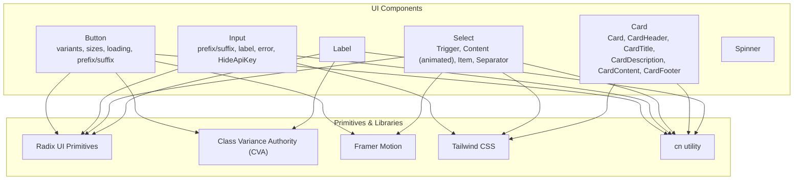
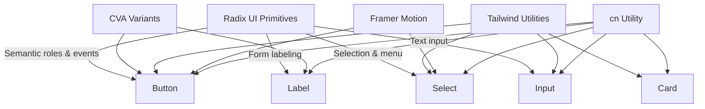
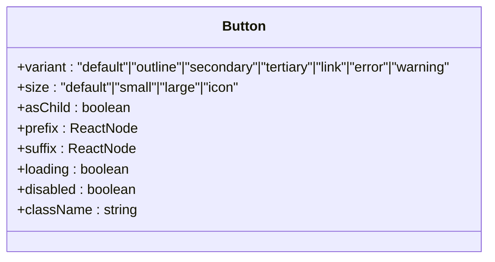
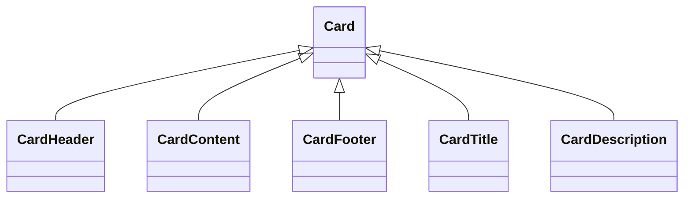
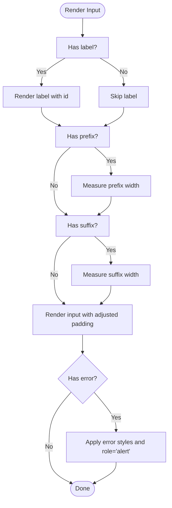
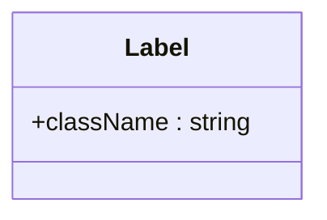
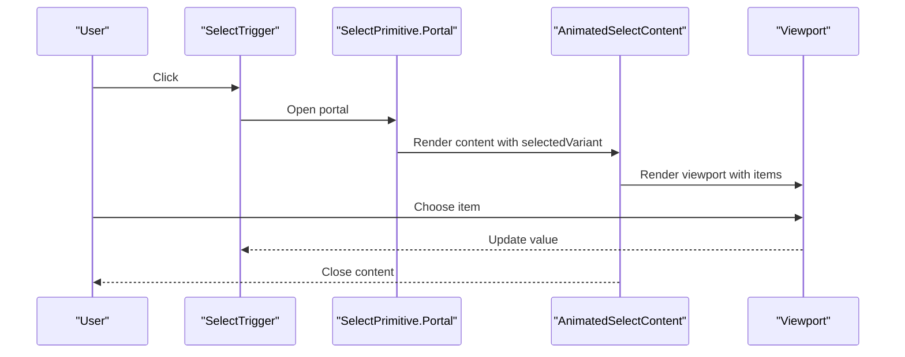
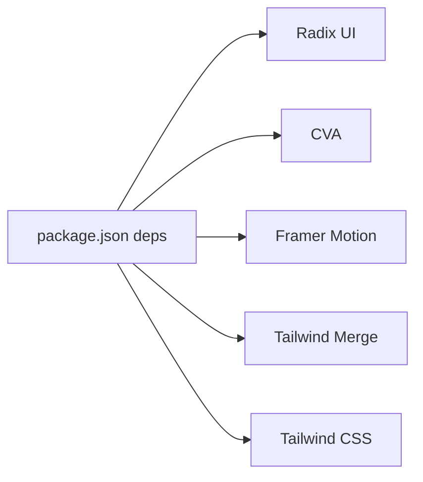

# Component Library

<cite>
**Referenced Files in This Document**
- [button.jsx](file://src/components/ui/button.jsx)
- [card.jsx](file://src/components/ui/card.jsx)
- [input.jsx](file://src/components/ui/input.jsx)
- [label.jsx](file://src/components/ui/label.jsx)
- [select.jsx](file://src/components/ui/select.jsx)
- [spinner.jsx](file://src/components/ui/spinner.jsx)
- [utils.js](file://src/lib/utils.js)
- [package.json](file://package.json)
- [tailwind.config.js](file://tailwind.config.js)
</cite>

## Table of Contents
1. [Introduction](#introduction)
2. [Project Structure](#project-structure)
3. [Core Components](#core-components)
4. [Architecture Overview](#architecture-overview)
5. [Detailed Component Analysis](#detailed-component-analysis)
6. [Dependency Analysis](#dependency-analysis)
7. [Performance Considerations](#performance-considerations)
8. [Troubleshooting Guide](#troubleshooting-guide)
9. [Conclusion](#conclusion)
10. [Appendices](#appendices)

## Introduction
This document describes DSABuddy’s core UI component library focused on Button, Card, Input, Label, and Select. It explains how components are structured, styled via Tailwind CSS and Class Variance Authority (CVA), composed with Radix UI primitives, and animated with Framer Motion. It also covers accessibility, responsive design, and integration patterns to ensure consistent user experiences across the application.

## Project Structure
The UI components live under src/components/ui and are built with:
- Radix UI primitives for accessible base behaviors
- Tailwind CSS for styling and responsive design
- Class Variance Authority (CVA) for variant and size styling
- Framer Motion for smooth animations
- A shared cn utility for merging Tailwind classes

**Diagram sources**
- [button.jsx](file://src/components/ui/button.jsx#L1-L115)
- [card.jsx](file://src/components/ui/card.jsx#L1-L58)
- [input.jsx](file://src/components/ui/input.jsx#L1-L169)
- [label.jsx](file://src/components/ui/label.jsx#L1-L20)
- [select.jsx](file://src/components/ui/select.jsx#L1-L259)
- [spinner.jsx](file://src/components/ui/spinner.jsx#L1-L39)
- [utils.js](file://src/lib/utils.js#L1-L3)
- [package.json](file://package.json#L12-L33)
- [tailwind.config.js](file://tailwind.config.js#L1-L78)

**Section sources**
- [button.jsx](file://src/components/ui/button.jsx#L1-L115)
- [card.jsx](file://src/components/ui/card.jsx#L1-L58)
- [input.jsx](file://src/components/ui/input.jsx#L1-L169)
- [label.jsx](file://src/components/ui/label.jsx#L1-L20)
- [select.jsx](file://src/components/ui/select.jsx#L1-L259)
- [spinner.jsx](file://src/components/ui/spinner.jsx#L1-L39)
- [utils.js](file://src/lib/utils.js#L1-L3)
- [package.json](file://package.json#L12-L33)
- [tailwind.config.js](file://tailwind.config.js#L1-L78)

## Core Components
This section documents the five core components: Button, Card, Input, Label, and Select. It focuses on props, variants, sizes, usage patterns, accessibility, and responsive behavior.

- Button
  - Purpose: Interactive control with multiple visual styles and sizes, support for loading states, prefix/suffix elements, and tap feedback.
  - Key props:
    - variant: default, outline, secondary, tertiary, link, error, warning
    - size: default, small, large, icon
    - asChild: render as a child component using Radix Slot
    - prefix/suffix: React nodes rendered before/after text
    - loading/disabled: state flags affecting appearance and interactivity
    - className: additional Tailwind classes
  - Accessibility: Inherits focus-visible ring and disabled pointer-events from base styles; supports asChild for semantic wrappers.
  - Responsive: Uses rem-based paddings and rounded sizes; adapts to screen widths via Tailwind utilities.
  - Animation: Framer Motion tap-scale for tactile feedback.
  - Example usage pattern: Combine prefix/suffix icons with text; use loading to indicate async actions; choose variant/size per context.

- Card
  - Purpose: Container with header, title, description, content, and footer segments for grouping related information.
  - Composition:
    - Card: outer container
    - CardHeader/CardFooter: layout containers
    - CardTitle: prominent heading
    - CardDescription: supporting text
    - CardContent: body content area
  - Accessibility: No explicit ARIA roles; relies on semantic HTML structure.
  - Responsive: Uses padding and spacing utilities; scales with container widths.

- Input
  - Purpose: Text input with optional label, prefix/suffix adornments, and inline error messaging.
  - Key props:
    - label: associated label text
    - prefix/suffix: adornment nodes; optional styling to visually integrate with input border
    - prefixStyling/suffixStyling: whether to apply rounded corners and inner borders
    - error: displays error message and applies error-specific styling
    - type: input type (text, password, etc.)
    - iclassName: additional classes for the input element itself
    - className: wrapper/container classes
  - Accessibility: Associates label via htmlFor; error region uses role="alert".
  - Responsive: Adornments adjust padding dynamically; error styling adapts to light/dark modes.
  - Specialized variant: HideApiKey wraps Input with a toggle to show/hide password.

- Label
  - Purpose: Styled label for form controls, inheriting Radix UI behavior and CVA styling.
  - Props: className for additional Tailwind classes.
  - Accessibility: Uses Radix Label primitive for proper association with inputs.

- Select
  - Purpose: Accessible dropdown selection with animated content transitions and scrollable viewport.
  - Composition:
    - Root, Group, Value, Trigger, Content (animated/static), Label, Item, Separator, Scroll buttons
  - Variants:
    - Animated content supports multiple animation presets: zoom, scaleBounce, fade, slideUp/Down/Left/Right, flip, rotate
    - Static content uses Radix open/close animations
  - Accessibility: Built on Radix Select primitives; includes scroll buttons and viewport sizing.
  - Responsive: Content adapts to trigger size and side constraints; popper positioning supported.

**Section sources**
- [button.jsx](file://src/components/ui/button.jsx#L10-L38)
- [button.jsx](file://src/components/ui/button.jsx#L62-L113)
- [card.jsx](file://src/components/ui/card.jsx#L5-L56)
- [input.jsx](file://src/components/ui/input.jsx#L23-L115)
- [input.jsx](file://src/components/ui/input.jsx#L119-L166)
- [label.jsx](file://src/components/ui/label.jsx#L7-L17)
- [select.jsx](file://src/components/ui/select.jsx#L14-L207)
- [select.jsx](file://src/components/ui/select.jsx#L124-L207)

## Architecture Overview
The component library follows a layered architecture:
- Base primitives: Radix UI primitives provide accessible semantics and keyboard navigation.
- Styling layer: Tailwind utilities and CVA define variants and sizes consistently.
- Behavior layer: Framer Motion adds micro-interactions and transitions.
- Utility layer: cn merges Tailwind classes safely.

**Diagram sources**
- [button.jsx](file://src/components/ui/button.jsx#L3-L8)
- [label.jsx](file://src/components/ui/label.jsx#L2-L3)
- [select.jsx](file://src/components/ui/select.jsx#L4-L12)
- [card.jsx](file://src/components/ui/card.jsx#L3-L11)
- [input.jsx](file://src/components/ui/input.jsx#L4-L5)
- [utils.js](file://src/lib/utils.js#L1-L3)
- [package.json](file://package.json#L12-L33)

## Detailed Component Analysis

### Button
- Implementation highlights:
  - Uses Slot to optionally render as a child element for semantic flexibility.
  - Applies CVA variants for visual styles and sizes.
  - Integrates Spinner during loading and supports prefix/suffix adornments.
  - Wraps content in a motion.div with a subtle scale transform for press feedback.
- Props summary:
  - variant: default, outline, secondary, tertiary, link, error, warning
  - size: default, small, large, icon
  - asChild, prefix, suffix, loading, disabled, className
- Accessibility and responsiveness:
  - Focus-visible ring and disabled states handled via base classes.
  - Icon-only sizing optimized for touch targets.

**Diagram sources**
- [button.jsx](file://src/components/ui/button.jsx#L62-L76)

**Section sources**
- [button.jsx](file://src/components/ui/button.jsx#L10-L38)
- [button.jsx](file://src/components/ui/button.jsx#L62-L113)

### Card
- Composition:
  - Card: base container with rounded corners, border, and shadow.
  - CardHeader/CardFooter: vertical spacing and alignment helpers.
  - CardTitle: typography for headings.
  - CardDescription: muted, smaller text for descriptions.
  - CardContent: padding and spacing for content areas.
- Usage patterns:
  - Stack header/title/description/content/footer in order.
  - Apply className for contextual overrides (e.g., background, shadow).

**Diagram sources**
- [card.jsx](file://src/components/ui/card.jsx#L5-L56)

**Section sources**
- [card.jsx](file://src/components/ui/card.jsx#L1-L58)

### Input
- Features:
  - Optional label with dynamic error color.
  - Prefix/suffix adornments with automatic width calculation.
  - Error state with alert role and icon.
  - HideApiKey variant toggles password visibility with accessible ARIA labels.
- Props summary:
  - label, prefix, suffix, prefixStyling, suffixStyling, error, type, iclassName, className
- Accessibility:
  - Label associates with input via htmlFor.
  - Error region marked with role="alert".
  - Toggle button includes screen-reader-only text.

**Diagram sources**
- [input.jsx](file://src/components/ui/input.jsx#L23-L115)

**Section sources**
- [input.jsx](file://src/components/ui/input.jsx#L23-L115)
- [input.jsx](file://src/components/ui/input.jsx#L119-L166)

### Label
- Implementation:
  - Thin wrapper around Radix Label primitive with CVA-styled typography.
- Props summary:
  - className

**Diagram sources**
- [label.jsx](file://src/components/ui/label.jsx#L11-L17)

**Section sources**
- [label.jsx](file://src/components/ui/label.jsx#L1-L20)

### Select
- Features:
  - Animated content with multiple presets (zoom, scaleBounce, fade, directional slides, flip, rotate).
  - Scrollable viewport with up/down buttons.
  - Static content fallback using Radix animations.
  - Items with indicators and separators.
- Props summary:
  - Trigger: inherits Radix trigger props
  - Content: position, variants (animation preset), className
  - Item: className, children
  - Label, Separator, ScrollUp/Down buttons
- Accessibility:
  - Uses Radix Select primitives for keyboard navigation and ARIA attributes.
  - Scroll buttons enable navigation for long lists.

**Diagram sources**
- [select.jsx](file://src/components/ui/select.jsx#L124-L207)
- [select.jsx](file://src/components/ui/select.jsx#L168-L194)

**Section sources**
- [select.jsx](file://src/components/ui/select.jsx#L14-L207)
- [select.jsx](file://src/components/ui/select.jsx#L124-L207)

## Dependency Analysis
External libraries and their roles:
- Radix UI: Provides accessible primitives for buttons, labels, selects, dropdowns, accordions, and scroll areas.
- class-variance-authority (CVA): Centralizes variant and size definitions for consistent styling.
- framer-motion: Adds micro-interactions and content transitions.
- tailwind-merge: Safely merges Tailwind classes to avoid conflicts.
- Tailwind CSS: Utility-first styling and responsive breakpoints.

**Diagram sources**
- [package.json](file://package.json#L12-L33)

**Section sources**
- [package.json](file://package.json#L12-L33)
- [tailwind.config.js](file://tailwind.config.js#L1-L78)

## Performance Considerations
- Prefer CVA for variants to minimize conditional rendering and keep class lists concise.
- Use Framer Motion sparingly; limit heavy animations on low-powered devices.
- Defer expensive computations (e.g., measuring adornment widths) to useEffect/useMemo where appropriate.
- Keep component trees shallow; compose primitives directly to reduce re-renders.
- Use className over inline styles to leverage CSS specificity and caching.

## Troubleshooting Guide
- Button not responding to clicks:
  - Verify disabled prop is not set; ensure loading does not override click handlers.
- Input adornments overlap text:
  - Confirm prefix/suffix are present before measuring widths; ensure className adjustments do not override computed paddings.
- Select content does not animate:
  - Ensure selectedVariant matches one of the predefined presets; confirm Framer Motion is imported and enabled.
- Label not focusing input:
  - Ensure htmlFor matches the input id; verify label is rendered before the input.
- Card layout issues:
  - Use CardHeader/CardFooter for spacing; avoid overriding internal padding classes.

**Section sources**
- [button.jsx](file://src/components/ui/button.jsx#L77-L113)
- [input.jsx](file://src/components/ui/input.jsx#L29-L73)
- [select.jsx](file://src/components/ui/select.jsx#L18-L73)
- [label.jsx](file://src/components/ui/label.jsx#L40-L46)
- [card.jsx](file://src/components/ui/card.jsx#L17-L56)

## Conclusion
DSABuddy’s UI component library leverages Radix UI for accessibility, CVA for consistent styling, Tailwind for responsive design, and Framer Motion for delightful interactions. The Button, Card, Input, Label, and Select components form a cohesive design system that promotes usability, maintainability, and scalability across the application.

## Appendices

### Prop Reference Tables
- Button
  - variant: default, outline, secondary, tertiary, link, error, warning
  - size: default, small, large, icon
  - asChild, prefix, suffix, loading, disabled, className

- Card
  - Card: className
  - CardHeader/CardFooter: className
  - CardTitle/CardDescription/CardContent: className

- Input
  - label, prefix, suffix, prefixStyling, suffixStyling, error, type, iclassName, className

- Label
  - className

- Select
  - Trigger: inherited Radix props
  - Content: position, variants (animation preset), className
  - Item: className, children
  - Label, Separator, ScrollUp/Down buttons

### Integration Patterns
- Compose Button with icons via prefix/suffix for clear affordances.
- Wrap forms with Card for logical grouping; pair Label with Input for accessibility.
- Use Select for single/multi-selection with ScrollArea for long lists.
- Apply error styling on Input and propagate messages to assistive technologies via role="alert".