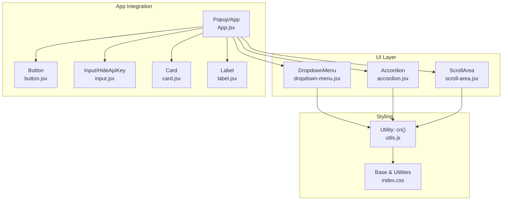
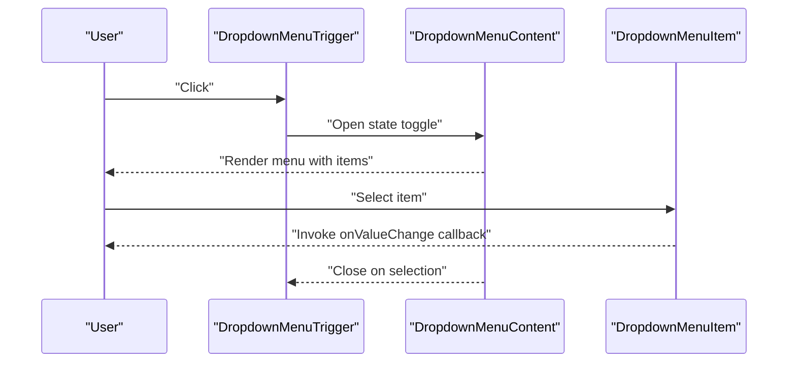
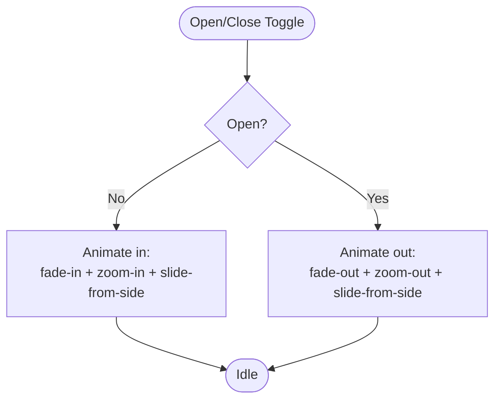
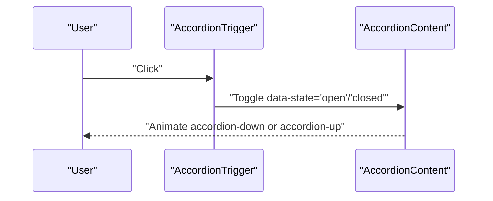
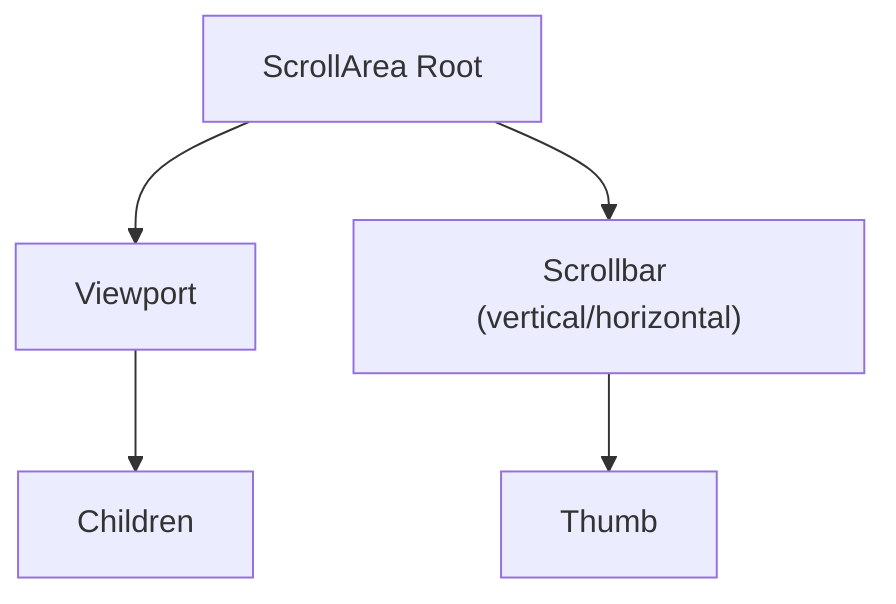
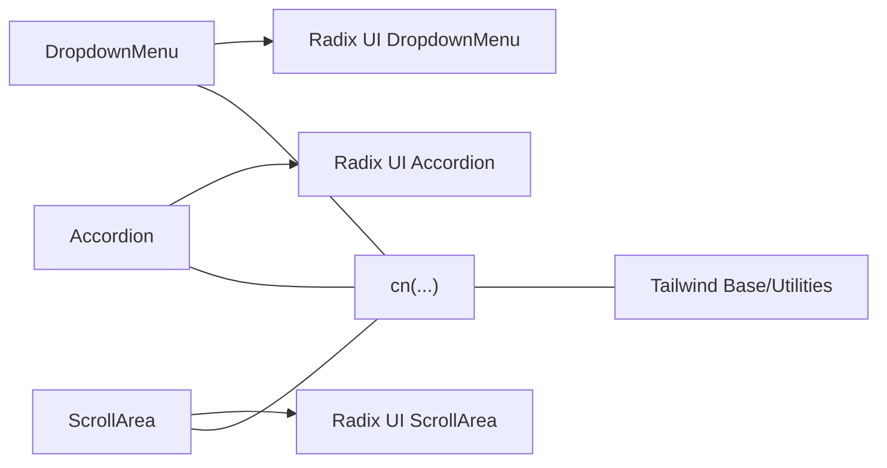

# Interactive Components

<cite>
**Referenced Files in This Document**
- [dropdown-menu.jsx](file://src/components/ui/dropdown-menu.jsx)
- [accordion.jsx](file://src/components/ui/accordion.jsx)
- [scroll-area.jsx](file://src/components/ui/scroll-area.jsx)
- [utils.js](file://src/lib/utils.js)
- [index.css](file://src/index.css)
- [App.jsx](file://src/App.jsx)
- [main.jsx](file://src/main.jsx)
- [input.jsx](file://src/components/ui/input.jsx)
- [button.jsx](file://src/components/ui/button.jsx)
- [card.jsx](file://src/components/ui/card.jsx)
- [label.jsx](file://src/components/ui/label.jsx)
</cite>

## Table of Contents
1. [Introduction](#introduction)
2. [Project Structure](#project-structure)
3. [Core Components](#core-components)
4. [Architecture Overview](#architecture-overview)
5. [Detailed Component Analysis](#detailed-component-analysis)
6. [Dependency Analysis](#dependency-analysis)
7. [Performance Considerations](#performance-considerations)
8. [Troubleshooting Guide](#troubleshooting-guide)
9. [Conclusion](#conclusion)

## Introduction
This document explains DSABuddy’s interactive UI components with a focus on DropdownMenu, Accordion, and ScrollArea. It covers interactive behaviors, state management, event handling, keyboard navigation, focus management, accessibility, animations, responsive behavior, and practical usage patterns. The goal is to help developers integrate these components effectively and build accessible, performant user experiences.

## Project Structure
These three components are implemented as thin wrappers around Radix UI primitives, styled with Tailwind utility classes and merged with a shared utility function. They are used within the application shell and integrated with form controls and buttons.

**Diagram sources**
- [dropdown-menu.jsx](file://src/components/ui/dropdown-menu.jsx#L1-L166)
- [accordion.jsx](file://src/components/ui/accordion.jsx#L1-L46)
- [scroll-area.jsx](file://src/components/ui/scroll-area.jsx#L1-L40)
- [utils.js](file://src/lib/utils.js#L1-L3)
- [index.css](file://src/index.css#L1-L61)
- [App.jsx](file://src/App.jsx#L1-L233)
- [button.jsx](file://src/components/ui/button.jsx#L1-L115)
- [input.jsx](file://src/components/ui/input.jsx#L117-L169)
- [card.jsx](file://src/components/ui/card.jsx#L1-L58)
- [label.jsx](file://src/components/ui/label.jsx#L1-L20)

**Section sources**
- [dropdown-menu.jsx](file://src/components/ui/dropdown-menu.jsx#L1-L166)
- [accordion.jsx](file://src/components/ui/accordion.jsx#L1-L46)
- [scroll-area.jsx](file://src/components/ui/scroll-area.jsx#L1-L40)
- [utils.js](file://src/lib/utils.js#L1-L3)
- [index.css](file://src/index.css#L1-L61)
- [App.jsx](file://src/App.jsx#L1-L233)

## Core Components
- DropdownMenu: A menu system built on Radix UI with animated open/close transitions, keyboard navigation support, and nested submenus. It exposes Root, Trigger, Content, Item, Checkbox/Radio items, Group, Portal, Sub, SubTrigger, SubContent, RadioGroup, and shortcuts.
- Accordion: A collapsible panel system with animated expansion/collapse using CSS keyframes. It supports multiple independent items and a chevron rotation indicator.
- ScrollArea: A scrollable viewport with overlay scrollbar that respects orientation and integrates with Radix UI primitives.

Each component relies on:
- Radix UI primitives for state and accessibility semantics
- Tailwind classes for styling and animations
- A shared cn(...) utility to merge class names safely

**Section sources**
- [dropdown-menu.jsx](file://src/components/ui/dropdown-menu.jsx#L7-L166)
- [accordion.jsx](file://src/components/ui/accordion.jsx#L7-L46)
- [scroll-area.jsx](file://src/components/ui/scroll-area.jsx#L6-L38)
- [utils.js](file://src/lib/utils.js#L1-L3)

## Architecture Overview
The components are composed within the application layout. DropdownMenu and Accordion are used in forms and settings panels, while ScrollArea is used for content areas that may exceed viewport height.

**Diagram sources**
- [dropdown-menu.jsx](file://src/components/ui/dropdown-menu.jsx#L9-L63)
- [App.jsx](file://src/App.jsx#L126-L147)

## Detailed Component Analysis

### DropdownMenu
- State management: Controlled by Radix UI internals; consumers pass callbacks like onValueChange to receive selections.
- Interactions:
  - Trigger opens the menu; clicking outside closes it.
  - Keyboard navigation follows ARIA Menu semantics (arrow keys, home/end, Enter/Space, Escape).
  - Submenus are supported via SubTrigger/SubContent.
- Accessibility:
  - Uses Radix UI’s accessible primitives; focus management is handled internally.
  - Disabled items are visually and semantically disabled.
- Animations:
  - Fade and zoom transitions on open/close.
  - Directional slide-in based on side prop.
- Responsive behavior:
  - Portal renders the menu outside normal DOM flow for proper stacking and positioning.

**Diagram sources**
- [dropdown-menu.jsx](file://src/components/ui/dropdown-menu.jsx#L49-L63)

**Section sources**
- [dropdown-menu.jsx](file://src/components/ui/dropdown-menu.jsx#L9-L166)

### Accordion
- State management: Each AccordionItem maintains its own open/closed state via Radix UI.
- Interactions:
  - Clicking the header toggles content visibility.
  - Chevron rotates 180° when expanded.
- Animations:
  - CSS keyframes drive collapse/expand with a smooth 200ms transition.
- Accessibility:
  - Uses Header/Trigger/Content primitives; screen readers announce open/closed state via data attributes.
- Responsive behavior:
  - Content area resizes to fit inner content; padding/borders adapt to stacked items.

**Diagram sources**
- [accordion.jsx](file://src/components/ui/accordion.jsx#L18-L44)

**Section sources**
- [accordion.jsx](file://src/components/ui/accordion.jsx#L7-L46)

### ScrollArea
- State management: Radix UI manages internal scroll thumb sizing and visibility.
- Interactions:
  - Scrollbar appears on hover or when content overflows.
  - Orientation-specific sizing and borders applied conditionally.
- Accessibility:
  - Provides native scrolling semantics; scrollbar is optional and does not interfere with keyboard navigation.
- Responsive behavior:
  - Adapts to vertical/horizontal overflow; inherits container rounding for seamless visuals.

**Diagram sources**
- [scroll-area.jsx](file://src/components/ui/scroll-area.jsx#L6-L38)

**Section sources**
- [scroll-area.jsx](file://src/components/ui/scroll-area.jsx#L1-L40)

### Integration Patterns and Best Practices
- Form controls:
  - DropdownMenu is commonly used for model selection and settings menus.
  - Combine with Label and Input for accessible forms.
- Accessibility:
  - Ensure labels are associated with inputs and controls.
  - Use aria-* attributes where exposed by primitives.
  - Provide visible focus indicators and keyboard navigation cues.
- Focus management:
  - Radix UI handles focus trapping and restoration; ensure triggers and items are focusable.
- Event handling:
  - Use onValueChange for selection updates; propagate state to parent components.
- Animation and responsiveness:
  - Prefer CSS animations for smooth transitions; avoid heavy computations during scroll/resize.
  - Keep content inside ScrollArea reasonably sized to prevent jank.

**Section sources**
- [App.jsx](file://src/App.jsx#L126-L147)
- [input.jsx](file://src/components/ui/input.jsx#L117-L169)
- [label.jsx](file://src/components/ui/label.jsx#L1-L20)
- [button.jsx](file://src/components/ui/button.jsx#L1-L115)
- [card.jsx](file://src/components/ui/card.jsx#L1-L58)

## Dependency Analysis
- Component dependencies:
  - All three components depend on Radix UI primitives for state and accessibility.
  - They rely on a shared cn(...) utility to merge Tailwind classes.
  - Styles come from Tailwind base/components/utilities layers.
- Coupling and cohesion:
  - Components are cohesive units encapsulating styling and behavior.
  - Low coupling to external logic; consumers supply callbacks and state.
- External integrations:
  - App.jsx composes DropdownMenu and Accordion within a form layout.
  - ScrollArea is used implicitly via higher-level layouts and cards.

**Diagram sources**
- [dropdown-menu.jsx](file://src/components/ui/dropdown-menu.jsx#L1-L6)
- [accordion.jsx](file://src/components/ui/accordion.jsx#L1-L6)
- [scroll-area.jsx](file://src/components/ui/scroll-area.jsx#L1-L5)
- [utils.js](file://src/lib/utils.js#L1-L3)
- [index.css](file://src/index.css#L1-L3)

**Section sources**
- [dropdown-menu.jsx](file://src/components/ui/dropdown-menu.jsx#L1-L6)
- [accordion.jsx](file://src/components/ui/accordion.jsx#L1-L6)
- [scroll-area.jsx](file://src/components/ui/scroll-area.jsx#L1-L5)
- [utils.js](file://src/lib/utils.js#L1-L3)
- [index.css](file://src/index.css#L1-L3)

## Performance Considerations
- Use CSS animations instead of JavaScript-driven transforms for smoother UX.
- Avoid unnecessary re-renders by lifting state to parent components and passing callbacks.
- Keep ScrollArea content lightweight; virtualization is not implemented here.
- Prefer minimal DOM nesting within DropdownMenu/Accordion to reduce layout thrash.
- Defer heavy work until after user interactions settle (e.g., delay expensive computations after scroll events).

## Troubleshooting Guide
- Menu does not close after selection:
  - Ensure the consumer passes an onValueChange handler and updates the selected value.
- Keyboard navigation not working:
  - Verify the trigger and items are focusable and not overridden by custom styles.
- Scrollbar not visible:
  - Confirm overflow conditions and that the ScrollArea wrapper has explicit dimensions.
- Visual conflicts with theme:
  - Check Tailwind base layer variables and dark mode classes.

**Section sources**
- [dropdown-menu.jsx](file://src/components/ui/dropdown-menu.jsx#L65-L76)
- [accordion.jsx](file://src/components/ui/accordion.jsx#L35-L44)
- [scroll-area.jsx](file://src/components/ui/scroll-area.jsx#L21-L38)
- [index.css](file://src/index.css#L31-L51)

## Conclusion
DropdownMenu, Accordion, and ScrollArea provide robust, accessible, and animated building blocks for DSABuddy’s UI. By leveraging Radix UI primitives and Tailwind utilities, these components deliver consistent behavior across interactions, maintain strong accessibility guarantees, and integrate cleanly with form controls and layout components.