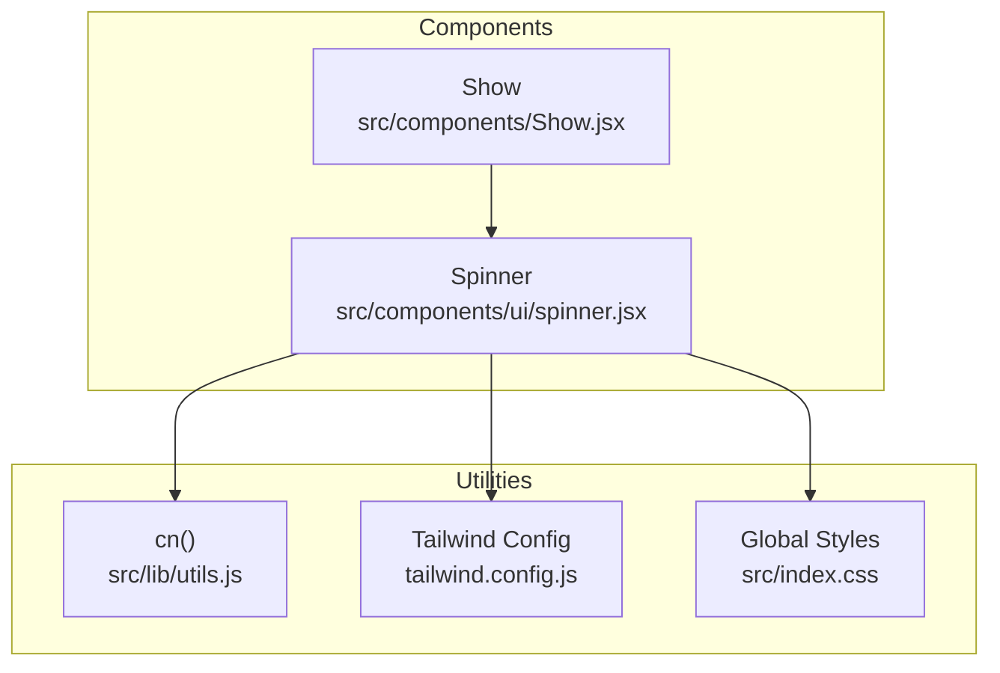
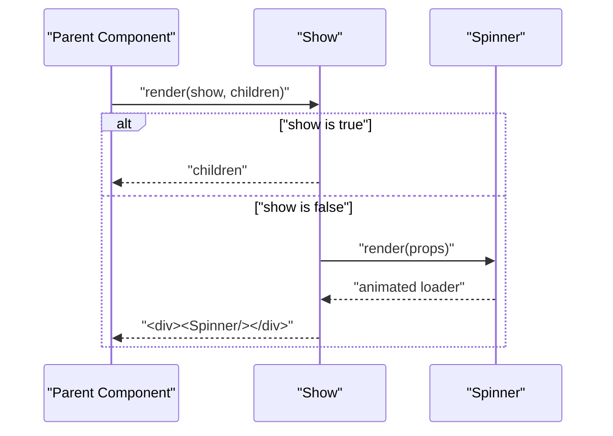
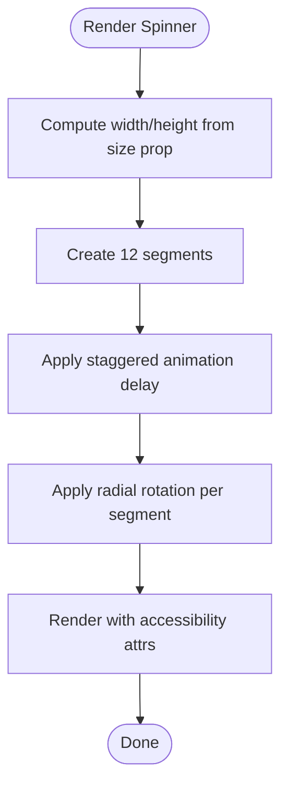
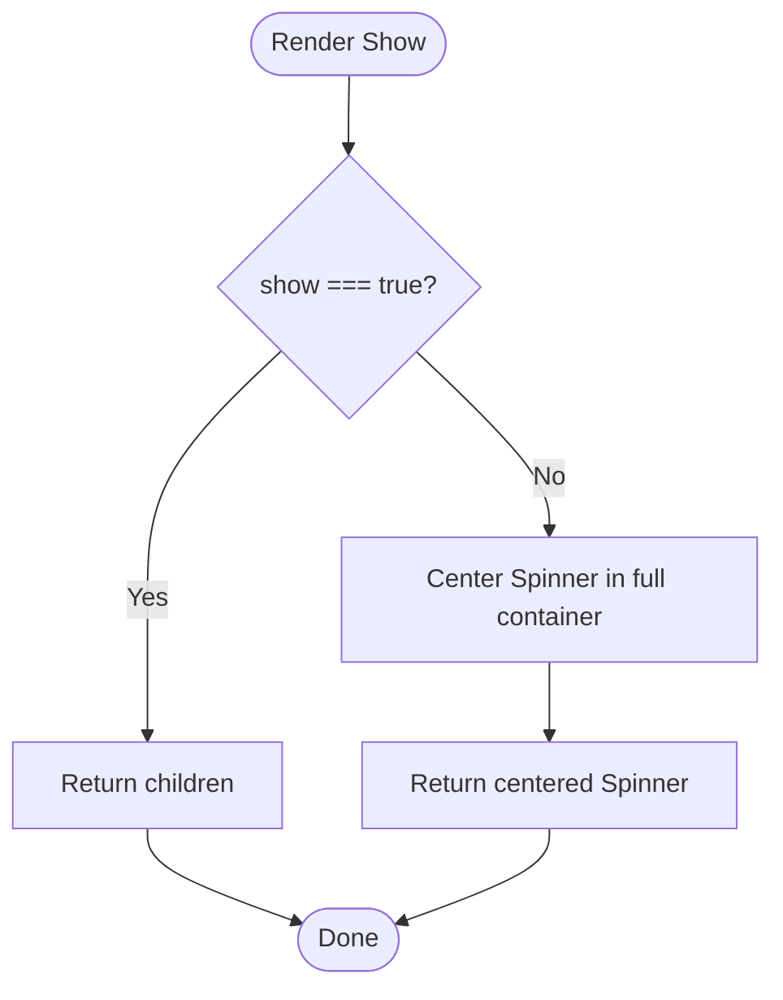
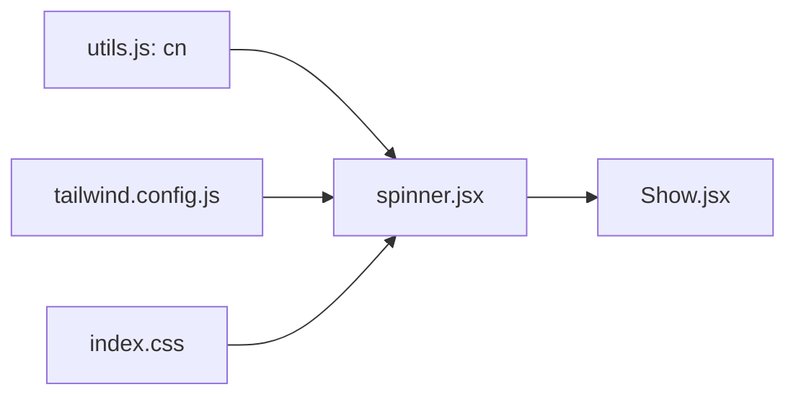

# Specialized Components

<cite>
**Referenced Files in This Document**
- [spinner.jsx](file://src/components/ui/spinner.jsx)
- [Show.jsx](file://src/components/Show.jsx)
- [utils.js](file://src/lib/utils.js)
- [index.css](file://src/index.css)
- [tailwind.config.js](file://tailwind.config.js)
</cite>

## Table of Contents
1. [Introduction](#introduction)
2. [Project Structure](#project-structure)
3. [Core Components](#core-components)
4. [Architecture Overview](#architecture-overview)
5. [Detailed Component Analysis](#detailed-component-analysis)
6. [Dependency Analysis](#dependency-analysis)
7. [Performance Considerations](#performance-considerations)
8. [Accessibility and UX Guidelines](#accessibility-and-ux-guidelines)
9. [Usage Examples](#usage-examples)
10. [Troubleshooting Guide](#troubleshooting-guide)
11. [Conclusion](#conclusion)

## Introduction
This document focuses on DSABuddy’s specialized UI components: Spinner and Show. It explains how Spinner renders a smooth, animated loading indicator using pure CSS animations and Tailwind utilities, and how Show conditionally renders content while displaying a Spinner during asynchronous operations. The guide covers component props, customization options, integration patterns, performance optimization strategies, accessibility considerations, and practical usage scenarios.

## Project Structure
The specialized components are located under the components directory:
- Spinner is a reusable UI component under src/components/ui/spinner.jsx.
- Show is a lightweight conditional renderer under src/components/Show.jsx.
- Utility helpers and styling are provided via src/lib/utils.js and Tailwind configuration.

**Diagram sources**
- [spinner.jsx](file://src/components/ui/spinner.jsx#L1-L39)
- [Show.jsx](file://src/components/Show.jsx#L1-L22)
- [utils.js](file://src/lib/utils.js#L1-L3)
- [tailwind.config.js](file://tailwind.config.js#L1-L78)
- [index.css](file://src/index.css#L1-L61)

**Section sources**
- [spinner.jsx](file://src/components/ui/spinner.jsx#L1-L39)
- [Show.jsx](file://src/components/Show.jsx#L1-L22)
- [utils.js](file://src/lib/utils.js#L1-L3)
- [tailwind.config.js](file://tailwind.config.js#L1-L78)
- [index.css](file://src/index.css#L1-L61)

## Core Components
- Spinner: Renders a 12-segment rotating loader with staggered animation delays and per-segment rotation transforms. It supports responsive sizing and integrates with Tailwind color tokens.
- Show: Conditionally renders children when a boolean flag is true; otherwise, it displays a centered Spinner to indicate pending content.

Key characteristics:
- Spinner exposes className and size props and uses role and aria-label for accessibility.
- Show accepts show and children props and centers a Spinner when content is not ready.

**Section sources**
- [spinner.jsx](file://src/components/ui/spinner.jsx#L4-L38)
- [Show.jsx](file://src/components/Show.jsx#L13-L21)

## Architecture Overview
The components integrate with Tailwind CSS for styling and animations, and leverage a shared utility for class merging.

**Diagram sources**
- [Show.jsx](file://src/components/Show.jsx#L13-L21)
- [spinner.jsx](file://src/components/ui/spinner.jsx#L4-L38)

## Detailed Component Analysis

### Spinner Component
Spinner creates a circular loader composed of 12 uniformly sized segments arranged radially around a center point. Each segment receives:
- A computed animation delay to stagger the fade-in/fade-out effect.
- A rotation transform to position each segment evenly around the circle.
- A size derived from the size prop or a default value.
- Accessibility attributes for screen readers.

Implementation highlights:
- Uses React.forwardRef to expose ref to the root element.
- Applies Tailwind utility classes for positioning, sizing, and animation.
- Uses a shared cn utility for safe class merging.

**Diagram sources**
- [spinner.jsx](file://src/components/ui/spinner.jsx#L4-L38)

**Section sources**
- [spinner.jsx](file://src/components/ui/spinner.jsx#L4-L38)
- [utils.js](file://src/lib/utils.js#L1-L3)

### Show Component
Show conditionally renders either children or a centered Spinner. It is ideal for async content loading scenarios where content availability depends on external operations.

Behavior:
- When show is true, children are returned directly.
- When show is false, a full-coverage container centers a Spinner.

**Diagram sources**
- [Show.jsx](file://src/components/Show.jsx#L13-L21)

**Section sources**
- [Show.jsx](file://src/components/Show.jsx#L13-L21)

## Dependency Analysis
- Spinner depends on:
  - cn utility for class merging.
  - Tailwind theme tokens for colors and layout.
  - Global CSS for base styles and utilities.
- Show depends on Spinner and is used to gate content rendering.

**Diagram sources**
- [utils.js](file://src/lib/utils.js#L1-L3)
- [tailwind.config.js](file://tailwind.config.js#L1-L78)
- [index.css](file://src/index.css#L1-L61)
- [spinner.jsx](file://src/components/ui/spinner.jsx#L1-L39)
- [Show.jsx](file://src/components/Show.jsx#L1-L22)

**Section sources**
- [utils.js](file://src/lib/utils.js#L1-L3)
- [tailwind.config.js](file://tailwind.config.js#L1-L78)
- [index.css](file://src/index.css#L1-L61)
- [spinner.jsx](file://src/components/ui/spinner.jsx#L1-L39)
- [Show.jsx](file://src/components/Show.jsx#L1-L22)

## Performance Considerations
- Prefer GPU-friendly transforms and opacity changes: Spinner uses rotate and translate transforms along with opacity-based animation, which are generally efficient.
- Keep segment count reasonable: 12 segments offer a good balance between smoothness and DOM overhead.
- Avoid unnecessary reflows: Spinner computes delays and rotations based on index; keep the number of segments constant to prevent churn.
- Use size prop judiciously: Larger sizes increase paint area; choose sizes appropriate for the UI context.
- Minimize class conflicts: Use the className prop to scope styles and avoid heavy Tailwind utilities that cause layout thrashing.

[No sources needed since this section provides general guidance]

## Accessibility and UX Guidelines
- Spinner:
  - Role and label: Spinner sets role="status" and aria-label="Loading" to aid assistive technologies.
  - Color contrast: Uses foreground color tokens to maintain contrast across themes.
  - Motion preferences: Consider respecting reduced motion settings by adjusting animation duration or disabling animations.
- Show:
  - Provide meaningful loading states: Use Show to replace empty or pending content with a visible indicator.
  - Communicate progress: For long-running tasks, pair Show with contextual messaging or progress bars.
  - Focus management: Ensure focus moves appropriately after async content loads.

**Section sources**
- [spinner.jsx](file://src/components/ui/spinner.jsx#L11-L14)
- [index.css](file://src/index.css#L54-L61)

## Usage Examples
Below are practical usage patterns for Spinner and Show. Replace placeholder comments with your own content and async logic.

- Loading indicator with custom size:
  - Use Spinner with the size prop to match surrounding UI density.
  - Example reference: [Spinner usage pattern](file://src/components/ui/spinner.jsx#L15-L18)

- Conditional content display:
  - Wrap async content with Show and toggle show based on data readiness.
  - Example reference: [Show conditional rendering](file://src/components/Show.jsx#L13-L21)

- Dynamic UI updates:
  - Set show to false while fetching data, then set it to true upon completion.
  - Example reference: [Show fallback behavior](file://src/components/Show.jsx#L17-L19)

- Integration with the broader component ecosystem:
  - Combine Show with cards, lists, or modals to manage partial content visibility.
  - Example reference: [Show import and usage](file://src/components/Show.jsx#L1)

**Section sources**
- [spinner.jsx](file://src/components/ui/spinner.jsx#L15-L18)
- [Show.jsx](file://src/components/Show.jsx#L13-L21)

## Troubleshooting Guide
- Spinner not animating:
  - Verify Tailwind is generating the animation utilities and that the animation class is applied.
  - Confirm the keyframes and animation durations are present in the built CSS.
  - Reference: [Tailwind config and keyframes](file://tailwind.config.js#L60-L73)
- Spinner appears too small or large:
  - Adjust the size prop to control width and height.
  - Reference: [Size computation](file://src/components/ui/spinner.jsx#L15-L18)
- Spinner overlaps or clips content:
  - Ensure parent containers allow overflow or provide adequate spacing.
  - Reference: [Segment positioning](file://src/components/ui/spinner.jsx#L23-L31)
- Show does not display content:
  - Confirm the show prop toggles correctly and that children are valid React nodes.
  - Reference: [Conditional rendering](file://src/components/Show.jsx#L14-L16)
- Accessibility issues:
  - Ensure role and aria-label remain intact when wrapping Spinner.
  - Reference: [ARIA attributes](file://src/components/ui/spinner.jsx#L12-L13)

**Section sources**
- [tailwind.config.js](file://tailwind.config.js#L60-L73)
- [spinner.jsx](file://src/components/ui/spinner.jsx#L15-L18)
- [spinner.jsx](file://src/components/ui/spinner.jsx#L23-L31)
- [Show.jsx](file://src/components/Show.jsx#L14-L16)
- [spinner.jsx](file://src/components/ui/spinner.jsx#L12-L13)

## Conclusion
Spinner and Show provide a concise, accessible, and efficient foundation for managing loading states and conditional content in DSABuddy. By leveraging Tailwind utilities and a minimal animation strategy, these components deliver smooth user experiences during async operations while remaining easy to customize and integrate across the application.

[No sources needed since this section summarizes without analyzing specific files]