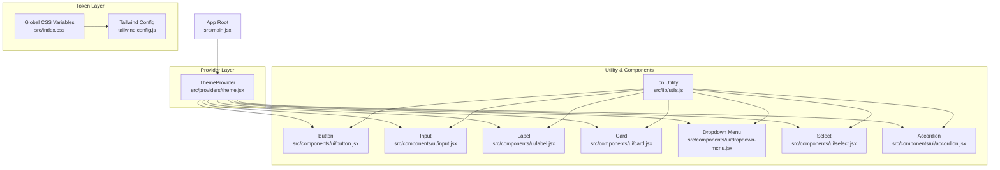
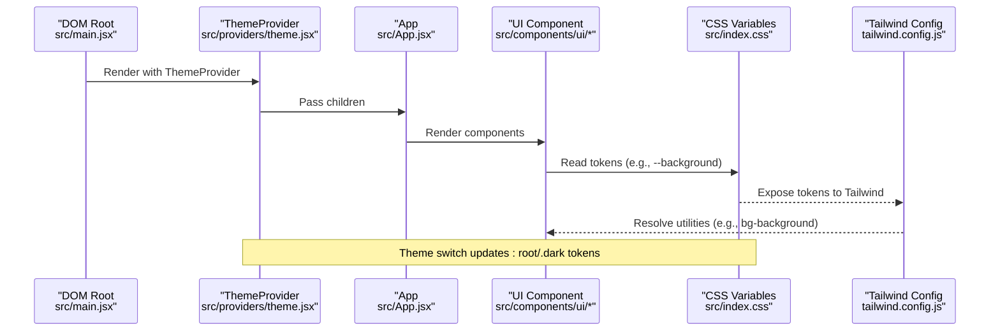
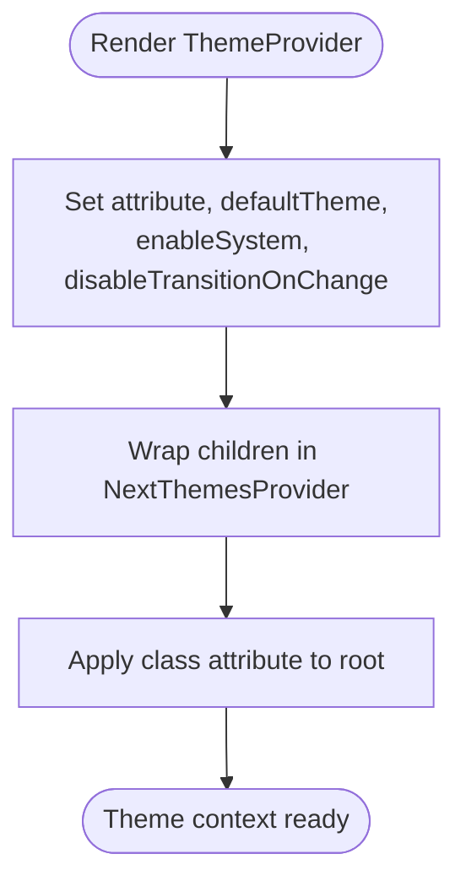
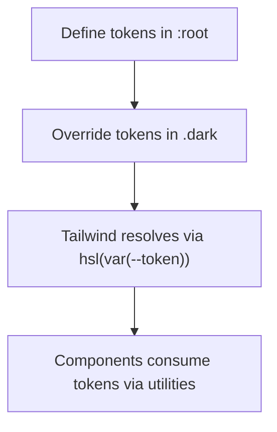
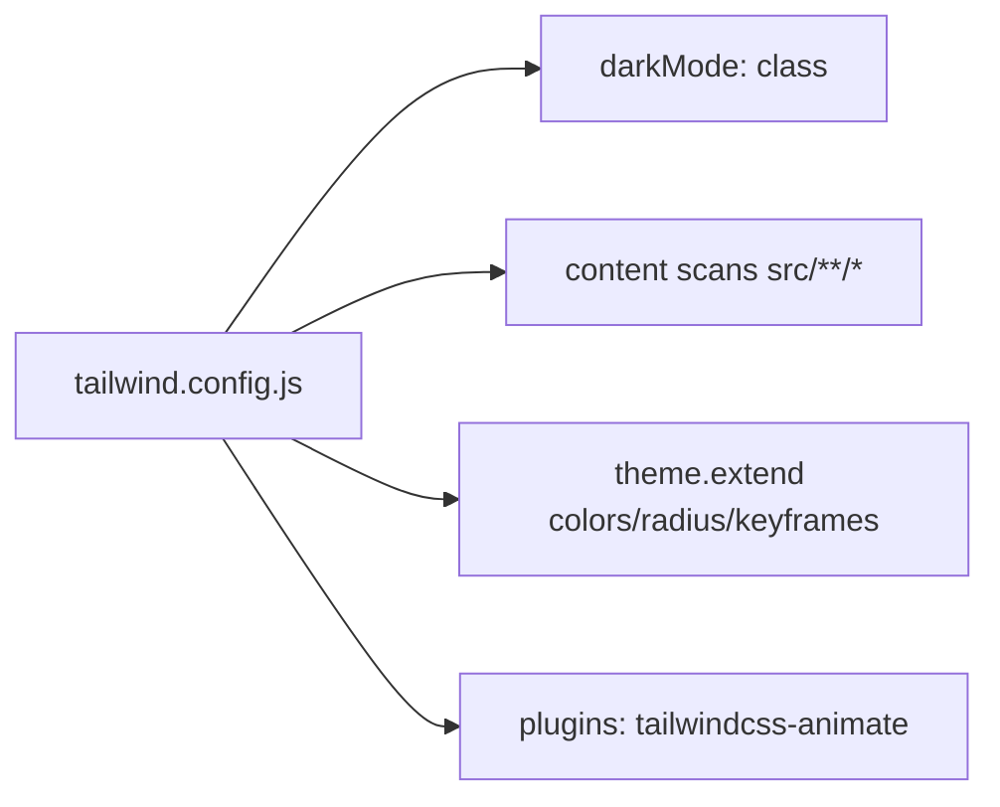
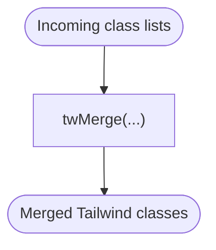
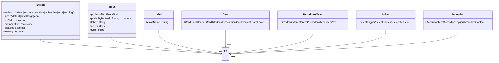
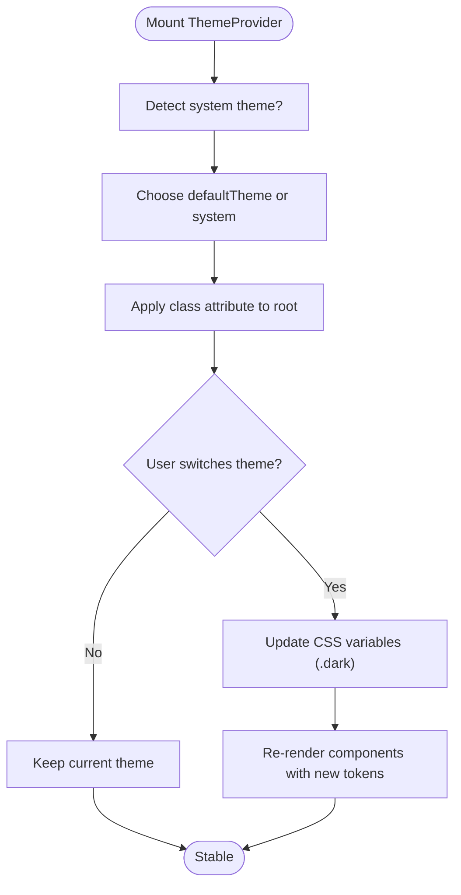
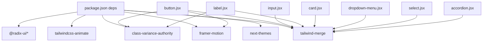

# Theme System and Styling

<cite>
**Referenced Files in This Document**
- [theme.jsx](file://src/providers/theme.jsx)
- [tailwind.config.js](file://tailwind.config.js)
- [index.css](file://src/index.css)
- [postcss.config.js](file://postcss.config.js)
- [package.json](file://package.json)
- [utils.js](file://src/lib/utils.js)
- [button.jsx](file://src/components/ui/button.jsx)
- [input.jsx](file://src/components/ui/input.jsx)
- [label.jsx](file://src/components/ui/label.jsx)
- [card.jsx](file://src/components/ui/card.jsx)
- [dropdown-menu.jsx](file://src/components/ui/dropdown-menu.jsx)
- [select.jsx](file://src/components/ui/select.jsx)
- [accordion.jsx](file://src/components/ui/accordion.jsx)
- [main.jsx](file://src/main.jsx)
- [App.jsx](file://src/App.jsx)
</cite>

## Table of Contents
1. [Introduction](#introduction)
2. [Project Structure](#project-structure)
3. [Core Components](#core-components)
4. [Architecture Overview](#architecture-overview)
5. [Detailed Component Analysis](#detailed-component-analysis)
6. [Dependency Analysis](#dependency-analysis)
7. [Performance Considerations](#performance-considerations)
8. [Troubleshooting Guide](#troubleshooting-guide)
9. [Conclusion](#conclusion)
10. [Appendices](#appendices)

## Introduction
This document explains DSABuddy’s theme system and styling architecture. It covers how themes are provided and switched, how design tokens are modeled with CSS variables, and how Tailwind CSS integrates with Radix UI primitives and component variants. It also documents the cn utility for safe class merging, component styling patterns, and guidelines for extending the theme system while maintaining consistency.

## Project Structure
The theme and styling system spans three layers:
- Provider layer: ThemeProvider wraps the app and manages theme state and attributes.
- Token layer: CSS variables define design tokens for light and dark modes.
- Utility and component layer: Tailwind utilities, CSS variables, and component variants compose styles consistently.

**Diagram sources**
- [theme.jsx](file://src/providers/theme.jsx#L24-L41)
- [index.css](file://src/index.css#L6-L61)
- [tailwind.config.js](file://tailwind.config.js#L1-L78)
- [utils.js](file://src/lib/utils.js#L1-L3)
- [button.jsx](file://src/components/ui/button.jsx#L1-L115)
- [input.jsx](file://src/components/ui/input.jsx#L1-L169)
- [label.jsx](file://src/components/ui/label.jsx#L1-L20)
- [card.jsx](file://src/components/ui/card.jsx#L1-L58)
- [dropdown-menu.jsx](file://src/components/ui/dropdown-menu.jsx#L1-L166)
- [select.jsx](file://src/components/ui/select.jsx#L1-L259)
- [accordion.jsx](file://src/components/ui/accordion.jsx#L1-L46)
- [main.jsx](file://src/main.jsx#L1-L13)

**Section sources**
- [theme.jsx](file://src/providers/theme.jsx#L1-L41)
- [index.css](file://src/index.css#L1-L61)
- [tailwind.config.js](file://tailwind.config.js#L1-L78)
- [postcss.config.js](file://postcss.config.js#L1-L7)
- [package.json](file://package.json#L1-L50)
- [utils.js](file://src/lib/utils.js#L1-L3)
- [main.jsx](file://src/main.jsx#L1-L13)

## Core Components
- ThemeProvider: Wraps the app with theme context, enabling system-aware theme selection and disabling transition flicker during theme changes.
- Design Tokens: CSS variables in :root and .dark define semantic tokens for background, foreground, borders, rings, and palettes.
- Tailwind Integration: Tailwind reads tokens via hsl(var(--token)) and extends border radius and keyframes/animations.
- cn Utility: Merges Tailwind classes deterministically using tailwind-merge.
- Component Variants: Components use class-variance-authority (cva) to define consistent variants and sizes.

**Section sources**
- [theme.jsx](file://src/providers/theme.jsx#L24-L41)
- [index.css](file://src/index.css#L6-L61)
- [tailwind.config.js](file://tailwind.config.js#L11-L77)
- [utils.js](file://src/lib/utils.js#L1-L3)
- [button.jsx](file://src/components/ui/button.jsx#L10-L38)

## Architecture Overview
The theme system is built around a provider that sets a class attribute on the root element and toggles .dark. Tailwind consumes CSS variables to resolve colors and radii. Components inherit styles from tokens and expose variants for consistent composition.

**Diagram sources**
- [main.jsx](file://src/main.jsx#L7-L12)
- [theme.jsx](file://src/providers/theme.jsx#L24-L41)
- [App.jsx](file://src/App.jsx#L101-L102)
- [index.css](file://src/index.css#L6-L61)
- [tailwind.config.js](file://tailwind.config.js#L11-L77)

## Detailed Component Analysis

### ThemeProvider Implementation
- Purpose: Provide theme context with configurable attribute, default theme, system enablement, and transition behavior.
- Behavior: Renders a wrapping div and delegates to next-themes for theme state management.

**Diagram sources**
- [theme.jsx](file://src/providers/theme.jsx#L24-L41)

**Section sources**
- [theme.jsx](file://src/providers/theme.jsx#L24-L41)

### Design Token Management
- Tokens: Semantic tokens for background, foreground, borders, rings, and palette groups (primary, secondary, muted, accent, destructive, popover, card).
- Modes:
  - Light defaults in :root.
  - Dark overrides in .dark.
- Tailwind consumption: Uses hsl(var(--token)) and var(--radius) for colors and border radius.
- Extensibility: Add new tokens in :root and .dark, then reference them in Tailwind config and components.

**Diagram sources**
- [index.css](file://src/index.css#L6-L61)
- [tailwind.config.js](file://tailwind.config.js#L20-L59)

**Section sources**
- [index.css](file://src/index.css#L6-L61)
- [tailwind.config.js](file://tailwind.config.js#L11-L77)

### Tailwind CSS Integration
- darkMode: class ensures Tailwind respects the .dark class.
- content: Scans src for class usage.
- theme.extend: Adds border radius tokens and keyframes/animations consumed by components.
- Plugins: tailwindcss-animate enables animation utilities.

**Diagram sources**
- [tailwind.config.js](file://tailwind.config.js#L1-L78)
- [postcss.config.js](file://postcss.config.js#L1-L7)

**Section sources**
- [tailwind.config.js](file://tailwind.config.js#L1-L78)
- [postcss.config.js](file://postcss.config.js#L1-L7)

### cn Utility Function
- Purpose: Merge Tailwind classes safely to avoid duplicates and conflicts.
- Usage: Applied across components to combine base styles, variants, and incoming className.

**Diagram sources**
- [utils.js](file://src/lib/utils.js#L1-L3)

**Section sources**
- [utils.js](file://src/lib/utils.js#L1-L3)

### Component Styling Patterns
- Variants and Sizes: Components define variants (e.g., default, secondary, outline) and sizes (e.g., default, small, large, icon) using cva.
- Token-driven Colors: Components reference semantic tokens (e.g., bg-primary, text-primary-foreground, border-input).
- Conditional States: Components adapt styles for loading, disabled, and error states.
- Motion and Animations: Components integrate Framer Motion for micro-interactions and Radix animations for menus/selects.

**Diagram sources**
- [button.jsx](file://src/components/ui/button.jsx#L10-L38)
- [input.jsx](file://src/components/ui/input.jsx#L23-L115)
- [label.jsx](file://src/components/ui/label.jsx#L7-L9)
- [card.jsx](file://src/components/ui/card.jsx#L5-L58)
- [dropdown-menu.jsx](file://src/components/ui/dropdown-menu.jsx#L49-L76)
- [select.jsx](file://src/components/ui/select.jsx#L75-L92)
- [accordion.jsx](file://src/components/ui/accordion.jsx#L9-L44)
- [utils.js](file://src/lib/utils.js#L1-L3)

**Section sources**
- [button.jsx](file://src/components/ui/button.jsx#L10-L115)
- [input.jsx](file://src/components/ui/input.jsx#L23-L169)
- [label.jsx](file://src/components/ui/label.jsx#L7-L20)
- [card.jsx](file://src/components/ui/card.jsx#L5-L58)
- [dropdown-menu.jsx](file://src/components/ui/dropdown-menu.jsx#L49-L166)
- [select.jsx](file://src/components/ui/select.jsx#L75-L259)
- [accordion.jsx](file://src/components/ui/accordion.jsx#L9-L46)

### Dark/Light Mode Switching
- Mechanism: ThemeProvider controls the class attribute on the root element. The .dark class switches CSS variables in :root to dark-mode values.
- Transition: disableTransitionOnChange reduces perceived flicker when switching themes.
- System Detection: enableSystem allows theme to follow OS preference.

**Diagram sources**
- [theme.jsx](file://src/providers/theme.jsx#L24-L41)
- [index.css](file://src/index.css#L31-L51)

**Section sources**
- [theme.jsx](file://src/providers/theme.jsx#L24-L41)
- [index.css](file://src/index.css#L31-L51)

### Typography Scales, Spacing Systems, and Responsive Breakpoints
- Typography: Components rely on semantic text-* utilities and font weights defined in base styles.
- Spacing: Consistent use of space utilities (e.g., p-, m-, gap-) and fixed heights (e.g., h-9, h-8, h-10) for inputs and buttons.
- Radius: Border radius tokens align to var(--radius) and are extended for lg/md/sm.
- Breakpoints: Tailwind’s default breakpoints apply; container padding and screen limits are configured centrally.

**Section sources**
- [tailwind.config.js](file://tailwind.config.js#L11-L77)
- [index.css](file://src/index.css#L54-L61)

### Runtime Theme Switching and Customization
- Runtime switching: Controlled by ThemeProvider props; consumers can programmatically switch themes by updating the underlying theme state.
- Customization options:
  - Modify tokens in :root and .dark for new palettes or semantic roles.
  - Extend Tailwind colors and radius in tailwind.config.js.
  - Add new variants/sizes via cva in components.
  - Introduce new CSS variables for layout tokens (e.g., spacing, typography scales).

**Section sources**
- [theme.jsx](file://src/providers/theme.jsx#L24-L41)
- [index.css](file://src/index.css#L6-L61)
- [tailwind.config.js](file://tailwind.config.js#L19-L77)

## Dependency Analysis
- External libraries:
  - next-themes: Theme provider and persistence.
  - class-variance-authority (cva): Component variants.
  - tailwind-merge: Safe class merging.
  - tailwindcss-animate: Animation utilities.
  - Radix UI: Primitive components (accordion, dropdown-menu, select, slot).
  - Framer Motion: Micro-interactions for interactive components.

**Diagram sources**
- [package.json](file://package.json#L12-L34)
- [button.jsx](file://src/components/ui/button.jsx#L3-L8)
- [input.jsx](file://src/components/ui/input.jsx#L4)
- [label.jsx](file://src/components/ui/label.jsx#L3)
- [card.jsx](file://src/components/ui/card.jsx#L3)
- [dropdown-menu.jsx](file://src/components/ui/dropdown-menu.jsx#L5)
- [select.jsx](file://src/components/ui/select.jsx#L11)
- [accordion.jsx](file://src/components/ui/accordion.jsx#L5)

**Section sources**
- [package.json](file://package.json#L12-L34)
- [button.jsx](file://src/components/ui/button.jsx#L3-L8)
- [input.jsx](file://src/components/ui/input.jsx#L4)
- [label.jsx](file://src/components/ui/label.jsx#L3)
- [card.jsx](file://src/components/ui/card.jsx#L3)
- [dropdown-menu.jsx](file://src/components/ui/dropdown-menu.jsx#L5)
- [select.jsx](file://src/components/ui/select.jsx#L11)
- [accordion.jsx](file://src/components/ui/accordion.jsx#L5)

## Performance Considerations
- Minimize reflows: Prefer token-driven utilities over inline styles.
- Reduce class churn: Use cn to merge classes efficiently.
- Limit animations: Keep motion and transitions subtle to avoid jank.
- Tree-shake unused utilities: Tailwind purges unused classes based on content globs.

## Troubleshooting Guide
- Theme does not switch:
  - Verify ThemeProvider wraps the app and attribute is applied to the root element.
  - Confirm .dark class toggles when switching to dark mode.
- Tokens not applied:
  - Ensure CSS variables are defined in :root and .dark.
  - Check Tailwind resolves hsl(var(--token)) correctly.
- Variant styles missing:
  - Confirm cva is invoked with correct variant/size and className is merged via cn.
- Conflicting classes:
  - Use cn to merge classes; it prevents duplicates and overrides.

**Section sources**
- [theme.jsx](file://src/providers/theme.jsx#L24-L41)
- [index.css](file://src/index.css#L6-L61)
- [tailwind.config.js](file://tailwind.config.js#L20-L59)
- [utils.js](file://src/lib/utils.js#L1-L3)
- [button.jsx](file://src/components/ui/button.jsx#L80-L87)

## Conclusion
DSABuddy’s theme system centers on a provider that toggles a class attribute, driving CSS variables for light and dark modes. Tailwind consumes these tokens to produce consistent, scalable styles. The cn utility and cva-based variants ensure predictable class merging and component composition. Extending the system involves adding tokens, variants, and sizes while preserving the token-first approach.

## Appendices

### Color Schemes and Palettes
- Semantic tokens: background, foreground, border, ring, input.
- Palette groups: primary, secondary, muted, accent, destructive, popover, card.
- Usage: Components reference tokens (e.g., bg-background, text-foreground, border-input).

**Section sources**
- [index.css](file://src/index.css#L6-L61)
- [tailwind.config.js](file://tailwind.config.js#L20-L54)

### Typography and Spacing Reference
- Typography: Use text-* utilities and font weights; maintain consistent scale across components.
- Spacing: Use space utilities and fixed heights for interactive elements.

**Section sources**
- [tailwind.config.js](file://tailwind.config.js#L11-L18)
- [button.jsx](file://src/components/ui/button.jsx#L26-L31)
- [input.jsx](file://src/components/ui/input.jsx#L62-L73)

### Extending the Theme System
- Add tokens: Define new CSS variables in :root and .dark.
- Extend Tailwind: Add tokens to theme.extend in tailwind.config.js.
- Add variants: Define new cva variants/sizes in components.
- Preserve consistency: Always reference tokens and use cn for class merging.

**Section sources**
- [index.css](file://src/index.css#L6-L61)
- [tailwind.config.js](file://tailwind.config.js#L19-L77)
- [button.jsx](file://src/components/ui/button.jsx#L10-L38)
- [utils.js](file://src/lib/utils.js#L1-L3)