# UI Components and Design System

<cite>
**Referenced Files in This Document**
- [button.jsx](file://src/components/ui/button.jsx)
- [card.jsx](file://src/components/ui/card.jsx)
- [dropdown-menu.jsx](file://src/components/ui/dropdown-menu.jsx)
- [input.jsx](file://src/components/ui/input.jsx)
- [select.jsx](file://src/components/ui/select.jsx)
- [accordion.jsx](file://src/components/ui/accordion.jsx)
- [label.jsx](file://src/components/ui/label.jsx)
- [scroll-area.jsx](file://src/components/ui/scroll-area.jsx)
- [spinner.jsx](file://src/components/ui/spinner.jsx)
- [theme.jsx](file://src/providers/theme.jsx)
- [tailwind.config.js](file://tailwind.config.js)
- [index.css](file://src/index.css)
- [utils.js](file://src/lib/utils.js)
- [App.jsx](file://src/App.jsx)
- [package.json](file://package.json)
</cite>

## Table of Contents
1. [Introduction](#introduction)
2. [Project Structure](#project-structure)
3. [Core Components](#core-components)
4. [Architecture Overview](#architecture-overview)
5. [Detailed Component Analysis](#detailed-component-analysis)
6. [Dependency Analysis](#dependency-analysis)
7. [Performance Considerations](#performance-considerations)
8. [Troubleshooting Guide](#troubleshooting-guide)
9. [Conclusion](#conclusion)
10. [Appendices](#appendices)

## Introduction
This document describes DSABuddy’s UI component system and design architecture. The system is built on Radix UI primitives for accessible, unstyled foundations, Tailwind CSS for utility-first styling and design tokens, and Framer Motion for subtle animations. A theme provider enables light and dark mode with system preference awareness. The documented components include Button, Card, DropdownMenu, Input, Select, Accordion, Label, ScrollArea, and Spinner. Each component’s props, customization options, accessibility features, responsive patterns, state/event handling, and animation implementations are explained, along with usage examples and integration guidelines.

## Project Structure
The UI components live under src/components/ui and are composed with Radix UI primitives, styled via Tailwind CSS, and enhanced with design tokens. Theme management is centralized in a provider that integrates with next-themes. Utility helpers merge Tailwind classes safely.

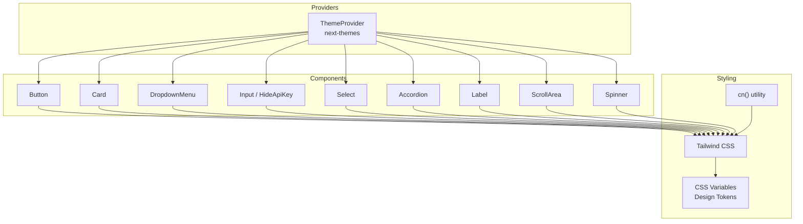

**Diagram sources**
- [theme.jsx](file://src/providers/theme.jsx#L24-L41)
- [button.jsx](file://src/components/ui/button.jsx#L62-L113)
- [card.jsx](file://src/components/ui/card.jsx#L5-L58)
- [dropdown-menu.jsx](file://src/components/ui/dropdown-menu.jsx#L7-L166)
- [input.jsx](file://src/components/ui/input.jsx#L23-L115)
- [select.jsx](file://src/components/ui/select.jsx#L14-L259)
- [accordion.jsx](file://src/components/ui/accordion.jsx#L7-L46)
- [label.jsx](file://src/components/ui/label.jsx#L11-L18)
- [scroll-area.jsx](file://src/components/ui/scroll-area.jsx#L6-L39)
- [spinner.jsx](file://src/components/ui/spinner.jsx#L4-L35)
- [tailwind.config.js](file://tailwind.config.js#L1-L78)
- [index.css](file://src/index.css#L6-L61)
- [utils.js](file://src/lib/utils.js#L1-L3)

**Section sources**
- [package.json](file://package.json#L12-L34)
- [tailwind.config.js](file://tailwind.config.js#L1-L78)
- [index.css](file://src/index.css#L6-L61)
- [utils.js](file://src/lib/utils.js#L1-L3)
- [theme.jsx](file://src/providers/theme.jsx#L24-L41)

## Core Components
This section summarizes the reusable UI components and their primary responsibilities.

- Button: Variants and sizes with optional prefix/suffix icons, loading state, and press feedback.
- Card: Semantic layout blocks for content grouping with header/title/description/content/footer parts.
- DropdownMenu: Menu system with triggers, groups, submenus, checkboxes, radios, and shortcuts.
- Input: Text input with optional label, prefix/suffix adornments, and inline error messaging.
- Select: Styled dropdown list with animated content variants and scroll controls.
- Accordion: Collapsible sections with smooth open/close animations.
- Label: Accessible label for form controls.
- ScrollArea: Scrollable viewport with draggable scrollbar track.
- Spinner: Loading indicator with configurable size and animated segments.

**Section sources**
- [button.jsx](file://src/components/ui/button.jsx#L10-L38)
- [card.jsx](file://src/components/ui/card.jsx#L5-L58)
- [dropdown-menu.jsx](file://src/components/ui/dropdown-menu.jsx#L7-L166)
- [input.jsx](file://src/components/ui/input.jsx#L23-L115)
- [select.jsx](file://src/components/ui/select.jsx#L14-L259)
- [accordion.jsx](file://src/components/ui/accordion.jsx#L7-L46)
- [label.jsx](file://src/components/ui/label.jsx#L11-L18)
- [scroll-area.jsx](file://src/components/ui/scroll-area.jsx#L6-L39)
- [spinner.jsx](file://src/components/ui/spinner.jsx#L4-L35)

## Architecture Overview
The UI architecture follows a layered approach:
- Primitive Layer: Radix UI primitives provide semantics and keyboard navigation.
- Styling Layer: Tailwind utilities and design tokens define visual styles and spacing.
- Composition Layer: Components wrap primitives and compose Tailwind classes.
- Animation Layer: Framer Motion adds micro-interactions and transitions.
- Theme Layer: next-themes manages theme switching and system preference.

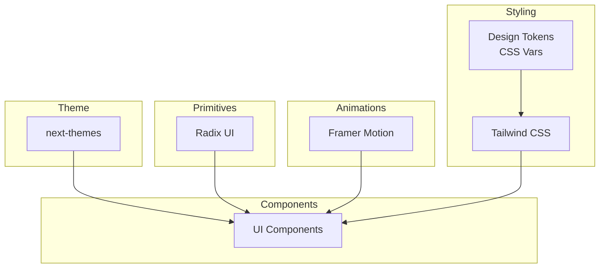

**Diagram sources**
- [theme.jsx](file://src/providers/theme.jsx#L24-L41)
- [tailwind.config.js](file://tailwind.config.js#L19-L77)
- [index.css](file://src/index.css#L6-L61)
- [button.jsx](file://src/components/ui/button.jsx#L8-L8)
- [select.jsx](file://src/components/ui/select.jsx#L12-L12)
- [accordion.jsx](file://src/components/ui/accordion.jsx#L38-L42)

## Detailed Component Analysis

### Button
- Purpose: Action surface with multiple variants and sizes, optional icons, loading state, and press feedback.
- Props:
  - variant: default, outline, secondary, tertiary, link, error, warning
  - size: default, small, large, icon
  - asChild: render as child element
  - prefix/suffix: React nodes for icons
  - loading: show spinner and temporarily switch variant
  - disabled: disable interaction
  - className: additional container classes
- Accessibility: Inherits focus-visible styles and maintains pointer-events behavior.
- Responsive: Uses fluid sizing and padding classes; icon containers adapt to content.
- Animation: Press feedback via Framer Motion scale transform.
- Composition: Uses cva for variant/size combinations and cn for safe class merging.

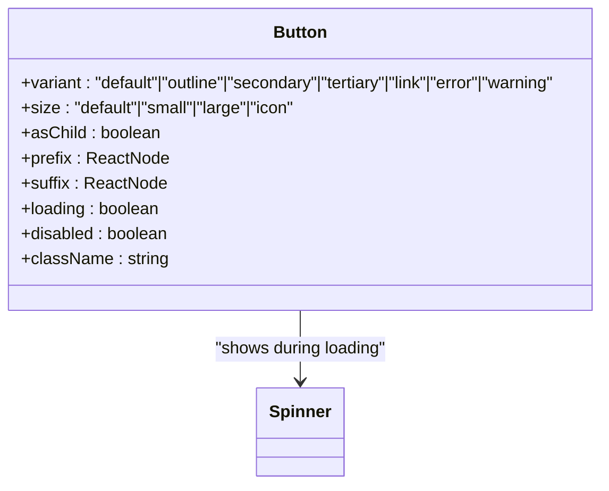

**Diagram sources**
- [button.jsx](file://src/components/ui/button.jsx#L10-L38)
- [button.jsx](file://src/components/ui/button.jsx#L62-L113)
- [spinner.jsx](file://src/components/ui/spinner.jsx#L4-L35)

**Section sources**
- [button.jsx](file://src/components/ui/button.jsx#L10-L38)
- [button.jsx](file://src/components/ui/button.jsx#L62-L113)

### Card
- Purpose: Container for grouped content with semantic parts.
- Parts:
  - Card: outer container
  - CardHeader: top area with vertical spacing
  - CardTitle: title typography
  - CardDescription: muted description text
  - CardContent: main content area
  - CardFooter: bottom action area
- Accessibility: No special roles; rely on semantic HTML and proper heading hierarchy.
- Responsiveness: Padding and spacing classes adapt across breakpoints.

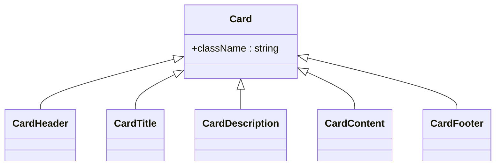

**Diagram sources**
- [card.jsx](file://src/components/ui/card.jsx#L5-L58)

**Section sources**
- [card.jsx](file://src/components/ui/card.jsx#L5-L58)

### DropdownMenu
- Purpose: Flexible menu system with nested submenus, checkboxes, radios, and shortcuts.
- Key elements:
  - Root, Trigger, Portal
  - Content with side-aware animations
  - Item, CheckboxItem, RadioItem, Label, Separator
  - Group, Sub, SubTrigger, SubContent
- Accessibility: Uses Radix primitives for ARIA roles and keyboard navigation.
- Animations: Built-in enter/exit animations via data attributes.

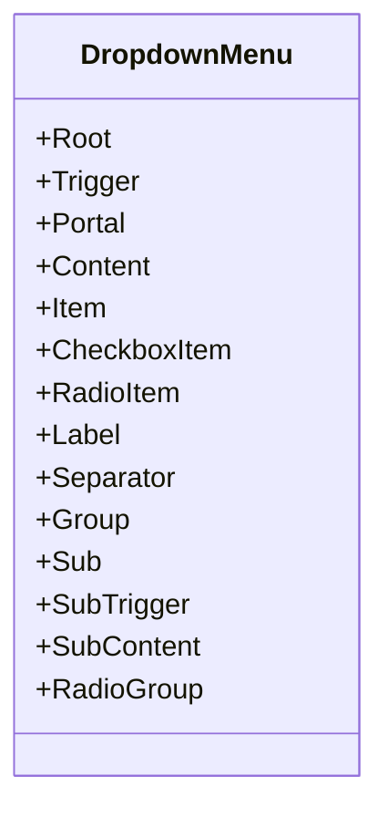

**Diagram sources**
- [dropdown-menu.jsx](file://src/components/ui/dropdown-menu.jsx#L7-L166)

**Section sources**
- [dropdown-menu.jsx](file://src/components/ui/dropdown-menu.jsx#L7-L166)

### Input
- Purpose: Text input with optional label, prefix/suffix adornments, and inline error messaging.
- Specialized variant:
  - HideApiKey: Toggles password visibility with accessible icons.
- State management:
  - Calculates prefix/suffix widths dynamically to adjust input padding.
  - Tracks visibility state for password toggle.
- Accessibility:
  - Proper label association via htmlFor.
  - Screen-reader-friendly toggle labels.
- Error UX: Dedicated alert region with icon and label.

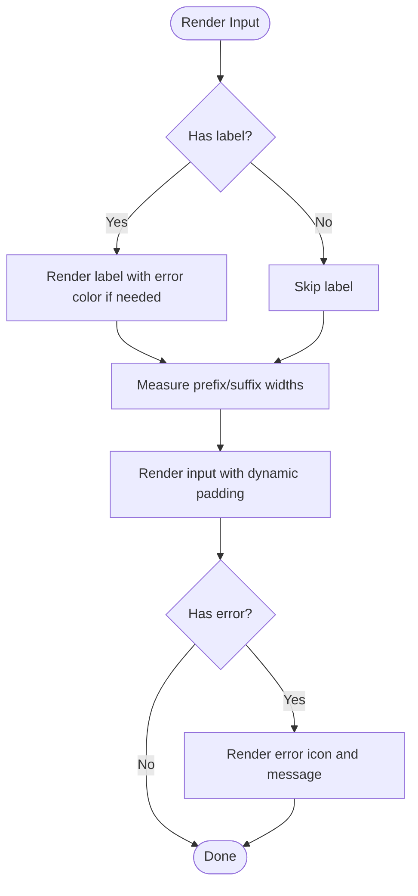

**Diagram sources**
- [input.jsx](file://src/components/ui/input.jsx#L23-L115)

**Section sources**
- [input.jsx](file://src/components/ui/input.jsx#L23-L115)
- [input.jsx](file://src/components/ui/input.jsx#L119-L168)

### Select
- Purpose: Styled dropdown list backed by Radix Select primitives.
- Features:
  - Animated content variants (zoom, scaleBounce, fade, slide up/down/left/right, flip, rotate).
  - Scroll buttons for long lists.
  - Item indicators and separators.
- Props:
  - variants: selects animation variant
  - position: popper alignment
  - Trigger, Content, Item, Label, Separator, ScrollUp/DownButton
- Accessibility: Inherits Radix Select semantics and keyboard handling.

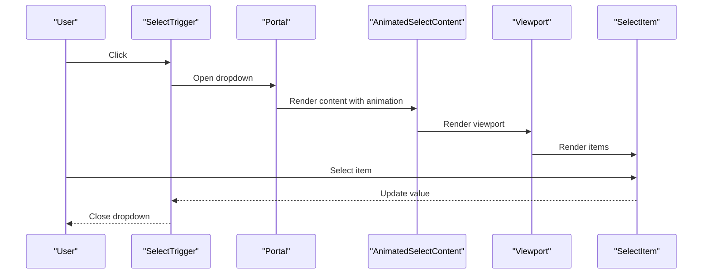

**Diagram sources**
- [select.jsx](file://src/components/ui/select.jsx#L124-L207)
- [select.jsx](file://src/components/ui/select.jsx#L168-L195)

**Section sources**
- [select.jsx](file://src/components/ui/select.jsx#L14-L259)

### Accordion
- Purpose: Collapsible sections with smooth animations.
- Elements:
  - Accordion (root)
  - AccordionItem (section)
  - AccordionTrigger (header with chevron)
  - AccordionContent (collapsible panel)
- Animation: Uses Tailwind data-[state]-based animations for open/close.

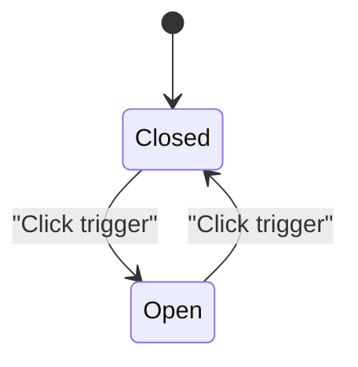

**Diagram sources**
- [accordion.jsx](file://src/components/ui/accordion.jsx#L35-L44)

**Section sources**
- [accordion.jsx](file://src/components/ui/accordion.jsx#L7-L46)

### Label
- Purpose: Accessible label for form controls.
- Styling: Uses cva for consistent typography and disabled state handling.

**Section sources**
- [label.jsx](file://src/components/ui/label.jsx#L7-L18)

### ScrollArea
- Purpose: Scrollable container with draggable scrollbar.
- Elements:
  - ScrollArea (root)
  - ScrollBar (track and thumb)
- Orientation: Supports vertical and horizontal orientations.

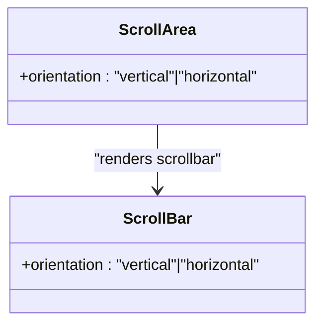

**Diagram sources**
- [scroll-area.jsx](file://src/components/ui/scroll-area.jsx#L6-L39)

**Section sources**
- [scroll-area.jsx](file://src/components/ui/scroll-area.jsx#L6-L39)

### Spinner
- Purpose: Loading indicator with configurable size and animated segments.
- Props:
  - size: pixel size
  - className: additional classes
- Animation: 12 animated segments with staggered delays and rotation transforms.

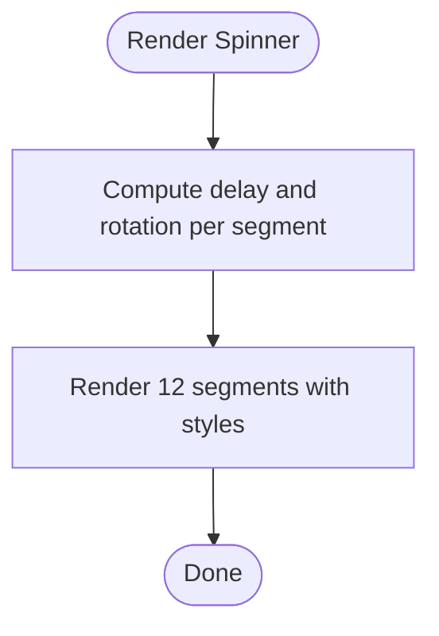

**Diagram sources**
- [spinner.jsx](file://src/components/ui/spinner.jsx#L4-L35)

**Section sources**
- [spinner.jsx](file://src/components/ui/spinner.jsx#L4-L35)

## Dependency Analysis
The UI components depend on Radix UI primitives, Tailwind utilities, and design tokens. Theme switching is handled by next-themes. Utility functions merge Tailwind classes safely.

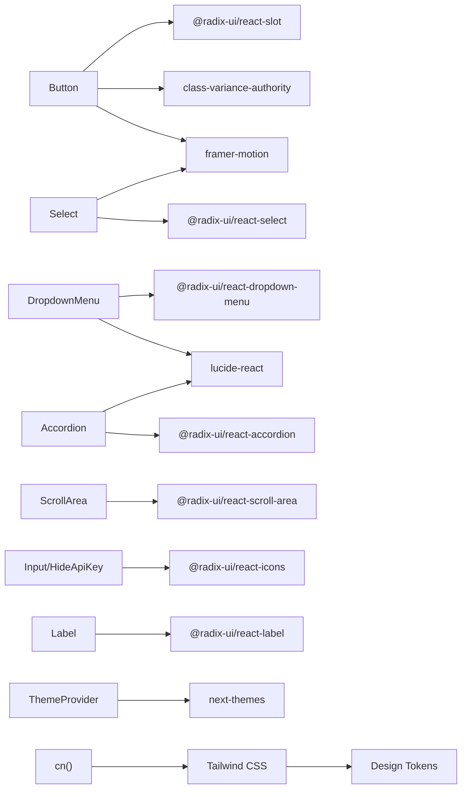

**Diagram sources**
- [button.jsx](file://src/components/ui/button.jsx#L3-L8)
- [select.jsx](file://src/components/ui/select.jsx#L4-L12)
- [dropdown-menu.jsx](file://src/components/ui/dropdown-menu.jsx#L1-L6)
- [accordion.jsx](file://src/components/ui/accordion.jsx#L1-L6)
- [scroll-area.jsx](file://src/components/ui/scroll-area.jsx#L1-L6)
- [input.jsx](file://src/components/ui/input.jsx#L5)
- [label.jsx](file://src/components/ui/label.jsx#L2-L3)
- [theme.jsx](file://src/providers/theme.jsx#L2)
- [tailwind.config.js](file://tailwind.config.js#L19-L77)
- [utils.js](file://src/lib/utils.js#L1)

**Section sources**
- [package.json](file://package.json#L12-L34)
- [tailwind.config.js](file://tailwind.config.js#L19-L77)
- [utils.js](file://src/lib/utils.js#L1-L3)
- [theme.jsx](file://src/providers/theme.jsx#L24-L41)

## Performance Considerations
- Prefer static animations where possible; use Framer Motion sparingly for interactive feedback.
- Defer heavy computations in components; memoize derived values when appropriate.
- Keep class strings minimal and avoid excessive nesting in Tailwind utilities.
- Use the cn utility to merge classes efficiently and avoid duplicates.
- Limit portal usage to necessary contexts to reduce DOM traversal overhead.

## Troubleshooting Guide
- Theme not switching:
  - Verify default theme and system preference settings in the ThemeProvider.
  - Ensure dark mode is enabled in Tailwind config and CSS variables are present.
- Select content not animating:
  - Confirm the selected animation variant is passed to SelectContent.
  - Check that Framer Motion is imported and available.
- Input adornment misalignment:
  - Ensure prefix/suffix refs are rendered and measured before computing padding.
  - Verify className and iclassName are not overriding computed styles unintentionally.
- Scrollbar not visible:
  - Confirm ScrollBar is rendered within ScrollArea and orientation matches content.
- Button press feedback not working:
  - Ensure Framer Motion is installed and the wrapper div is present.

**Section sources**
- [theme.jsx](file://src/providers/theme.jsx#L24-L41)
- [tailwind.config.js](file://tailwind.config.js#L3-L3)
- [index.css](file://src/index.css#L6-L61)
- [select.jsx](file://src/components/ui/select.jsx#L197-L207)
- [input.jsx](file://src/components/ui/input.jsx#L23-L115)
- [scroll-area.jsx](file://src/components/ui/scroll-area.jsx#L6-L39)
- [button.jsx](file://src/components/ui/button.jsx#L107-L112)

## Conclusion
DSABuddy’s UI system combines accessible primitives, expressive styling, and thoughtful animations to deliver a cohesive, theme-aware interface. Components are designed for composability, customization, and maintainability, enabling rapid iteration while preserving usability and aesthetics.

## Appendices

### Theme Management and Design Tokens
- Theme Provider:
  - Wraps the app with next-themes to manage theme state and system preference.
  - Configurable default theme, attribute, and transition behavior.
- Design Tokens:
  - CSS variables define semantic color scales and radii.
  - Tailwind theme extends these tokens for consistent spacing and colors.
- Dark Mode:
  - Tailwind dark mode uses the class strategy; CSS variables switch accordingly.

**Section sources**
- [theme.jsx](file://src/providers/theme.jsx#L24-L41)
- [tailwind.config.js](file://tailwind.config.js#L3-L77)
- [index.css](file://src/index.css#L6-L61)

### Component Usage Examples
- Button with icons and loading:
  - Reference: [button.jsx](file://src/components/ui/button.jsx#L62-L113)
- Card composition:
  - Reference: [card.jsx](file://src/components/ui/card.jsx#L5-L58)
- DropdownMenu with submenus:
  - Reference: [dropdown-menu.jsx](file://src/components/ui/dropdown-menu.jsx#L7-L166)
- Input with label and error:
  - Reference: [input.jsx](file://src/components/ui/input.jsx#L23-L115)
- Select with custom animation:
  - Reference: [select.jsx](file://src/components/ui/select.jsx#L197-L207)
- Accordion section:
  - Reference: [accordion.jsx](file://src/components/ui/accordion.jsx#L7-L46)
- ScrollArea with scrollbar:
  - Reference: [scroll-area.jsx](file://src/components/ui/scroll-area.jsx#L6-L39)
- Spinner usage:
  - Reference: [spinner.jsx](file://src/components/ui/spinner.jsx#L4-L35)

### Integration Guidelines
- Wrap the application with the ThemeProvider to enable theme switching.
- Import components from src/components/ui and compose them according to the provided APIs.
- Use Tailwind utilities alongside component-specific className props for fine-grained customization.
- For animations, leverage component-provided variants or add Framer Motion wrappers where supported.

**Section sources**
- [App.jsx](file://src/App.jsx#L101-L231)
- [theme.jsx](file://src/providers/theme.jsx#L24-L41)