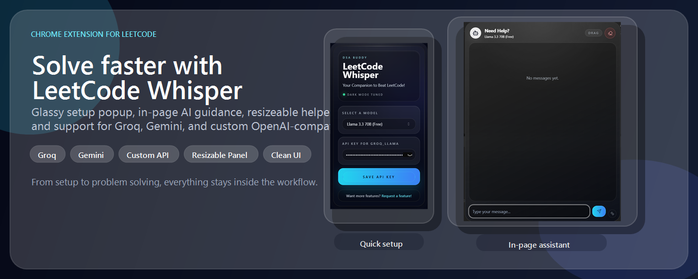
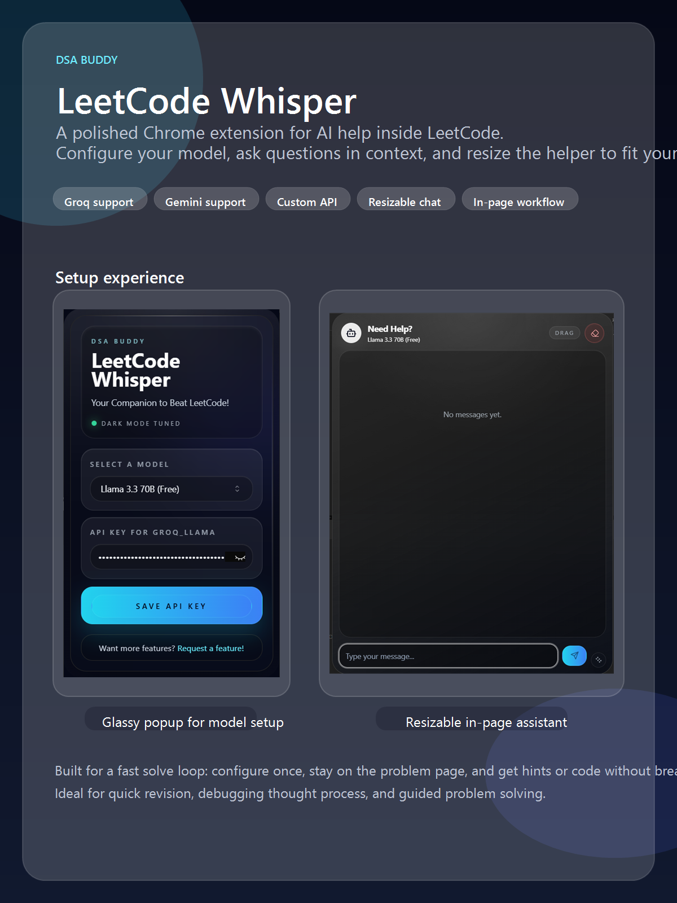

<div align="center">

# 🧠 DSA Buddy — LeetCode Whisper

**Your AI-powered companion for cracking DSA problems — right inside your browser.**

[](https://github.com/ayown/DSABuddy)
[](https://developer.chrome.com/docs/extensions/mv3/)
[](https://react.dev)
[](https://vitejs.dev)
[](LICENSE)

<br/>



<br/>

<p><strong>Configure once. Stay on the problem page. Get AI-powered hints, feedback & code — without breaking your flow.</strong></p>

[Features](#-features) · [Screenshots](#-screenshots) · [Quick Start](#-quick-start) · [Architecture](#-architecture) · [Tech Stack](#-tech-stack) · [Contributing](#-contributing)

</div>

---

## ✨ Features

<table>
<tr>
<td width="50%">

### 🤖 In-Page AI Assistant
A resizable, draggable chat panel injected directly into LeetCode, HackerRank, and GeeksforGeeks problem pages. Ask questions, get hints, debug your approach — all without leaving the page.

### 🔑 One-Click Setup
A polished glassmorphic popup to configure your preferred AI model and API key. Supports per-model key storage so you can switch providers instantly.

### 🧩 Multi-Provider Support
Bring your own key for **Groq**, **Google Gemini**, or any **OpenAI-compatible API**. Free-tier models included out of the box.

</td>
<td width="50%">

### 💬 Contextual Conversations
The assistant reads the problem statement and your current code directly from the DOM — zero copy-paste required. Structured responses include feedback, expandable hints, and syntax-highlighted code snippets.

### 💾 Persistent Chat History
Conversations are stored per-problem in **IndexedDB**, so your progress survives page reloads and browser restarts. Paginated loading keeps performance snappy.

### 🌑 Dark-Mode Native
Every surface — popup, chat panel, code blocks — is dark-mode tuned with glassmorphism, blur effects, and subtle gradient accents. Designed to feel at home on LeetCode's dark theme.

</td>
</tr>
</table>

---

## 📸 Screenshots

<div align="center">



<br/>

<sub><strong>Left:</strong> Glassmorphic popup for model & API key configuration &nbsp;·&nbsp; <strong>Right:</strong> Resizable in-page chat assistant with drag, clear, and resize controls</sub>

</div>

---

## 🚀 Quick Start

### Prerequisites

| Tool | Version |
|------|---------|
| [Node.js](https://nodejs.org/) | 16+ |
| [pnpm](https://pnpm.io/) (or npm / yarn) | Latest |

### Installation

```bash
# 1. Clone the repository
git clone https://github.com/ayown/DSABuddy.git
cd DSABuddy

# 2. Install dependencies
pnpm install          # or: npm install

# 3. Build for production
pnpm build            # or: npm run build
```

### Load in Chrome

1. Navigate to **`chrome://extensions/`**
2. Enable **Developer mode** (toggle in top-right)
3. Click **Load unpacked** → select the `dist/` folder
4. Open any problem on [LeetCode](https://leetcode.com), [HackerRank](https://hackerrank.com), or [GeeksforGeeks](https://geeksforgeeks.org)
5. Click the DSA Buddy icon → configure your model & API key
6. Hit the floating **chat button** on the problem page → start solving! 🎉

> **Keyboard Shortcut:** `Ctrl + Shift + D` (Windows/Linux) or `⌘ + Shift + D` (macOS) to open the popup.

---

## 🏗 Architecture

```
┌─────────────────────────────────────────────────────────────────────────┐
│                          Chrome Extension (MV3)                        │
│                                                                        │
│  ┌──────────────┐    chrome.storage    ┌──────────────────────────┐    │
│  │   Popup UI   │◄───────────────────►│   Service Worker         │    │
│  │  (React/Vite)│                      │   (background.js)        │    │
│  │              │                      │                          │    │
│  │ • Model      │    sendMessage()     │ • Groq API proxy        │    │
│  │   Selection  │────────────────────►│ • Gemini API proxy       │    │
│  │ • API Key    │                      │ • Custom OpenAI proxy    │    │
│  │   Config     │                      │ • CORS bypass            │    │
│  └──────────────┘                      └──────────────────────────┘    │
│                                                  ▲                     │
│                                                  │ sendMessage()       │
│                                                  │                     │
│  ┌──────────────────────────────────────────────────────────────────┐  │
│  │                    Content Script (React DOM Injection)          │  │
│  │                                                                  │  │
│  │  ┌────────────────┐  ┌─────────────────┐  ┌──────────────────┐  │  │
│  │  │ Site Adapters  │  │  ChatBox Panel   │  │  IndexedDB       │  │  │
│  │  │                │  │                  │  │  Persistence     │  │  │
│  │  │ • LeetCode     │  │ • Drag & resize  │  │                  │  │  │
│  │  │ • HackerRank   │  │ • Chat history   │  │ • Per-problem    │  │  │
│  │  │ • GFG          │  │ • Code highlight │  │   chat storage   │  │  │
│  │  │                │  │ • Rate limiting  │  │ • Paginated      │  │  │
│  │  │ Extract:       │  │ • Hints/snippets │  │   retrieval      │  │  │
│  │  │ • Problem stmt │  │                  │  │                  │  │  │
│  │  │ • User code    │  │                  │  │                  │  │  │
│  │  │ • Language     │  │                  │  │                  │  │  │
│  │  └────────────────┘  └─────────────────┘  └──────────────────┘  │  │
│  └──────────────────────────────────────────────────────────────────┘  │
└─────────────────────────────────────────────────────────────────────────┘
```

---

## 🛠 Tech Stack

| Layer | Technology |
|-------|-----------|
| **UI Framework** | React 18 |
| **Build Tool** | Vite 7 + `@vitejs/plugin-react` |
| **Styling** | Tailwind CSS 3 + `tailwindcss-animate` |
| **Component Library** | Radix UI (Select, Accordion, ScrollArea, Dropdown) |
| **Animation** | Framer Motion |
| **Code Highlighting** | `prism-react-renderer` (Dracula theme) |
| **Icons** | Lucide React |
| **Persistence** | IndexedDB (`idb`) + Chrome Storage API |
| **AI Providers** | Groq, Google Gemini, Custom OpenAI-compatible |
| **Extension Runtime** | Chrome Manifest V3 (Service Worker) |
| **Validation** | Zod |
| **Linting** | ESLint 9 |
| **Formatting** | Prettier |

---

## 📂 Project Structure

```
DSABuddy/
├── public/                         # Store assets & promotional images
├── icons/                          # Extension icons (16, 48, 128px)
├── src/
│   ├── assets/                     # Static assets (SVGs, images)
│   ├── components/                 # Reusable React components
│   │   └── ui/                     # Radix-based UI primitives
│   ├── constants/
│   │   ├── prompt.js               # AI system prompt template
│   │   └── valid_models.js         # Supported model definitions
│   ├── content/
│   │   ├── adapters/               # Platform-specific DOM adapters
│   │   │   ├── SiteAdapter.js      # Base adapter interface
│   │   │   ├── LeetCodeAdapter.js  # LeetCode DOM extraction
│   │   │   ├── HackerRankAdapter.js# HackerRank DOM extraction
│   │   │   └── GFGAdapter.js       # GeeksforGeeks DOM extraction
│   │   └── content.jsx             # In-page chat panel (React)
│   ├── lib/
│   │   ├── chromeStorage.js        # Chrome Storage API wrapper
│   │   ├── indexedDB.js            # IndexedDB persistence layer
│   │   └── utils.js                # Utility functions
│   ├── models/                     # AI model abstraction layer
│   │   ├── BaseModel.js            # Abstract model base class
│   │   └── model/                  # Provider-specific implementations
│   ├── providers/                  # React context providers
│   ├── services/                   # Service layer (ModelService)
│   ├── App.jsx                     # Popup main component
│   ├── background.js               # MV3 Service Worker (API proxy)
│   ├── content.jsx                 # Content script entry point
│   ├── main.jsx                    # Popup entry point
│   └── index.css                   # Global styles
├── manifest.json                   # Chrome Extension manifest (V3)
├── vite.config.js                  # Vite build configuration
├── tailwind.config.js              # Tailwind CSS configuration
└── package.json
```

---

## 🤝 Contributing

Contributions are welcome! Here's how to get started:

1. **Fork** the repository
2. **Create a feature branch:** `git checkout -b feat/amazing-feature`
3. **Commit your changes:** `git commit -m "feat: add amazing feature"`
4. **Push to your branch:** `git push origin feat/amazing-feature`
5. **Open a Pull Request**

> 💡 Have an idea? [Open an issue](https://github.com/ayown/DSABuddy/issues/new) — feature requests are welcome!

---

## 📜 License

Distributed under the **MIT License**. See [`LICENSE`](LICENSE) for more information.

---

<div align="center">

**Built with 🤍 using React, Vite & Chrome Extensions API**

<sub>If DSA Buddy helped your prep, consider giving it a ⭐ on GitHub!</sub>

</div>